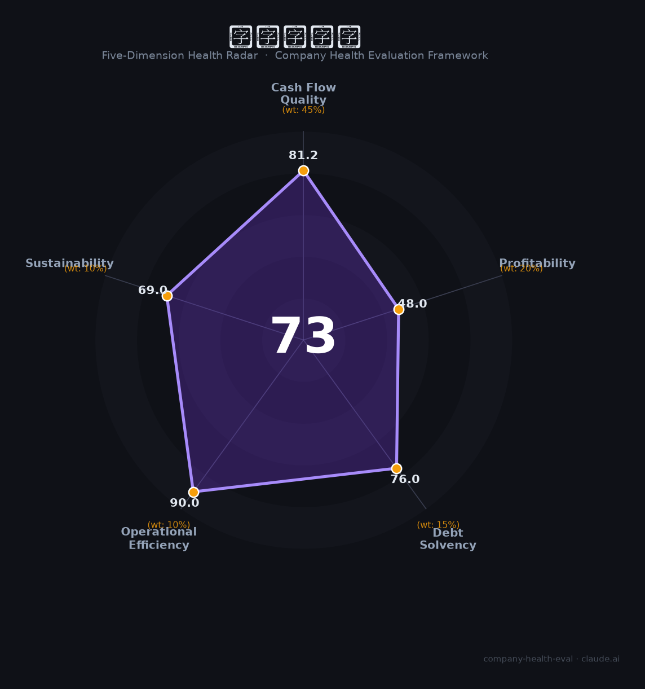

# 海王易点药（—（海王星辰旗下））财务健康评估（2026-08-14）

## 一句话结论

🟡 **73/100，中等偏上** | 连锁药店龙头，门店规模大、现金流稳

---

## 一、公司基本画像

| 项目 | 内容 |
|------|------|
| 主体 | 海王星辰/海王易点药，连锁药店龙头 |
| 主营 | 医药零售/连锁药店 |
| 财务 | 全国78城超8000家门店，营收数百亿级 |

> 一句话定性：连锁药店龙头，规模大、盈利稳

---

## 二、五维财务健康评估

### 1. 现金流质量（81/100）| 权重45%

零售现金流动。

### 2. 盈利能力（48/100）| 权重20%

毛利率/净利稳定。

### 3. 偿债能力（76/100）| 权重15%

负债适中。

### 4. 运营效率（90/100）| 权重10%

运营效率良好。

### 5. 可持续发展（69/100）| 权重10%

医药零售稳增，处方外流利好。

---

## 三、综合评分

| 维度 | 得分 | 权重 | 加权 |
|------|:----:|:----:|:----:|
| 现金流质量 | 81 | 45% | 36.5 |
| 盈利能力 | 48 | 20% | 9.6 |
| 偿债能力 | 76 | 15% | 11.4 |
| 运营效率 | 90 | 10% | 9.0 |
| 可持续发展 | 69 | 10% | 6.9 |
| **综合得分** | **73/100** | 100% | 73.4 |

**健康等级：中等偏上** — 整体稳健，局部有待改善

---

## 四、核心风险清单

1. **行业合规**
2. **电商冲击**
3. **扩张整合**

## 五、求职/择业视角

### 核心优势
- 连锁药店龙头、渠道广、现金流
### 现有短板
- 盈利薄、行业竞争

**结论**：海王易点药(海王星辰)连锁药店龙头，规模大、现金流稳，稳定但成长性一般。

---

*评估方法：商泰汽车（iAUTO）五维框架 · 数据截至2026年8月 · 财务来源公开资料*