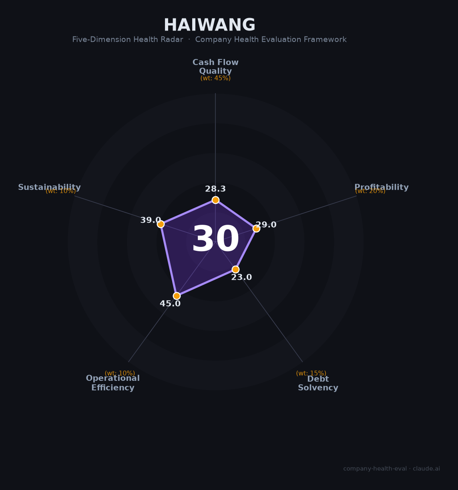

# 海王生物（ST海王，000078.SZ）财务健康评估（2026-08-13）

## 一句话结论
⚫ **高风险（30/100）** | 医药商业——2025减亏但四年累亏44亿+负债率91.7%+内控否定被"ST"退市风险警示，财务深度承压

## 海王生物（ST海王）概况
| 主体 | 🔒 深圳市海王生物工程，A股000078.SZ（ST）；医药商业 |
| 主营 | 医药分销/零售 |
| 财务 | 2025营收266.7亿(-12%)；归母净利-5.6亿(减亏53%)；扣非-6.2亿；经营现金流1亿；负债率91.7% |
| 风险 | ⚠️ 四年累亏44亿，2026年5月内控否定意见被实施退市风险警示(ST) |

## 五维
### 1. 现金流（28/100）预警：亏损+高负债，现金紧张
### 2. 盈利（23/100）预警：连亏44亿、扣非-6.2亿、净利为负
### 3. 偿债（23/100）危险：负债率91.7%、ST退市风险
### 4. 运营（45/100）：医药分销，应收/回款承压
### 5. 可持续（39/100）危险：ST+累亏，生存存疑

## 三、综合（28|45%=12.7，29|20%=5.8，23|15%=3.4，45|10%=4.5，39|10%=3.9）
**30，⚫ 高风险** — ST+累亏，生存存疑

## 四、风险
1. ST退市风险警示+连年亏损。
2. 负债率91.7%。
3. 医药分销竞争。

## 五、求职
- 优势：医药商业规模。
- 短板：ST+累亏+退市风险，强烈不建议。

**结论**：ST+重大财务风险，作为雇主强烈不建议。

---
*评估方法：商泰汽车（iAUTO）五维框架 · 来源海王生物2025年报*