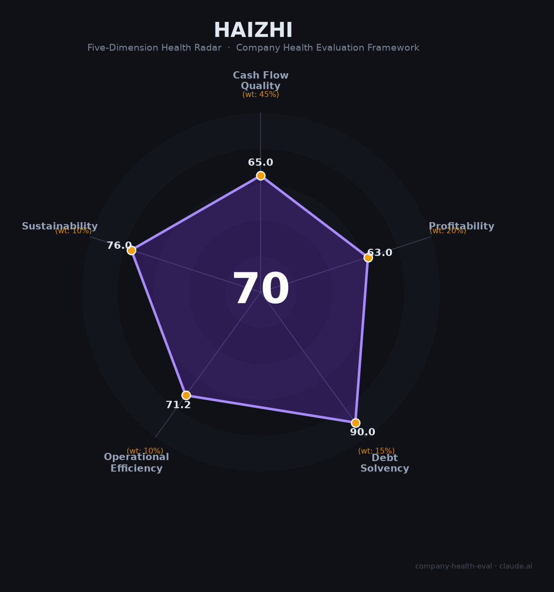

# 海致科技（Haizhi）财务健康评估（2026-06-12）

## 一句话结论

🟡 **中等偏上（70/100）** | GraphRAG+知识图谱赛道隐形冠军，营收CAGR 26%+智能体增速68%，资不抵债+应收恶化+IPO后暴跌67%是三重硬伤

---

## 一、公司基本画像

- **主体**：海致科技集团（Haizhi Technology），2013年成立，2026年2月13日港交所主板上市（02706.HK），首日涨242%
- **股权结构**：上市前E-2轮估值33亿元，君联资本、高瓴、IDG资本、BAI等参股
- **规模**：721人（2025年报），研发/技术团队约528人（75-79%）
- **主营**：Atlas图谱解决方案（76.5%）+ Atlas智能体解决方案（23.5%），以图计算+知识图谱+大模型（GraphRAG）为核心
- **定位**："AI除幻第一股"——通过知识图谱消除大模型幻觉
- **市场地位**：中国图为核心的AI智能体提供商市占率约50%（但该细分市场总规模不足2亿元）

---

## 二、五维财务健康评估

### 1. 现金流质量（65/100）
| 指标 | 判定 | 依据 |
|------|:--:|------|
| 经营现金流净额 | 🔴 危险 | 连续4年为负（2025年-5,527万），主营业务尚未自我造血 |
| 现金及等价物 | 🟢 健康 | 2025年末4.43亿元，加金融资产合计超10亿（IPO后），可覆盖多年 |
| 有息负债 | 🟢 健康 | 赎回负债20.63亿已随IPO转权益，上市后杠杆极低 |

### 2. 盈利能力（63/100）
| 指标 | 判定 | 依据 |
|------|:--:|------|
| 毛利率 | 🟠 一般 | 43.3%（2025），处于企业软件中等水平 |
| 净利率 | 🟠 一般 | 经调整净利率3.9%（+2,415万），绝对值仍薄 |
| 营收增速 | 🟢 优秀 | 2022-2025 CAGR约26%，Atlas智能体+68.4%高速增长 |
| 研发费用率 | 🟡 良好 | 9.8%（0.61亿/6.21亿），处于5-25%合理区间但被质疑偏低 |
| 人均产出 | 🟠 一般 | 人均营收约86万元，企业软件行业中等 |

### 3. 偿债能力（90/100）—— 上市后赎回负债转权益，资产负债表干净
### 4. 运营效率（71/100）
| 指标 | 判定 | 依据 |
|------|:--:|------|
| 应收周转 | 🔴 危险 | 周转天数从126天飙升至260天，回款周期近乎翻倍 |
| 客户集中度 | 🟢 健康 | 多元客户结构 |
| 员工/高管 | 🟢 健康 | 团队稳定，仅1位非执行董事辞职 |

### 5. 可持续发展（76/100）—— 知识图谱赛道CAGR 31%+政策利好，但"AI除幻"概念市场规模小（不足2亿）

## 三、综合评分

| 维度 | 得分 | 权重 | 加权得分 |
|------|:----:|:----:|:--------:|
| 现金流质量 | 65 | 45% | 29.2 |
| 盈利能力 | 63 | 20% | 12.6 |
| 偿债能力 | 90 | 15% | 13.5 |
| 运营效率 | 71 | 10% | 7.1 |
| 可持续发展 | 76 | 10% | 7.6 |
| **综合得分** | | | **70/100 🟡 中等偏上** |

## 四、核心风险

1. **IPO后暴跌67%+资不抵债（极高）**：上市3个月市值蒸发近七成，净资产-14.51亿元，20.63亿赎回负债虽已转权益但投资者套现动机极强
2. **应收恶化（高）**：周转天数126→260天近乎翻倍，应收占总营收47%
3. **研发费用率仅9.8%（高）**：被市场质疑"重销售轻研发"，核心技术壁垒存疑
4. **赛道天花板低（中）**：图AI智能体细分市场不足2亿元，市占率50%也仅约1亿规模

## 五、总结

海致科技是知识图谱/GraphRAG赛道「市占率最高、营收增速最快、但财务质量最脆弱」的港股次新股：CAGR 26%、智能体+68%、经调整连续两年盈利。但资不抵债（净资产-14.5亿）、应收恶化（260天）、经营现金流连续4年为负、研发投入被质疑不足——四重财务硬伤叠加IPO后股价暴跌67%，使公司处于"概念好但基本面弱"的典型次新股困境。

*评估日期：2026-06-12 | 评分引擎 v1.0 | 雷达图：Haizhi_health_radar.png*
