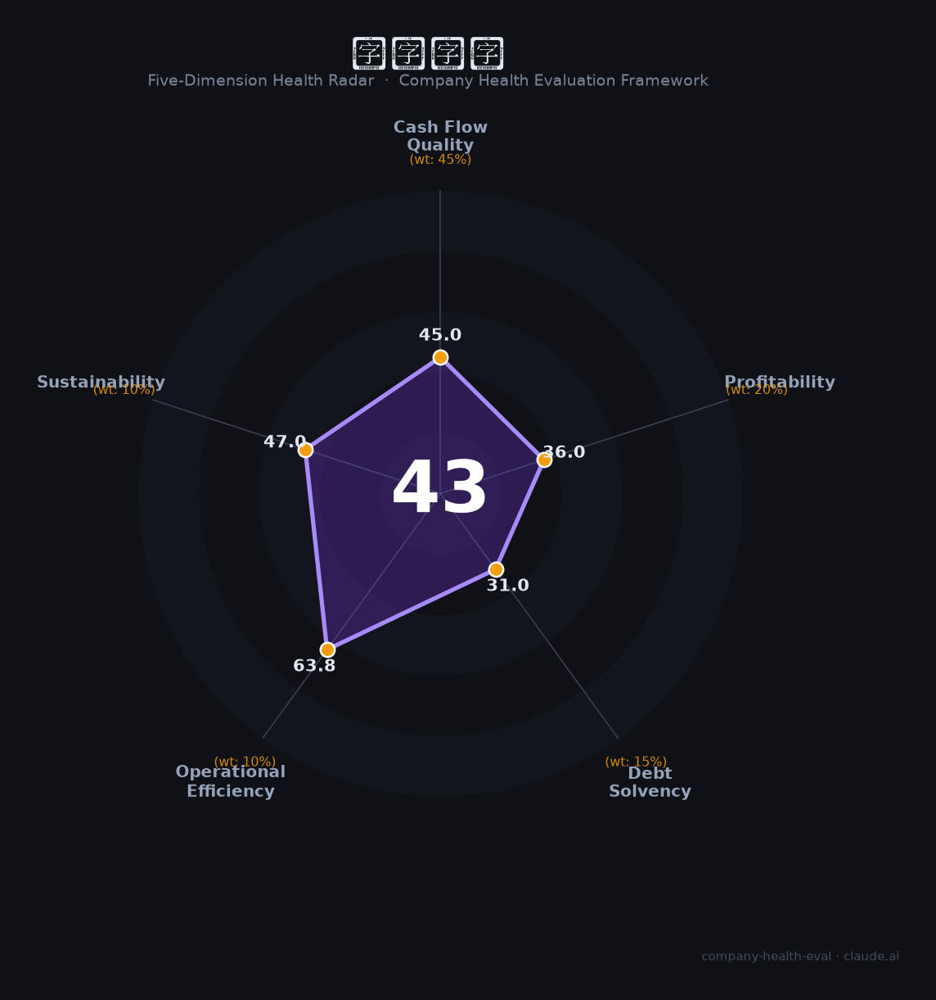

# 深业集团（—（深圳国资））财务健康评估（2026-08-14）

## 一句话结论

🔴 **43/100，中等偏下** | 地产国企，转型承压、盈利亏、负债重

---

## 一、公司基本画像

| 项目 | 内容 |
|------|------|
| 主体 | 深业集团，深圳国资地产/基建集团 |
| 主营 | 房地产/城建/园区 |
| 财务 | 2025前三季营收244亿，净亏8.48亿，地产转型承压 |

> 一句话定性：深圳国企地产集团，转型承压、净亏损

---

## 二、五维财务健康评估

### 1. 现金流质量（45/100）| 权重45%

地产去化慢，现金流偏紧。

### 2. 盈利能力（36/100）| 权重20%

净亏损，盈利能力差。

### 3. 偿债能力（31/100）| 权重15%

高负债、偿债压力大。

### 4. 运营效率（64/100）| 权重10%

运营效率一般。

### 5. 可持续发展（47/100）| 权重10%

地产行业下行，但基建/园区有积淀。

---

## 三、综合评分

| 维度 | 得分 | 权重 | 加权 |
|------|:----:|:----:|:----:|
| 现金流质量 | 45 | 45% | 20.2 |
| 盈利能力 | 36 | 20% | 7.2 |
| 偿债能力 | 31 | 15% | 4.7 |
| 运营效率 | 64 | 10% | 6.4 |
| 可持续发展 | 47 | 10% | 4.7 |
| **综合得分** | **43/100** | 100% | 43.2 |

**健康等级：中等偏下** — 存在较多风险点，需谨慎评估

---

## 四、核心风险清单

1. **地产下行**
2. **高负债**
3. **连续亏损(深圳控股)**

## 五、求职/择业视角

### 核心优势
- 深圳国资背景、园区/基建强
### 现有短板
- 盈利、高杠杆、地产承压

**结论**：深业集团深圳国企，基建/园区有优势，但地产拖累致亏损高杠杆，风险较高。

---

*评估方法：商泰汽车（iAUTO）五维框架 · 数据截至2026年8月 · 财务来源深业集团/深圳控股年报*