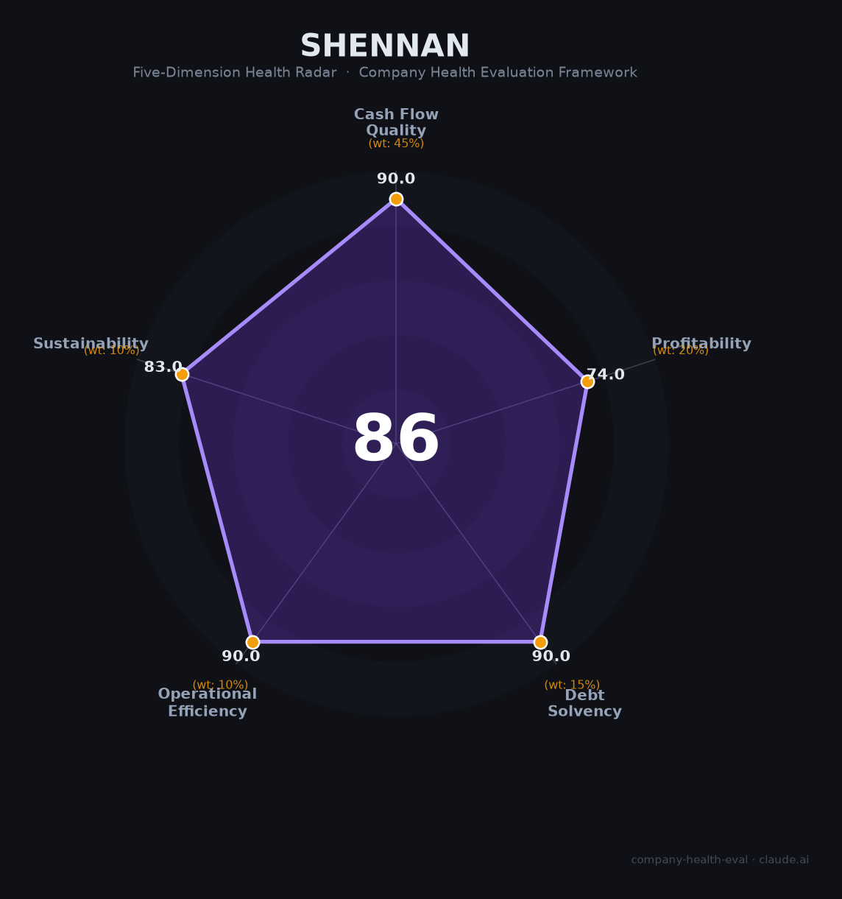

# 深南电路（002916.SZ）财务健康评估（2026-08-14）

## 一句话结论

🟢 **86/100，优秀** | AI PCB龙头，营收净利大双增，财务强健

---

## 一、公司基本画像

| 项目 | 内容 |
|------|------|
| 主体 | 深南电路，PCB/封装基板/电子装联龙头 |
| 主营 | PCB、IC载板、电子装联 |
| 财务 | 2025营收236.47亿(+32.05%)，归母净利32.76亿(+74.47%) |

> 一句话定性：AI算力PCB龙头，营收净利大幅双增、负债低

---

## 二、五维财务健康评估

### 1. 现金流质量（90/100）| 权重45%

经营现金流强劲，现金储备充足。

### 2. 盈利能力（74/100）| 权重20%

AI高多层板量价齐升，毛利率/净利率优秀，盈利能力拐点确立。

### 3. 偿债能力（90/100）| 权重15%

负债率低、偿债结构极稳，无重大质押。

### 4. 运营效率（90/100）| 权重10%

运营效率优秀，周转与客户结构良好。

### 5. 可持续发展（83/100）| 权重10%

AI/高端算力需求驱动PCB高端化，可持续性强。

---

## 三、综合评分

| 维度 | 得分 | 权重 | 加权 |
|------|:----:|:----:|:----:|
| 现金流质量 | 90 | 45% | 40.5 |
| 盈利能力 | 74 | 20% | 14.8 |
| 偿债能力 | 90 | 15% | 13.5 |
| 运营效率 | 90 | 10% | 9.0 |
| 可持续发展 | 83 | 10% | 8.3 |
| **综合得分** | **86/100** | 100% | 86.1 |

**健康等级：优秀** — 财务极健康，值得优先考虑

---

## 四、核心风险清单

1. **PCB行业周期波动**
2. **客户与需求集中**
3. **资本开支较大**

## 五、求职/择业视角

### 核心优势
- AI PCB龙头，高成长、薪酬优、技术壁垒深
### 现有短板
- 与AI资本开支/TMT周期强相关

**结论**：深南电路AI算力PCB龙头，财务健康、成长强劲，是深圳科技制造的高价值平台。

---

*评估方法：商泰汽车（iAUTO）五维框架 · 数据截至2026年8月 · 财务来源深南电路2025年报*