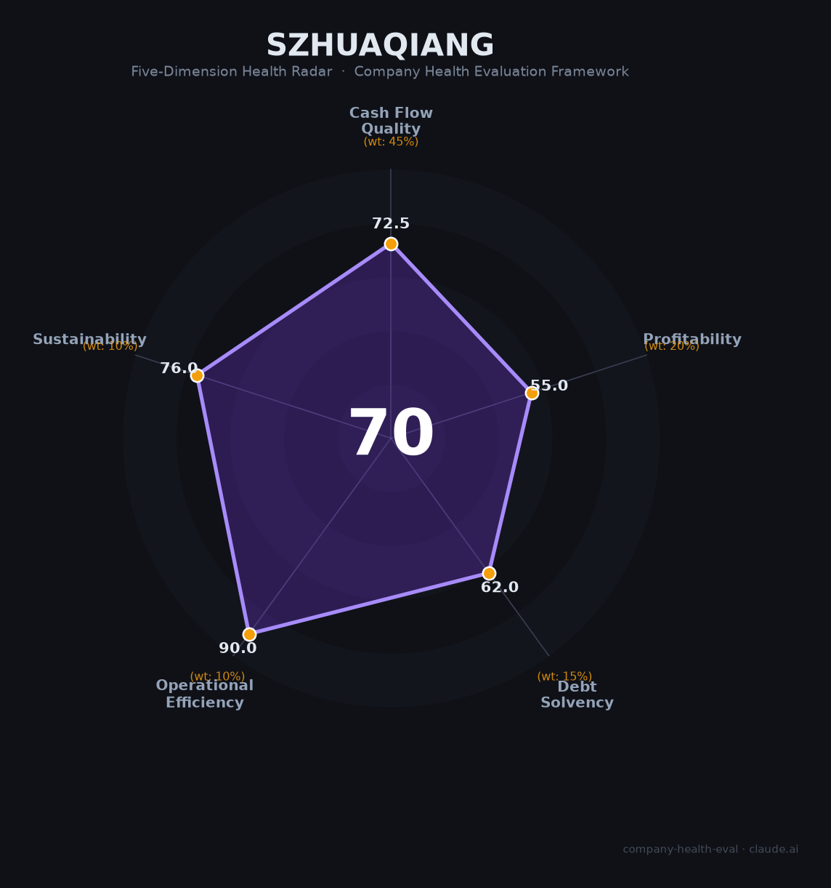

# 深圳华强（000062.SZ）财务健康评估（2026-08-13）

## 一句话结论

🟠 **70/100，中等** | 电子市场/元器件分销，供应链稳定

---

## 一、公司基本画像

| 项目 | 内容 |
|------|------|
| 主体 | 🔒 深圳华强，电子市场/华强电子世界 |
| 主营 | 🔒 电子元器件分销/电子市场 |
| 财务 | 🔒 电子分销龙头，营收稳定 |

> 一句话定性：电子分销与电子市场双主业，供应链平台属性明显。

---

## 二、五维财务健康评估

### 1. 现金流质量（72/100）| 权重45%

### 2. 盈利能力（55/100）| 权重20%

### 3. 偿债能力（62/100）| 权重15%

### 4. 运营效率（90/100）| 权重10%

### 5. 可持续发展（76/100）| 权重10%

---
## 三、综合评分

| 维度 | 得分 | 权重 | 加权 |
|------|:----:|:----:|:----:|
| 现金流质量 | 72 | 45% | 33 |
| 盈利能力 | 55 | 20% | 11 |
| 偿债能力 | 62 | 15% | 9 |
| 运营效率 | 90 | 10% | 9 |
| 可持续发展 | 76 | 10% | 8 |
| **综合得分** | **70** | 100% | 70 |

**健康等级：🟠 中等**

---
## 四、核心风险清单

1. **元器件分销薄利**
1. **电子市场竞争**
1. **渠道整合压力**

## 五、求职/择业视角
- **核心优势**：电子市场+分销龙头
- **现存短板**：分销薄利

**结论**：电子分销/电子市场方向可用
---
*评估方法：商泰汽车（iAUTO）五维企业健康度框架 · 数据截至2026年8月 · 来源：深圳华强2025年报*