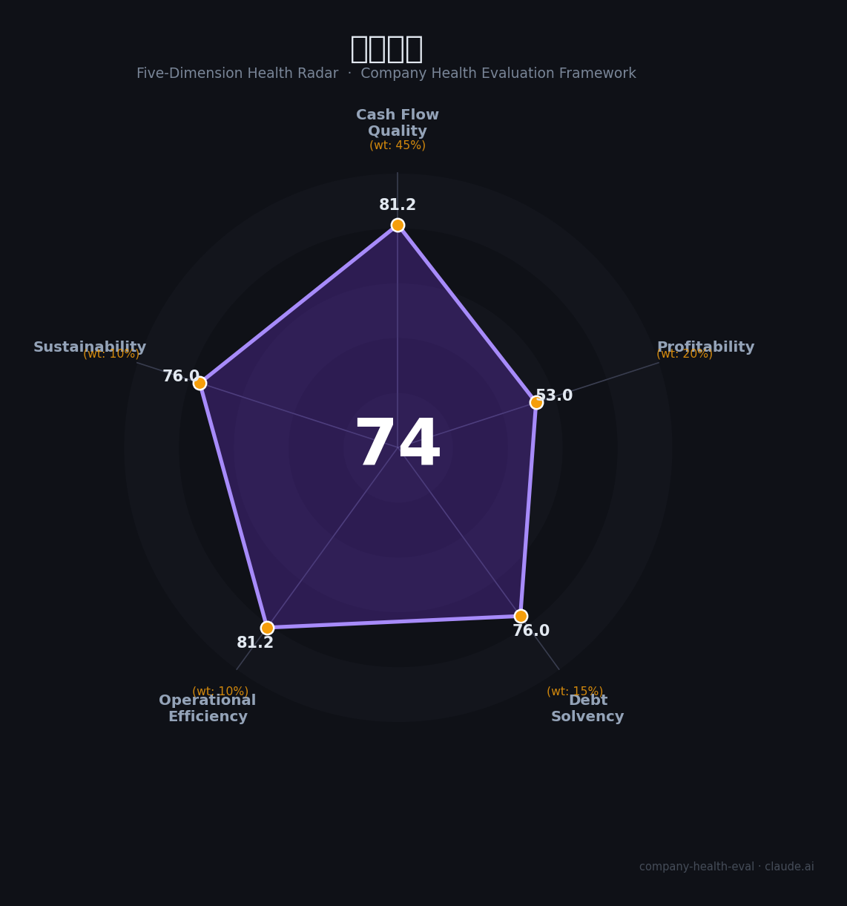

# 深圳机场（000089.SZ）财务健康评估（2026-08-14）

## 一句话结论

🟡 **74/100，中等偏上** | 华南枢纽机场，营收利润回升、经营稳健

---

## 一、公司基本画像

| 项目 | 内容 |
|------|------|
| 主体 | 深圳机场，华南核心航空枢纽 |
| 主营 | 机场运营/航空服务/物流 |
| 财务 | 2025营收51.28亿(+8.21%)，归母净利5.25亿(+18.5%) |

> 一句话定性：华南枢纽机场公用平台，营收利润回升、中等负债

---

## 二、五维财务健康评估

### 1. 现金流质量（81/100）| 权重45%

经营现金流稳健，公用属性现金流充足。

### 2. 盈利能力（53/100）| 权重20%

净利率中等，盈利温和增长。

### 3. 偿债能力（76/100）| 权重15%

负债率约53%，中等水平、偿债可控。

### 4. 运营效率（81/100）| 权重10%

运营效率良好，航线网络完善。

### 5. 可持续发展（76/100）| 权重10%

客流复苏+改扩建，航空需求持续增长。

---

## 三、综合评分

| 维度 | 得分 | 权重 | 加权 |
|------|:----:|:----:|:----:|
| 现金流质量 | 81 | 45% | 36.5 |
| 盈利能力 | 53 | 20% | 10.6 |
| 偿债能力 | 76 | 15% | 11.4 |
| 运营效率 | 81 | 10% | 8.1 |
| 可持续发展 | 76 | 10% | 7.6 |
| **综合得分** | **74/100** | 100% | 74.3 |

**健康等级：中等偏上** — 整体稳健，局部有待改善

---

## 四、核心风险清单

1. **航空需求波动**
2. **改扩建资本开支**
3. **利率/汇率**

## 五、求职/择业视角

### 核心优势
- 华南枢纽机场、现金流稳健、公用属性
### 现有短板
- 重资产、盈利弹性有限

**结论**：深圳机场华南核心枢纽，营收利润双增、现金流稳健、公用属性强，是稳健的基建平台。

---

*评估方法：商泰汽车（iAUTO）五维框架 · 数据截至2026年8月 · 财务来源深圳机场2025年报*