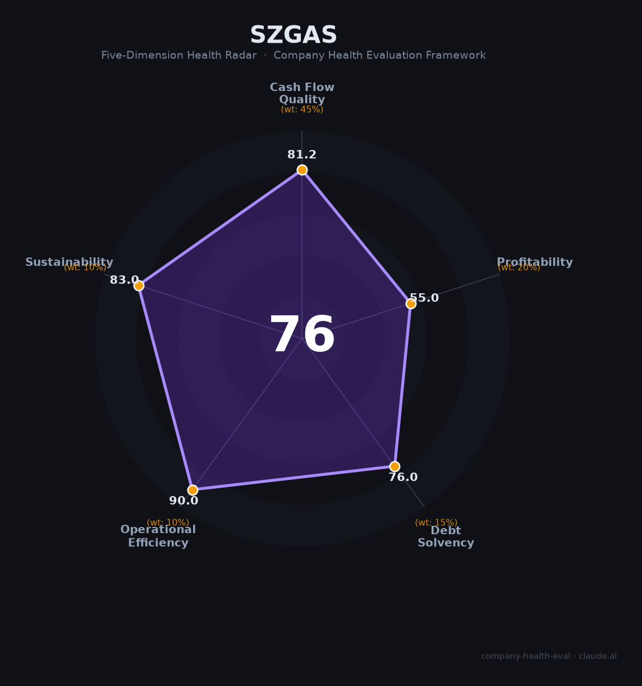

# 深圳燃气（601139.SH）财务健康评估（2026-08-13）

## 一句话结论

🟡 **76/100，中等偏上** | 深圳燃气公用龙头，营收净利稳定

---

## 一、公司基本画像

| 项目 | 内容 |
|------|------|
| 主体 | 🔒 深圳市燃气集团，城市燃气公用 |
| 主营 | 🔒 管道燃气、燃气工程、LNG资源 |
| 财务 | 🔒 2025营收297.96亿(+5.11%)，归母净利14.08亿，ROE 8.8% |

## 二、五维财务健康评估

### 1. 现金流质量（81/100）| 权重45%

### 2. 盈利能力（55/100）| 权重20%

### 3. 偿债能力（76/100）| 权重15%

### 4. 运营效率（90/100）| 权重10%

### 5. 可持续发展（83/100）| 权重10%

---
## 三、综合评分

| 维度 | 得分 | 权重 | 加权 |
|------|:----:|:----:|:----:|
| 现金流质量 | 81 | 45% | 37 |
| 盈利能力 | 55 | 20% | 11 |
| 偿债能力 | 76 | 15% | 11 |
| 运营效率 | 90 | 10% | 9 |
| 可持续发展 | 83 | 10% | 8 |
| **综合得分** | **76** | 100% | 76 |

**健康等级：中等偏上**

---
## 四、核心风险清单

1. **燃气价格监管**
2. **城市燃气竞争**
3. **终端需求**
## 五、求职/择业视角
- **核心优势**：燃气公用稳定+清洁能源
- **现存短板**：公用企业增长有限

**结论**：公用能源稳定，深圳地方国企
---
*评估方法：商泰汽车（iAUTO）五维框架 · 数据截至2026年8月 · 来源：深圳燃气2025年报*
