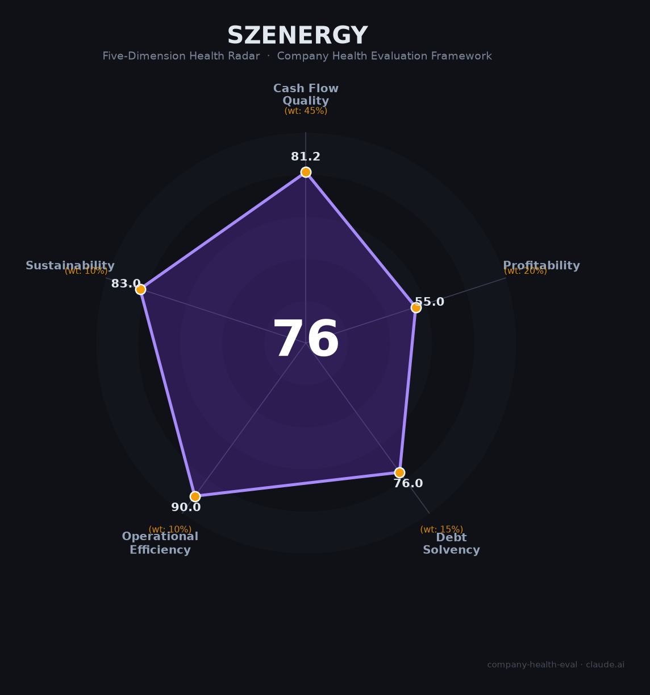

# 深圳能源集团（000027.SZ）财务健康评估（2026-08-13）

## 一句话结论
🟡 **中等偏上（76/100）** | 深圳电力/清洁能源公用龙头——营收434.3亿（+5.4%）、净利21亿（+4.9%）、经营现金流118亿，稳定公用事业+清洁能源转型

## 也门基本画像
| 主体 | 🔒 深圳能源集团，A股000027.SZ；深圳国资委旗下电力公用 |
| 主营 | 电力（火/风/光）、燃气、环保、清洁能源 |
| 财务 | 2025营收434.3亿(+5.4%)；归母净利21亿(+4.9%)；扣非18.7亿；经营现金流约118亿；负债率约64%、员工逾2万 |

## 二、五维财务健康评估
1. 现金流（81/100）|45%：经营现金流118亿、公用事业现金流稳。
2. 盈利（55/100）|20%：净利率5%、ROE4.3%尚可，电力稳定但增长平。
3. 偿债（76/100）|15%：负债率64%重资产，但公用+现金流稳偿债安全。
4. 运营（90/100）|10%：电力/燃气/清洁运营高效稳定。
5. 可持续（83/100）|10%：清洁能源/碳中和国策+燃气/环保，长期稳健。

## 三、综合评分
| 现金流81|45%=36.5 | 盈利55|20%=11 | 偿债76|15%=11.4 | 运营90|10%=9 | 可持续83|10%=8.3 | **76** |
**评级：🟡 中等偏上** — 公用清洁能源，稳定分红

## 四、风险
1. 电价/燃气市场化。
2. 重资产资本开支。
3. 火电/煤电成本。

## 五、求职
- 优势：深圳国企公用、电力/清洁能源稳定平台、国企福利。
- 短板：公用企业薪酬中等、增长平。

**结论：适合追求稳定+能源/电力方向的求职者，深圳国企公用稳定。**

---
*评估方法：商泰汽车（iAUTO）五维框架 · 来源深圳能源2025年报*