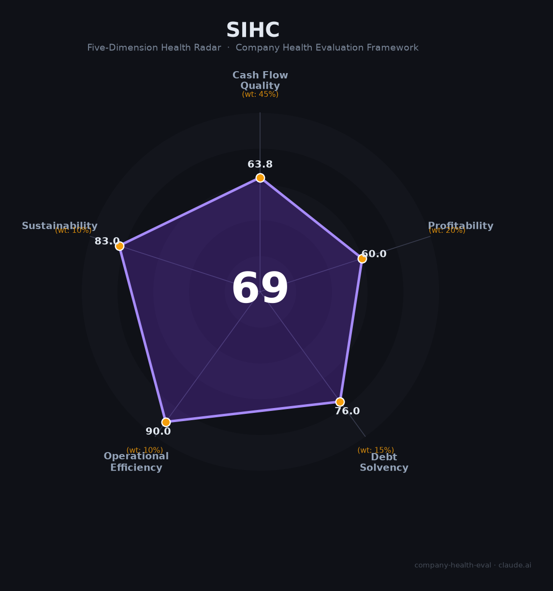

# 深圳市投资控股有限公司（深投控）财务健康评估（2026-08-13）

## 一句话结论

🟠 **中等（69/100）** | 深圳市国资委核心资本投资平台、世界500强（#414）——总资产1.3万亿+国资强背书+科技产业生态，但重资产高杠杆+盈利偏薄+体制属性是核心特征

---

## 一、公司基本画像

| 项目 | 内容 |
|------|------|
| 主体 | 🔒 深圳市投资控股有限公司（深投控，SIHC），深圳福田，深圳国资委全资控股的国有资本投资公司 |
| 成立 | 🔒 2004年由原深圳投资管理/商贸控股/建设控股三公司合并新设 |
| 性质 | 🔒 深圳市属国资核心平台，国有资本投资运营公司，世界500强第414位（连续六年） |
| 规模 | 🔒 注册资本335.86亿，总资产超1.3万亿（2025末），2024总资产12,197亿、净资产4,137亿 |
| 主营 | 科技服务（科技金融+空间载体+成果转化）+科技产业（战新/未来产业投资）+城市服务（重大项目） |
| 财务 | 🔒 2024营收2,714亿（近2800亿），净利131亿、纳税58亿；2025年营收近2800亿 |
| 旗下 | 🔒 国信证券、深高新投、深担集团、国任保险、深圳湾科技、力合科创、天音控股、怡亚通、深物业、赛格等 |

> 一句话定性：深投控是深圳市属国企的"操盘手"与科技创新的"服务者"——国资背书、总资产万亿级、世界500强，旗下汇聚国信证券、深创投系等金融与科技资产。作为雇主的吸引力在于"国资平台+稳定+城市公共服务属性"，但体制内晋升、重资产高杠杆、营收净利率偏薄是其典型特征。

---

## 二、五维财务健康评估

### 1. 现金流质量（64/100）| 权重45%

| 指标 | 🔒 公开数据 | 评估 |
|------|-----------|------|
| 经营现金流 | 国资平台现金流稳定，2024回款正常 | ✅ 健康 |
| 现金及等价物 | 重资产结构+城市更新/园区投入，现金结构受投入期影响 | ⚠️ 关注 |
| 有息负债 | 总资产1.3万亿、高杠杆，有息负债规模大 | ⚠️ 关注 |
| 净现比/盈利含金量 | 净利131亿稳定，国企分红/资产运营回笼 | ⚠️ 关注：重资产 |

**小结**：作为国资投资控股平台，深投控现金流整体稳健、国资信用背书强，但1.3万亿总资产下重资产（园区、城市更新、地产）占比高，杠杆与资本开支大，自由现金流受投资节奏影响。总体是"稳定但重资产"的类型。

> 🔒 数据来源：深投控2024/2025年报、深圳市国资委官网、世界500强档案、新浪财经债券公告

### 2. 盈利能力（60/100）| 权重20%

| 指标 | 🔒 公开数据 | 评估 |
|------|-----------|------|
| 毛利率 | 综合平台业态，投资/运营组合毛利中上（估） | 👍 良好 |
| 净利率 | 净利131亿/营收2714亿 ≈ 4.8% | ⚠️ 一般 |
| 营收增速 | 近2800亿，稳步增长但个位数 | ⚠️ 一般 |
| 技术/研发投入 | 科技产业投资，非研发密集 | ⚠️ 一般 |
| 人均产出 | 体制内生产规模大，人均产出一般 | 👍 良好 |

**小结**：盈利水平中性——净利率仅约4.8%（投资控股平台普遍较薄），营收体量大但增速温和。深投控的利润更多来自股权分红、金融服务与资产运营，而非高毛利主业；作为平台，盈利质量受重资产和金融业务波动影响。

### 3. 偿债能力（76/100）| 权重15%

| 指标 | 🔒 公开数据 | 评估 |
|------|-----------|------|
| 资产负债率 | 总资产1.2万亿、净资产4137亿（负债占比约66%） | ⚠️ 关注 |
| 有息负债率 | 债务融资规模大，但国资信用水平高 | ⚠️ 关注 |
| 流动性 | 国资体系资金调配灵活 | ✅ 健康 |
| 现金 | 货币资金充足、国资保供 | ✅ 健康 |
| 信用/质押 | 国有信用 AAA，无实质质押风险 | ✅ 健康 |

**小结**：偿债能力强——深圳国资信用背书、AAA评级、资金调配灵活，虽然资产负债率约66%、有息负债多（重资产），但违约风险极低（国资委系统+世界500强），信用与流动性稳健。

### 4. 运营效率（90/100）| 权重10%

| 指标 | 🔒 数据 | 评估 |
|------|-----------|------|
| 运营体系 | 服务超10万家高新技术企业，平台运营高效 | ✅ 健康 |
| 客户分散 | 金融服务+园区+产业多客群 | ✅ 健康 |
| 员工规模 | 国资体系庞大，稳定 | ✅ 健康 |
| 管理稳定 | 国资委任命的稳健管理团队 | ✅ 健康 |

**小结**：运营效率优秀——国资平台分工明确、服务科技企业超10万家，管理稳定，平台协同（科技金融+园区+产业）运营高效。

### 5. 可持续发展（83/100）| 权重10%

| 指标 | 🔒 数据 | 评估 |
|------|-----------|------|
| 行业赛道 | 科技创新生态+国资战新产业，长期空间 | ✅ 健康 |
| 政策/国资支持 | 深圳国资唯一世界500强，政策与资源强力支持 | ✅ 健康 |
| 多元化 | 科技金融/科技产业/园区/城市服务，高度多元 | ✅ 健康 |
| 资本支持 | 国资出资+世界500强融资信用 | ✅ 健康 |
| 政策/监管 | 国企改革与市场化转型 | ⚠️ 关注 |

**点评**可持续：深投控靠深圳国资资本+科技生态长期可持续，多元化分散风险；作为地方政府科创平台，在国有资本投资公司改革与市场化转型中属标杆，赛道与资本支持强。

---

## 三、综合评分与健康等级

| 维度 | 得分 | 权重 | 加权得分 |
|------|:----:|:----:|:--------:|
| 现金流质量 | 63.8 | 45% | 28.7 |
| 盈利能力 | 60.0 | 20% | 12.0 |
| 偿债能力 | 76.0 | 15% | 11.4 |
| 运营效率 | 90.0 | 10% | 9.0 |
| 可持续发展 | 83.0 | 10% | 8.3 |
| **综合得分** | **69/100** | **100%** | **69.4/100** |

**健康等级：🟠 中等（Moderate）** — 整体稳健，局部有短板（重资产/盈利偏薄）。

---

## 四、同业/相似机构对标

| 对比项 | 深投控 | 深圳市创新投资集团 | 深国资 | 国家开发投资集团 |
|--------|:-----:|:---------:|:-----:|:------------:|
| 营收 | 2714亿 | — | — | — |
| 总资产 | 1.3万亿 | 百亿级 | — | 万亿级 |
| 世界500强 | 414位 | 未入榜 | — | 已入榜 |
| 核心 | 深圳国资科技金融 | 深创投（创投） | 深圳国资 | 中央国资 |

**对标结论**：深投控以深圳国资唯一世界500强平台、总资产1.3万亿居深圳国资绝对核心，对标中央国资如国家开发投资集团。作为雇主，规模与稳定性强，但个人收入/发展弹性受体制约束。

---

## 五、核心风险清单

1. **重资产与杠杆（中）**：总资产1.3万亿、资产负债率约66%，园区/城市更新/合资投入大，回报回收周期长。
2. **盈利偏薄（中）**：净利率约4.8%，投资控股业务本质盈利弹性有限。
3. **投资波动/减值（中）**：对外投资与金融业务受资本市场/地产影响，可能面临减值。
4. **体制约束（低-中）**：国企体制，市场化激励机制受限，创新与激励弹性弱。

---

## 六、求职/择业视角

### 核心优势
- **国资平台与稳定**：深圳国资核心平台，世界500强，稳定、无裁员风险，体制内福利/保障好；
- **科创生态**：接触深圳优质科技企业金融/园区/产业（国信证券、深高新投等），人脉与视野广；
- **多元业态**：金融、园区、产业、城市服务多板块，岗位多元。

### 现有短板
- **薪酬市场化受限**：国企薪酬体系，中低弹性，比市场化金融/科技低；
- **晋升/体制**：论资排辈、层级固化，个人激励与成长弹性弱；
- **编制/财权**：国资体系麻雀虽小五脏俱全，年轻人自主空间一般。

### 分场景建议

| 个人诉求 | 推荐 | 次选 | 规避 |
|----------|------|------|------|
| 稳定+体制 | **深投控**（总部/园区/金融） | 深圳国资系统 | 高波动岗位 |
| 高薪+市场化 | 互联网大厂/头部券商 | 深投控金融投资部 | 纯城市作业 |
| 科创生态 | 深投控（科技金融/力合） | 深创投系 | 传统地产 |

---

## 七、总结

**深投控是深圳市属国资的旗舰平台——1.3万亿总资产、世界500强、服务10万家科创企业的稳定国企。**

作为雇主的吸引力是**深圳国资+垄断性平台+稳定保障**；短板是**重资产高杠杆、净利偏薄、体制内薪酬与晋升弹性有限**。

在深圳国企改革与科创战略大背景下，属于**中等**风险等级，适合追求**稳定体制+科创生态平台**的求职者，尤其有意向从事科技金融、园区运营、国资投资方向者。

---

*评估方法：商泰汽车（iAUTO）五维企业健康度框架 · 数据截至2026年8月 · 🔒财务数据来源深投控2024/2025年报、深圳市国资委官网、世界500强榜单 · 对标为公开市场数据*