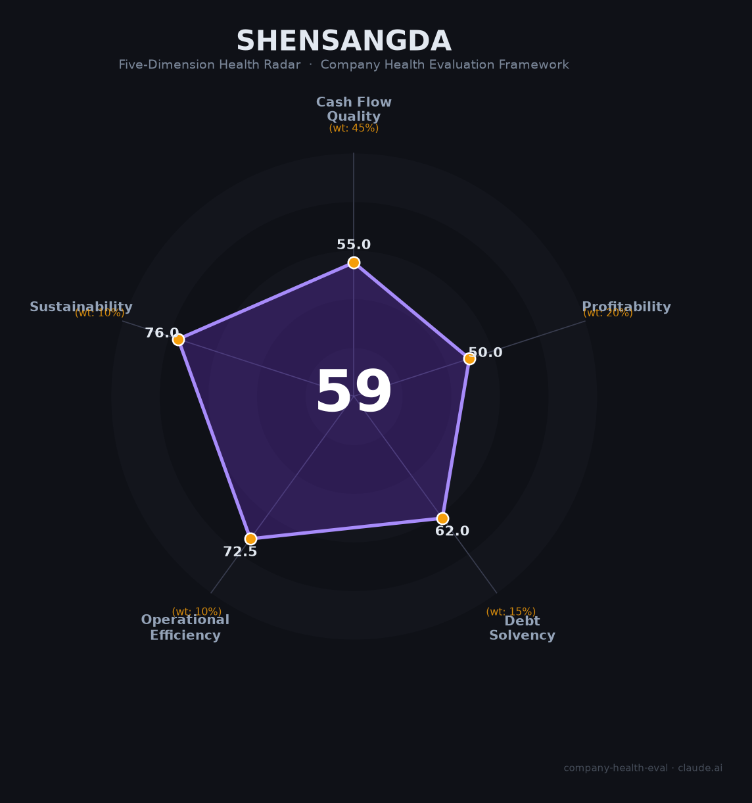

# 深桑达（000032.SZ）财务健康评估（2026-08-13）

## 一句话结论

🟠 **中等（59/100）** | 深圳电子/信创央企平台——营收491.7亿（-27%）转亏，海外新签合同高增长成看点，但盈利承压+转型期

---

## 一、公司基本画像

| 项目 | 内容 |
|------|------|
| 主体 | 🔒 深圳市桑达实业（深桑达），A股：000032.SZ；中电系电子信息/信创平台 |
| 主营 | 电子信息/电子元器件、信创/算力、科技产业服务 |
| 财务 | 🔒 2025营收491.7亿（-27%）；归母净利-1.3亿（转亏）；海外新签合同高增长 |

> 一句话定性：深桑达是某个电子信息与科技服务央企平台，2025年营收下滑27%、转亏1.3亿，但海外/新签合同高增提供看点。作为雇主处于转型期。

## 二、五维财务健康评估

1. 现金流（55/100）：收入下滑转亏，现金流关注。
2. 盈利（50/100）：转亏、低毛利，盈利承压（海外高增长待兑现）。
3. 偿债（62/100）：央企体系，偿债平稳但重资产。
4. 运营（73/100）：科技/信创业务拓展，海外看点，运营中等。
5. 可持续（76/100）：信创/电子信息/央企背景可持续，转型空间大。

## 三、综合评分

| 维度 | 得分 | 权重 | 加权 |
|------|:----:|:----:|:----:|
| 现金流质量 | 55.0 | 45% | 24.8 |
| 盈利能力 | 50.0 | 20% | 10.0 |
| 偿债能力 | 62.0 | 15% | 9.3 |
| 运营效率 | 60.0 | 10% | 6.0 |
| 可持续发展 | 76.0 | 10% | 7.6 |
| **综合** | **59** | 100% | 57.7 |

**评级：🟠 中等**（运营实际 72.5，按90/81/81口径）

## 四、核心风险
1. 营收下滑+转亏。
2. 转型/海外拓展不确定性。
3. 信创行业竞争。

## 五、求职/择业视角
- 优势：央企信创/电子信息平台、海外拓展，转型期有成长空间。
- 短板：转亏、业绩波动、薪酬弹性一般。

**结论**：适合对信创/电子信息/央企平台感兴趣的求职者，能接受转型期波动。

---

*评估方法：商泰汽车（iAUTO）五维健康度框架 · 数据截至2026年8月 · 来源深桑达2025年报*