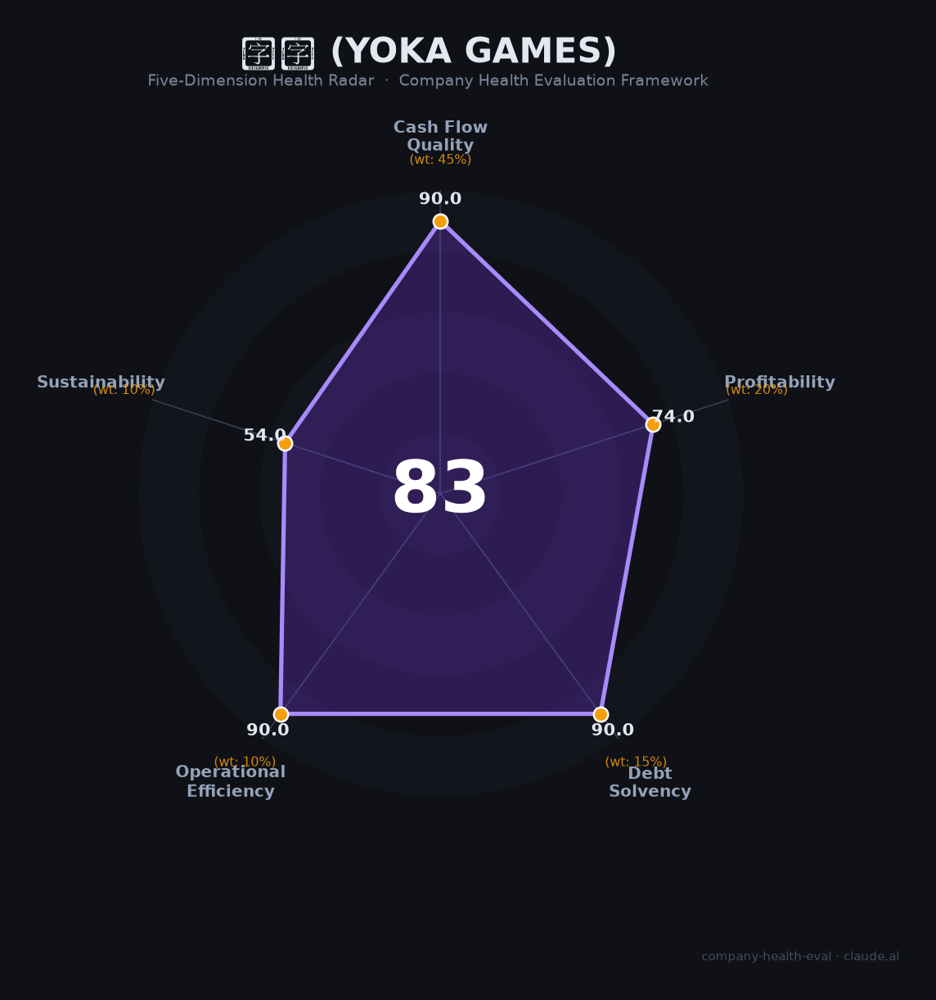

# 游卡 财务健康评估（2026-06-19）

## 一句话结论

🟡 **中等偏上（83/100）** | 16年国民IP现金牛+零负债+965标杆，单一IP依赖+抽卡合规+口碑死亡螺旋是核心隐忧

## 一、公司基本画像

| 项目 | 内容 |
|------|------|
| **运营主体** | 杭州游卡网络技术有限公司 |
| **成立时间** | 2015年11月（品牌始于2008年北京游卡） |
| **法定代表人** | 杜彬（CEO，清华计算机博士，联合创始人） |
| **注册资本** | 26,030.8万元 |
| **员工规模** | ~1,500-2,000人（杭州总部+上海/广州/成都/深圳/北京） |
| **股权结构** | 管理层100%控股（2017年从边锋/浙数文化完成MBO回购，无外部股东） |
| **核心产品** | 《三国杀》IP系列（OL+移动版+十周年+名将传等），占数字游戏收入>99% |
| **用户规模** | 累计注册4亿+（2023年），月流水约¥3亿（2024.7第三方估） |
| **融资状态** | 无外部融资（2017年MBO后自给自足），2018年曾以创嘉控股申请港股IPO未果 |
| **IP归属** | 完全自有（2009年转让给边锋→2015年边锋以¥1.04亿作价注入杭州游卡→2017年管理层全资回购） |

**一句话定性**：游卡是「成也三国杀，困也三国杀」的典型——16年国民级IP带来持续现金流和4亿用户，但单一产品依赖（>99%）、IP生命周期衰竭（Steam好评率仅7.48%）、抽卡合规隐患三重叠加，在「收割存量」与「寻找增量」之间艰难平衡。

## 二、五维财务健康评估

### 1. 现金流质量（90.0/100）

| 指标 | 判断 | 说明 |
|------|------|------|
| 经营现金流 | ✅ 健康 | 月流水¥3亿级（2024第三方估），16年持续运营，MBO后自给自足8年无外部融资，现金流极大概率持续为正 |
| 现金储备 | ✅ 健康 | 零负债+成熟现金牛+管理层100%控股，现金积累应充裕 |
| 有息负债 | ✅ 健康 | 管理层全资持有，零有息负债 |

**评估**：游卡是典型「现金牛」公司——16年IP持续产生流水，无债务、无外部股东，现金流质量毋庸置疑。2017年自边锋MBO以来8年未融资即是最好的现金流证明。

### 2. 盈利能力（74.0/100）

| 指标 | 判断 | 说明 |
|------|------|------|
| 毛利率 | ✅ 良好 | 📊 估60-70%（数字游戏行业基准，扣除渠道分成30%后仍高） |
| 净利率 | ✅ 良好 | 📊 估20-35%（成熟游戏高毛利+老产品运营成本低，但对标卡游44%净利率有差距） |
| 营收增速 | ✅ 良好 | 📊 2016年审计营收¥1.88亿→2024年估¥21-27亿（8年CAGR~35%）；2025.12 Sensor Tower +77%环比 |
| 研发费用率 | ✅ 良好 | 📊 估5-10%（成熟运营为主+新项目研发，高新技术企业资质） |
| 人均产出 | ✅ 良好 | 📊 估¥120-150万/人（¥21-27亿/1,500-2,000人），远超游戏行业均值~¥50-80万 |

**评估**：盈利能力在游戏行业中属于「中上」——比不过米哈游/卡游的暴利，但远超普通游戏公司。核心制约是三国杀付费体系「杀鸡取卵」（单个武将保底¥3,000/¥9,000），虽短期撑高流水但加速用户流失。

### 3. 偿债能力（90.0/100）

| 指标 | 判断 | 说明 |
|------|------|------|
| 资产负债率 | ✅ 健康 | 零有息负债，管理层全资持有 |
| 有息负债率 | ✅ 健康 | 零 |

**评估**：偿债风险为零。不仅无债务，还无外部股东对赌压力（与卡游的¥13.5亿对赌形成鲜明对比）。

### 4. 运营效率（90.0/100）

| 指标 | 判断 | 说明 |
|------|------|------|
| 应收周转 | ✅ 健康 | 游戏收入来自平台（苹果/谷歌/渠道）定期结算，回款周期短 |
| 客户集中度 | ✅ 健康 | 4亿+注册用户，完全分散 |
| 员工规模趋势 | ✅ 健康 | 1,500-2,000人，持续校招+社招，无大规模裁员（仅《七王书》项目局部解散且多数内部转岗） |
| 高管稳定性 | ✅ 健康 | 杜彬任CEO超10年，黄恺/李由等创始团队仍在，管理层极稳 |

**评估**：运营效率极为出色。在2023-2024全球游戏裁员潮中未发生大规模裁员，965文化在996泛滥的游戏行业独树一帜。

### 5. 可持续发展能力（54.0/100）

| 指标 | 判断 | 说明 |
|------|------|------|
| 行业赛道 | ⚠️ 关注 | 狭义桌游市场增速仅3.4%，但TCG/线上卡牌增速可观。三国杀核心赛道趋于成熟 |
| 技术壁垒 | ✅ 健康 | 16年IP+4亿用户认知+90%桌游市占率+四级赛事金字塔，护城河极深 |
| 业务多元化 | 🔴 危险 | 三国杀占数字游戏收入>99%，其他产品（自在西游、指间山海）量级远不及。极度单一IP依赖 |
| 资本支持 | ⚠️ 关注 | MBO后8年无外部融资。管理层100%控股既是优势（无对赌/无外部压力），也是局限（缺乏战略性资本支持） |
| 政策风险 | ⚠️ 关注 | 抽卡概率合规争议（盒子概率低至0.1%+公示不透明+大量投诉）；防沉迷执行不力（未成年人退款投诉频发）；内容审核持续 |

**评估**：可持续性是游卡的致命短板。三国杀已进入典型的「IP榨取末期」——Steam好评率仅7.48%（平台历史最低之一），武将定价离谱（¥3,000-9,000/个），三服数据割裂（OL/手杀/十周年），玩家社区「蒸蒸日上」梗成为行业笑柄。本质是「死亡螺旋」：付费设计恶化→玩家流失→逼氪更狠→加速流失。

## 三、综合评分与健康等级

| 维度 | 得分 | 权重 | 加权得分 |
|------|------|------|----------|
| 现金流质量 | 90.0 | 45% | 40.5 |
| 盈利能力 | 74.0 | 20% | 14.8 |
| 偿债能力 | 90.0 | 15% | 13.5 |
| 运营效率 | 90.0 | 10% | 9.0 |
| 可持续发展 | 54.0 | 10% | 5.4 |
| **综合得分** | | | **83.2/100** |
| **健康等级** | | | 🟡 **中等偏上** |

## 四、同业对标

| 对比项 | 游卡（三国杀） | 卡游（Kayou） | 网易·炉石传说 |
|--------|-------------|-------------|-------------|
| 上市/融资状态 | MBO私有，无融资 | 港股二次交表（失效），¥13.5亿对赌 | 网易旗下（NASDAQ: NTES） |
| 营收规模 | 📊 ¥21-27亿（2024估） | ¥100.57亿（2024） | ~¥18亿（2024炉石中国估） |
| 毛利率 | 📊 估60-70% | 67.3%（卡牌71.3%） | ~68.7%（网易游戏） |
| 净利率 | 📊 估20-35% | 44.4%（经调整） | ~28%（网易整体） |
| 核心IP模式 | **100%自有IP** | 69个授权IP+1个自有 | 暴雪授权 |
| 员工规模 | ~1,500-2,000 | — | ~30,000（网易全体） |
| IP运营年限 | **16年+** | 卡游三国2年（授权IP依赖热度） | 炉石10年+ |
| 核心差异 | 单一IP极深护城河+口碑崩塌 | 多IP矩阵+儿童市场+对赌压力 | 暴雪品质+网易运营+全球化 |

**对标结论**：游卡是中国原创桌游IP最长寿的持有者（16年），自有IP模式在成本结构上优于卡游（零授权费），但在规模上远逊（卡游4倍营收）且面临更严重的IP生命周期问题。三国杀的口碑恶化与炉石传说的回归热潮形成鲜明对比。

## 五、核心风险清单

1. **IP生命周期衰竭+口碑死亡螺旋（极高）**：Steam好评率7.48%（平台历史最低），武将定价¥3,000-9,000/个，三服割裂（OL/手杀/十周年），玩家社区「蒸蒸日上」梗成行业笑柄。「付费恶化→用户流失→逼氪更狠」的死亡螺旋已形成。16年的运营时长是双刃剑——既证明IP韧性，也意味着存量用户的付费潜力正被榨干。

2. **抽卡概率合规风险（高）**：盒子概率低至0.1%，保底机制不透明，多平台存在「概率造假」投诉（2019年质量万里行+2024年黑猫投诉）。参考卡游IPO因未成年保护二度受阻，抽卡合规可能成为监管整治的下一个目标。

3. **极度单一IP依赖（高）**：三国杀占数字游戏收入>99%。《七王书》2024年获版号后仍解散，《自在西游》首月流水破2亿后未能持续。任何对三国杀的监管、舆情或用户流失冲击都将直接威胁公司生存。

4. **防沉迷执行不力（中高）**：黑猫投诉数十起未成年人充值数千至近万元拒退案例。若被监管部门作为典型案例查处，可能面临罚款或整改。

5. **8年无融资+无资本化路径（中）**：MBO后完全自给自足，IPO失败后无明确资本化计划。管理层100%控股虽避免了外部对赌压力，但也意味着老员工的期权/股权缺乏流动性。

## 六、求职/择业视角

### 核心优势
- **游戏圈965标杆**：9:00-18:30弹性+双休+公积金12%全额，在996泛滥的游戏行业独树一帜
- **稳定现金流**：16年IP持续产生流水，零负债，4亿注册用户，无裁员潮（2023-2024全球游戏裁员潮中平稳度过，仅《七王书》项目局部调整）
- **三国杀IP运营经验**：深度参与中国最长寿桌游IP的运营，简历上有分量
- **杭州生活性价比**：杭州滨江区+六险一金+餐补+免费晚餐+22点后打车报销，生活成本低于北上深

### 现存短板
- **薪资倒挂严重**：无普调机制，3-5年老员工薪资可能和校招SP持平，涨薪靠跳槽
- **IP影响力局限**：三国杀在游戏圈外知名度有限，跳槽到非游戏公司帮助不大
- **技术栈陈旧**：三国杀底层代码年代久远，在老项目组技术成长有限
- **管理混乱**：前员工形容为「真人版狼人杀」，层级不清、流程混乱
- **部门两极分化**：「养老组」vs「内卷组」差距大，对个人发展影响大

### 分场景建议

| 个人诉求 | 推荐 | 次选 | 规避 |
|----------|------|------|------|
| 稳定+WLB | **游卡**（965+零裁员+现金牛） | 网易游戏 | 996游戏公司 |
| 高薪+跳板 | 米哈游（薪资行业顶级） | 腾讯游戏 | **游卡**（薪资倒挂+涨薪慢） |
| 成长+技术提升 | 米哈游/鹰角（前沿技术） | 游卡新项目组 | **游卡三国杀维稳组** |
| 杭州定居+性价比 | **游卡**（杭州游戏圈中上薪资+12%公积金） | 网易杭州 | — |

> **强烈推荐**：追求WLB和稳定性的杭州策划/运营/美术（965+零裁员+杭州安居）。
> **不推荐**：追求高薪和快速晋升的技术岗（无普调+薪资倒挂+技术栈陈旧）。

## 七、总结

**游卡是「中国最长寿原创桌游IP的守护者与掘墓人」：**
现金流极稳（月流水¥3亿级+零负债+MBO自给自足8年），运营效率出色（零裁员+965标杆），16年IP护城河极深（4亿用户+90%桌游市占率）。
核心短板是IP生命周期衰竭（Steam好评率7.48%的死亡螺旋）+极度单一产品依赖（>99%）+抽卡合规隐患。
在三国杀「榨干存量 vs 寻找增量」的关键十字路口，属于**财务健康但前景堪忧的现金牛**，适合追求WLB的从业者，不适合追求高成长和创新的顶尖人才。

---

*评估日期：2026-06-19 | 数据截至：2026年6月公开信息 | 评分引擎：company-health-eval v1.0*
