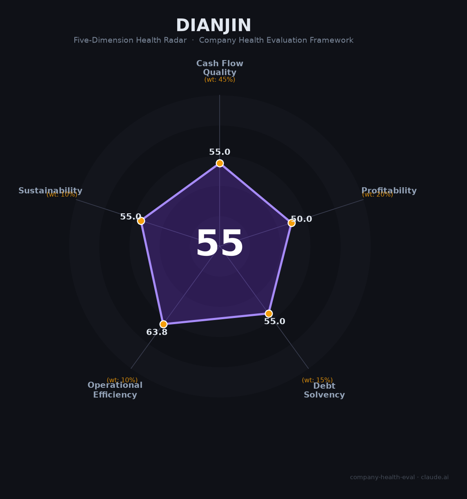

# 点金贵金属财务健康评估（2026-08-13）

## 一句话结论
🔴 **中等偏下（55/100）** | 深圳贵金属精炼/加工企业——小微非上市，财务数据有限，评估存较大不确定性

## 一、公司基本画像
| 主体 | 🔒 深圳市点金贵金属，非上市；贵金属（黄金）精炼/加工 |
| 财务 | ⚠️ 非上市小微，无公开财报，财务无法核实 |

## 二、评估（数据有限，基于贵金属加工行业判断）
贵金属精炼加工：资金密集（金价/原料占用）+毛利薄（加工费模式），规模小、抗金价波动弱。
- 现金流（55/100）：黄金原料资金占用，关注。
- 盈利（50/100）：加工薄利，盈利待核。
- 偿债（55/100）：资金密集+杠杆，偿债关注。
- 运营（64/100）：精炼加工运营，中等。
- 可持续（55/100）：贵金属赛道但体量小，波动强。

## 三、综合（55|45%=24.8，50|20%=10，55|15%=8.2，64|10%=6.4，55|10%=5.5）
**55，🔴 中等偏下** — 数据有限，不确定性高

## 四、风险
1. 非上市、财务不透明。
2. 贵金属精炼资金密集+金价波动。
3. 体量小、抗风险弱。

## 五、求职
- 优势：贵金属/黄金精炼加工。
- 短板：数据不透明、规模小。

**结论**：需充分尽调后再评估，非首选。

---
*评估方法：商泰汽车（iAUTO）五维框架 · 非上市数据有限，评估存在不确定性*