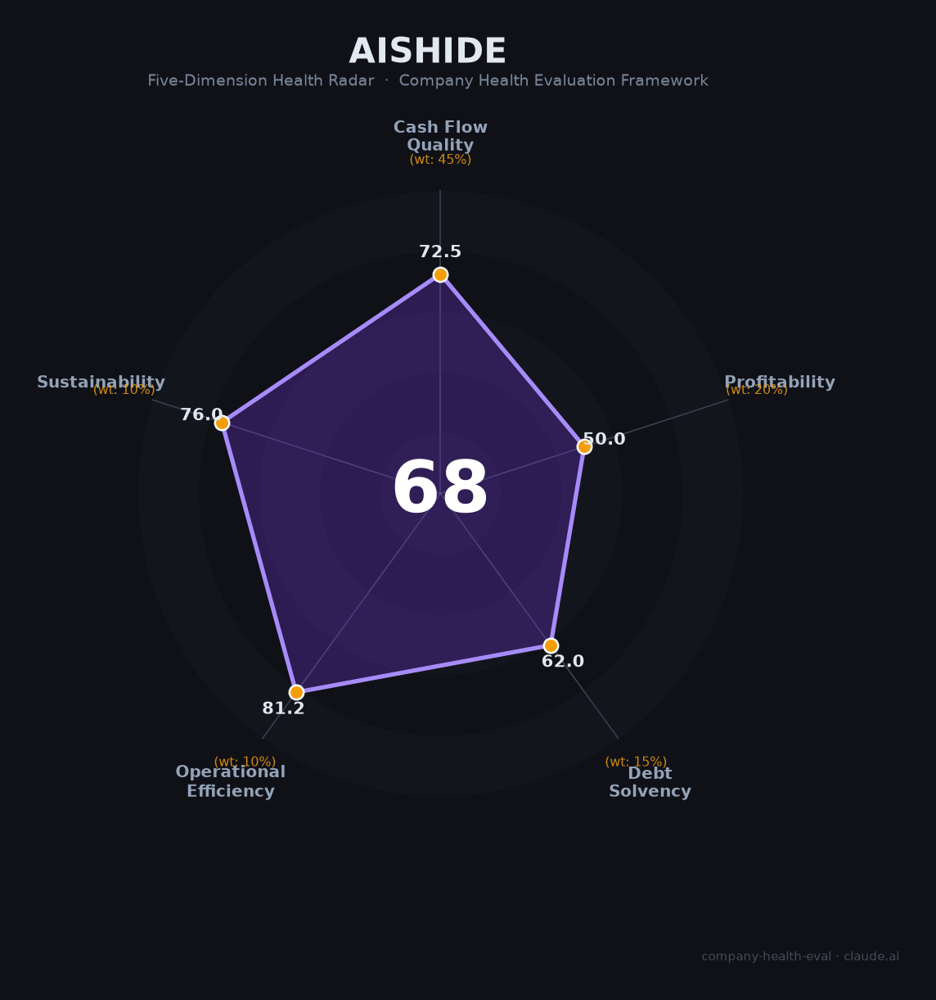

# 爱施德（002416.SZ）财务健康评估（2026-08-13）

## 一句话结论

🟠 **中等（68/100）** | 手机/消费电子分销龙头——营收552.2亿、盈利承压但现金流稳健，分销薄利+渠道转型

---

## 一、公司基本画像

| 主体 | 🔒 深圳市爱施德股份有限公司，A股：002416.SZ；苹果/华为手机等消费电子分销 |
| 主营 | 手机/3C分销、渠道服务 |
| 财务 | 🔒 2025营收552.2亿（基本持平）；归母净利3.7亿（承压）；毛利率约6%、净利率0.7%；员工数千 |

> 一句话定性：爱施德是消费电子分销龙头（代理苹果/华为/荣耀等），营收550亿+但分销毛利薄（6%），盈利承压但仍盈利，渠道网络是核心资产。

## 二、五维财务健康评估

1. 现金流（73/100）：分销回款/现金流稳健健康（消费电子账期）。
2. 盈利（50/100）：毛利6%、净利3.7亿（承压），分销薄利。
3. 偿债（62/100）：分销杠杆、应收账款占用，偿债中等。
4. 运营（81/100）：渠道/客户网络成熟，运营高效。
5. 可持续（76/100）：消费电子分销稳定，渠道+出海/新品类拓展，价格战与ATL波动关注。

## 三、综合评分

| 维度 | 得分 | 权重 | 加权 |
|------|:----:|:----:|:----:|
| 现金流质量 | 72.5 | 45% | 32.6 |
| 盈利能力 | 50.0 | 20% | 10.0 |
| 偿债能力 | 62.0 | 15% | 9.3 |
| 运营效率 | 81.2 | 10% | 8.1 |
| 可持续发展 | 76.0 | 10% | 7.6 |
| **综合** | **68** | 100% | 67.6 |

**评级：🟡 中等偏上（68, 边界）** — 分销龙头但薄利。

## 四、核心风险
1. 分销薄利、净利率0.7%。
2. 手机/消费电子渠道依赖（苹果/华为）。
3. 备货与库存。

## 五、求职/择业视角
- 优势：手机分销龙头、渠道网络、稳定。
- 短板：薄利、薪酬弹性一般、分销强度。

**结论**：适合追求消费电子分销/渠道运营方向的求职者，稳定但非高增长。

---

*评估方法：商泰汽车（iAUTO）五维健康度框架 · 数据截至2026年8月 · 来源爱施德2025年报*