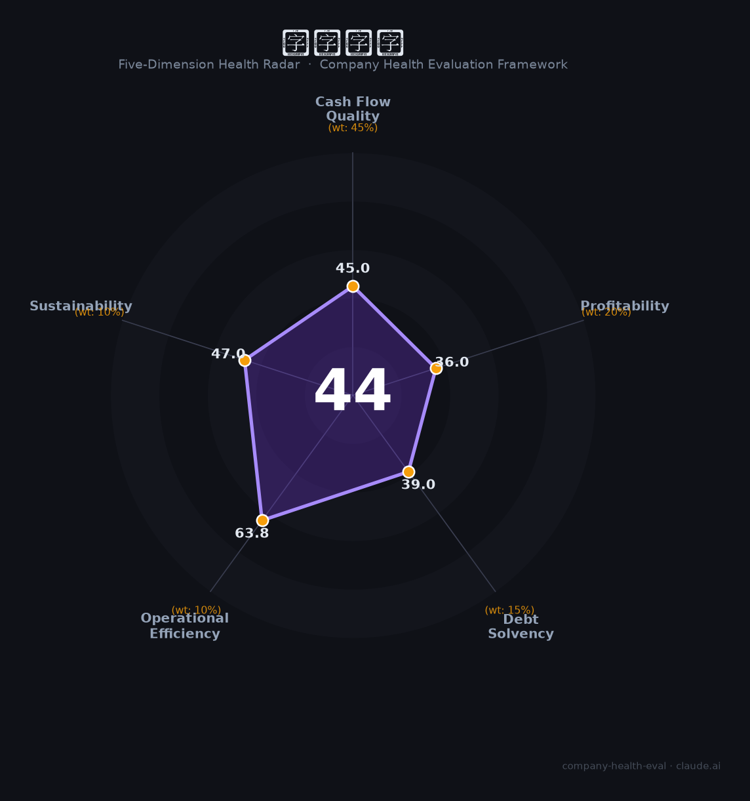

# 特发信息（000070.SZ）财务健康评估（2026-08-14）

## 一句话结论

🔴 **44/100，中等偏下** | 光通信+军工信息化，主业稳但减值亏损

---

## 一、公司基本画像

| 项目 | 内容 |
|------|------|
| 主体 | 特发信息，(深圳国企) |
| 主营 | 光通信/军工信息化 |
| 财务 | 2025营收约44亿，归母净利-4.96亿(收购拖累/减值) |

> 一句话定性：深圳国企光通信，主业赚钱但减值巨亏

---

## 二、五维财务健康评估

### 1. 现金流质量（45/100）| 权重45%

现金流一般。

### 2. 盈利能力（36/100）| 权重20%

净亏损，盈利能力差。

### 3. 偿债能力（39/100）| 权重15%

高负债。

### 4. 运营效率（64/100）| 权重10%

运营效率一般。

### 5. 可持续发展（47/100）| 权重10%

军工信息化高增，但整体亏损。

---

## 三、综合评分

| 维度 | 得分 | 权重 | 加权 |
|------|:----:|:----:|:----:|
| 现金流质量 | 45 | 45% | 20.2 |
| 盈利能力 | 36 | 20% | 7.2 |
| 偿债能力 | 39 | 15% | 5.8 |
| 运营效率 | 64 | 10% | 6.4 |
| 可持续发展 | 47 | 10% | 4.7 |
| **综合得分** | **44/100** | 100% | 44.4 |

**健康等级：中等偏下** — 存在较多风险点，需谨慎评估

---

## 四、核心风险清单

1. **减值亏损**
2. **高负债**
3. **光通信竞争**

## 五、求职/择业视角

### 核心优势
- 国企背景、军工信息化高增
### 现有短板
- 亏损、高杠杆

**结论**：特发信息深圳国企，军工信息化增长但整体亏损、高杠杆，风险较高。

---

*评估方法：商泰汽车（iAUTO）五维框架 · 数据截至2026年8月 · 财务来源特发信息2025年报*