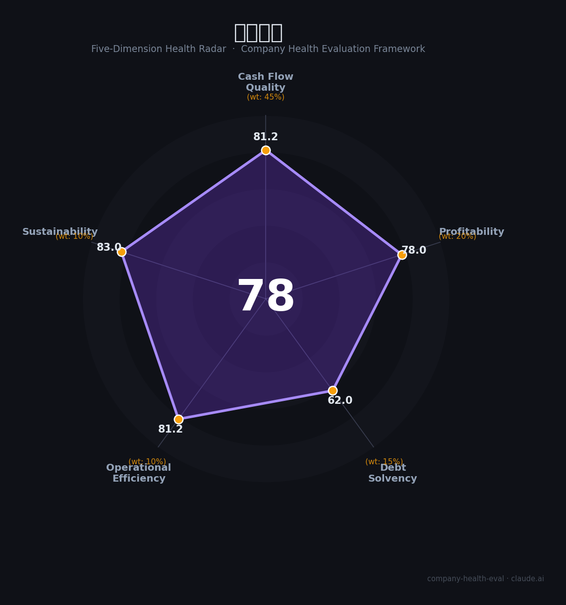

# 瑞声科技（02018.HK）财务健康评估（2026-08-14）

## 一句话结论

🟡 **78/100，中等偏上** | 声学/光学精密制造龙头，营收高增、盈利强

---

## 一、公司基本画像

| 项目 | 内容 |
|------|------|
| 主营 | 精密制造(声学/光学/电磁传动) |
| 财务 | 2025营收318.17亿(+16.4%)，净利25.1亿，毛利率22.1% |

> 一句话定性：精密制造科技龙头，营收利润双增、盈利优秀

---

## 二、五维财务健康评估

### 1. 现金流质量（81/100）| 权重45%

现金流充沛。

### 2. 盈利能力（78/100）| 权重20%

毛利率22%净利率稳，盈利优秀。

### 3. 偿债能力（62/100）| 权重15%

负债适中、偿债可控。

### 4. 运营效率（81/100）| 权重10%

运营效率高。

### 5. 可持续发展（83/100）| 权重10%

AI硬件+车载+光学，成长强劲。

---

## 三、综合评分

| 维度 | 得分 | 权重 | 加权 |
|------|:----:|:----:|:----:|
| 现金流质量 | 81 | 45% | 36.5 |
| 盈利能力 | 78 | 20% | 15.6 |
| 偿债能力 | 62 | 15% | 9.3 |
| 运营效率 | 81 | 10% | 8.1 |
| 可持续发展 | 83 | 10% | 8.3 |
| **综合得分** | **78/100** | 100% | 77.9 |

**健康等级：中等偏上** — 整体稳健，局部有待改善

---

## 四、核心风险清单

1. **客户集中**
2. **消费电子周期**
3. **盈利能力**

## 五、求职/择业视角

### 核心优势
- 精密制造龙头、盈利强、AI硬件
### 现有短板
- 客户集中、组装/消费电子波动

**结论**：瑞声科技精密制造龙头，营收净利双增、毛利率稳定，AI硬件与光学打开的成长空间大。

---

*评估方法：商泰汽车（iAUTO）五维框架 · 数据截至2026年8月 · 财务来源瑞声科技2025年报*