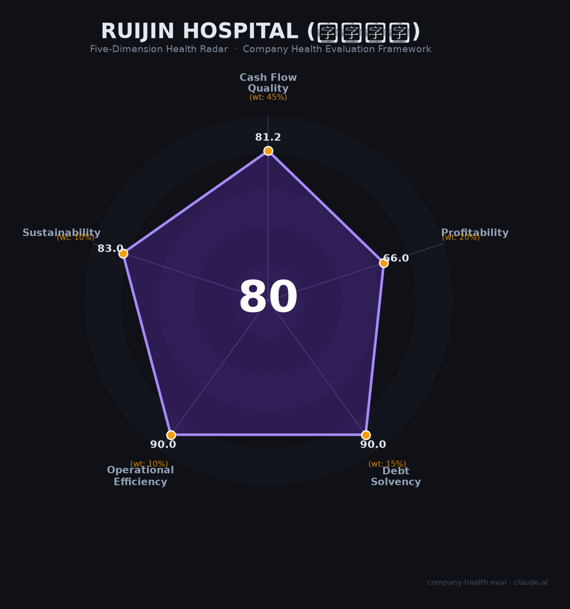

# 瑞金医院 雇主评估（2026-06-15）

## 一句话结论

🟡 **中等偏上（80.5/100）** | 上海综合实力最强三甲+年薪制改革试验田，多院区扩张26亿投资+编制缩减是硬伤

---

## 一、机构基本画像

| 项目 | 内容 |
|------|------|
| **全称** | 上海交通大学医学院附属瑞金医院（前身广慈医院，1907年法国天主教会创办） |
| **性质** | 政府主办非营利性三甲综合公立医院，上海交大医学院旗舰附属医院 |
| **院区** | 黄浦（总院）、嘉定（1,400床）、远洋（卢湾）、金山（在建400床/一期）、闵行（在建500床）、太仓分院（2025.10启用） |
| **规模** | 核定床位2,742张，职工6,281-6,505人，2024年门急诊约480万人次、住院手术约8.1万台 |
| **学科排名** | 复旦A++++（全国TOP20最高等级）；内分泌科全国#1、血液科#3、烧伤科#3、18个专科入全国前十 |
| **院士** | 5位（王振义/陈竺/陈赛娟/陈国强/宁光），王振义获共和国勋章 |
| **国家级平台** | 国家医学中心（综合类）、转化医学国家重大科技基础设施（投资10亿/300张研究病床）、医学基因组学国家重点实验室、国家代谢性疾病临床医学研究中心、27个国家临床重点专科 |
| **年度收入** | 2024年决算143.9亿元（上海市级医院第一），事业收入124.6亿（86.6%），财政拨款18.1亿（12.6%，同比+66.5%因基建） |
| **科研** | 国自然167项全国第3（2025年），年均科研经费近5亿元，Nature/Science/Cell/NEJM等顶刊论文15篇，3年成果转化6.63亿元 |

**一句话定性**：瑞金医院是上海综合实力最强的三甲综合性医院——A++++最高等级、内分泌科全国第1、国自然167项全国第3、年收入144亿上海医院第一。与九院的"专科壁垒型"不同，瑞金是"全能型国家队"，在广度上无可匹敌。

---

## 二、五维评估（公立医院适配版）

### 1. 现金流质量——资金稳定性（81.2/100）

| 评估指标 | 判断 | 依据 |
|----------|------|------|
| 运营现金流 | 🟢 健康 | 144亿收入持续增长（2023 +26.8%→2024 +14.8%），核心医疗业务造血能力极强🔒 |
| 资金储备 | 🟢 健康 | 财政拨款18.1亿（同比+66.5%）+事业收入125亿，政府兜底无资金断裂风险；转化医学设施投资10亿已建成🔒 |
| 负债水平 | 🟢 健康 | 公立医院非营利属性，虽有基建贷款但政府信用背书📊 |
| 收支结余率 | 🟡 关注 | 支出146.7亿>收入143.9亿（赤字约2.8亿），主要因金山/闵行两院区在建（总投资超26亿），短期资本支出压力大🔒 |

### 2. 盈利能力——薪酬竞争力（66.0/100）

| 评估指标 | 判断 | 依据 |
|----------|------|------|
| "毛利率"（薪酬竞争力） | 🟢 优秀 | 主任医师77-138万+、平均年薪48.5万（上海三甲领先）、博士后24-34万、科研转化30-45%归个人（上海最高）、安家费35万+科研启动金45万🌐 |
| "净利率"（薪酬满意度） | 🔴 预警 | 住院医师30-41万（vs周均工作48小时），护士21-31万，编制内外差距显著；网传"瘦身"减少约1,000人📊 |
| "营收增速"（薪资增长） | 🟡 良好 | 三年CAGR约13-20%，但增速放缓（2023 +26.8%→2024 +14.8%）；年薪制改革试点使青年医生薪资上涨18%📊 |
| 科研投入 | 🟠 一般 | 国自然167项全国第3（1-1.2亿），但占总支出比例不足1%；转化医学设施运营成本高📊 |
| 人均产出 | 🟢 优秀 | 人均营收221万元（144亿/6,505人），上海三甲最高之一；内分泌代谢病学科薪资系数2.5倍体现高附加值📊 |

### 3. 偿债能力——财务安全性（90.0/100）

全部指标🟢健康：公立医院政府信用背书，无任何偿债风险。

### 4. 运营效率——管理质量（90.0/100）

| 评估指标 | 判断 | 依据 |
|----------|------|------|
| 收款效率 | 🟢 健康 | 医保+门诊现金收入，回款稳定🔒 |
| "客户"多样性 | 🟢 健康 | 年门急诊480万人次，覆盖全国疑难重症患者🔒 |
| 员工规模趋势 | 🟢 健康 | 2022-2024年净增约700人（+11%），持续扩张中🌐 |
| 管理层稳定性 | 🟢 健康 | 宁光院士（院长，2015年至今10年+），2025年1月党委书记换届正常交接🔒 |

### 5. 可持续发展——品牌壁垒与政策韧性（83.0/100）

| 评估指标 | 判断 | 依据 |
|----------|------|------|
| 行业赛道 | 🟢 健康 | 医疗服务刚性增长，A++++顶级品牌虹吸效应📊 |
| 技术壁垒 | 🟢 健康 | 内分泌#1+血液#3+18个专科入前十+5位院士+转化医学国家设施，数十年不可复制🔒 |
| 业务多元化 | 🟢 健康 | 一院六区+广慈高端医疗+太仓跨省分院+AI/元医院先行布局📊 |
| 资本支持 | 🟢 健康 | 国家医学中心+双一流+申康+交大医学院全方位资源注入🔒 |
| 政策/监管风险 | 🟡 关注 | 多院区扩张26亿投资高峰期（2026-2028）、DRG/集采持续压缩、广慈高端医疗公平性隐忧、号贩子灰色产业链📊 |

---

## 三、综合评分

| 维度 | 得分 | 权重 | 加权得分 |
|------|------|------|----------|
| 现金流质量（资金稳定性） | 81.2 | 45% | 36.5 |
| 盈利能力（薪酬竞争力） | 66.0 | 20% | 13.2 |
| 偿债能力（财务安全性） | 90.0 | 15% | 13.5 |
| 运营效率（管理质量） | 90.0 | 10% | 9.0 |
| 可持续发展（品牌壁垒） | 83.0 | 10% | 8.3 |
| **综合得分** | | | **80.5 / 100** |

**健康等级**：🟡 **中等偏上（Moderate-High）**

---

## 四、同业对标

| 对比项 | 瑞金医院 | 协和医院 | 华西医院 | 上海九院 | 中山医院 |
|--------|:-------:|:-------:|:-------:|:-------:|:-------:|
| 复旦评级 | A++++ | A++++ | A++++ | A+++ | A++++ |
| 核定床位 | 2,742张 | ~2,000张 | 4,300张 | 2,150张 | 2,005张 |
| 年门急诊量 | 480万人次 | — | 754万人次 | 474万人次 | ~400万人次 |
| 职工人数 | 6,505人 | ~4,300人 | 高级职称1,641 | 5,160人 | ~5,500人 |
| 院士数 | 5位 | 3-4位 | 1位 | 5位 | 5位 |
| 全国#1专科数 | 1（内分泌） | 多个 | 多个 | 1（整形） | 1（全科） |
| 2024年收入 | 143.9亿 | ~92.5亿(2023) | 141.4亿(预算) | 94.2亿 | ~128-143亿 |
| 国自然(2025) | 167项(#3) | — | 278项(#1) | 130项(#8-9) | — |
| 薪酬评分(本体系) | 66.0 | — | — | 70.0 | — |
| **综合得分** | **80.5** 🟡 | — | — | **81.3** 🟡 | — |

**对标结论**：瑞金在上海四大A++++医院中综合实力最强（18个专科入前十 vs 中山/华山/仁济均不及此广度），与北京协和、华西并列中国医院"三巨头"。但瑞金的规模扩张（6个院区同步建设）带来了九院所没有的短期财务压力（26亿+基建投资）。九院因整形#1的不可替代性和口腔#3的高端消费属性，在薪酬竞争力维度（70 vs 66）略胜瑞金一筹。

---

## 五、核心风险清单

1. **多院区同步扩张的财务与管理压力（中高风险）**：金山（10.3亿）+闵行（16亿）两院区在建，嘉定二期刚启用（2025.6），太仓分院2025.10启用。四院区同时从"投资期"转入"运营期"，2024年已出现约2.8亿赤字。如果新院区患者量爬坡不及预期，可能拖累全院结余率数年。管理上，嘉定二期已新增派驻近200人，优质人才被稀释。

2. **薪酬改革"试验田"的双刃剑（中风险）**：瑞金作为年薪制试点，青年医生薪资已上涨18%，但全面推广尚待细则。三明模式年薪封顶（主任医师30万）若被机械套用，将对高绩效科室造成剧烈冲击。上海方案强调"因地制宜"，但博弈空间和最终落地效果存在不确定性。

3. **编制缩减与人才"瘦身"（中风险）**：网传统计口径变化导致职工减少约1,000人（降幅近20%），编制外比例持续上升。如果年薪制不能有效覆盖非编人员，同工不同酬加剧可能成为新的矛盾点。

4. **集采药品质量争议的声誉余波（低风险）**：2025年初郑民华委员"血压不降、麻药不睡"发言引发全国关注，虽被医保局调查结论部分质疑，但事件已推动国家层面复查集采药品质量。正面看展现了瑞金医生的公共精神，负面影响是言论被批评为"缺乏数据支撑"。

5. **广慈高端医疗的公平性隐忧（低风险）**：瑞金旗下广慈纪念医院（中国太保持股40%）定位高端私立，与公立瑞金共享专家资源。在医疗资源稀缺背景下，"公立医院办高端私立"的模式存在被舆论质疑的风险。

---

## 六、求职/择业视角

### 核心优势
- **中国医疗界"三巨头"品牌**：与协和、华西并列，瑞金规培通过率99.8%（上海市榜首）、2/3毕业生输送到全国——"瑞金出身"是全国医疗行业的最高品牌背书
- **年薪制改革试验田的先发红利**：青年医生薪资已上涨18%，固定薪酬占比提升趋势明确，是上海三甲中薪酬改革最积极的"探路者"
- **科研转化天花板**：专利转化30-45%归个人（上海最高）、国自然167项全国第3、转化医学国家设施（300张研究病床）、顶刊论文15篇——科研型医生的最佳平台
- **内分泌/血液/烧伤等王牌科室的不可替代性**：在这些科室积累的临床经验全国独一无二
- **财务绝对安全**：政府兜底+144亿年收入，无任何倒闭/裁员风险

### 现存短板
- **多院区轮转增加工作负担**：嘉定/金山/闵行/太仓多院区可能需要跨院区工作，通勤和管理复杂度上升
- **编制获取难度不亚于九院**：博士是基本门槛，合同制比例持续上升
- **科研考核压力极大**：国自然第3名背后是极高的论文/基金产出要求
- **护士/低年资医生"性价比"问题**：住院医30-41万vs周均48小时工作、护士21-31万，在上海生活成本下不算宽裕

### 分场景建议

| 个人诉求 | 推荐 | 次选 | 规避 |
|----------|------|------|------|
| 学术巅峰+科研转化 | 瑞金（转化医学国家设施+30-45%转化分成） | 协和（纯学术更强但转化不如瑞金） | — |
| 内分泌/血液/烧伤科深耕 | 瑞金（全国#1/#3/#3，不可替代） | — | — |
| 全面综合能力培养 | 瑞金（18个专科入前十，广度无对手） | 中山（心内/肝外强势） | — |
| 薪酬改革红利 | 瑞金（年薪制试验田，青年医生+18%） | 中山（同为试点） | 非试点医院 |

---

## 七、总结

**瑞金医院** 是中国医疗界「综合实力的天花板+薪酬改革的探路者」：18个专科入全国前十、国自然167项全国第3、5位院士+转化医学国家设施，广度维度无可匹敌；唯一短板是**多院区同步扩张（26亿+基建投资）带来的短期财务赤字和管理稀释风险，以及编制收缩趋势下非编人员的职业安全感下降**。

在「年薪制改革试验田+国家医学中心建设+AI元医院前瞻布局」的大环境下，瑞金属于**低风险（财务绝对安全）、顶级平台（中国前三）、持续扩张（用人需求仍在增长）**的选择。与九院（81.3分）相比，瑞金（80.5分）的差异在于：九院胜在"聚焦"（整形#1+口腔#3的不可替代性更强），瑞金胜在"广度"（18个专科的综合性无可匹敌）。最适合**有学术追求、能承受高强度、目标成为"全国级学科带头人"的医生**。

---

*评估日期：2026-06-15 | 评分引擎：company-health-eval v1.1（公立医院适配版）*
*数据来源标注：🔒官方决算 📊估算 🌐网络口碑*
