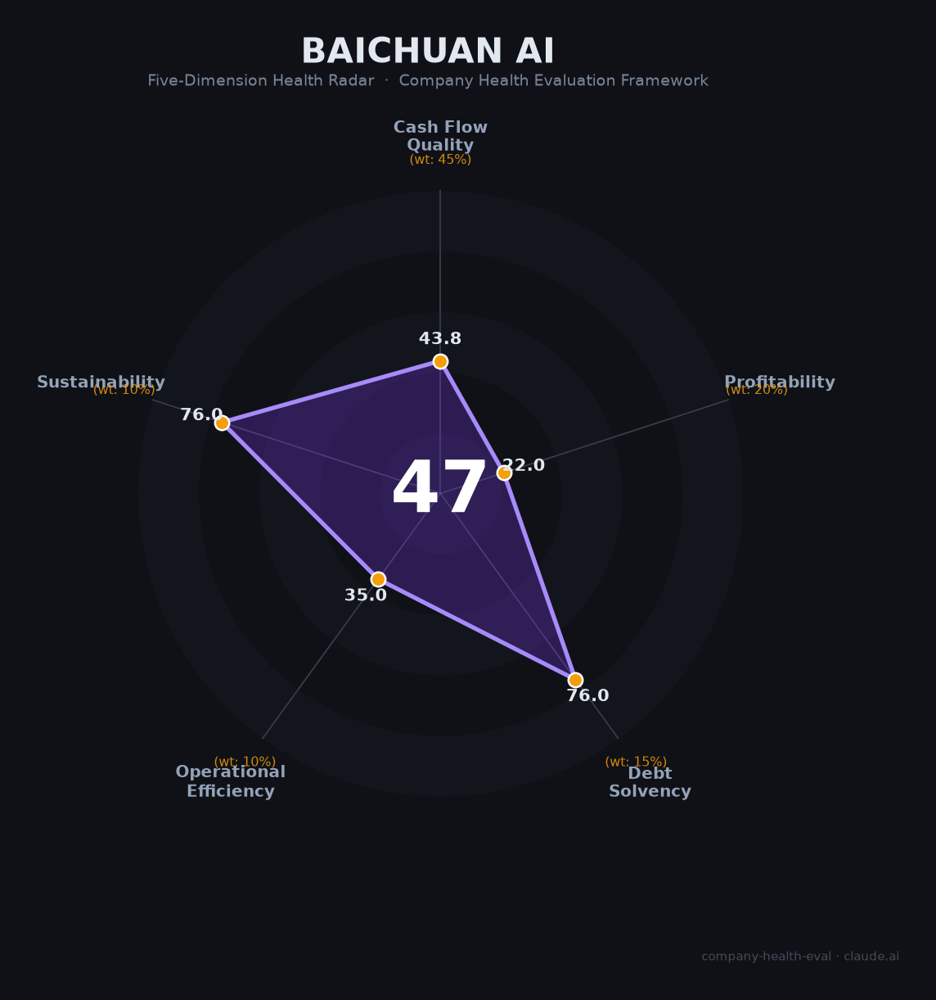

# 百川智能 财务健康评估（2026-06-12）

## 一句话结论

🔴 **中等偏下（46.6/100）** | 医疗大模型技术世界第一（HealthBench三榜冠军），现金30亿可撑3-5年；唯营收近乎为零、4/5联创离职、商业化路径未验证是生存级风险

> **重要提示**：百川智能是2023年成立的早期AI创业公司。本框架对初创公司的财务基本面评分天然偏低——这反映的是"当前财务状态"而非"长期增长潜力"。求职者需结合技术壁垒和IPO预期综合判断。

---

## 一、公司基本画像

| 项目 | 内容 |
|------|------|
| **全称** | 北京百川智能科技有限公司（Baichuan Intelligent Technology） |
| **成立** | 2023年4月10日，北京清华科技园 |
| **创始人/CEO** | 王小川（前搜狗CEO，清华计算机系，18岁IOI金牌） |
| **唯一在任联创** | 茹立云（总裁，前搜狗COO，浙江省高考状元） |
| **已离职联创** | 洪涛（商业化）、焦可（互联网）、陈炜鹏（模型研发）、谢剑（后训练）——4/5已离职 |
| **员工** | ~200人（从峰值450人收缩56%，研发占比~80%） |
| **主营业务** | 医疗AI大模型（Baichuan-M4）+ AI家庭医生"百小医"（APP+微信BOT） |
| **2024年营收** | ~1亿元（📊 金融B端定制化服务，已放弃） |
| **2025年营收** | 可能更低（战略转型至医疗，API永久免费） |
| **估值** | 200亿元（2024年7月A轮，近2年无新融资） |
| **融资总额** | ~75亿元（天使5000万美元+A1轮3亿美元+A轮50亿元） |
| **现金储备** | 约30亿元（2026年1月王小川披露） |
| **IPO计划** | 可能2027年启动（王小川个人判断） |

百川智能是中国"大模型六小虎"中唯一全面转型医疗垂直赛道的公司。从通用大模型赛道退出后，百川将全部资源押注在"AI造医生"——Baichuan-M4在HealthBench三大评测同时登顶世界第一（超越GPT-5.5、Claude Opus 4.7），事实性幻觉率压至3.3%全球最低。但商业化路径尚未验证，核心团队大面积流失（4/5联创离职），是六小虎中"最危险或最安全"的矛盾体。

---

## 二、五维财务健康评估

### 1. 现金流质量（43.8/100）

| 指标 | 状态 | 详情 |
|------|------|------|
| 经营现金流净额 | 🔴 危险 | 早期AI创业公司，成立3年从未产生正向经营现金流。2025年放弃年收入1亿元的B端业务后，OCF进一步恶化（📊 估算） |
| 现金及等价物 | ⚠️ 关注 | 账面30亿元现金。年消耗约5-10亿元（📊 估算：薪资2-3亿+算力2-5亿+其他），现金跑道约3-5年。13.82亿元GPU合同已解除，大幅减轻支出压力 |
| 有息负债 | ✅ 健康 | 零有息负债，纯股权融资驱动 |
| 净现比 | 🔴 危险 | 无利润可配比（持续亏损），OCF持续为负 |

现金30亿是百川的"生命线"。王小川称"即使什么都不做，光靠存单利息也足够让这群精英过得体面"。按当前200人团队的低消耗模式，现金可支撑3-5年。但如果重新加大模型训练或扩张团队，消耗速度将显著加快。

### 2. 盈利能力（22.0/100）

| 指标 | 等级 | 详情 |
|------|------|------|
| 毛利率 | ➖ 一般 | 医疗AI软件理论毛利率50-75%（对标鹰瞳科技74%、科大讯飞智慧医疗53%），但百川目前收入规模极小，实际毛利率无参考意义 |
| 净利率 | ⚠️ 预警 | 深度亏损。年支出5-10亿元 vs 年收入可能不到1亿元，净利率约-500%至-1000%（📊 估算） |
| 营收增速 | ⚠️ 预警 | 2024年~1亿→2025年可能更低（主动放弃B端业务），战略转型期收入负增长 |
| 研发费用率 | ⚠️ 预警 | 几乎100%支出为研发（人员+算力），远超35%且深度亏损 |
| 人均产出 | ⚠️ 预警 | 约5万元/人（📊 1亿营收/200人），极低——但这在早期AI研发阶段属正常 |

盈利能力是百川最弱的维度（22分），五项指标中四项预警。但这本质上是"主动选择"——百川放弃了年收入1亿元的金融B端业务，All in医疗赛道。如果按2024年的商业化轨迹（B端营收+API收入），盈利能力可以显著改善。王小川的选择是先牺牲商业化以换取医疗赛道的技术壁垒——这需要求职者自己判断是否认同。

### 3. 偿债能力（76.0/100）

| 指标 | 状态 | 详情 |
|------|------|------|
| 资产负债率 | ✅ 健康 | 几乎无负债，纯股权融资 |
| 有息负债率 | ✅ 健康 | 0% |
| 流动比率 | ⚠️ 关注 | 无法精确验证（非上市初创公司） |
| 现金比率 | ⚠️ 关注 | 无法精确验证（同上） |
| 股权质押比例 | ✅ 健康 | 王小川持股76.43%，无质押风险 |

偿债能力是百川唯一亮点维度（76分），三健康两关注。百川没有债务负担，30亿纯现金无任何偿债压力。两个"关注"仅因非上市公司数据不透明。

### 4. 运营效率（35.0/100）

| 指标 | 状态 | 详情 |
|------|------|------|
| 应收周转 | ⚠️ 关注 | 医院客户回款周期长达6-12个月。2024年B端客户回款相对较快，但该业务已放弃 |
| 客户集中度 | ⚠️ 关注 | 主要依赖3家医院合作（北京儿童医院/医科院肿瘤医院/瑞金医院）+少量政府项目，客户高度集中 |
| 员工规模趋势 | 🔴 危险 | 从450人骤降至200人（-56%），大规模裁员反映战略剧烈摇摆 |
| 高管稳定性 | 🔴 危险 | 5位联创中4位已离职（洪涛/焦可/陈炜鹏/谢剑），仅王小川+茹立云在任。联合创始人大面积出走是创业公司最高危信号之一 |

运营效率评分35分，两关注两危险，是百川第二大薄弱环节。450→200人的大幅裁员虽属主动"瘦身"，但4/5联合创始人离职（涵盖商业化、互联网、模型研发、后训练全部关键职能）折射出内部战略分歧之深。对一个200人团队而言，高管流失的影响远大于大厂。

### 5. 可持续发展能力（76.0/100）

| 指标 | 状态 | 详情 |
|------|------|------|
| 行业赛道空间 | ✅ 健康 | 医疗AI市场CAGR 30-43%（2026年预计跨越1,500亿元），五部门要求2030年基层诊疗AI辅助全覆盖 |
| 技术壁垒 | ✅ 健康 | Baichuan-M4在HealthBench/Hard/Professional三大榜世界第一，幻觉率3.3%全球最低。1,000+条原子化临床路径，3年+难以复制 |
| 业务多元化 | ⚠️ 关注 | 全面聚焦医疗单一赛道。抗风险能力弱——一旦医疗AI商业化不及预期，无Plan B |
| 资本支持 | ✅ 健康 | 75亿元累计融资（阿里/腾讯/小米/北上AI产业基金），30亿现金，2027年IPO预期 |
| 政策/监管风险 | ⚠️ 关注 | NMPA三类证尚未申请，AI诊疗法律责任归属不明，医疗数据合规要求极高 |

可持续发展评分76分。技术壁垒（M4医疗大模型全球领先）和市场赛道（医疗AI 30%+ CAGR）是百川最强的两大维度。但过度聚焦医疗单一赛道（"只有一条命"）和医疗AI监管的不确定性构成双刃剑——如果医疗AI成功，百川将是垂类霸主；如果失败，没有退路。

---

## 三、综合评分与健康等级

| 维度 | 得分 | 权重 | 加权得分 |
|------|:----:|:----:|:--------:|
| 现金流质量 | 43.8 | 45% | 19.7 |
| 盈利能力 | 22.0 | 20% | 4.4 |
| 偿债能力 | 76.0 | 15% | 11.4 |
| 运营效率 | 35.0 | 10% | 3.5 |
| 可持续发展 | 76.0 | 10% | 7.6 |
| **综合得分** | **46.6** | **100%** | **46.6/100** |

**健康等级：🔴 中等偏下（Moderate-Low）**

---

## 四、同业对标

| 对比项 | 百川智能 | 智谱AI | MiniMax | 月之暗面 |
|--------|:----:|:----:|:----:|:----:|
| 估值/市值 | ~200亿（2024.7） | ~5,000亿港元 | ~2,500亿港元 | ~$200亿 |
| 2025年营收 | <1亿（估） | 7.24亿（+132%） | 5.6亿（+159%） | ARR $2亿+ |
| 净利润 | 深度亏损 | -47亿 | -$1.9B | 深度亏损 |
| 员工数 | ~200 | ~2,000+ | ~1,500+ | ~800+ |
| 战略方向 | **医疗AI单一赛道** | 政企MaaS基座 | C端全球化 | 基座模型+C端入口 |
| 毛利率 | 理论50-75%（未验证） | 负（研发440%收入） | 25.4% | 未公开 |
| 上市状态 | 未上市（2027计划） | 港股02513.HK | 港股0100.HK | 未上市 |
| 联创留存 | 1/5（仅王小川+茹立云） | 完整 | 完整 | 完整 |

**对标结论**：百川在"大模型六小虎"中的财务基本面最弱（营收最低、员工最少、联创流失最严重），但医疗AI的技术护城河（M4 HealthBench全球第一）是六小虎中最独特且壁垒最深的。百川走的是一条"高集中度、高风险、高回报"的路径——要么成为医疗AI领域的"OpenAI"，要么在商业化的漫长寒冬中耗尽30亿现金。

---

## 五、核心风险清单

1. **商业化路径未验证（极高风险）**：放弃1亿元B端收入换取医疗赛道All in，但医疗AI的付费方至今不明确——90%医院从未为医疗AI单独付费，医保不覆盖AI诊断，API永久免费策略难以变现。王小川本人也说"当前不是考虑商业化的时候"。

2. **联创大面积流失（极高风险）**：4/5联合创始人离职，涵盖商业化、模型研发、后训练等全部关键职能。对200人团队而言，核心人才流失的冲击被极度放大。仅存的茹立云（COO背景）能否独当技术+C端+商业化三条线存疑。

3. **融资窗口收窄（高风险）**：2024年7月A轮至今近2年无新融资。2026年前两个月全球AI融资中OpenAI/Anthropic/Waymo三家拿走83%，种子轮下滑11%。如果B轮融资迟迟无法关闭，估值可能大幅缩水。

4. **巨头全面挤压（中高风险）**：蚂蚁阿福（月活3,000万）、讯飞晓医（下载2,600万）、百度文心健康管家、腾讯觅影——每一家都有百川不具备的流量/生态/资金优势。百小医的"微信寄生"策略在腾讯自己也在做医疗AI的局面下极为脆弱。

5. **医疗AI监管不确定性（中风险）**：NMPA三类证审批、AI诊疗责任归属、数据安全合规——三重监管空白叠加。任何一个方向的收紧都可能打乱百川的商业化节奏。

---

## 六、求职/择业视角

### 核心优势
- **医疗AI赛道天花板极高**：全球医疗AI市场万亿级，中国2030年基层AI辅助全覆盖。如果百川跑通"AI家庭医生"模式，将是定义赛道的公司
- **技术壁垒世界级**：Baichuan-M4三大医疗榜全球第一，3.3%幻觉率全球最低——在百川积累的医疗AI技术经验是极度稀缺的
- **王小川亲自面试**：扁平组织（2.4级管理层），CEO直接带人，个人成长曲线陡峭
- **期权潜在价值**：Pre-IPO阶段（2027年计划），200亿估值在医疗AI赛道有巨大上行空间

### 现存短板
- **极高不确定性**：融资、商业化、团队稳定性三重风险叠加。如果2027年IPO未能如期或B轮估值缩水，期权价值可能归零
- **薪资竞争力一般**：算法岗70-130万（行业中等偏下），低于月之暗面（80-150万+）和DeepSeek（80-160万+）——只能用期权弥补
- **联创流失严重**：团队稳定性是求职需要重点评估的——特别是你加入后向谁汇报、团队成员留存率如何
- **赛道窄**：医疗AI经验迁移到其他AI赛道（通用大模型/C端应用）的通用性有限

### 分场景建议

| 个人诉求 | 推荐 | 次选 | 规避 |
|----------|------|------|------|
| 赌IPO暴富 | 月之暗面（估值/营收增长最强） | 百川（如信医疗AI赛道） | MiniMax（已上市，期权空间有限） |
| AI技术积累 | DeepSeek（技术深度最强） | 智谱AI（政企B端场景宽） | 百川（赛道太窄） |
| 稳定+确定性 | 智谱/腾讯/阿里AI部门 | — | 百川（不确定性最高） |
| 医疗AI信仰 | 百川智能（唯一专注医疗的六小虎） | 科大讯飞医疗 | 大厂医疗AI部门（非核心战略） |

---

## 七、总结

百川智能是中国AI创业公司中"技术最强、风险最高"的矛盾体——Baichuan-M4在HealthBench三大评测超越GPT-5.5等所有模型登顶世界第一，1,000+条原子化临床路径构成3年+不可复制的技术壁垒，现金30亿可支撑3-5年；唯一短板（也是致命短板）是商业化路径完全未验证（年营收可能不到1亿）、4/5联合创始人已离职、以及融资窗口正在收窄（近2年无新融资）。在中国AI从"通用大模型"转向"垂直深耕"的大背景下，百川属于中等偏下（46.6分），仅适合深信医疗AI赛道、愿意承担极高不确定性、且看重"从0到1定义赛道"经历的冒险型求职者。对于以AI Agent为职业方向的候选人，百川的百小医（微信BOT+APP双端Agent）和1,000+条原子化临床路径SKILL提供了极稀缺的"医疗Agent"工程实践场景——但需重点关注2026年下半年B轮融资进展和2027年IPO计划是否如期推进。

---

*评估日期：2026年6月12日 | 数据截至：2026年5月公开信息 | 注意：百川智能为非上市初创公司，财务数据为第三方估算+媒体报道，标注「📊 估算」*
