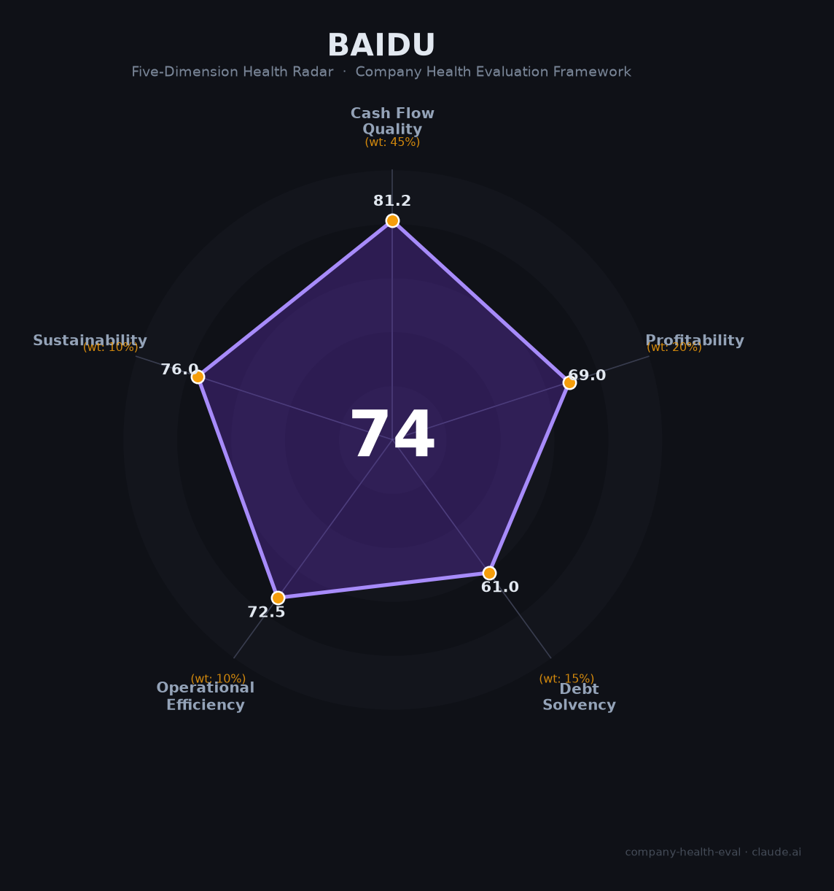

# 百度 财务健康评估（2026-06-12）

## 一句话结论

🟡 **中等偏上（74.3/100）** | 现金充裕负债率低（34%）、AI收入占比过半（52%Q1）、自动驾驶全球领先；唯搜索广告连续6季下滑（-18%）和C端AI全盘溃败（文心App MAU仅53万）是核心失血点

---

## 一、公司基本画像

| 项目 | 内容 |
|------|------|
| **全称** | 百度集团股份有限公司（Baidu, Inc.） |
| **成立** | 2000年1月1日，北京中关村 |
| **创始人/CEO** | 李彦宏（持股~17%，投票权~57%通过B类股） |
| **上市** | 纳斯达克BIDU（2005.8）+ 港股9888.HK（2021.3，二次上市） |
| **市值** | ~395亿美元（2026年6月，PE 203x，PB 0.95近破净） |
| **员工** | 33,500人（2025年底），研发占比55% |
| **主营业务** | AI业务400亿（31%，含智能云/AI应用/AI营销）+ 传统搜索广告（~570亿）+ 爱奇艺（~280亿） |
| **2025年营收** | 1,291亿元（-3%） |
| **2025年GAAP净利润** | 55.89亿元（-76%，含162亿资产减值） |
| **Non-GAAP净利润** | 189亿元（-30%） |
| **核心战略** | "芯云模体"全栈AI——昆仑芯+智能云+文心大模型+智能体 |

百度是中国AI领域投入最早、累计研发最多的公司（累计AI投入超1,000亿元）。但面临经典"创新者窘境"——传统搜索广告（现金牛）被AI搜索和内容平台持续分流，C端AI产品（文心一言App）MAU跌至53万（不及豆包的1/30），被迫"All in AI"转型但新业务体量尚难填补旧业务缺口。好在B端AI（智能云+昆仑芯）和自动驾驶（萝卜快跑累计2000万单）商业化在加速。

---

## 二、五维财务健康评估

### 1. 现金流质量（81.2/100）

| 指标 | 状态 | 详情 |
|------|------|------|
| 经营现金流净额 | ✅ 健康 | 连续多年为正（262亿→366亿→212亿→2025年为正），AI云和广告业务现金流转化良好 |
| 现金及等价物 | ✅ 健康 | 现金248亿+短期投资1,026亿=合计1,274亿（2024年末）。2026年Q1含长期投资合计2,793亿元，覆盖月均运营支出约13个月 |
| 有息负债 | ✅ 健康 | 资产负债率33.7%（2024年），连续三年下降（39%→35%→34%），有息负债从837亿降至710亿 |
| 净现比 | ⚠️ 关注 | OCF/NI=0.89（2024年）。低于1，主因爱奇艺等非现金减值和非经营项目影响。Non-GAAP口径下OCF/NI约0.78 |

百度现金流质量评分81.2分，三健康一关注。现金流基本面稳健——资产负债率仅34%、有息负债710亿且持续降低、现金储备覆盖13个月以上运营支出。但净现比不足1（0.89）是关注点，反映利润中包含较多非现金项目。2025年虽有大额减值（162亿），但经营现金流未受同等冲击，体现核心业务的现金生成能力。

### 2. 盈利能力（69.0/100）

| 指标 | 等级 | 详情 |
|------|------|------|
| 毛利率 | 👍 良好 | 44%（2025年），较2023年峰值51.7%明显下滑。AI云硬件成本上升+广告收入萎缩双重挤压 |
| 净利率 | ➖ 一般 | GAAP净利率4.3%（55.9亿/1,291亿），含162亿元一次性资产减值。剔除后Non-GAAP约14.6% |
| 营收增速 | ➖ 一般 | 近3年CAGR仅1.4%（+8.8%→-1.1%→-3.0%）。2025年Q2广告收入-15%，加速下滑 |
| 研发费用率 | 🌟 卓越 | ~15-16%（2025年），处于10-25%最优区间。从18.9%峰值适度下降反映研发从"人"转向"算力"的效率提升 |
| 人均产出 | 👍 良好 | 385万元/人（2025年），高于互联网行业平均。但低于腾讯（649万）和阿里（423万） |

盈利能力评分69分，是百度最拖后腿的维度。毛利率从52%降至44%（两年降8个百分点）反映AI云硬件业务拉低整体利润率的结构性问题。营收3年CAGR仅1.4%表明增长引擎切换远未完成——AI新业务（+48%）的增量仅勉强填补传统搜索广告（-18%）的缺口。Non-GAAP净利率14.6%尚可，但GAAP口径受爱奇艺和极越汽车等减值拖累严重。

### 3. 偿债能力（61.0/100）

| 指标 | 状态 | 详情 |
|------|------|------|
| 资产负债率 | ✅ 健康 | 33.7%（2024年），显著低于40%阈值，且连续三年下降 |
| 有息负债率 | ⚠️ 关注 | 16.6%（710亿/4,278亿），低于20%阈值但仍有约710亿元债务（含58亿美元债券） |
| 流动比率 | ⚠️ 关注 | 约1.8-2.0区间（估算），接近但未达>2的健康线 |
| 现金比率 | 🔴 危险 | 约0.28（248亿现金/~900亿流动负债），远低于0.5阈值 |
| 股权质押比例 | ✅ 健康 | 李彦宏B类股投票权57%，无大股东质押风险 |

偿债能力评分61分，是百度第二个偏弱维度。核心矛盾在于现金比率极低（0.28）——百度将大量现金配置为短期投资（1,026亿）而非持有现金，导致纯现金对流动负债覆盖率不足。但这是主动的现金管理策略而非流动性危机：短期投资可快速变现，2026年Q1全口径流动性（含长期投资）已达2,793亿。整体偿债风险可控。

### 4. 运营效率（72.5/100）

| 指标 | 状态 | 详情 |
|------|------|------|
| 应收周转 | ✅ 健康 | DSO仅28.7天（2024年），连续三年改善（32→31→29天）。应收账款从211亿降至143亿（-32%），回款效率极高 |
| 客户集中度 | ✅ 健康 | 数百万广告主+云客户+AI API调用者，高度分散 |
| 员工规模趋势 | ⚠️ 关注 | 四年减员12,000人（45,500→33,500，-26%）。2025年虽新招15,000人（+33%），但"大进大出"的不稳定性显著 |
| 高管稳定性 | ⚠️ 关注 | 近2年超14位VP+离职（移动生态CTO、自动驾驶总经理、搜索首席架构师等），是百度史上最大规模高管变动 |

运营效率评分72.5分，两健康两关注。DSO 29天是百度运营效率的亮点——搜索广告预充值+云业务加速回款。但四年减员26%虽含"主动换血"（裁旧岗招AI新岗）的战略意图，高管批量离职（14+ VP）和核心技术人员流失（文心大模型研发骨干孙珂转投京东）对AI转型的长期影响值得警惕。

### 5. 可持续发展能力（76.0/100）

| 指标 | 状态 | 详情 |
|------|------|------|
| 行业赛道空间 | ⚠️ 关注 | 搜索广告市场萎缩（Gartner预测2026年传统搜索量-25%），AI云（+34%）和AI营销（+301%）高增长但体量不足。整体加权增速约5-10%（📊 估算） |
| 技术壁垒 | ✅ 健康 | 文心5.0（2.4万亿参数，40+评测超GPT-5）+昆仑芯（出货6.9万片）+Apollo自动驾驶（累计2000万单）+飞桨（1070万开发者），全栈AI壁垒3年+不可复制 |
| 业务多元化 | ✅ 健康 | 搜索+AI云+自动驾驶+智能体（千帆130万+）+爱奇艺，横跨广告/云计算/出行/娱乐 |
| 资本支持 | ✅ 健康 | 纳斯达克+港股双重上市，现金2,793亿，昆仑芯独立上市（科创板辅导中）打开新融资通道 |
| 政策/监管风险 | ⚠️ 关注 | 2026年6月被美国防部列入"中国军方企业"名单（股价周跌13%），搜索广告监管趋严（医疗广告），自动驾驶事故责任立法空白 |

可持续发展评分76分，三健康两关注。百度"芯云模体"全栈AI技术壁垒在国内仅次于华为——同时拥有AI芯片（昆仑芯）、大模型（文心5.0）、自动驾驶（Apollo）和深度学习框架（飞桨）的公司全球仅百度一家。但搜索基本盘的萎缩不可逆（PC端份额已低于必应），AI转型的时间窗口正在收窄。

---

## 三、综合评分与健康等级

| 维度 | 得分 | 权重 | 加权得分 |
|------|:----:|:----:|:--------:|
| 现金流质量 | 81.2 | 45% | 36.5 |
| 盈利能力 | 69.0 | 20% | 13.8 |
| 偿债能力 | 61.0 | 15% | 9.2 |
| 运营效率 | 72.5 | 10% | 7.2 |
| 可持续发展 | 76.0 | 10% | 7.6 |
| **综合得分** | **74.3** | **100%** | **74.3/100** |

**健康等级：🟡 中等偏上（Moderate-High）**

---

## 四、同业对标

| 对比项 | 百度 | 腾讯 | 字节跳动 | 科大讯飞 |
|--------|:----:|:----:|:------:|:------:|
| 上市/估值 | NASDAQ+港股（~$395亿） | 港股（~$5,000亿+） | 未上市（~$5,500亿） | A股（~¥1,400亿） |
| 2025年营收 | 1,291亿（-3%） | 7,518亿（+14%） | ~$1,860亿（+20%） | 271亿（+20%） |
| 净利润 | 56亿GAAP（-76%） | 2,248亿（+16%） | ~$500亿 | 6.6亿 |
| 毛利率 | 44% | **56%** | ~55%（估） | 40% |
| 研发费用率 | 15-16% | 11% | — | 20% |
| 员工数 | 3.4万 | 11.5万 | ~15万 | 1.7万 |
| 人均营收 | 385万 | **649万** | ~500万+ | 161万 |
| AI大模型MAU | 文心1.5亿（含内嵌） | 元宝0.8-1亿 | **豆包2.5亿** | — |
| 云市场份额 | <5%（未进前五） | 7.9%（第五） | 14.8%（AI云第二） | — |
| 自动驾驶 | **全球领先（2000万单）** | — | — | — |

**对标结论**：百度在AI全栈技术（芯片+框架+模型+应用）和自动驾驶两个维度拥有独特优势（全球无直接可比公司），但在营收增速（-3% vs 腾讯+14%）、盈利规模（56亿 vs 腾讯2,248亿）和C端AI产品力（文心App 53万MAU vs 豆包1.4亿）三个维度已全面落后于第一梯队。百度是典型的"技术强、商业弱"公司——AI技术积累中国前三，但变现能力远弱于腾讯（社交）和字节（流量）。

---

## 五、核心风险清单

1. **搜索广告失血加速（极高风险）**：核心在线营销收入连续6个季度同比下滑（Q2 2025 -15%），PC端搜索份额已被必应超越。Gartner预测2026年传统搜索量下降25%。这是百度的"现金牛"——一旦失血速度超过AI新业务增速，将陷入营收持续萎缩的螺旋。

2. **C端AI全面溃败（高风险）**：文心App MAU仅53万，不及豆包（1.4亿）的1/260，春节红包大战投入5亿仅获DAU峰值82.6万（豆包1.45亿）。"文心一言→文小言→文心"三年三改品牌，用户认知混乱。百度在"AI第一入口"之争中已实质性出局。

3. **资产减值风险持续（中高风险）**：2025年计提162亿元长期资产减值（爱奇艺+极越汽车等），PB仅0.95接近破净。爱奇艺持续亏损、极越汽车破产清算，投资组合质量堪忧。

4. **高管+核心人才流失（中高风险）**：近2年14位VP+离职，文心大模型研发骨干、搜索首席架构师等核心技术人才外流。百度正通过提拔90后管培生"换血"，但经验断层风险不可忽视。

5. **中概股+地缘政治风险（中风险）**：2026年6月被美国防部列入"中国军方企业"名单，股价一周跌13%。尚未升级为双重主要上市，港股通受限。

---

## 六、求职/择业视角

### 核心优势
- **AI技术深度中国前三**：文心5.0（2.4万亿参数）+昆仑芯+Apollo+飞桨全栈，在百度积累的AI技术经验通用性极强
- **自动驾驶独一无二**：萝卜快跑全球最大规模Robotaxi运营商，累计2000万单，商业化从0到1阶段已过
- **薪酬性价比合理+WLB相对好**：校招技术岗34-60万/年，社招AI方向40-90K·16薪。双休基本保证，非MEG部门节奏较缓和（舒适度第二梯队）
- **AI转型红利**：2026年校招AI岗占90%+，昆仑芯独立上市在即（科创板辅导中），AI新业务期权价值高

### 现存短板
- **薪资竞争力不足**：白菜价32-35万（字节36-45万、阿里48万、拼多多48-64万），在大厂中属最低档
- **裁员风险高**：2025年底大裁员（MEG 20-40%），应届生入职3个月即被裁。人员"大进大出"极不稳定
- **C端品牌塌陷**：文心App被市场判定失败，做C端AI产品的履历加成有限。B端（云/Apollo）含金量更高
- **晋升天花板**：组织"新陈代谢"剧烈（14+VP离职，90后管培生上位），传统晋升路径被打乱

### 分场景建议

| 个人诉求 | 推荐 | 次选 | 规避 |
|----------|------|------|------|
| 稳定+深耕 | 百度ACG（智能云、B端AI，裁员风险低） | 腾讯（成熟业务） | 百度MEG（移动生态，裁员重灾区） |
| 高薪+跳板 | 字节/拼多多 | 百度自动驾驶（Apollo） | 百度通用开发岗（薪资最低档） |
| AI技术成长 | 百度（文心大模型/昆仑芯/飞桨全栈） | 科大讯飞 | 纯C端AI产品 |
| 自动驾驶风口 | 百度Apollo（全球最大Robotaxi运营商） | 华为车BU | 小鹏（竞争激烈） |

---

## 七、总结

百度是中国AI领域"技术储备最深厚、商业化最挣扎"的搜索引擎巨头——文心5.0（2.4万亿参数）评测超GPT-5、昆仑芯出货6.9万片、Apollo全球最大Robotaxi运营商（2000万单）、千帆Agent平台130万+智能体，技术全栈壁垒仅次于华为，唯一短板是搜索广告现金牛持续失血（连续6季下滑，-18%）且C端AI产品全盘溃败（文心App MAU仅53万=豆包1/260），新老动能切换的时间窗口正在收窄。在中国传统搜索向AI原生搜索范式转移的大背景下，百度属于中等偏上（74.3分），适合追求AI技术深度+自动驾驶方向、能接受"组织剧烈换血"的不确定性、看重长期技术积累而非短期现金回报的求职者的选择。对于以AI Agent为职业方向的候选人，百度千帆Agent平台（130万+智能体）和"秒哒"无代码Agent开发工具提供了丰富的Agent工程实践场景——但需注意避开处于裁员重灾区的MEG（移动生态）部门。

---

*评估日期：2026年6月12日 | 数据截至：百度2025年年报+2026年Q1季报（2026年5月18日发布） | 财报审计：PwC*
