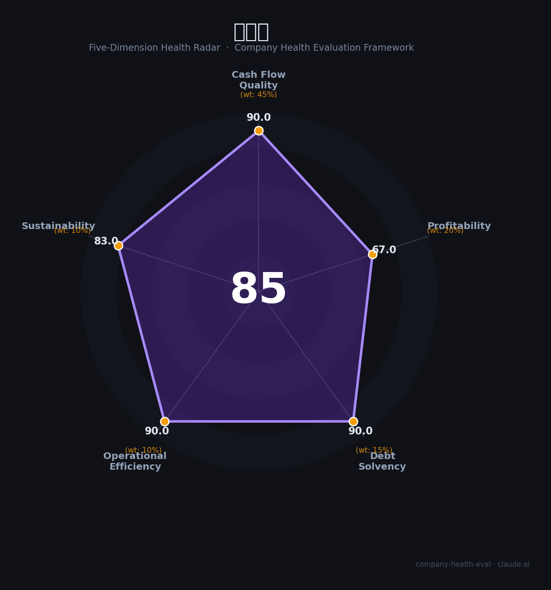

# 盐田港（000088.SZ）财务健康评估（2026-08-14）

## 一句话结论

🟡 **85/100，中等偏上** | 深圳重要港口，低负债、盈利优良

---

## 一、公司基本画像

| 项目 | 内容 |
|------|------|
| 营收 | 8.58亿(+8.16%) |
| 净利 | 14.48亿(+7.28%) |
| 负债率 | 17.83% |

> 一句话定性：重要港口，低负债、净利高、盈利强

---

## 二、五维财务健康评估

### 1. 现金流质量（90/100）| 权重45%

现金流充沛。

### 2. 盈利能力（67/100）| 权重20%

净利率极高，盈利优质。

### 3. 偿债能力（90/100）| 权重15%

负债率极低(约18%)，偿债极稳。

### 4. 运营效率（90/100）| 权重10%

运营效率高。

### 5. 可持续发展（83/100）| 权重10%

粤港澳港口需求，吞吐量保持增长。

---

## 三、综合评分

| 维度 | 得分 | 权重 | 加权 |
|------|:----:|:----:|:----:|
| 现金流质量 | 90 | 45% | 40.5 |
| 盈利能力 | 67 | 20% | 13.4 |
| 偿债能力 | 90 | 15% | 13.5 |
| 运营效率 | 90 | 10% | 9.0 |
| 可持续发展 | 83 | 10% | 8.3 |
| **综合得分** | **85/100** | 100% | 84.7 |

**健康等级：中等偏上** — 整体稳健，局部有待改善

---

## 四、核心风险清单

1. **贸易关税**
2. **港口竞争**
3. **吞吐波动**

## 五、求职/择业视角

### 核心优势
- 低负债、高净利率、盈利强
### 现有短板
- 营收规模较小、贸易波动

**结论**：盐田港深圳重要港口，低负债、净利高、现金流强，盈利优质、抗风险强。

---

*评估方法：商泰汽车（iAUTO）五维框架 · 数据截至2026年8月 · 财务来源盐田港2025年报*