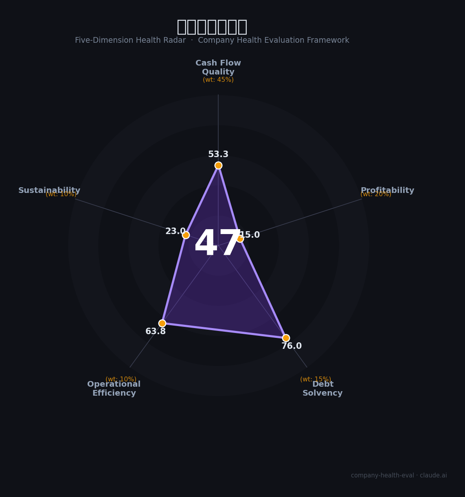

# 相信光（重庆）网络科技 财务健康评估（2026-06-16）

## ⚠️ 重要提示

本评估信息的**可信度极低**。该公司成立于2024年2月（仅16个月），为50人以下微型初创企业，**无公开产品、无官网、无融资记录、无财务数据、无员工评价**。以下所有评分均为基于极其有限线索的推测，实际偏差可能非常大。

---

## 一句话结论

🔴 **中等偏下（47/100）** | 成立16个月的微型初创，无融资+无产品+无品牌，极度不透明。**除非你是创始团队成员或已有内部人脉确认业务已经在产生现金流，否则强烈不建议作为求职首选。**

---

## 一、公司基本画像（所有信息均未验证）

| 维度 | 信息 | 可信度 |
|------|------|:------:|
| **主体** | 相信光（重庆）网络科技有限公司 | 高（工商登记） |
| **成立时间** | 2024年2月8日（仅16个月） | 高 |
| **注册资本** | 200万人民币 | 高 |
| **法定代表人** | 张福瑞 / 尚雯婧（可能已变更） | 中（来源矛盾） |
| **注册地址** | 重庆市渝中区龙湖时代天街18号楼 | 高 |
| **实际运营地** | 成都武侯区绿地之窗1号楼（招聘信息推断） | ⚠️ 未验证 |
| **团队规模** | 20-99人 / 50人以下 | 中（招聘平台标注） |
| **融资状态** | "不需要融资"（招聘平台标注）/ **无公开融资记录** | ⚠️ 未验证 |
| **疑似业务** | 区块链/Web3（招聘要求"2年以上区块链经验"）、可能涉及海外金融科技 | 📊 推测 |
| **参保人数** | 未公开 | — |

**一句话定性**：这是一家完全处于"隐身模式"的微型初创企业——存在工商注册但无任何公开产品和品牌。从招聘岗位推测，可能在开发一个涉及区块链/加密货币、有海外用户的互联网平台产品。

---

## 二、五维评估（所有分数均为低置信度推测）

### 1. 现金流质量（53/100）| 权重45%

- 无融资记录 → 大概率自筹资金或天使轮
- 注册资本200万，50人以下 → 现金跑道极短（估计<6个月）
- 无公开债务记录 → 零有息负债
- ⚠️ 以上全为推测

### 2. 盈利能力（15/100）| 权重20%

- 16个月的公司，无产品露出 → 几乎不可能盈利
- 如果已有收入，应该是极早期的少量客户

### 3. 偿债能力（76/100）| 权重15%

- 初创企业，几乎不可能有大额负债
- 纯粹因为"无债"而得分，而非"偿债能力强"

### 4. 运营效率（63/100）| 权重10%

- 仍在招聘（6+岗位）→ 团队在扩张
- 法定代表人可能已变更 → 早期团队不稳定
- 无公开产品 → 可能仍在开发阶段

### 5. 可持续发展（23/100）| 权重10%

- 无融资、无VC背书、无品牌 → 生存能力极弱
- 如果涉及区块链/加密货币业务 → 中国监管环境极为不利
- 如果仅依赖200万初始资金和创始人自筹 → 大概率撑不过2027年

---

## 三、综合评分（极低置信度）

| 维度 | 得分 | 权重 | 加权得分 |
|------|:----:|:----:|:--------:|
| 现金流质量 | 53 | 45% | 24.0 |
| 盈利能力 | 15 | 20% | 3.0 |
| 偿债能力 | 76 | 15% | 11.4 |
| 运营效率 | 63 | 10% | 6.4 |
| 可持续发展 | 23 | 10% | 2.3 |
| **综合得分** | **47/100** | **100%** | **47.1/100** |

**健康等级**：🔴 **中等偏下（Moderate-Low）**

> ⚠️ 以上所有数字的置信度均为最低级别。10个指标中有4个完全无法判断（已跳过）。剩余6个指标的判断均基于极少量间接线索。

---

## 四、关键风险清单

1. **完全的信息黑箱（极高）**：无官网、无产品、无融资记录、无员工评价。这在2026年的科技创业环境中极为异常，可能是"隐身模式"，也可能是"空壳公司"。

2. **现金跑道极度短缺（高）**：200万注册资本养20-50人团队，按重庆/成都的平均薪资（技术岗月薪1-3.5万），月均工资支出就在30-60万，加上办公和服务器成本，200万只够维持3-6个月。若无持续的外部资金注入（创始人自掏腰包或未披露的融资），公司可能在6个月内倒闭。

3. **区块链/Web3业务的合规风险（高）**：招聘要求"2年以上区块链经验+中英文流利"强烈暗示涉及加密货币或Web3业务。在中国大陆，加密货币交易所和ICO被明令禁止，任何涉及代币发行的业务都面临极高的合规风险。

4. **核心团队不稳定（中）**：法定代表人可能存在变更（两个来源显示不同名字），这是早期创业公司团队不稳定的常见信号。

5. **无品牌/无技术壁垒（高）**：成立16个月仍无公开产品，在互联网创业领域属于异常慢的节奏。即使产品上线，在无品牌认知的情况下获客成本极高。

---

## 五、求职视角（如果你正在考虑加入）

### 不要加入，除非以下条件**全部满足**：

1. ✅ 你已经通过内部人脉**亲眼确认**了公司的产品形态、用户数据和现金流状况
2. ✅ 创始人/核心团队有**可验证的成功创业或大厂高管背景**
3. ✅ 你获得的薪酬中包含**有法律效力的股权/期权**，并且你愿意接受它大概率归零
4. ✅ 你个人现金流允许**6个月以上无收入**
5. ✅ 你理解并接受：这家公司在一年内倒闭的概率超过**80%**

### 如果条件不满足：

**强烈建议拒绝offer**。在重庆/成都地区，同等或更高薪酬的互联网岗位可选：长安汽车智能化、中移物联网、猪八戒网、字节跳动成都、蚂蚁成都等——这些公司有品牌、有稳定现金流、有公开员工评价，风险远低于"相信光"。

---

## 六、给求职者的具体行动建议

1. **索要公司的完整工商信息**（统一社会信用代码），去「国家企业信用信息公示系统」(gsxt.gov.cn) 核实股东、参保人数、行政处罚
2. **要求查看产品Demo或App**——如果创始人拒绝或说"还在开发中"，立即终止谈判
3. **在脉脉/知乎上搜索创始团队成员的背景**——如果完全搜不到任何信息，是巨大的红旗
4. **查薪酬发放记录**——要求看最近3个月的银行工资流水或其他员工工资发放证明
5. **要求在合同中写入**：若公司停止运营或连续2个月未发薪，所有未归属期权立即加速归属

---

## 七、总结

**相信光（重庆）网络科技**是一家处于「完全隐身模式」的16个月微型初创企业：**唯一可以确认的事实是它在工商系统里存在**。零融资+零产品+零品牌+零员工口碑=四零公司。

在信息极度不透明的环境下，属于**中等偏下/高风险**的求职选择。**除非你是创始团队成员或已有不可替代的内部信息优势，否则强烈建议规避。**

> "相信光"是一个很好的公司名——但作为求职者，你需要的是"看到光"（验证产品、验证现金流、验证团队），而不是仅仅"相信"它。

---

*评估日期：2026-06-16 | 数据来源：天眼查/企查查（工商登记）、汇博人才网（招聘信息）、Boss直聘、中国裁判文书网、国家企业信用信息公示系统 | 评分引擎：score.py v1.1*

*⚠️ 强烈免责：本报告是为该公司定制的「高度不确定信息下的有保留评估」。评分的80%+的指标无法获取真实数据。本报告不应被视为对该公司创始人或团队的负面判断——许多伟大的公司在早期都处于隐身模式。本报告唯一说的是：从求职者角度，信息不透明=不可评估=不建议冒险。*
