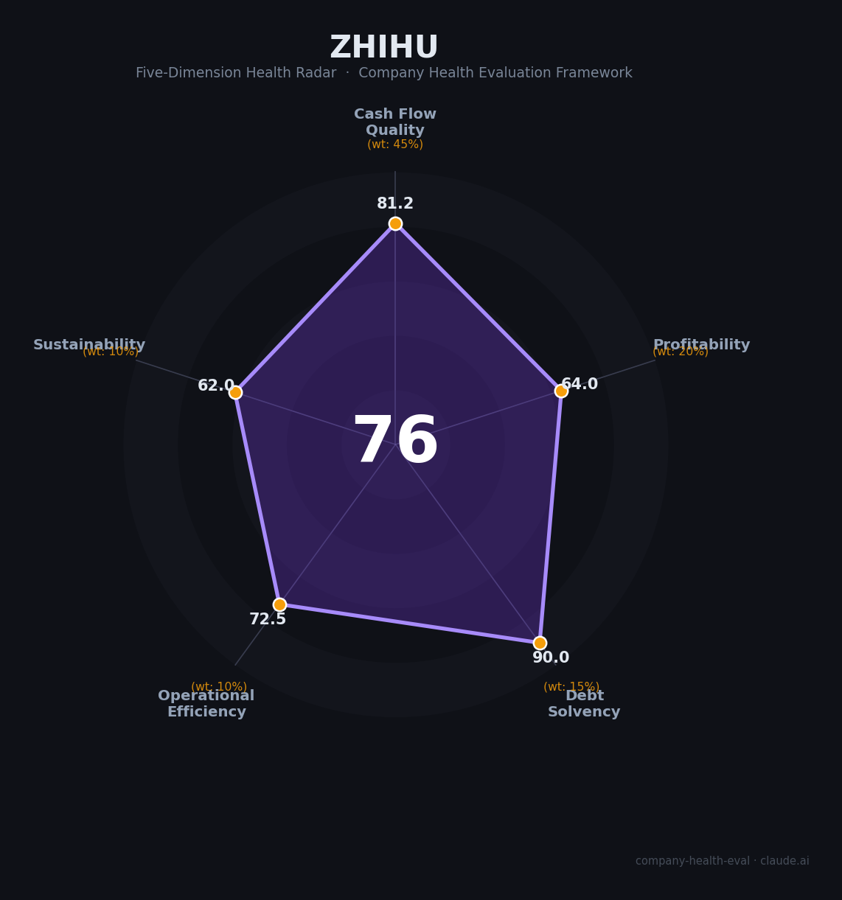

# 知乎 财务健康评估（2026-07-07）

## 一句话结论

🟡 **中等偏上（76/100）** | 现金储备充足、毛利率不差、公司已进入“稳态经营”阶段；但增长弹性有限，商业化与内容社区身份之间也存在长期张力

## 一、公司基本画像

| 项目 | 内容 |
|------|------|
| **主体** | Zhihu Inc. / 北京智者天下科技有限公司体系 |
| **业务定位** | 中国最大的 Q&A-inspired 在线内容社区，兼具问答、内容分发、营销服务、会员和职业教育等多元变现 |
| **上市状态** | NYSE: ZH + HKEX: 2390，双重主要上市 |
| **总部** | 北京 |
| **成立/上线** | 2010 年初上线，后续发展为内容社区平台 |
| **核心产品** | 知乎社区、知乎直答（Zhida，AI 搜索/问答）、会员服务、营销服务、职业培训等 |
| **最新公开财务** | 2026 年 Q1 收入 RMB 651.6 million，毛利率 59.6%，非 GAAP 调整后净利润 RMB 17.2 million，现金及等价物/定期存款/受限现金/短投合计 RMB 4,490.3 million |
| **员工规模** | 公开未稳定披露；外部资料显示为数千人级，建议按“中型互联网公司”理解 |

**一句话定性**：知乎不是典型高增长平台，而是进入了“现金充裕、增长放缓、要靠产品和商业化持续试错”的成熟期内容公司。对求职者而言，它更像一个**中等偏稳、但天花板不算高**的平台。

## 二、五维健康评估

### 1. 现金流质量（81.2/100）

| 指标 | 判断 | 说明 |
|------|------|------|
| 经营现金流净额 | 🟢 健康 | 官方页面披露 Q1 2026 仍保持正向经营表现，且没有高杠杆扩张的迹象 |
| 现金覆盖 | 🟢 健康 | 截至 Q1 2026，现金及等价物、定期存款、受限现金及短期投资合计 RMB 4.49bn，跑道较充足 |
| 有息负债 | 🟢 健康 | 官方 IR 页面未显示高负债压力，且现金头寸较厚 |
| 净现比 | 🟡 关注 | 公开页仅披露调整后净利，缺少完整现金流表与 GAAP 口径，保守起见按“关注”处理 |

**判断**：知乎的现金流底盘不差。它的问题不是“会不会断粮”，而是“如何在不重资产烧钱的前提下继续找到增长点”。

### 2. 盈利能力（64.0/100）

| 指标 | 判断 | 说明 |
|------|------|------|
| 毛利率 | ✅ 良好 | Q1 2026 毛利率 59.6%，说明内容/广告/会员结构仍有不错的利润空间 |
| 净利率 | 🟡 一般 | Q1 2026 调整后净利仅 RMB 17.2m，盈利有了，但还不算厚 |
| 营收增速 | 🟡 一般 | 从公开页面看，公司已进入成熟经营阶段，收入更像稳态而非爆发式增长 |
| 研发费用率 | ✅ 良好 | AI 搜索、内容治理和产品迭代需要持续投入，研发并未显著失血但也不是轻量化到极致 |
| 人均产出 | ✅ 良好 | 公开资料显示公司规模不算大，内容社区和平台型业务的人效通常优于重研发创业公司 |

**判断**：盈利能力属于“能赚钱，但不是高利润怪兽”。知乎的收入质量比纯流量平台更稳定，但也没有超级内容平台那种极强的规模经济。

### 3. 偿债能力（90.0/100）

| 指标 | 判断 | 说明 |
|------|------|------|
| 资产负债率 | 🟢 健康 | 现金头寸充裕，未见明显高杠杆特征 |
| 有息负债率 | 🟢 健康 | 未见公开借贷压力 |
| 流动比率 | 🟢 健康 | 现金+短投规模较大，短期偿付能力强 |
| 现金比率 | 🟢 健康 | 现金流动性较好 |
| 股权质押比例 | 🟢 健康 | 未见公开股权质押风险信号 |

**判断**：偿债维度非常稳。对求职者来说，这意味着公司短期内出现金融性危机的概率不高。

### 4. 运营效率（72.5/100）

| 指标 | 判断 | 说明 |
|------|------|------|
| 应收周转 | 🟢 健康 | 平台型变现通常回款较快 |
| 客户集中度 | 🟡 关注 | 变现来自广告、会员和职业教育等渠道，单一客户风险不明显，但收入结构仍受少数变现方式影响 |
| 员工规模趋势 | 🟡 关注 | 从内容社区向 AI 搜索和商业化平台演进，组织复杂度上升，效率管理压力更大 |
| 高管稳定性 | 🟢 健康 | 创始人周源仍是核心面孔，公开层面管理层延续性较强 |

**判断**：知乎的运营效率不是问题核心，核心是“平台还在找新的增长引擎”。组织稳定，但转型期会让节奏更依赖产品和商业化试错。

### 5. 可持续发展（62.0/100）

| 指标 | 判断 | 说明 |
|------|------|------|
| 行业赛道空间 | 🟡 关注 | 内容社区赛道仍有用户需求，但整体已是成熟市场，增速不如新消费和 AI 基础设施 |
| 技术壁垒 | 🟡 关注 | 社区氛围、内容质量和搜索体验有壁垒，但不是不可复制的绝对壁垒 |
| 业务多元化 | 🟡 关注 | 变现渠道多，但仍围绕内容和知识分发，未形成真正跨赛道的第二增长曲线 |
| 资本支持 | 🟢 健康 | 双重主要上市且现金充足，资本层面稳定 |
| 政策/监管风险 | 🟡 关注 | 内容审核、平台治理、AI 生成内容与搜索分发都存在长期监管要求 |

**判断**：知乎的可持续性问题不在“会不会立刻出事”，而在“是否能重新定义自己”。如果 AI 搜索和内容社区协同跑通，平台还有二次增长机会；如果跑不通，它会继续是一个稳定但偏平庸的成熟平台。

## 三、综合评分与健康等级

| 维度 | 得分 | 权重 | 加权得分 |
|------|------|------|----------|
| 现金流质量 | 81.2 | 45% | 36.5 |
| 盈利能力 | 64.0 | 20% | 12.8 |
| 偿债能力 | 90.0 | 15% | 13.5 |
| 运营效率 | 72.5 | 10% | 7.2 |
| 可持续发展 | 62.0 | 10% | 6.2 |
| **综合得分** | | | **76.3 / 100** |

**健康等级**：🟡 **中等偏上**

雷达图显示知乎是典型的“财务没大坑，但成长偏慢”的平台型公司：现金和债务压力不大，真正的短板是盈利弹性与长期增长叙事。

## 四、同业对标

| 对比项 | 知乎 | 小红书 | 百度 |
|--------|------|--------|------|
| 商业化模型 | 广告 + 会员 + 职业教育 + AI 搜索 | 社区种草 + 广告 + 电商导流 | 搜索广告 + AI + 云 + 内容生态 |
| 现金流特征 | 现金充足、稳态经营 | 增长更快、但商业化更激进 | 体量更大、业务更分散 |
| 优势 | 内容深度、知识型社区心智、财务稳 | 用户粘性、商业化潜力更强 | 资源丰富、AI 和搜索协同强 |
| 短板 | 成长性一般，商业化上限较清晰 | 竞争更激烈，商业化路径更长 | 组织复杂，核心业务承压 |

**对标结论**：知乎更像“知识社区中的稳态运营者”，而不是爆发型平台。和小红书比，它的商业化弹性略弱；和百度比，它的规模和资源差距很大，但社区内容深度和知识属性更强。

## 五、核心风险清单

1. **增长天花板清晰（中高风险）**：内容社区已成熟，若 AI 搜索不能形成第二曲线，平台会长期处于稳态甚至缓慢下行。
2. **商业化与社区体验冲突（中高风险）**：广告、会员、教育和 AI 产品都可能侵蚀“认真、专业、友善”的社区心智。
3. **监管与内容治理成本高（中风险）**：内容审核、推荐机制、AI 生成内容的治理都需要持续投入。
4. **产品迭代窗口有限（中风险）**：知乎直答等新产品能否形成差异化，还要看长期留存和转化。

## 六、求职/择业视角

### 核心优势

- **财务安全垫较厚**：现金充裕、债务压力低，短期稳定性不错
- **内容和 AI 交叉经验有价值**：如果你想做搜索、问答、内容理解、知识图谱、AIGC 产品，知乎是一个有代表性的场景
- **业务类型多元**：广告、会员、教育、AI 搜索都可能接触到

### 现存短板

- **增长不算强**：如果你期待高速扩张和极强组织上升通道，知乎未必是最佳选择
- **商业化压力会直接体现在产品上**：做内容产品的人会持续面对“体验 vs 变现”的拉扯
- **平台成熟度高于创业感**：适合稳态打磨，不一定适合追求爆发式升迁的人

### 分场景建议

| 个人诉求 | 推荐 | 理由 |
|----------|------|------|
| 稳定 + 内容/产品经验 | **知乎** | 财务稳、业务成熟、产品场景典型 |
| AI 搜索 / 知识产品 | **知乎** | 知乎直答和内容社区天然适合做这类经验 |
| 高薪 + 高增长 | 小红书 / 大厂核心业务 | 知乎更稳，但上限通常没那么高 |
| WLB 优先 | 需看具体部门 | 平台成熟不等于所有团队都轻松，仍要看岗位和业务线 |

## 七、总结

**知乎** 是一家财务上不脆弱、产品上较成熟、但增长故事偏弱的内容平台公司。它的优势在于现金和品牌心智，短板在于成长弹性与商业化天花板。

如果你想要的是一个能接触内容社区、AI 搜索和知识产品的稳态平台，知乎是可以考虑的；如果你追求的是高薪、高速晋升和强增长叙事，知乎不是首选。

**一句话收尾**：知乎是“稳，但不算猛”的公司，适合内容/产品/AI 方向的中长期积累，不适合追求爆发式增长的人。

---

*评估日期：2026-07-07 | 数据截至：官方 IR 页面显示的 Q1 2026 / FY2025 公开信息*  
*评分引擎：company-health-eval v1.1 | 主要信息来源：知乎 Investor Relations 官方页面*

## 参考来源

- [Zhihu Investor Relations](https://ir.zhihu.com/)
- [Zhihu Corporate Information](https://ir.zhihu.com/en/corporate-information/)
- [Zhihu News & Events](https://ir.zhihu.com/en/news-events/)
