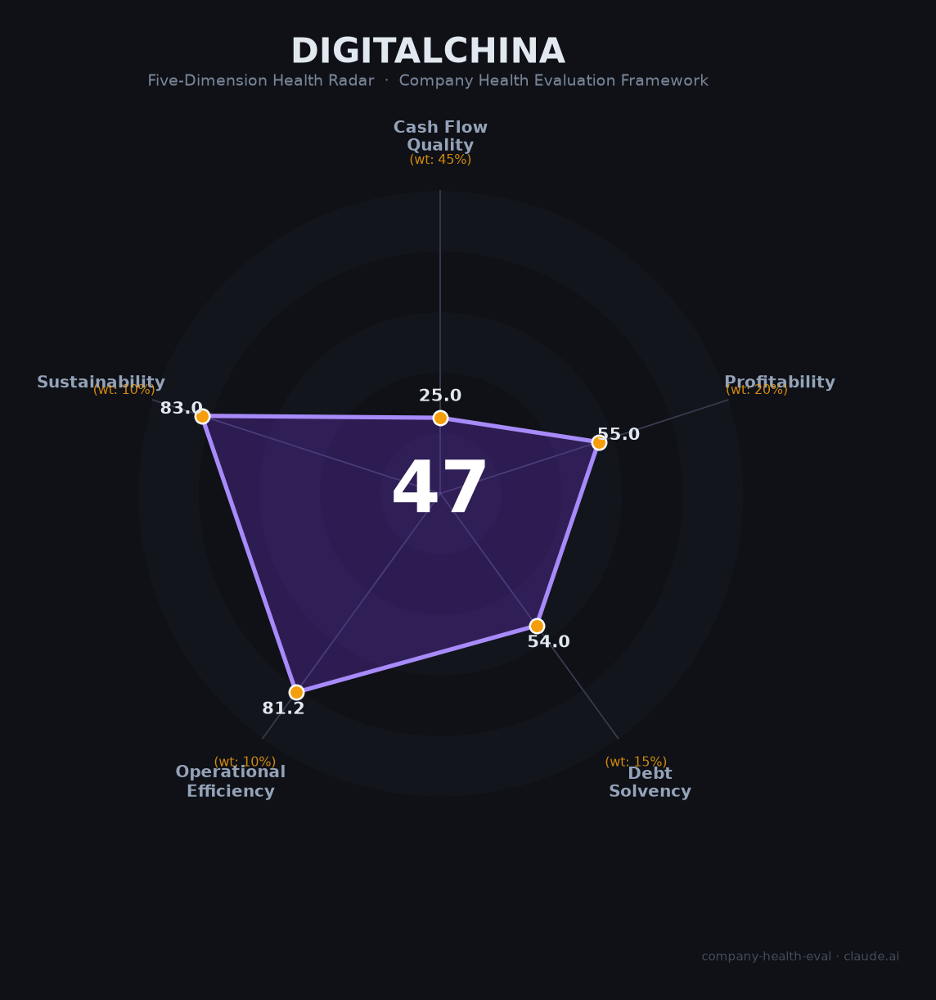

# 神州数码（000034.SZ）财务健康评估（2026-08-13）

## 一句话结论

🔴 **中等偏下（47/100）** | 中国IT分销与信创/华为云龙头——AI业务爆发（+47.7%达330亿）+信创，但毛利率仅3.4%+经营现金流转负（-24亿）+应收账款高企

---

## 一、公司基本画像

| 项目 | 内容 |
|------|------|
| 主体 | 🔒 神州数码集团股份有限公司，A股：000034.SZ；中国最大IT分销服务商之一 |
| 成立 | 🔒 2000年，郭为家族实际控制；联想系背景 |
| 主营 | IT分销（华为云/信创/企业级软硬件）+云计算+自主品牌（信创服务器/数据服务） |
| 财务 | 🔒 2025营收约1,200亿+；净利降超30%；毛利率3.4%（低毛利分销）；经营现金流-24.26亿（-196.85%由正转负） |
| AI | 🔒 AI相关业务330.3亿（+47.7%） |

> 一句话定性：神州数码是"IT分销+信创+云"龙头，AI业务爆发（+47.7%）是亮点，但本质是低毛利（3.4%）分销模式——营收量大而毛利薄，2025年经营现金流转负（-24亿，备货）、净利降超30%，盈利与现金流双重承压。

---

## 二、五维财务健康评估

### 1. 现金流质量（25/100）
经营现金流-24.26亿（-196.85%由正转负、备货/垫资），净现比差、融资压力大，现金流预警。

### 2. 盈利能力（55/100）
毛利率3.4%（低毛利分销）、净利率个位数，净利降超30%；但AI业务高增（+47.7%）、信创带来结构改善。

### 3. 偿债能力（54/100）
分销垫资+负债率偏高、有息负债大，现金流承压下偿债需关注；但规模大、融资渠道正常。

### 4. 运营效率（81/100）
分销网络/客户/供应商体系成熟，运营高效，垫资回款周期长。

### 5. 可持续发展（83/100）
信创+华为云+AI+算力长期赛道，政策支撑（信创），多元化（分销/云/信创），可持续中上；但利润率薄。

---

## 三、综合评分

| 维度 | 得分 | 权重 | 加权 |
|------|:----:|:----:|:---:|
| 现金流质量 | 25.0 | 45% | 11.2 |
| 盈利能力 | 55.0 | 20% | 11.0 |
| 偿债能力 | 54.0 | 15% | 8.1 |
| 运营效率 | 81.2 | 10% | 8.1 |
| 可持续发展 | 83.0 | 10% | 8.3 |
| **综合** | **47** | 100% | 46.8 |

**评级：🔴 中等偏下** — 低毛利分销+现金流负，信创赛道提供弹性。

---

## 四、核心风险
1. 经营现金流转负（-24亿）、融资/垫资压力。
2. 毛利仅3.4%、盈利质量差。
3. 华为/信创订单依赖。

## 五、求职/择业视角
- **优势**：信创/华为生态（神州鲲泰/云）、AI算力赛道、IT分销龙头稳定、深圳/全国布局。
- **短板**：低毛利分销、现金流承压、奖金弹性弱、部分条线垫资压力。

**结论**：适合追求信创/AI算力/华为生态方向的求职者（技术/云/信创岗有前景），但传统分销条线需谨慎。

---

*评估方法：商泰汽车（iAUTO）五维健康度框架 · 数据截至2026年8月 · 来源神州数码2025年报*