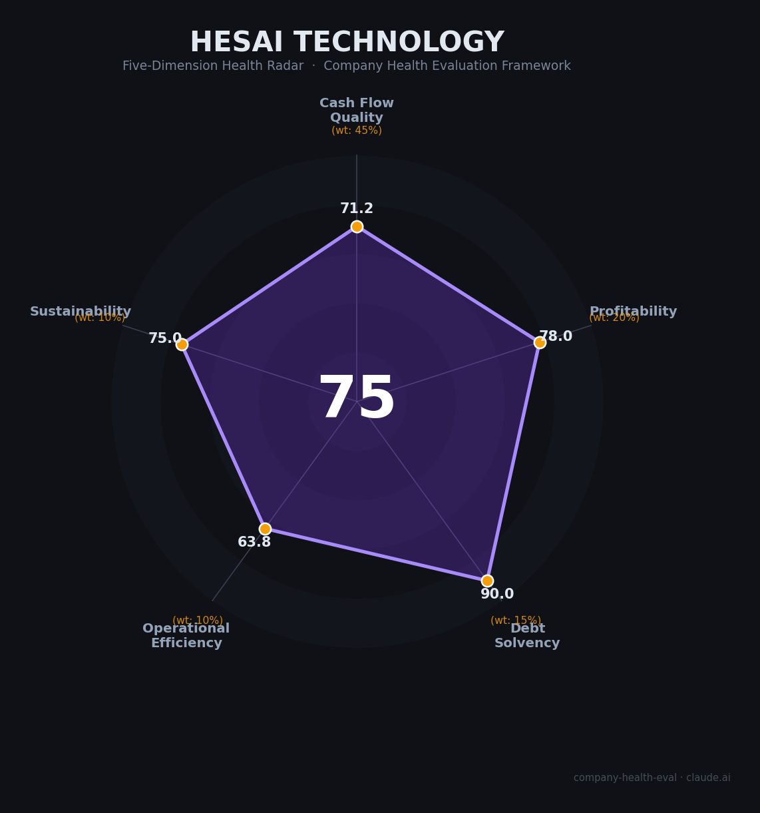

# 禾赛科技（Hesai）财务健康评估（2026-08-13）

## 一句话结论

🟡 **中等偏上（75/100）** | 全球车载激光雷达出货与营收双料第一·行业唯一全年盈利——
现金流/偿债/盈利多维度优秀，核心隐患是**盈利含金量（净现比0.27）**与**美国国防政策直接点名**

---

## 一、公司基本画像

| 项目 | 内容 |
|------|------|
| 主体 | 禾赛集团（Hesai Group，开曼注册）——全球最大汽车激光雷达（LiDAR）供应商，主业覆盖汽车ADAS、Robotaxi、机器人（人形/四足/物流） |
| 成立 | 2014年10月22日成立于上海（上海禾赛科技有限公司） |
| 创始人 | 李一帆（董事长兼CEO）、孙恺（首席科学家）、向少卿（CTO）——三创始人合计约17.4%持股/67.6%表决权（双层股权A/B类） |
| 总部 | 上海（研发中心+麦克斯韦智造中心）；海外：美国加州Palo Alto、德国斯图加特、泰国Galileo工厂（2026年起） |
| 主营 | 车载激光雷达（ADAS主雷达AT128/ATX/ETX等）+ 机器人激光雷达（Pandar/XT等）+ 感知软件；2025年出货1,620,406台（+222.9%） |
| 上市状态 | 🔒 美股Nasdaq（HSAI，2023年2月IPO募资约US$1.9亿）＋ 港股主板（2525.HK，**2025年9月16日IPO募资约HK$41.6亿**，全球激光雷达最大IPO之一） |
| 融资历史 | 上市前累计融资；2023美股IPO；2025港股IPO（基石：高瓴Hillhouse、泰康、Grab等） |

> 一句话定性：禾赛是全球激光雷达行业的技术与出货双龙头，**已从烧钱期跨入自我造血期**——2025年首次全年盈利（行业唯一）、连续三年正经营现金流、在手现金约75亿人民币；同时也是美中科技战中**被政策点名最多**的本土科技公司之一。「业绩基本面强势 + 地缘政治风险敞口」是其独特的双重画像。

---

## 二、五维财务健康评估

### 1. 现金流质量（71/100）| 权重45%

| 指标 | 🔒 公开数据 | 评估 |
|------|-----------|------|
| 经营现金流净额 | 连续3年为正：2023 +5,726万 / 2024 +6,350万 / 2025 **+1.17亿人民币**（20-F） | ✅ 健康：经营净现金持续为正 |
| 现金及等价物 | 现金＋短期投资＋长期定存合计约**75亿人民币**（2025年末74.96亿；2026Q1末72.32亿） | ✅ 健康：覆盖超3年运营 |
| 有息负债 | 短期借款4.48亿＋长期借款2.79亿≈**RMB 7.2亿**，净资产约90亿，有息负债率8% | ✅ 健康：几乎无息负债 |
| 净现比（OCF/净利） | **0.27**（OCF 1.17亿 / 净利4.36亿）——利润中约一半来自一次性收益（出售股权证券增益1.76亿 + 知识产权转让0.37亿） | 🔴 危险 |

**小结**：现金流表现分化。**正面**：经营现金流连续三年为正（行业唯一）、在手现金超75亿元、几乎零有息负债。**负面**：净现比仅0.27——2025年净利润约半数来自一次性收益（出售权益5.4亿等），经营现金流对盈利支撑不足；应收账款大幅扩张（年末12.6亿，占收入42%）也侵蚀了现金转化质量。整体该维度定为「优秀下限」，净现比是唯一预警项。

### 2. 盈利能力（78/100）

| 核心指标 | 🔒 公开数据 | 评估 |
|------|-----------|------|
| 毛利率 | 2025年 **41.8%**（2024年42.6%）——远超同业（速腾26.5%、Innoviz 23%） | ✅ 优秀 |
| 净利率 | 2025年 GAAP **14.4%**（非GAAP 18.2%）；2026Q1 2.7%（淡季） | ✅ 良好 |
| 营收增速（3年CAGR） | 2022: 12.0亿 → 2023: 18.8亿 → 2024: 20.8亿 → 2025: **30.3亿**；CAGR≈36% | ✅ 优秀 |
| 研发费用率 | 公司研发密集型公司，研发费用率约30%+ | ✅ 优秀（高科技行业标配） |
| 人均产出 | 收入30.3亿 / 员工1,118人 = **人均约271万** | ✅ 优秀：行业第一梯队 |

**小结**：盈利能力是禾赛的「翻身维度」——2025年成为**全球激光雷达行业第一个实现全年GAAP盈利的公司**（净利4.36亿，Non-GAAP 5.5亿）。毛利率41.8%在硬件赛道极其优秀，规模效应随出货+223%充分释放。但注意：净利约一半来自一次性收益，纯粹经营利润约2.4亿（净利率约8%）；在价格战持续下，盈利质量需盯后续非GAAP持续性。

### 3. 偿债能力（90/100）| 权重15%

| 核心指标 | 🔒 公开数据 | 评估 |
|------|-----------|------|
| 资产负债率 | 2025年总资产约112.6亿，总负债22.3亿 → **资产负债率约19.8%** | ✅ 健康 |
| 有息负债率 | 有息负债7.2亿 ≈ 净资产90亿的 8% | ✅ 健康 |
| 流动比率 | 流动资产约71亿 / 流动负债约19亿 = **3.7** | ✅ 健康 |
| 现金比率 | 现金及短期投资约47亿 / 流动负债约19亿 = **2.5** | ✅ 健康 |
| 股权质押 | 无公开质押记录 | ✅ 健康 |

**小结**：偿债能力是本轮全场最强维度——几乎零有息负债（集团层可转债位），现金约7.5倍于总借债，资产负债率约18%；上市融资进一步充实资产负债表，偿债能力极强。

### 4. 运营效率（63/100）| 权重10%

| 核心指标 | 🔒/公开数据 | 评估 |
|------|-----------|------|
| 应收周转 | 2025年末应收账款12.6亿，占收入41.7%（DSO约150天，同比恶化） | ⚠️ 关注 |
| 客户集中度 | 前五大客户占比 **55.8%**（2025，较2024年66.7%改善） | ⚠️ 关注 |
| 员工规模趋势 | 2025年末1,118人（同比-24人/-2.1%）；2026年春招仍在进行 | ⚠️ 关注：2024年Q4曾裁员15-20% |
| 高管稳定性 | 三位创始人在位（CEO/首席科学家/CTO），无核心高管流失 | ✅ 健康：管理层稳定 |

**小结**：运营效率两极分化。制造运营扎实（自动化率高）、管理层稳定、员工精简高效（人均产出行业第一）。但经营质量承压两点：**应收账款快速膨胀**（收缩与收入增速差）和**客户集中度仍超50%**。综合来看运营「中上」，应收是核心观察点。

### 5. 可持续发展（75/100）

| 核心指标 | 公开数据 | 评估 |
|------|-----------|------|
| 行业赛道空间 | 全球汽车激光雷达2024年约8.6亿美元 → 2030年**35.6亿美元（CAGR 24%）**；中国渗透率仅20% | ✅ 健康：高景气持续 |
| 技术壁垒 | 全球ADAS出货第一（份额约40-50%）；自研ASIC/SoC（ATX第六代） | ✅ 健康：壁垒深厚 |
| 客户/业务多元化 | 全球定点500万+/客户40多家OEM：理想、小米、长安、比亚迪、蔚来、小鹏、奔驰、NVIDIA | ✅ 健康 |
| 融资/资本支持 | 全球第一家激光雷达双上市；港股募资约54亿美元(?)——实为约5.4亿美元 | ✅ 健康 |
| 政策/监管风险 | **2025年12月美国NDAA财年2025 §164明确点名**：禁止美国国防采购LiDAR（境外生效） | 🔴 危险 |

**小结**：可持续性是禾赛的「护城河-赛道-资本」综合模板——全球出货第一、双上市打通资本通道、客户广覆盖。唯一硬伤是**政策风险**：美国国防授权法明确点名（NDAA §164已2026年6月30日生效）、1260H名单、多州立法拟禁中国激光雷达——对美销售与全球客户的美系车型构成潜在政策壁垒。

---

## 三、综合评分与健康等级

| 维度 | 得分 | 权重 | 加权得分 |
|------|:----:|:----:|:--------:|
| 现金流质量 | 71 | 45% | 32.0 |
| 盈利能力 | 78 | 20% | 15.6 |
| 偿债能力 | 90 | 15% | 13.5 |
| 运营效率 | 63 | 10% | 6.3 |
| 可持续发展 | 75 | 10% | 7.5 |
| **综合得分** | **75/100** | **100%** | **74.9** |

**健康等级：🟡 中等偏上（Moderate-High）** — 现金、偿债、盈利三达标，短板是现金流质量（净现比）与政策风险。

---

## 四、同业对标

| 对比项 | 禾赛科技 | 速腾聚创(RoboSense) | Innoviz | 华为智驾 |
|--------|---------|-------------------|---------|----------|
| 上市 | Nasdaq+港股（2023/2025） | 港股（2498.HK, 2024） | 美股（亏损） | 未上市 |
| 2025营收 | 🔒 RMB 30.3亿 | 19.4亿（部分计54亿含交付） | ~6亿 | 华为内部 |
| 毛利率 | **41.8%** | 26.5%（改善中） | 转正（23%） | — |
| 净利 | **+4.36亿（行业唯一盈利）** | -1.5亿 | 亏损 | 亏损 |
| 出货 | **162.0万台** | 91.2万台 | 少量 | 自供 |
| 全球ADAS份额 | **第一（约40%+）** | 前三 | <1% | 自供为主 |
| 核心标签 | 盈利龙头+双上市 | 高性价比卷价 | 成本困局 | 全栈生态 |

**对标结论**：禾赛是行业绝对龙头且率先盈利——收入约为第二名速腾的1.5倍、行业唯一全年赚钱；速腾以性价比路线竞争，华为全栈自研集成是主要威胁。**盈利质量（净现比）**与**客户集中度**是相对弱点。

---

## 五、核心风险清单

1. **美国国防部直接点名（高）**：**NDAA FY2025 §164已2026年6月30日生效**——禁止美方国防采购/使用中企雷达；叠加 1260H 名单与「SAFE LiDAR Act」等立法动议——若美国全面禁中国雷达或扩展至军用无绕过，美国与部分西方客户可能被迫切换供应商。量化影响：美国/北约相关业务比例估计约10-20%，直接冲击尚可但标杆性影响大。
2. **净现比<0.5、盈利含金量不足（中）**：2025年净利4.36亿中约49%来自一次性收益（出售权益+IP等），经营净利约2.4亿/净利率8%；若剔除一次性，持续盈利的可持续性存疑。
3. **价格战持续（中）**：激光雷达平均售价从2024年$500/台降至2025年$260/台；毛利率虽有43%但仍下行（42.6%→41.8%），若价格战延续 2026-2027 盈利空间被压缩。
4. **应收账款恶化（中）**：应收2023年5.2亿→2024年7.7亿→2025年12.6亿，占总收入42%，DSO约150天——若客户回款变差，营运资金压力上升。
5. **客户集中度（低-中）**：前五客户55.8%，第一大客户9.6%（理想等新势力为主）；若单一客户换装竞品（华为/速腾）或经营恶化，业绩波动放大。
6. **政策与疫情黑天鹅（低-中）**：若中美科技战进一步升级、欧洲跟进禁中国智驾供应链，全球主机厂去中国化加速，影响出海扩张故事。

---

## 六、求职/择业视角

### 核心优势
- **公司财务上健康**：连续三年正经营现金流、在手现金75亿、2025年唯一盈利——2024年Q4裁员为创业期/价格战期的周期性调整，2026年全球出货2-3倍扩张在岗。
- **行业地位第一+技术壁垒**：激光雷达唯一全球龙头，理想/小米/蔚来/小鹏/奔驰/英伟达生态主链，算法与硬件团队技术积累扎实。
- **薪酬竞争力**：核心算法与硬件岗位在自动驾驶产业链居上游（级别高于多数初创），2025年港股IPO后期权价值提升。
- **技术成长快**：ADAS+机器人（人形/四足/机器人出租车）双赛道，云端基础（感知大模型）方向先进。

### 现存短板
- **美国政策点名直接涉及**：NDAA §164等直接点名——美国客户相关岗位（F150/欧系/DOE国际）存在政策政策倾斜风险，若美国再升级（全部禁用+剔除条款），美国与部分欧洲客户订单受冲击。
- **盈利质量待看**：公司仍主要赚非经营利润（一次性收益占比高），若价格战侵蚀毛利率（41.8%），2026年利润可能回落。
- **工作强度与异地**：上海研发中心为重心，供应链与职责较分散（泰国/欧洲/美国工厂），出差与远程协调强度高。
- **客户集中**：理想、小米等新势力占主要，若部分客户切换华为/自研，订单波动大。

### 分场景建议

| 个人诉求 | 推荐 | 次选 | 规避 |
|----------|------|------|------|
| 稳定+深耕技术 | **禾赛（第一+现金充足+技术壁垒高）** | 速腾聚创 | 初创雷达公司 |
| 高薪+期权回报 | 禾赛（港股IPO后） | 速腾 | 未上市初创 |
| 出海+国际化 | 禾赛（125国家确定性、泰工厂） | 大疆车载 | 纯内销公司 |
| 多元+跨领域 | 禾赛（ADAS+机器人双线） | 华为智驾 | 单一场景公司 |

---

## 七、总结

禾赛科技是激光雷达全球出货与营收「双料第一」的公司：
连续三年正经营现金流、行业唯一全年盈利、在手现金75亿+、双市场上市，**财务与产品双引擎成熟**。唯一短板是**美政策直接点名 +净现比仅0.27（盈利含金量低）**。

在激光雷达价格战与美中科技博弈并存的大环境下，属于**中等偏上（Moderate-High）**财务健康度——适合追求**技术深耕+财务稳健+想搭全球智能驾驶核心链**的求职者；对追求无忧政策风险的求职者，需审慎评估美国政策敞口。

---

*评估方法：五维企业健康度框架（现金流45%/盈利20%/偿债15%/运营10%/可持续10%）· 数据截至2026-08-13 · 依据：HSAI 20-F FY2025、2026Q1业绩公告、投资者关系页面、美股/港交所披露。*