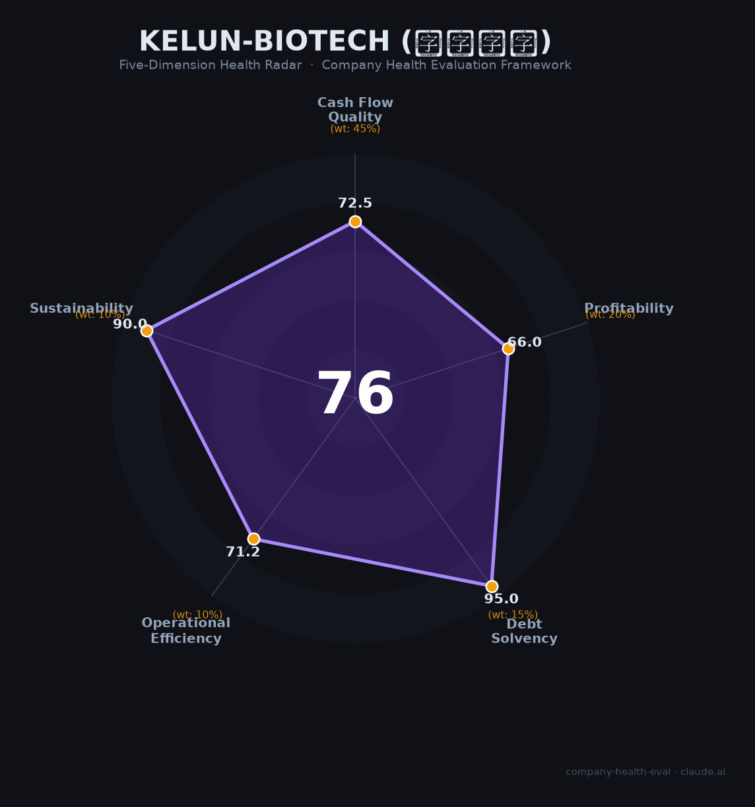

# 科伦博泰（Kelun-Biotech, 6990.HK）财务健康评估（2026-06-12）

## 一句话结论

🟡 **中等偏上（76.2/100）** | 零银行借款 · 4款产品上市 · 默沙东背书 · 商业化烧钱期——ADC赛道的「中国冠军候选」

---

## 一、公司基本画像

| 项目 | 详情 |
|------|------|
| 主体 | 🔒 四川科伦博泰生物医药股份有限公司，港交所：6990.HK |
| 成立 | 2016年11月22日，成都温江区 |
| 股权 | 🔒 科伦药业（002422.SZ）控股约53.41%；默沙东持股约5.77%为第二大股东 |
| 规模 | 🔒 员工2,045人（2025年末），商业化团队600+人 |
| 上市 | 2023年7月11日港股IPO，发行价60.60港元，募资净额约12.59亿港元 |
| 主营 | ADC（抗体偶联药物）研发+商业化，4款产品8项适应症获批 |
| BD | 默沙东9款ADC授权，总里程碑高达118亿美元——中国创新药BD历史第一 |

> 科伦博泰是科伦药业（大输液龙头，002422.SZ）分拆的创新药平台，创始人刘革新为实际控制人，CEO葛均友主持日常运营。公司核心产品芦康沙妥珠单抗（SKB264/佳泰莱）是全球首个在ADC+IO一线NSCLC III期成功的TROP2 ADC，被默沙东列为"重磅炸弹"潜力候选。

**一句话定性**：中国ADC第一梯队「准盈利商业化biotech」——4款产品已上市、默沙东118亿美元背书、现金充裕零银行借款，但经营现金流仍为负、核心产品2025年销售不及预期、千亿市值估值溢价明显。

---

## 二、五维财务健康评估

### 1. 现金流质量（72.5/100）| 权重45%

| 指标 | 🔒 公开数据 | 评估 |
|------|-----------|------|
| 经营现金流净额 | 2023年+0.60亿→2024年-4.30亿→2025年-1.80亿（收窄58%） | ⚠️ 关注：时正时负，商业化投入期 |
| 现金及等价物 | 2025年末32.44亿（广义现金+金融资产45.59亿） | ✅ 健康：覆盖17-24个月运营 |
| 有息负债 | 零银行贷款，仅融资租赁0.88亿 | ✅ 健康：零银行借款，极低杠杆 |
| 净现比 | OCF(-1.80亿) / NI(-3.82亿)=0.47，经营现金流亏损幅度小于会计亏损 | ⚠️ 关注：仍为净流出，但收窄趋势明确 |

**小结**：现金流是科伦博泰现阶段的最大短板——2025年仍为经营现金净流出（-1.80亿），主要因商业化团队扩张（销售费用+160%）和持续高研发投入。但收窄趋势明确（2024年-4.30亿→2025年-1.80亿），且45.59亿充裕现金储备提供了充足缓冲。多券商预期2026年扭亏为盈，届时OCF有望转正。

> 🔒 数据来源：科伦博泰2025年年报（2026年3月发布）；东方财富6990.HK财务分析

### 2. 盈利能力（66.0/100）| 权重20%

| 指标 | 🔒 公开数据 | 评估 |
|------|-----------|------|
| 毛利率 | 2025年71.9%（连续三年提升：49.3%→65.9%→71.9%） | ⚠️ 良好：高于行业平均，许可+药品双轮驱动毛利率持续改善 |
| 净利率 | 2025年经调整净亏损2.11亿（净利率-10.3%），但Q4单季已接近盈亏平衡 | 🚩 预警：仍亏损，但拐点临近 |
| 营收增速（3年CAGR） | 2022年8.04亿→2025年20.58亿，CAGR 36.8% | ✅ 优秀：远超20% |
| 研发费用率 | 64.1%（2025年），biotech行业正常水平 | ⚠️ 良好：支持17项全球III期的管线投入 |
| 人均创收 | 101万元/人（2025年） | ⚠️ 良好：商业阶段biotech合理水平 |

**小结**：盈利能力处于「黎明前的黑暗」阶段——毛利持续改善（71.9%）、营收3年CAGR 36.8%、部分季度已接近盈亏平衡，但整体仍亏损。SKB264销售（2025年约5亿）低于券商预期的8-10亿，部分因2025年尚未纳入医保。2026年1月入医保后Q1亏损已收窄70%，全年扭亏可期。

> 🔒 数据来源：科伦博泰2025年年报；界面新闻/券商研报；科伦药业合并报表2026Q1拆分

### 3. 偿债能力（95.0/100）| 权重15%

| 指标 | 🔒 公开数据 | 评估 |
|------|-----------|------|
| 资产负债率 | 2025年末18.7%（2023年IPO前>100%） | ✅ 健康：<40%，极低 |
| 有息负债率 | 有息负债0.88亿/总资产51.49亿≈1.7%（且为零银行贷款） | ✅ 健康：零银行借款，仅融资租赁 |
| 流动比率 | 约5（流动资产~35亿/流动负债~7亿） | ✅ 健康：>2 |
| 现金比率 | 约4.6（现金32.44亿/流动负债~7亿） | ✅ 健康：>1 |
| 股权质押 | 无质押记录 | ✅ 健康：<30% |

**加分项**：零银行贷款 + 资产负债率18.7% → 偿债能力行业顶级

**小结**：偿债能力维度几近满分。IPO+多次配售充实资本后，公司从2022年资不抵债彻底逆转为极低杠杆结构。零银行借款+45.59亿现金为该维度提供几乎无懈可击的安全垫。

> 🔒 数据来源：科伦博泰2025年年报资产负债表；富途牛牛6990.HK

### 4. 运营效率（71.2/100）| 权重10%

| 指标 | 🔒 公开数据 | 评估 |
|------|-----------|------|
| 应收周转天数 | 约13.5天（2025年，许可收入回款快） | ✅ 健康：极低，默沙东里程碑款+药品分销回款迅速 |
| 客户集中度 | 默沙东许可收入占总收入~73%，为最大单一客户 | 🚩 危险：默沙东单一客户依赖度>60% |
| 员工规模趋势 | 2022年1,155人→2025年2,045人（+77%），连续三年扩编 | ✅ 健康：稳步增长 |
| 高管稳定性 | CEO葛均友任职4年+，核心高管团队（研发/商业/财务）稳定 | ✅ 健康：核心团队3年+ |

**小结**：运营效率整体良好，唯一且重大的风险是默沙东单一客户依赖——许可收入占总收入73%。虽然默沙东是AAA级合作伙伴（17项全球III期投入佐证承诺），但若合作生变，收入结构将面临断崖风险。公司正通过自主商业化（600+人团队、2,000+家医院覆盖）分散这一风险。

> 🔒 数据来源：科伦博泰2025年年报收入拆分；StockAnalysis员工数据

### 5. 可持续发展（90.0/100）| 权重10%

| 指标 | 评估 | 判断依据 |
|------|------|---------|
| 行业赛道空间 | ✅ 健康 | 全球ADC市场CAGR 30%，TROP2为最大单一靶点赛道之一 |
| 技术壁垒 | ✅ 健康 | SKB264全球首个ADC+IO一线NSCLC III期成功（柳叶刀发表），6项BTD，宜联生物和解后从竞品管线获得分成收入 |
| 客户/业务多元化 | ✅ 健康 | 默沙东许可+自主商业化双轨；4款产品8项适应症；肺癌/乳腺癌/妇科/消化道/泌尿5大癌种布局 |
| 融资/资本支持 | ✅ 健康 | 港股上市+多次配售（含2025年2.5亿美元配售超额认购）+默沙东股权投资+母公司科伦药业背书 |
| 政策/监管风险 | ✅ 健康 | CDE审评友好（6项BTD+5项优先审评）、3款产品5项适应症已入医保 |

**小结**：可持续发展是科伦博泰最强的维度。默沙东17项全球III期临床正在将SKB264推向全球市场，2027年计划集中披露9项关键数据。中国ADC出海大潮中，科伦博泰以118亿美元BD交易保持历史第一的位置。宜联生物和解后从6条竞品管线获取分成，进一步加固了竞争壁垒。

---

## 三、综合评分与健康等级

| 维度 | 得分 | 权重 | 加权 |
|------|:----:|:----:|:----:|
| 现金流质量 | 72.5 | 45% | 32.6 |
| 盈利能力 | 66.0 | 20% | 13.2 |
| 偿债能力 | 95.0 | 15% | 14.2 |
| 运营效率 | 71.2 | 10% | 7.1 |
| 可持续发展 | 90.0 | 10% | 9.0 |
| **综合得分** | | **100%** | **76.2** |

**健康等级：🟡 中等偏上（Moderate-High）**

### 得分解读

- **长板**：偿债能力(95.0)、可持续发展(90.0)——现金充裕、零银行借款、赛道高景气、默沙东深度绑定
- **中板**：现金流质量(72.5)、运营效率(71.2)——商业化投入期OCF为负，但收窄趋势明确
- **短板**：盈利能力(66.0)——仍处于盈亏平衡前夜，SKB264销售不及预期拖累

> 得分76.2低于同赛道映恩生物(83.1)，科伦博泰在盈利能力上（自建600人商业化团队）投入更大、OCF为负，但这些投入正在构建长期自主商业化能力——短期财务指标承压但战略价值显著。

---

## 四、同业对标

| 对比项 | **科伦博泰 6990.HK** | 荣昌生物 9995.HK | 映恩生物 9606.HK |
|--------|:-------------------:|:----------------:|:----------------:|
| 2025年营收 | **20.58亿**（+6.5%） | 32.42亿（+89.6%） | 18.52亿（-4.6%） |
| 经调整净利润 | **-2.11亿** | **+7.10亿（扭亏）** | -3.89亿 |
| 毛利率 | **71.9%** | 84.3% | 31.8% |
| 研发费用 | **13.20亿** | 12.19亿 | 8.38亿 |
| 现金储备 | **45.59亿** | 总资产72.39亿 | 33.25亿 |
| 市值（2026.6） | **~997亿港元** | ~621亿港元 | ~168亿港元 |
| 商业化产品 | **4款（8项适应症）** | 2款 | 0（2026年BLA） |
| BD交易总额 | **>118亿美元（默沙东）** | >82亿美元 | >60亿美元（6笔） |
| **核心管线** | SKB264 (TROP2 ADC) | RC48 (HER2 ADC) | DB-1303 (HER2 ADC) |
| 员工 | **2,045人** | >3,000人 | ~220人 |

**对标结论**：科伦博泰在ADC赛道中的定位是「商业化最领先的创新biotech」——4款产品已上市、默沙东BD为中国历史第一、千亿市值位居行业榜首。但荣昌生物已率先扭亏为盈，映恩生物以更轻资产实现正向经营现金流。科伦博泰的"重资产商业化投入"策略在短期拖累盈利指标，但中长期构建了更完整的pharma能力。

---

## 五、核心风险清单

1. **默沙东合作依赖（高风险）**：许可收入占总收入73%（14.98亿/20.58亿），默沙东若调整管线优先级或终止合作将造成收入断崖。2023年10月默沙东曾终止2项临床前ADC资产（非核心），显示合作存在调整风险。缓释因素：默沙东已启动17项全球III期（潜在投入约30亿美元），退出成本极高。

2. **千亿市值高估值（中高风险）**：PS超50倍（全球ADC龙头Seagen被收购前仅15-20倍），SKB264销售不及预期（实际5亿 vs 预期8-10亿）。若2026年销售继续低于预期，估值可能面临重大调整。

3. **OS数据尚未成熟（中风险）**：SKB264一线NSCLC PFS HR=0.35极为亮眼，但OS数据仅显示"获益趋势"（HR=0.55），尚未达到统计学显著性。若OS最终未达阳性，FDA批准前景和市场信心将受重创。

4. **母公司科伦药业业绩崩盘（中风险）**：科伦药业2025年营收-15.13%、净利润-42.03%，传统大输液/仿制药业务承压。虽科伦博泰资金独立，但母公司作为控股股东若财务状况恶化，可能间接影响市场信心。

5. **TROP2 ADC竞争格局演变（中低风险）**：吉利德Trodelvy多线失败（EVOKE-03终止）利好SKB264，但第一三共Dato-DXd仍在积极推进。若Dato-DXd在类似适应症读出更优数据，SKB264的先发优势可能被削弱。

6. **核心人才流失历史（低风险，已部分化解）**：前总经理薛彤彤等3位核心高管离职创办宜联生物（直接竞争对手）。2025年12月和解后，科伦博泰从宜联生物6条ADC管线获取分成收入（已收7.03亿元），将竞争对手转化为收入来源。

---

## 六、求职/择业视角

### 核心优势

- **平台价值极高**：中国ADC第一梯队、千亿市值、默沙东全球合作伙伴。在科伦博泰积累的ADC研发/商业化经验在全球医药行业属于最炙手可热的技能组合。
- **财务安全性**：45.59亿现金+零银行借款+科伦药业母公司背书，即使不考虑新增BD收入也可支撑24+个月运营。对比多数18A biotech，资金安全垫极厚。
- **职业成长空间**：从biotech向pharma转型阶段（600→800人商业化团队、4款产品上市），内部晋升机会多。2025年开出6个百万年薪岗位。

### 现存短板

- **薪酬结构两极分化**：总监级年薪60-110万（高于市场），但普通工程师月薪约8,174元（低于成都平均39%）。基层员工薪酬竞争力偏弱。
- **工作地点单一**：总部成都温江区，非一线城市。对于偏好北上广深的求职者，地理位置是天然约束。
- **工作压力分化**：约70%员工认为"压力不大"，30%反映"经常加班"。研发和商业化部门节奏差异明显。

### 分场景建议

| 个人诉求 | 推荐 | 次选 | 规避 |
|----------|------|------|------|
| 稳定+深耕ADC | ✅ 适合：现金充裕、管线扎实、默沙东背书 | | |
| 高薪+跳板 | | ⚠️ 次选：基层薪资偏低但品牌溢价强，跳槽MNC认可度高 | |
| 成长+IPO红利 | ✅ 适合：从biotech到pharma转型期，内部机会多 | | |
| WLB/一线城市 | | | 🚫 不适合：成都单一地点，研发部门节奏快 |

---

## 七、总结

**科伦博泰是中国ADC领域「商业化最领先的创新biotech」公司：**

默沙东118亿美元背书（中国BD历史第一）+4款产品已上市+零银行借款+45.59亿现金，核心短板是仍处于商业化烧钱期（OCF为负）、SKB264销售不及预期（2025年约5亿 vs 预期8-10亿）以及默沙东单一客户高度依赖。

在ADC赛道全球高景气（CAGR 30%）、中国创新药出海加速、医保覆盖持续扩大的大环境下，属于**中等偏上**风险等级，适合**看好ADC赛道长期前景、追求品牌溢价和国际化经验、能接受成都工作地点**的生物医药专业人才的优质平台。2026年若实现扭亏为盈+SKB264美国BLA提交，公司将从「biotech」正式迈入「pharma」行列。
