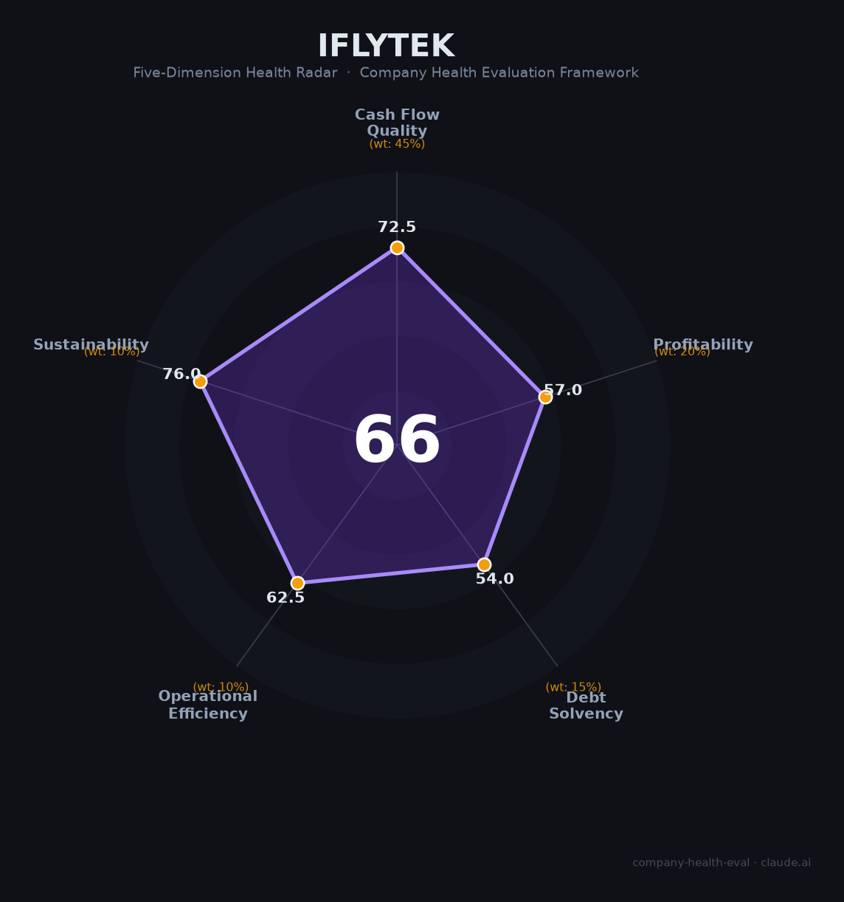

# 科大讯飞 财务健康评估（2026-06-12）

## 一句话结论

🟠 **中等（66/100）** | AI国家队级平台，营收271亿增速16%——但扣非净利率不足1%、政府补贴占利润76%、应收账款163亿、深交所40亿定增问询中。它是「不可或缺的战略资产」，也是「难以自负盈亏的财政依赖体」。

---

## 一、公司基本画像

| 项目 | 数据 | 可信度 |
|------|------|:------:|
| **主体** | 科大讯飞股份有限公司（iFLYTEK CO., LTD.） | 🔒工商 |
| **股票代码** | 002230.SZ（深交所中小板） | 🔒深交所 |
| **成立/上市** | 1999年成立 / 2008年5月上市 | 🔒招股书 |
| **注册地** | 合肥市高新开发区望江西路666号 | 🔒工商 |
| **实控人** | 刘庆峰（2024年11月起单一控制，此前与中科大资产一致行动） | 🔒公告 |
| **第一大股东** | 中国移动（约10.03%，央企） | 🔒年报 |
| **企业性质** | 混合所有制公众公司，实控人为自然人→民营企业 | 🔒公告 |
| **董事长/总裁** | 刘庆峰（1973年生，中科大博士，连续五届全国人大代表） | 🔒年报 |
| **员工** | 16,818人（2025年末），研发人员10,040人（59.7%） | 🔒年报 |
| **市值** | ~1,100亿元（2026.06） | 🔒行情 |

### 2025年业务收入结构（🔒年报）

| 业务板块 | 营收（亿元） | 占比 | 同比增速 |
|----------|:--------:|:----:|:------:|
| 智慧教育 | 89.67 | 33.1% | +24.0% |
| 开放平台 | 59.36 | 21.9% | +14.8% |
| 智能硬件 | 24.47 | 9.0% | +21.0% |
| 运营商 | 21.85 | 8.1% | +14.9% |
| 智慧汽车 | 14.11 | 5.2% | **+42.7%** |
| 智慧医疗 | 9.39 | 3.5% | +35.7% |
| 信息工程（智慧城市） | 13.92 | 5.1% | -17.2% |
| 数字政府 | 10.85 | 4.0% | -9.3% |
| 企业AI解决方案 | 7.74 | 2.9% | +20.4% |
| 智慧政法 | 7.08 | 2.6% | -4.2% |
| 移动互联网 | 7.59 | 2.8% | +9.8% |
| 其他 | 5.02 | 1.8% | — |
| **合计** | **271.05** | **100%** | **+16.12%** |

### 关键子公司与资本运作

- **讯飞医疗（02506.HK）**：2024年12月分拆上市（港股医疗大模型第一股），科大讯飞持股49.42%。2025年营收9.15亿（+24.7%），净亏损收窄51%至6,479万。股价低于发行价（82.8→67.95港元）。
- **定增计划**：拟向特定对象发行股票募资不超过40亿元（全部用于补充流动资金），2025年10月遭深交所8大类问题审核问询，截至2026年6月仍在审核中。

**一句话定性**：科大讯飞是中国AI产业的「国家队」级平台企业——从智能语音起家，20年深耕形成教育+医疗+汽车+开放平台+智慧城市的全场景AI版图。271亿营收、16%增速、1.7万员工彰显平台量级。但扣非净利率不足1%、政府补贴占归母利润76%、应收163亿（208天周转）、资产负债率55.7%且持续走高——这些数字共同指向一个尖锐结论：讯飞是「不可或缺的战略资产」，但同时是「难以自负盈亏的财政依赖体」。它的价值更多体现在国家AI战略安全层面，而非股东回报或财务健康层面。

---

## 二、五维财务健康评估

### 1. 现金流质量（72/100）🟠

| 指标 | 2023 | 2024 | 2025 | 判断 |
|------|:----:|:----:|:----:|:--:|
| 经营现金流 | +3.50亿 | +24.95亿 | +32.08亿 | 🟢 连续三年为正，2024年起大幅改善 |
| 现金/短债覆盖 | — | — | 现金31.5亿/短债11.6亿 | 🟡 覆盖OK但绝对值偏紧 |
| 有息负债 | 47.98亿 | 49.83亿 | 46.86亿 | 🟡 体量适中但短债暴增4倍 |
| 应收周转天数 | 205天 | 210天 | 208天 | 🔴 远超行业均值128天 |
| 净现比（CFO/NI） | 53% | 446% | 382% | 🟢 2024起远超1，但依赖回款突击 |

**现金流解剖**：科大讯飞2024-2025年经营现金流的「大逆转」（从3.5亿→25亿→32亿）是本次评估中最大的正面信号——但其可持续性存疑。改善主要来自：(1)成立专项回款部门加大催收力度、(2)主动收缩低毛利G端项目减少应收增量、(3)年末集中回款（G端季节性特征）。这本质上是「向存量应收账款要现金流」，而非业务模式根本性改善。如果2026年G端财政进一步收紧，回款能力可能再次恶化。

**应收账款是定时炸弹**：163亿应收占营收60%，其中45%账龄超1年，2025年单年计提坏账损失9.31亿元（超过当年归母净利润8.39亿）。公司辩称「实际核销占比<0.1%」，但这种说法忽略了——G端客户的违约通常不是「不还」，而是「无限期拖延」，这对现金流的影响是真实的。

### 2. 盈利能力（57/100）🟠

| 指标 | 数据 | 得分 | 判断 |
|------|------|:--:|:--:|
| 毛利率 | 42.36%（三年趋势下滑） | 🟡 | 接近IT集成商水平（40-45%），远低于平台型AI公司（60-85%） |
| 净利率 | 归母3.09% / 扣非**0.97%** | 🔴 | 扣非净利率不足1%，主营业务几乎不赚钱 |
| 营收增速（3Y CAGR） | ~17%（2022-2025） | 🟢 | 良好的双位数增长，大基数下维持不易 |
| 研发费用率 | 16.37%（2025） | 🟢 | 处于科技公司10-25%健康区间 |
| 人均创收 | 161万元（2025） | 🟡 | 高于IT服务行业均值但人均创利仅5万元 |

**盈利的「皇帝新衣」——政府补贴依赖**：

| 指标 | 2023 | 2024 | 2025 |
|------|:----:|:----:|:----:|
| 政府补助（计入损益） | 4.04亿 | 4.19亿 | 6.36亿 |
| 归母净利润 | 6.57亿 | 5.60亿 | 8.39亿 |
| **补贴占利润比** | **61.5%** | **74.8%** | **75.8%** |
| 扣非净利润 | 1.18亿 | 1.88亿 | 2.64亿 |

**如果政府补贴退坡30%**（从6.36亿→4.45亿），归母净利润将降至6.48亿（-22.8%）。**如果退坡50%**，归母净利润将降至5.21亿（-37.9%）。讯飞的盈利本质上是一个「财政转移支付项目」——国家通过补贴间接支持AI战略产业，讯飞是最大的受益者之一。这不是原罪（Oracle/微软早期也拿政府合同），但投资者需要清醒认识到这不是市场化的盈利能力。

### 3. 偿债能力（54/100）🟠

| 指标 | 数据 | 判断 |
|------|------|:--:|
| 资产负债率 | 55.72%（三年从53%→55%→56%） | 🟡 超过40%健康线，仍在可控范围但趋势向上 |
| 有息负债率 | 10.4%（46.86亿/448.57亿） | 🟢 比例可控 |
| 短期借款 | 11.61亿（较2023年的2.43亿暴增378%） | 🔴 短期偿债压力骤增 |
| 应付债券 | 8.09亿（2025年首次出现） | 🟡 新增债务品种 |
| 股权质押 | 刘庆峰2023年减持23.5亿偿还质押借款，此后未减持 | 🟡 质押风险已大幅解除 |

**关键趋势**：债务结构正在从「长期稳定」转向「短期紧张」——长期借款缩减（45.55亿→27.16亿），短期借款暴增（2.43亿→11.61亿），首次发行债券（8.09亿）。加之应收账款质量恶化，实际流动性风险高于账面数据。

### 4. 运营效率（62/100）🟠

| 指标 | 数据 | 判断 |
|------|------|:--:|
| 应收周转 | 208天 vs 行业128天 | 🔴 效率低下，G端模式的结构性缺陷 |
| 客户集中度 | 多元分散（教育31%+开放平台22%+汽车5%+医疗3.5%等） | 🟢 行业和客户分布广泛 |
| 员工趋势 | 14,356→15,551→16,818人（持续增长） | 🟢 规模扩张，研发人员占比稳定60% |
| 高管稳定 | 核心团队超20年在位；VP杜兰/CFO汪明离职但非批量 | 🟡 创始人稳定，个别高管正常更替 |

**运营效率的「人效悖论」**：1.7万人团队、161万人均创收（在IT服务行业算中等偏上），但人均创利仅5万元——意味着每增加一个员工，公司只能获得约5万元的年度利润。这种「人海战术+低利润」模式更接近传统IT外包而非AI平台公司。16,818人中有10,040人（60%）是研发人员，是讯飞最大的资产也是最大的成本。

### 5. 可持续发展能力（76/100）🟡

| 指标 | 判断 | 依据 |
|------|:--:|------|
| 行业赛道 | 🟢 | 中国AI市场CAGR 24%，教育AI~30%，医疗AI更快；「数据要素×」三年行动+教育强国政策强力驱动 |
| 技术壁垒 | 🟢 | 20年语音技术积累+国家科技进步一等奖+星火大模型国产前三+首批通过GB/T 45654国标 |
| 客户/业务多元化 | 🟢 | 教育/医疗/汽车/开放平台/城市/政法六大板块，G/B/C三层全覆盖 |
| 资本支持 | 🟡 | A股上市+讯飞医疗港股分拆；但40亿定增遭深交所问询，融资节奏受阻 |
| 政策/监管风险 | 🟡 | **双重性**：AI监管合规壁垒利好讯飞（淘汰套壳企业）；但政府补贴退坡是致命风险 |

**讯飞的「战略期权价值」**：在美国实体清单（2019年起）+ 中美AI脱钩加速的背景下，讯飞是中国唯一具备「从底层算力（华为昇腾）+ 自研大模型（星火）+ 全行业应用落地」全栈能力的AI平台公司。这种「全栈国产化」身份在商业市场上的溢价有限（毛利率仅42%），但在国家安全层面具有不可替代的「战略冗余」价值。讯飞千亿市值的核心支撑不是利润表，而是这个「看涨期权」——如果中美科技彻底脱钩，讯飞可能是中国AI基础设施最后的「备胎」之一。

---

## 三、综合评分与健康等级

| 维度 | 得分 | 权重 | 加权得分 |
|------|:----:|:----:|:--------:|
| 现金流质量 | 72 | 45% | 32.4 |
| 盈利能力 | 57 | 20% | 11.4 |
| 偿债能力 | 54 | 15% | 8.1 |
| 运营效率 | 62 | 10% | 6.2 |
| 可持续发展 | 76 | 10% | 7.6 |
| **66/100** ||**100%**|**57.30**|

**健康等级**：🟠 **中等（Moderate）**

> 得分位于55-70区间下沿。核心拖分项是盈利能力（扣非净利率仅0.97%）和现金流质量（应收163亿/208天）。偿债和运营效率处于中等水平。可持续发展是相对强项（赛道空间+技术壁垒+全栈国产化战略价值）。该等级的含义是：**有明确且重大的风险点（政府补贴依赖+应收坏账累积），需根据个人风险偏好和场景谨慎判断。**

---

## 四、同业对标

### AI平台公司横向对比（2024年数据，🔒公开财报）

| 对比项 | 科大讯飞 | 百度 | 商汤科技 | 金山办公 | 云从科技 |
|--------|:------:|:---:|:------:|:------:|:------:|
| 上市地 | A股中小板 | 港股 | 港股 | A股科创板 | A股科创板 |
| 营收（亿） | **233** | 1,331 | 38 | 51 | 4 |
| 营收增速 | **+18.8%** | -1% | +10.8% | +12.4% | **-36.7%** |
| 毛利率 | 42.6% | 50.4% | 42.9% | **85.1%** | 35.8% |
| 净利率 | 2.2% | **17.9%** | 亏损 | **32.1%** | -177% |
| 研发费用率 | 16.7% | 16.6% | **109.5%** | 33.1% | 119.3% |
| 员工数 | 15,551 | ~35,900 | 3,756 | 5,189 | 453 |
| PS估值 | **~4.7x** | ~2.2x | ~13.4x | ~20.3x | ~35.2x |
| 大模型商业化 | 教育72亿+开放平台52亿 | 云AI 219亿（最领先） | 生成式AI 24亿（+103%） | WPS AI月活1968万 | 早期，商业化困难 |

### 讯飞 vs 行业的核心差异解读

1. **「最低PS」的背后是「最低利润率」**：讯飞PS仅4.7x（同行10-35x），并非市场低估，而是因为其42%的毛利率和2.2%的净利率更接近系统集成商（如太极股份、东华软件）而非AI平台公司。市场将它和金山办公（85%毛利率/32%净利率）对比时给出了合理折价。

2. **「最大员工规模」的双刃剑**：1.7万人是百度AI团队规模的约5倍（按人均），但人均创利仅5万——讯飞用「人海战术」做G端项目交付，而百度用「平台+API」模式做规模化。前者在短期营收增长上更稳健，后者在长期利润率上有更大想象空间。

3. **「全栈国产化」是壁垒也是枷锁**：转向华为昇腾后训练效率仅为A100的85%，大模型迭代比业界慢2-3个月。在商业竞争中这是劣势，但在政企市场（尤其是涉密/国安场景）这是排他性优势。

**对标结论**：科大讯飞在AI赛道中是「规模最大的系统集成商」而非「最纯的AI平台」。它的千亿市值不是由利润表支撑的，而是由「国家AI战略中不可替代的国产化全栈能力」这一战略期权支撑的。对于追求财务回报的投资者，金山办公和百度是更好的AI标的；对于看重战略价值和抗制裁能力的配置型投资者，讯飞是独一无二的存在。

---

## 五、核心风险清单

1. **⚫ 政府补贴依赖——盈利的「皇帝新衣」（高风险）**：2025年政府补贴6.36亿元，占归母净利润75.8%。若补贴退坡30-50%，归母净利润将出现显著亏损。讯飞近20年历史上从未在零补贴环境下证明过盈利能力。**触发条件**：地方财政持续紧张+AI补贴政策转向基础研究而非单一企业。

2. **⚫ 应收账款163亿——G端「无限期赊账」（高风险）**：应收账款占营收60%，周转208天，45%账龄超1年，2025年坏账计提9.31亿已超过归母净利润。这不是违约风险（政府不破产），而是流动性风险（政府无限期拖延）。**触发条件**：土地财政进一步恶化导致地方政府延迟/削减数字化采购付款。

3. **🔴 扣非净利率不足1%——主业盈利能力存疑（高风险）**：233亿营收只产生1.88亿扣非净利润（2024年），相当于每100元收入只赚0.81元。这种「大而不赚」的结构在资本市场一旦失去AI概念溢价，估值可能向系统集成商（PS 1-2x）回归。

4. **🟡 深交所40亿定增受阻（中等风险）**：深交所2025年10月出具审核问询函，聚焦8大类问题（研发资本化率偏高、应收长账龄激增、收入利润背离等）。若定增被否或大幅缩水，公司融资渠道将受限，短期债务压力上升。

5. **🟡 星火大模型竞争加剧（中等风险）**：DeepSeek/豆包/Kimi等新兴玩家在C端增长迅猛，百度文心宣布全面免费+开源。星火App月活仅575万（vs豆包数千万），C端入口缺失。讯飞的优势在B/G端私有化部署，但在面向开发者的开放平台生态上面临挑战。

6. **🟡 员工口碑恶化——人才争夺战可能失利（中等风险）**：脉脉/牛客网口碑偏负面（加班严重、KPI严苛、涨薪空间小、「合肥血汗工厂」标签）。在AI人才争夺白热化的2025-2026年，讯飞的雇主品牌可能成为吸引顶尖AI人才的障碍。

---

## 六、求职/择业视角

> 以下分析适用于考虑加入科大讯飞的求职者。

### 核心优势

- **平台量级大**：1.7万人/271亿营收/A股AI龙头，在合肥是无可争议的顶尖科技雇主，在全国AI行业有品牌认知度
- **技术积累深厚**：20年语音+AI技术，国家科技进步一等奖，星火大模型国产前三。技术人员能接触到有深度的AI项目
- **业务多元化提供内部流动空间**：教育/医疗/汽车/城市/消费者六大板块，研发→产品→行业落地全链条完整
- **「全栈国产化」经验稀缺且可迁移**：华为昇腾适配+国产大模型训练的经验是当前市场上最抢手的能力之一
- **相对稳定**：上市公司+央企股东（中国移动），大规模裁员风险低于纯互联网公司

### 现存短板

- **薪酬竞争力有限**：合肥Base月薪12-22K（校招），与一线大厂（字节/腾讯/百度）同岗位有30-50%差距。北京算法岗20-40K在行业内偏低
- **加班文化重+KPI严苛**：「加班时长挂钩绩效」「算法自动打D」「效仿华为末位淘汰」——员工体验评分低
- **涨薪空间小**：多个员工反映「入职即巅峰」「三年不涨薪」。公积金比例仅7%（对比互联网公司12%）
- **「合肥」地理位置双刃剑**：生活成本低是优势，但限制了职业网络和跳槽选择面
- **「系统集成商」底色对技术成长有天花板**：大量G端项目是交付型工作而非底层技术创新，部分技术人员可能感到「技术含量不够」

### 分场景建议

| 个人诉求 | 推荐度 | 理由 |
|----------|:------:|------|
| 稳定+WLB+合肥安家 | ⭐⭐⭐ | 合肥当地顶尖雇主，生活成本低，上市公司相对稳定，适合「不想卷一线城市」的技术人才 |
| 高薪+跳板 | ⭐⭐ | 薪酬低于一线大厂30-50%；品牌对跳槽有帮助但非顶级背书；合肥限制了面试/跳槽便利性 |
| AI技术成长 | ⭐⭐⭐⭐ | 语音/NLP/大模型/国产化适配经验稀缺且可迁移，是进入AI赛道的不错起点 |
| 赌AI赛道红利 | ⭐⭐⭐ | 讯飞是A股AI核心标的之一，若行业爆发+定增成功，期权/股票价值有想象空间；但利润率薄，想象空间受制约 |

### 面试/入职必确认的三件事

1. **具体团队和业务线**——是星火大模型核心研发（高价值）还是G端系统集成交付（低成长）？两者的技术含量和跳槽价值差距巨大。
2. **薪酬结构和涨薪机制**——公积金比例7%是否接受？公司是否有明确的年度调薪政策？（建议写入offer）
3. **加班强度**——虽是「标配」但不同团队差异大。通过面试官的反应和间接渠道了解直属团队的加班文化。

---

## 七、总结

**科大讯飞是中国AI产业「规模庞大的财政依赖型平台」**：271亿营收+1.7万人+20年技术积累+全栈国产化能力构成战略护城河，**唯一的关键短板是「无法在零补贴环境下证明盈利能力」——扣非净利率不足1%、政府补贴占利润76%、应收账款163亿且持续膨胀**。

在中美AI脱钩加速、国家科技自主战略强力推进的大背景下，科大讯飞属于**战略价值高于财务价值**的特殊存在——它的千亿市值更多反映的是「中国AI绝不能没有讯飞」的国家意志，而非「讯飞是一家优秀商业模式公司」的市场判断。对于求职者，它是进入AI赛道的体面起点，但不应是终点；对于投资者，它是AI主题的战略配置工具，但不应按成长股逻辑给予估值溢价。

---

*评估日期：2026年6月12日 | 数据截至：2025年年报（2026年4月披露）及公开市场信息 | 信息来源：巨潮资讯网/深交所公告（🔒公开财报）、东方财富/同花顺/富途牛牛财务数据、深交所审核问询函（2025.10）、信达证券/九方智投券商研报、钛媒体/每日经济新闻/网易财经深度分析、牛客网/脉脉/看准网员工评价*
