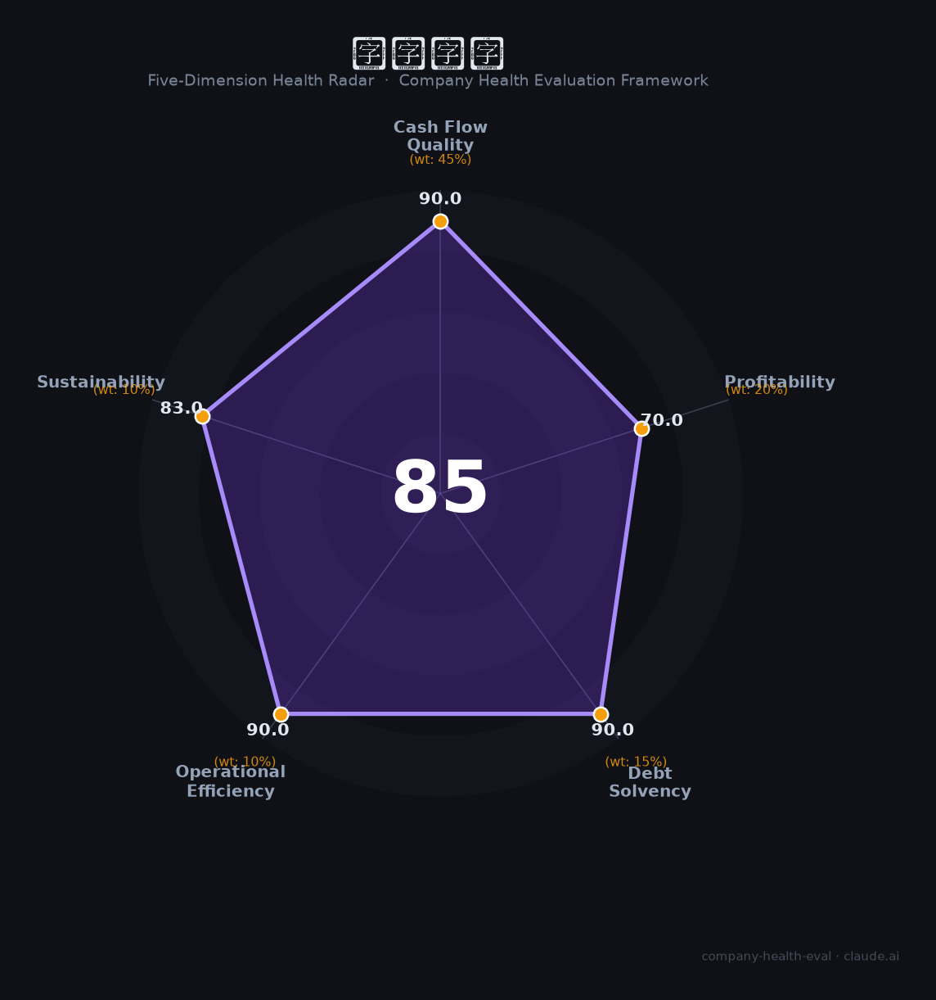

# 稳健医疗（300888.SZ）财务健康评估（2026-08-14）

## 一句话结论

🟢 **85/100，优秀** | 医疗+消费双轮，营收净利双增、稳健

---

## 一、公司基本画像

| 项目 | 内容 |
|------|------|
| 主体 | 稳健医疗，医用敷料+全棉时代 |
| 主营 | 医用敷料/健康生活消费品 |
| 财务 | 2025营收109.49亿(+21.96%)，归母净利7.68亿(+10.44%) |

> 一句话定性：医疗+消费双轮，营收净利双增、现金流好

---

## 二、五维财务健康评估

### 1. 现金流质量（90/100）| 权重45%

现金流充沛。

### 2. 盈利能力（70/100）| 权重20%

盈利稳健、毛利率高。

### 3. 偿债能力（90/100）| 权重15%

低负债、偿债优。

### 4. 运营效率（90/100）| 权重10%

运营效率高。

### 5. 可持续发展（83/100）| 权重10%

健康消费品增长，双品牌协同。

---

## 三、综合评分

| 维度 | 得分 | 权重 | 加权 |
|------|:----:|:----:|:----:|
| 现金流质量 | 90 | 45% | 40.5 |
| 盈利能力 | 70 | 20% | 14.0 |
| 偿债能力 | 90 | 15% | 13.5 |
| 运营效率 | 90 | 10% | 9.0 |
| 可持续发展 | 83 | 10% | 8.3 |
| **综合得分** | **85/100** | 100% | 85.3 |

**健康等级：优秀** — 财务极健康，值得优先考虑

---

## 四、核心风险清单

1. **口罩等防疫品需求回落**
2. **消费复苏不及预期**
3. **医疗集采**

## 五、求职/择业视角

### 核心优势
- 双轮驱动、低负债、品牌强
### 现有短板
- 防疫品红利消退、消费承压

**结论**：稳健医疗医疗+消费双轮，营收净利双增、现金流好，稳健优质平台。

---

*评估方法：商泰汽车（iAUTO）五维框架 · 数据截至2026年8月 · 财务来源稳健医疗2025年报*