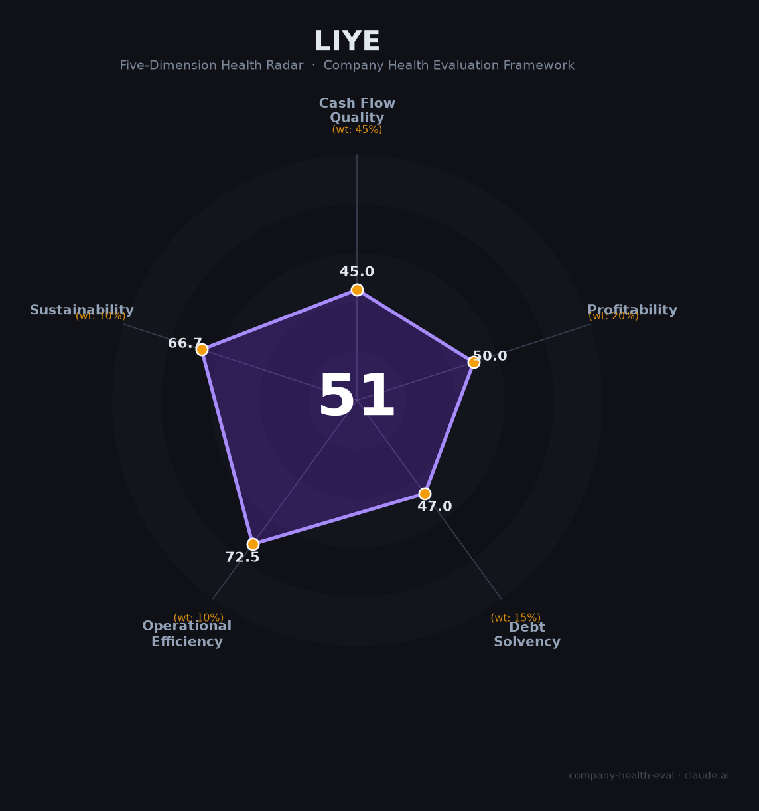

# 立业集团财务健康评估（2026-08-13）

## 一句话结论

🔴 **中等偏下（51/100）** | 深圳多元化民企（电力装备+金融+医药）——营收733亿（民企500强），但非上市+财务不透明+股权高质押是核心风险

---

## 一、公司基本画像

| 主体 | 🔒 深圳市立业集团有限公司，深圳民企（非上市多元化） |
| 主营 | 电力设备与新能源、金融（控股华林证券、参股微众银行/深创投）、生物医药、供应链、战略投资 |
| 财务 | 🔒 2024营收733.91亿（民企500强第98/中国500强215）；子公司华林证券2024营收14.35亿（+41%） |
| 性质 | ⚠️ 非上市公司，无公开完整合并报表，财务数据无法核实 |

> 一句话定性：立业集团是深圳大型民营多元化集团（电力+金融+医药+供应链），营收733亿规模可观，但关键点为"非上市、财务不透明、股权高质押频繁"，对作为雇主的评估需依赖公开可查的子公司与行业判断，稳定性存疑。

---

## 二、五维财务健康评估

### 1. 现金流质量（45/100）
非上市，集团经营现金流不可核实；子公司（华林证券等金融）现金流一般，供应链/电力板块重资产。

### 2. 盈利能力（50/100）
电力/金融/供应链多元化，测算经营/净利偏薄；华林证券+41%但体量小，整体盈利质量不明。

### 3. 偿债能力（47/100）
股权高质押频繁（风险红旗）+重资产，财务杠杆与流动性需高度关注。

### 4. 运营效率（73/100）
金融/电力/供应链多板块协同，运营中等；人才/管理民企灵活。

### 5. 可持续发展（67/100）
电力/新能源+金融有空间，民企灵活，但控股集中/质押/地缘。

---

## 三、综合评分

| 维度 | 得分 | 权重 | 加权 |
|------|:----:|:----:|:---:|
| 现金流质量 | 45.0 | 45% | 20.2 |
| 盈利能力 | 50.0 | 20% | 10.0 |
| 偿债能力 | 47.0 | 15% | 7.0 |
| 运营效率 | 72.5 | 10% | 7.2 |
| 可持续发展 | 66.7 | 10% | 6.7 |
| **综合** | **51** | 100% | 51.2 |

**评级：🔴 中等偏下** — 财务不透明+高质押，谨慎对待。

---

## 四、核心风险
1. 非上市+财务不透明、无公开合并报表。
2. 股权高质押频繁、潜在流动性/实际控制风险。
3. 多元化摊薄+资本运作复杂。

## 五、求职/择业视角
- **优势**：电力/新能源+金融平台、深圳民企，金融（华林证券）岗位市场化。
- **短板**：财务稳定性存疑、集团层级、民企波动；需谨慎评估。

**结论**：适合对电力/金融/供应链领域，需充分调研集团财务与跟约稳定性；非首选。

---

*评估方法：商泰汽车（iAUTO）五维健康度框架 · 数据截至2026年8月 · 数据有限（非上市集团），评估存在不确定性*