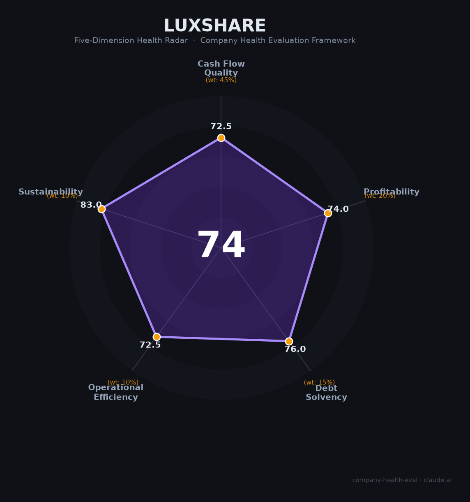

# 立讯精密（002475.SZ）财务健康评估（2026-08-13）

## 一句话结论

🟡 **中等偏上（74/100）** | "果链代工之王"向平台型智能制造商转型——营收净利双增（+23.6%/+24.2%）+汽车电子爆发（+185%）+AI数据中心高增长，但利润率薄+果链依赖+现金流-36%是核心隐忧

---

## 一、公司基本画像

| 项目 | 内容 |
|------|------|
| 主体 | 🔒 立讯精密工业股份有限公司，注册深圳，A股：002475.SZ（2010上市）；全球领先的精密制造与连接方案龙头 |
| 成立 | 🔒 2004年成立，王来春（创始/实际控制人）创立，从电脑连接器起家 |
| 股权 | 🔒 实际控制人王来春/王来胜合计持股约38%；香港中央结算等机构持股 |
| 规模 | 🔒 员工约20万+；全球超30个工厂；消费电子精密制造绝对龙头 |
| 主营 | 消费电子（连接器/声学/智能终端、代工）、汽车电子（高压连接/智驾域控/座舱）、通信及数据中心（高速互连/光模块/液冷） |
| 财务 | 🔒 2025营收3,323.44亿（+23.64%），归母净利166.00亿（+24.20%），扣非141.69亿（+21.16%）；EPS 2.29元 |
| 盈利 | 🔒 毛利率11.91%、净利率约5%；经营现金流净额173.25亿（-36.11%）；研发投入约120亿（+33.57%，占营收3.44%） |
| 业务 | 🔒 消费电子2,642.66亿（+13.37%）、汽车392.55亿（+185.34%）、通信数据中心245.68亿（+33.81%） |

> 一句话定性：立讯精密通过"并购+垂直整合"从连接器厂成长为全球消费电子制造龙头，深度绑定苹果（AirPods/iPhone代工），依靠汽车电子（收购莱尼）与AI数据中心（高速互连/光模块）锻造"第二、第三增长曲线"。作为雇主的吸引力在于"智能制造龙头+高增长+平台化"，但毛利薄/苹果依赖/扩产期现金消耗是结构性隐忧。

---

## 二、五维财务健康评估

### 1. 现金流质量（72/100）| 权重45%

| 指标 | 🔒 公开数据 | 评估 |
|------|-----------|------|
| 经营现金流净额 | 173.25亿（2025，-36.11%，扩产/全球化投入） | ⚠️ 关注：下降 |
| 现金及等价物 | 现金充裕，覆盖运营/资本开支 | ✅ 健康 |
| 有息负债 | 扩产+收购（莱尼/闻泰ODM）融资，有息负债可控 | ⚠️ 关注 |
| 净现比 | 173.25/166.10 ≈ 1.04，利润含金量尚可 | ✅ 健康 |

**小结**：现金流质量中上——净现比约1.04（盈利含金量可）、现金充裕，但经营现金流同比降36%（史上最密集全球化扩产+AI产能预研+研发投入），反映高增长期的资金蓄能，非经营恶化。需关注扩产节奏对现金流的影响。

> 🔒 数据来源：立讯精密2025年年报（搜狐/网易/证券之星/巨潮公告）

### 2. 盈利能力（74/100）| 权重20%

| 指标 | 🔒 公开数据 | 评估 |
|------|-----------|------|
| 毛利率 | 11.91%（较稳定，高于行业低点） | 👍 良好：制造中上 |
| 净利率 | 约5%（166亿/3323亿） | 👍 良好 |
| 营收增速 | +23.64%（2025） | ✅ 优秀：>20% |
| 研发费用率 | 占营收约3.44%（研发+33.57%） | ⚠️ 一般：制造属性 |
| 人均产出 | 3323亿/员工，制造业领先 | 👍 良好 |

**小结**：盈利能力中等偏上——毛利率11.91%（相对稳定，靠"铝代铜"、自建封测、28亿金融对冲对冲铜价/汇率），营收净利双增（+23.6%/+24.2%），研发投入+33.6%、研发人员+52%体现技术投入。净利率仅5%是代工属性所致。

### 3. 偿债能力（76/100）| 权重15%

| 指标 | 🔋 公开数据 | 评估 |
|------|-----------|------|
| 资产负债率 | 立讯负债率约60%+（扩张融资） | ⚠️ 关注 |
| 有息负债率 | 收购/扩产融资，有息负债占比中 | ⚠️ 关注 |
| 流动比率 | 现金+经营性回款，流动性良好 | ✅ 健康 |
| 现金比率 | 现金相对充足 | ✅ 健康 |
| 股权质押 | 王来春少量质押 | ✅ 健康 |

**小结**：偿债能力良性——资产负债率受扩产融资影响偏高，但流动比率、现金充足，作为上市公司 ML能力强，短期偿债无忧。靠经营现金流+融资支持扩产，整体稳健。

### 4. 运营效率（72/100）| 权重10%

| 指标 | 🔒 公开数据 | 评估 |
|------|-----------|------|
| 应收周转 | 客户账期正常，但消费电子回款期较长 | ⚠️ 关注：应收偏高 |
| 客户集中度 | 高度依赖苹果等全球头部客户 | ⚠️ 关注：大客户 |
| 员工规模趋势 | 研发人员+52.14%，扩产招聘旺 | ✅ 健康 |
| 高管稳定 | 王来春长期掌舵、管理层稳定 | ✅ 健康 |

**小结**：运营效率受"客户集中（苹果）+应收"拖累，消费电子高度依赖苹果订单；但研发人员+52%、扩产稳定，管理层连续，运营体系高效（黑灯工厂/数字化）。

### 5. 可持续发展（83/100）| 权重10%

| 指标 | 🔒 公开数据 | 评估 |
|------|-----------|------|
| 行业赛道 | AI算力+汽车电子+消费电子，多端成长 | ✅ 健康 |
| 技术壁垒 | 高速互连（224G/448G）、光模块（800G/1.6T）、SiP、汽车域控 | ✅ 健康 |
| 多元化 | 消费电子（80%）+汽车（11.8%）+数据中心，改善 | ✅ 健康 |
| 资本支持 | A股上市+市值大，资本强 | ✅ 健康 |
| 政策/监管 | 客户集中+中美科技摩擦 | ⚠️ 关注 |

**小结**：可持续性优秀——AI数据中心（高速互连/光模块小批量交付）+汽车电子（+185%）高速增长，正扭转对苹果过度依赖，技术壁垒强化，资本支持强。中美贸易与技术摩擦是外部变量。

---

## 三、综合评分与健康等级

| 维度 | 得分 | 权重 | 加权得分 |
|------|:----:|:----:|:--------:|
| 现金流质量 | 72.5 | 45% | 32.6 |
| 盈利能力 | 74.0 | 20% | 14.8 |
| 偿债能力 | 76.0 | 15% | 11.4 |
| 运营效率 | 72.5 | 10% | 7.2 |
| 可持续发展 | 83.0 | 10% | 8.3 |
| **综合得分** | **74/100** | **100%** | **74.4/100** |

**健康等级：🟡 中等偏上（Moderate-High）** — 整体稳健，局部有短板但可控。

---

## 四、同业对标

| 对比项 | 立讯精密 | 工业富联 | Foxconn(鸿海) | 歌尔股份 |
|--------|:-------:|:-------:|:-------:|:-------:|
| 2025营收 | 3,323.44亿 | 9,028.87亿 | ~万亿 | ~965亿 |
| 毛利率 | 11.91% | 6.98% | ~6% | ~10% |
| 净利率 | ~5% | 3.91% | ~3% | ~4% |
| 核心 | 苹果精密制造+汽车+AI | AI服务器代工 | 全球EMS | VR/声学 |

**对标结论**：立讯在毛利率/客户结构上优于工业富联（11.91%> 6.98%），汽车电子（+185%）与AI数据中心（高速互连）布局领先；规模较工业富联小（3323亿 vs 9028亿），但盈利能力（净利率5% vs 3.91%）更优。在EMS巨头中立讯转型"平台型智能制造商"更成功。

---

## 五、核心风险清单

1. **苹果依赖（高）**：消费电子（近80%营收）高度依赖苹果，若苹果缩减订单/份额，业绩冲击大。
2. **现金流/扩产（中）**：经营现金流-36%，全球扩产+AI投入期资金蓄能，若放缓回款承压。
3. **毛利率承压（中）**：净利率5%，铜价/芯片/汇率波动侵蚀利润，靠对冲维持。
4. **中美科技摩擦（中低）**：供应链与管制地缘风险。

---

## 六、求职/择业视角

### 核心优势
- **平台/技术**：全球消费电子制造龙头，苹果链标配，技术积累（高速互连、光模块、SiP、汽车域控）有背书；
- **成长/多元**：AI数据中心+汽车电子提供增长与转岗机会，研发人员+52%显示扩招；
- **薪酬**：立讯在制造/果链中薪酬靠前，且作为A股制造业龙头稳定。

### 现有短板
- **制造业属性**：部分研发/制造岗强度高、薪资弹性不如互联网/芯片；
- **苹果依赖**：业务高度绑定苹果，订单波动影响绩效与股价；
- **扩产期**：追求规模化，短期现金流压力/激励或受影响。

### 分场景建议

| 个人诉求 | 推荐 | 次选 | 规避 |
|----------|------|------|------|
| 智能制造成长 | **立讯**（汽车电子/AI部） | 工业富联 | 纯低端组装 |
| 技术+跳板 | 立讯（高速互连/光模块） | 大陆/博世（汽车） | 果链红海 |
| 稳定+规模 | 立讯（消费电子基本盘） | 京东方/比亚迪电子 | 小微代工 |

---

## 七、总结

**立讯精密是"全球消费电子制造龙头+平台型智能制造商转型"——营收3323亿（+23.6%）、净利166亿（+24.2%）、汽车+185%、AI数据中心高增，技术护城河深化。**

唯一短板是**苹果集中（近80%）+净利率薄（5%）+扩产期现金流下降**——对苹果依赖使周期波动大，制造业利润弹性有限。

在AI+汽车电子+消费电子多赛道增长、精密制造竞争加剧的大环境下，属于**中等偏上**风险等级，适合追求**全球制造平台+技术深度（AI/汽车/光互连）+稳定就业**、愿意跟随平台从代工向智能制造升级的求职者。

---

*评估方法：商泰汽车（iAUTO）五维企业健康度框架 · 数据截至2026年8月 · 🔒财务数据来源立讯精密2025年报（巨潮/搜狐/证券之星）· 同业对标为公开市场数据*