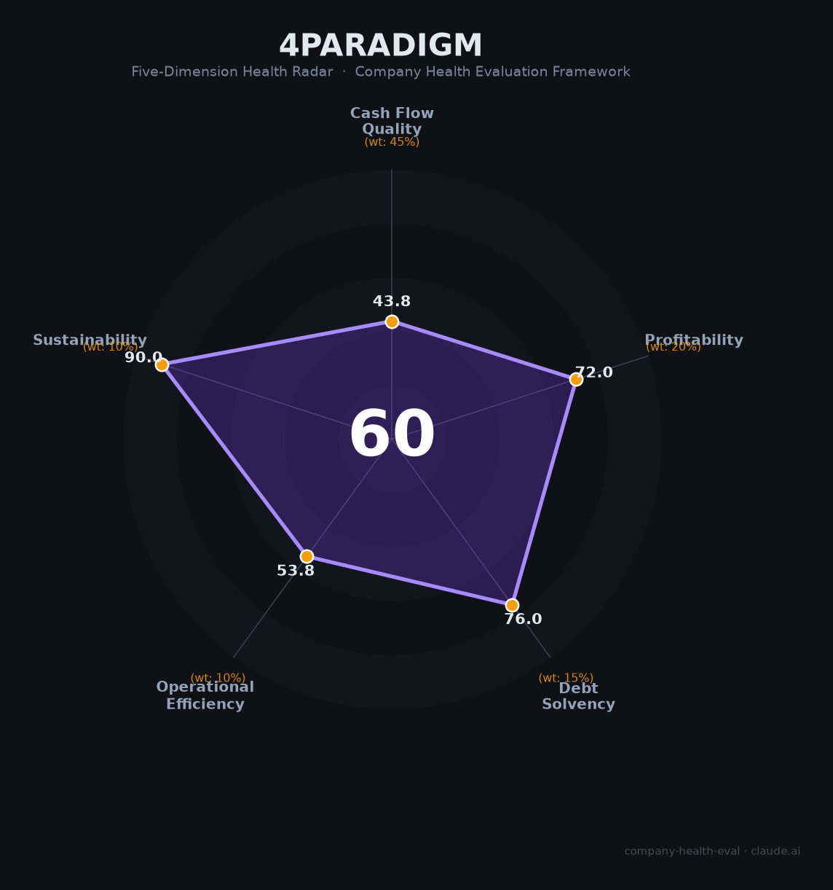

# 第四范式 财务健康评估（2026-06-12）

## 一句话结论

🟠 **中等（59.9/100）** | 人均创收中国AI第一（¥1,153万）+首次全年盈利+Agentic AI增速93%；唯OCF连续4年为负+毛利率持续下滑（48%→35%）是核心制约

---

## 一、公司基本画像

| 项目 | 内容 |
|------|------|
| **全称** | 范式智能技术集团（Phancy Group, 06682.HK，原第四范式） |
| **上市** | 2023年9月港交所主板（发行价55.6港元，募资8.36亿港元） |
| **创始人/CEO** | 戴文渊（1983年生，ACM世界冠军，前百度最年轻T10/华为诺亚方舟主任科学家） |
| **员工** | 619人（2025年末，从峰值1,801人大幅精简66%） |
| **主营业务** | 先知AI平台（91.8%营收）+ Agentic AI智能体（7.1%）+ API Token（1.1%） |
| **2025年营收** | 71.35亿元（+35.6%） |
| **2025年净利润** | 经调整归母净利润1,784万元（🔒上市以来首次全年盈利） |
| **市值** | ~160亿港元（2026年6月） |
| **核心产品** | 先知AI平台（集成150+大模型）+ Phanthy万神殿（AGI平台）+ Agentic AI智能体 |

第四范式是中国决策AI平台龙头——在私有化机器学习平台市场连续七年第一（份额30.4%），以619人极简团队创造71.35亿营收（人均1,153万，中国AI行业最高）。2025年实现上市以来首次全年盈利（经调整净利润1,784万），Agentic AI业务增速93%。

---

## 二、五维财务健康评估

### 1. 现金流质量（43.8/100）

OCF连续4年为负（-7.8→-10.0→-6.2→-6.8亿），主因大客户应收账款周期长（H1 2025应收19.67亿）。但趋势在改善——2024年起流出规模持续收窄。现金储备充裕（19.97亿+总流动性37.74亿），负债率仅19.3%（极低）。

### 2. 盈利能力（72.0/100）

毛利率34.8%持续下滑（从48%→47%→43%→35%），因硬件/云服务低毛利业务占比上升。但营收高增长（+36%）+人均产出中国AI第一（¥1,153万/人）+研发效率提升（费用率从53%降至33%）共同驱动首次盈利拐点。人均创收是腾讯的1.8倍。

### 3. 偿债能力（76.0/100）

负债率19.3%极低，现金37.74亿充裕，无有息负债压力。2025年两次配售融资进一步充实资本。

### 4. 运营效率（53.8/100）

应收周转偏慢（大客户账期长）、客户集中度偏高（金融/能源/运营商>60%）、员工大幅精简（-66%从1801→619）。但高管稳定（创始人领导11年）。

### 5. 可持续发展（90.0/100）

AI平台市场30%+增速、AutoML连续7年第一（壁垒深厚）、14+行业覆盖、已备案合规、港股上市融资通道畅通。

---

## 三、综合评分

| 维度 | 得分 | 权重 | 加权 |
|------|:----:|:----:|:----:|
| 现金流质量 | 43.8 | 45% | 19.7 |
| 盈利能力 | 72.0 | 20% | 14.4 |
| 偿债能力 | 76.0 | 15% | 11.4 |
| 运营效率 | 53.8 | 10% | 5.4 |
| 可持续发展 | 90.0 | 10% | 9.0 |
| **综合** | **59.9** | **100%** | **59.9/100** |

**🟠 中等** · 人均创收中国AI第一 · 首次全年盈利

---

## 四、核心风险

1. **OCF连续4年为负（高风险）**：大客户应收19.67亿，回款周期长。虽在改善，但现金流转正仍需时间
2. **毛利率持续下滑（中高风险）**：从48%→35%（三年降13pct），硬件/云服务占比上升是结构性趋势
3. **员工大幅精简（中风险）**：-66%减员虽提效但核心人才流失风险不可忽视
4. **利润极薄（中风险）**：首次盈利仅1,784万，80x PE需后续盈利大幅增长支撑

**适合**：看重人效极致+AI决策平台赛道+愿赌"刚盈利拐点"成长故事的求职者。

---

*评估日期：2026年6月12日 | 数据截至：2025年年报+2026Q1季报*
