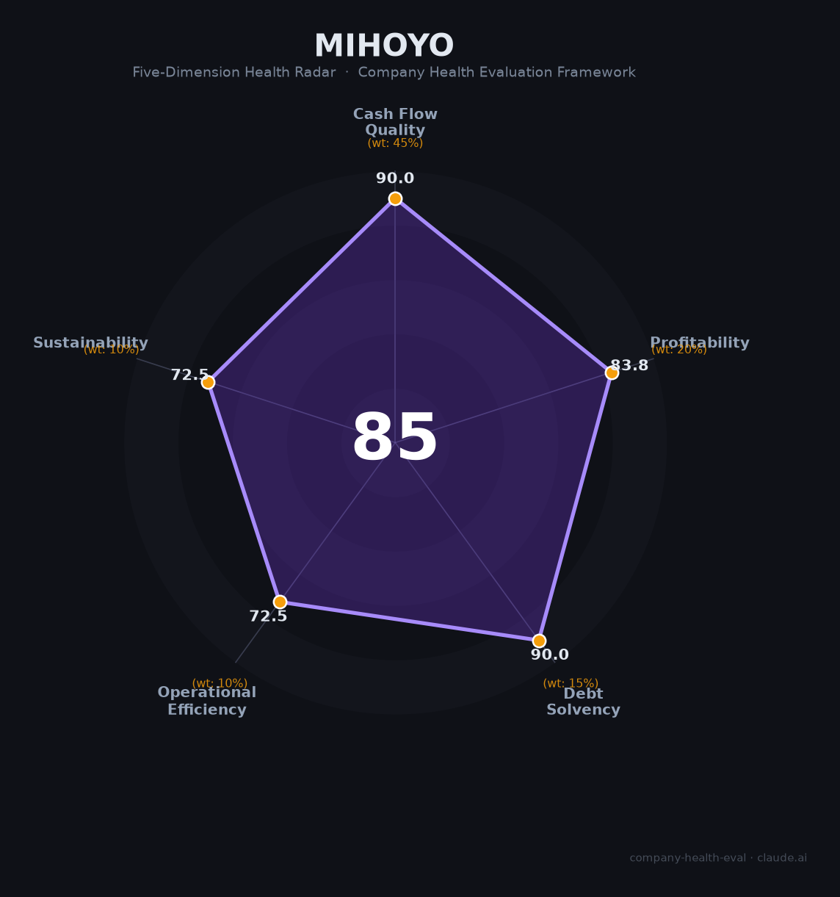

# 米哈游（miHoYo）财务健康评估（2026-06-12）

## 一句话结论

🟢 **优秀（85/100）** | 零负债+59%净利润率+人均创利行业第一，唯一悬念是千亿AI赌注能否兑现

## 一、公司基本画像

| 维度 | 内容 |
|------|------|
| **主体** | 上海米哈游网络科技股份有限公司（非上市） |
| **成立** | 2011年（上海交大宿舍起步），2012年正式注册 |
| **创始人** | 蔡浩宇（41%，第一大股东）、刘伟（22.6%，现任董事长）、罗宇皓（21.4%） |
| **融资** | 仅2012年天使轮¥100万（斯凯网络，持股15%），此后零外部融资 |
| **员工** | 全球约7,500-8,000人（国内社保~6,677 + 海外~800） |
| **估值** | ¥1,800-2,000亿（胡润2025-2026） |
| **核心产品** | 原神（2020.9）、崩坏：星穹铁道（2023.4）、绝区零（2024.7）、崩坏3（2016） |
| **2022年官方数据** | 营收¥273.4亿、净利润¥161.45亿、净利率59%、净资产¥374亿 |
| **2025年估算** | 营收约¥350-400亿（📊估算），净利润率约50%+ |
| **AI战略** | 2026年5月宣布三年最多投入¥1,000亿做AI；自研Glossa 13B大模型；Echo Agent平台 |
| **海外品牌** | HoYoverse（2022年成立，新加坡全球总部） |

米哈游是中国净利润率最高的大型游戏公司（2022年59%超腾讯/网易约2倍），也是唯一「零外部融资+零负债」做到全球前十的游戏厂商。创始人蔡浩宇2023年卸任董事长，刘伟接棒主导游戏主业，蔡本人转战AI（Anuttacon）。

## 二、五维财务健康评估

### 1. 现金流质量（90.0/100）

| 指标 | 现状 | 判定 |
|------|------|------|
| 经营现金流 | 游戏预付费模式，OCF天然充裕 | ✅ 健康 |
| 现金跑道 | 净资产¥600-800亿（估），覆盖多年运营 | ✅ 健康 |
| 有息负债 | **零**有息负债，无银行借款/无债券 | ✅ 健康 |
| 净现比 | 游戏预付费+无应收，OCF/NI≈1或更好 | ✅ 健康 |

**解读**：米哈游的现金流质量是教科书级别——零负债+预付费商业模式+无应收账款+PC端约50%流水零渠道抽成。2022年末官方净资产¥374亿，按2023-2025年利润积累推算，当前净资产应在¥600-800亿区间，现金类资产超¥400亿。唯一的「问题」是现金太多没地方花——这也是千亿AI投入宣言的背景。

### 2. 盈利能力（83.8/100）

| 指标 | 2022年（官方） | 2023-2025年（估） | 判定 |
|------|:----------:|:----------:|------|
| 毛利率 | ~85-90%（推算） | ~85-90% | 🏆 优秀（行业75分位+） |
| 净利率 | 59.0% | ~50-55% | 🏆 优秀（>15%） |
| 营收增速（3Y CAGR） | — | 273→~350，CAGR~8.6% | ⚠️ 一般（0-10%，但峰值后恢复中） |
| 研发费用率 | 未披露 | 含AI投入估~20-25% | 🏆 优秀（10-25%黄金区间） |
| 人均产出 | ¥547万/人 | ¥600-900万/人 | 🏆 优秀（行业3-5倍） |

**解读**：59%的净利润率（2022年官方）放在任何行业都是顶级——腾讯游戏约30%、网易游戏约30%、茅台约52%。核心原因是PC端约50%流水零渠道抽成+品牌IP驱动自然增长（非买量型厂商）+自研自发无IP授权费。2023年星铁上线后营收见顶（全球流水近¥500亿），2024年原神/星铁双双下滑致收入降约23%，2025年Q3起逐季回暖。营收3年CAGR仅~8.6%，扣分项在于「峰值后回落」而非持续高增长。

### 3. 偿债能力（90.0/100）

| 指标 | 数值 | 判定 |
|------|------|------|
| 资产负债率 | 接近0% | ✅ 健康（<<40%） |
| 有息负债率 | 0% | ✅ 健康 |
| 流动比率 | 极高 | ✅ 健康（>2） |
| 现金比率 | 极高 | ✅ 健康（>1） |
| 股权质押 | 无 | ✅ 健康 |

**解读**：米哈游是中国互联网公司中最干净的资产负债表——不欠银行一分钱，没有任何外部融资稀释，三位创始人合计持股85%。这是「财务保守主义」的极致体现，也是支撑千亿AI赌注的底气来源。

### 4. 运营效率（72.5/100）

| 指标 | 现状 | 判定 |
|------|------|------|
| 产品集中度 | Top 2（星铁+原神）占移动端81%+ | ⚠️ 关注（高位） |
| 员工规模趋势 | 5,200→6,196→6,677，持续增长 | ✅ 健康 |
| 高管稳定性 | 蔡浩宇2023.9卸任，刘伟接棒，「分家」已公开化 | ⚠️ 关注 |

**解读**：米哈游已构建三产品矩阵（原神/星铁/绝区零），相比多数仅靠单一产品的游戏公司已有显著改善。但星铁+原神仍占收入81%+，老游戏自然下滑不可逆（原神移动端从2022年$15.6亿→2024年$5.14亿，两年跌67%）。蔡浩宇卸任后创立Anuttacon（~50人AGI团队），刘伟公开承认「分手」，虽然运营平稳过渡但核心创始人精力已不在主业。

### 5. 可持续发展（72.5/100）

| 指标 | 现状 | 判定 |
|------|------|------|
| 行业赛道 | 全球游戏+7.5%，二次元手游-3.64%（连续两年下滑） | ⚠️ 关注（5-15%） |
| 技术壁垒 | 开放世界GaaS全平台管线，3年+难以复制 | ✅ 健康 |
| 业务多元化 | 全球数亿玩家，多平台多区域 | ✅ 健康 |
| 资本支持 | ¥400亿+现金自给自足 + MiniMax浮盈¥240-260亿 | ✅ 健康 |
| 政策/监管 | FTC$2000万罚单+全球抽卡监管趋严+数据跨境合规 | ⚠️ 关注 |

**解读**：二次元手游赛道本身在萎缩（2025年中国市场-3.64%），但米哈游的全球化布局（约60%收入来自海外）和多平台策略提供了缓冲。Glossa大模型+Echo Agent平台+帕姆帮帮AI NPC构成了AI+游戏的先发优势。最大不确定性是千亿AI赌注——三年年均¥333亿投入接近当前全年净利润，若AI不能反哺游戏主业或开辟新增长点，这将是人类游戏史上最昂贵的一场「烟花」。

## 三、综合评分与健康等级

| 维度 | 得分 | 权重 | 加权得分 |
|------|:----:|:----:|:--------:|
| 现金流质量 | 90.0 | 45% | 40.5 |
| 盈利能力 | 83.8 | 20% | 16.8 |
| 偿债能力 | 90.0 | 15% | 13.5 |
| 运营效率 | 72.5 | 10% | 7.2 |
| 可持续发展 | 72.5 | 10% | 7.2 |
| **综合得分** | | | **85.3** |
| **健康等级** | | | **🟢 优秀** |

## 四、同业对标

| 对比项 | 米哈游 | 腾讯游戏 | 网易游戏 |
|--------|:------:|:------:|:------:|
| 上市/融资 | 非上市，零外部融资 | 港股上市 | 港股上市 |
| 2025年游戏收入 | ~¥350-400亿（估） | ¥2,416亿 | ¥921亿 |
| 净利率 | ~50%+ | ~30% | ~30% |
| 员工规模 | ~7,500-8,000 | ~11.5万（集团） | ~3万（集团） |
| 人均创利 | ¥300-500万 | ~¥200万 | ~¥110万 |
| 负债率 | ~0% | 有息负债可控 | 有息负债可控 |
| 核心差异 | 纯自研自发+全球化 | 社交+游戏帝国+投资生态 | 自研+代理双轮驱动 |

**对标结论**：米哈游在人均效率和利润率上碾压腾讯/网易（约为2-3倍），但在收入规模上仅为腾讯游戏的1/7、网易游戏的1/2.5。其「小而精」模式在当前阶段极为成功，但千亿AI投入后能否维持高利润率是核心考验。

## 五、核心风险清单

1. **产品生命周期风险（高）**：原神移动端收入两年跌67%（$15.6亿→$5.14亿），星铁也已进入下滑通道。绝区零首年不及预期。若2026-2027年无新爆款接棒，收入可能继续承压。
2. **千亿AI赌注（高）**：三年¥1,000亿投入相当于把过去所有利润押上。基础大模型成功率极低，微软/谷歌年投入百亿美元级别。若失败，「烟花」将烧掉十年积累。
3. **抽卡商业模式监管（中高）**：FTC$2,000万罚单是全球监管风向标。比利时已禁抽卡，荷兰/澳大利亚跟进中。若主要市场（美/欧/日）收紧抽卡监管，商业模式根基将被动摇。
4. **创始人分家（中）**：蔡浩宇卸任+创立Anuttacon，刘伟公开承认「分手」。虽然运营尚稳，但核心创始人精力分散+战略方向可能存在分歧。
5. **赛道天花板（中）**：二次元手游市场连续两年萎缩（2024年-7.6%、2025年-3.64%），而开放世界赛道竞品大量涌入（鹰角终末地、完美异环、网易无限大）。
6. **加班文化+人才风险（中）**：11-11-6常态+2024年员工猝死事件+25%离职率→长期人才吸引力存疑。

## 六、求职/择业视角

### 核心优势
- **薪酬顶级**：校招硕士32-48万/年，SP 56万+，算法岗可达92.8万。年终奖核心项目8-12个月。六险二金+免费三餐。
- **技术壁垒强**：开放世界GaaS+全平台管线+AI Agent落地，经验在游戏行业有极高迁移价值
- **上海徐汇**：候选人在上海，通勤便利（浦东→徐汇约30-40分钟）
- **财务安全垫极厚**：零负债+¥400亿+现金→公司存活概率极高

### 现存短板
- **加班极为严重**：脉脉「加班重灾区」常年上榜，核心项目11-11-6是常态，2024年有员工猝死事件
- **晋升困难**：取消普调，非嫡系入职即巅峰
- **无上市/股权激励**：85%股权在三位创始人手中，员工持股极难实现
- **试用期淘汰率~25%**：「每4个离职就有1个被开除」

### 分场景建议

| 个人诉求 | 推荐程度 | 理由 |
|----------|:--------:|------|
| 稳定+深耕 | 🟠 可考虑 | 财务极稳但加班文化残酷，适合年轻人攒钱 |
| 高薪+跳板 | 🟢 强烈推荐 | 薪资行业天花板+米哈游品牌在游戏圈顶流 |
| 成长+AI赛道 | 🟡 推荐 | AI Agent+游戏交叉是独特经验，Glossa/Echo直接接触 |
| WLB/多元 | ⚫ 不推荐 | 加班重灾区，不适合追求工作生活平衡 |

## 七、总结

米哈游是中国游戏行业「财务最健康、人效最高、护城河最深」的公司：零负债+¥400亿+现金+59%净利润率创造了中国互联网罕见的财务安全垫，人均创利¥300-500万是A股任何游戏公司的3-10倍。唯一不确定性是千亿AI赌注——用游戏主业十年利润去搏AGI，要么成为「游戏界的OpenAI」，要么成为「人类游戏史上最贵的烟花」。

在当前「游戏主业增长趋缓+AI战略all in」的双重背景下，米哈游属于🟢 **优秀**，适合**能承受高强度加班、看好游戏+AI交叉赛道、追求顶级薪酬**的求职者作为优先选择——只要你身体扛得住。

---

*评估日期：2026-06-12 | 数据截至：2022年官方财务数据（光明日报）+ 2023-2025年第三方估算（Sensor Tower/AppMagic/Niko Partners）*
