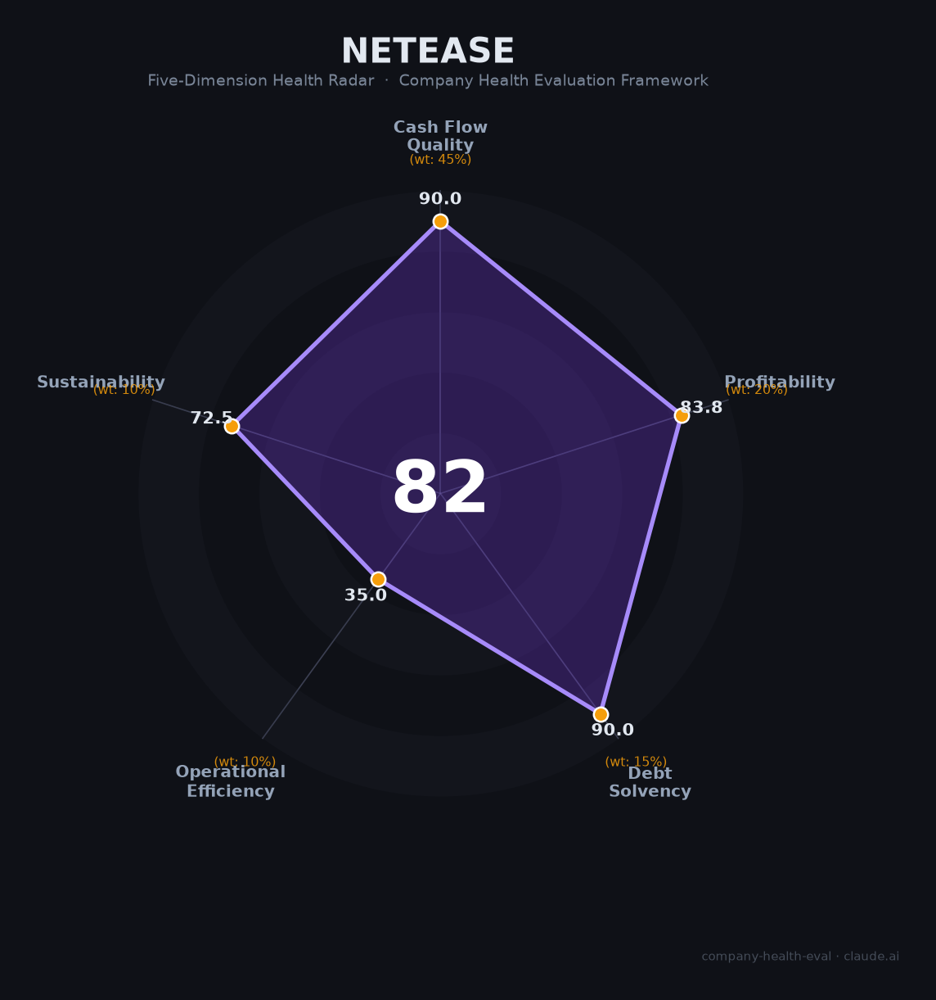

# 网易（9999.HK / NTES）财务健康评估（2026-06-12）

## 一句话结论

🟡 **中等偏上（82/100）** | 净现金¥1,559亿+游戏毛利率70%+伏羲AI Lab行业开创者，核心隐忧：梦幻西游占游戏毛利75%+新品断层+核心制作人批量出走

## 一、公司基本画像

| 维度 | 内容 |
|------|------|
| **上市** | 2000年NASDAQ（NTES），2020年港交所二次上市（09999.HK），2027年将转为双重主要上市 |
| **成立** | 1997年广州，丁磊创立。丁磊持股45.5%（中国科技巨头中最高创始人持股） |
| **员工** | ~25,400人（2025），从2021峰值32,064缩减约20% |
| **核心业务** | 游戏81.8%（¥921亿）、云音乐6.9%（¥78亿）、有道5.2%（¥59亿）、创新6.0%（¥68亿） |
| **2025营收** | ¥1,126亿（+7%），净利润¥338亿（+13.8%），OCF ¥507亿 |
| **财务特征** | 毛利率64.3%（游戏69.7%），净利率30.0%，资产负债率25.4%，净现金¥1,559亿 |
| **AI布局** | 伏羲AI Lab（2017），AOP智能体编程+MoA多智能体+逆水寒400+AI NPC，国内首个游戏角色仿生机器人 |

## 二、五维评估

### 1. 现金流质量（90.0/100）
OCF ¥353→397→507亿，净现比1.50。净现金¥1,559亿（中国互联网前3）→ 全部健康

### 2. 盈利能力（83.8/100）
毛利率64.3%（游戏69.7%，行业顶级）+ 净利率30.0% → 优秀。营收3Y CAGR仅5.3% → 一般。研发¥177亿/15.7%费率 → 优秀

### 3. 偿债能力（90.0/100）
资产负债率25.4%，有息负债仅¥67亿→ 全部健康

### 4. 运营效率（35.0/100）
梦幻西游占游戏毛利~75%（23年老IP）→ 危险。员工3年减13% → 关注。核心制作人批量出走（丁迎峰退休+10+高管离职）→ 关注

### 5. 可持续发展（72.5/100）
游戏市场增速7.7% → 关注。伏羲AI Lab+MMO壁垒 → 健康。82%收入靠游戏 → 关注。¥1,559亿净现金+双重上市 → 健康

## 三、评分

| 维度 | 得分 | 权重 |
|------|:----:|:----:|
| 现金流质量 | 90.0 | 45% |
| 盈利能力 | 83.8 | 20% |
| 偿债能力 | 90.0 | 15% |
| 运营效率 | 35.0 | 10% |
| 可持续发展 | 72.5 | 10% |
| **综合** | **81.5** 🟡 | |

## 四、核心风险

1. **梦幻西游依赖症（极高）**：贡献游戏毛利~75%，23年老IP一旦自然衰退将产生断崖式冲击
2. **新品断层（极高）**：2026Q1零新游发布，2027年前无重磅新品确定性预期
3. **核心制作人批量出走（高）**：丁迎峰退休+金韬/李凯明离职+贪腐案清洗，2024-2026流失10+高管

## 五、求职视角

- **优势**：游戏行业黄埔军校，AI NPC方向经验稀缺，伏羲Lab技术积累深，杭州/广州双总部
- **短板**：项目决定待遇（爆款40月年终vs普通2-4月），游戏核心部门高强度，"试用期后可能被裁"
- **建议**：适合有经验者深耕MMO/AI游戏方向，应届生需慎重选择部门和项目

*评估日期：2026-06-12 | 数据来源：网易2025年报（2026.2.11发布）*
