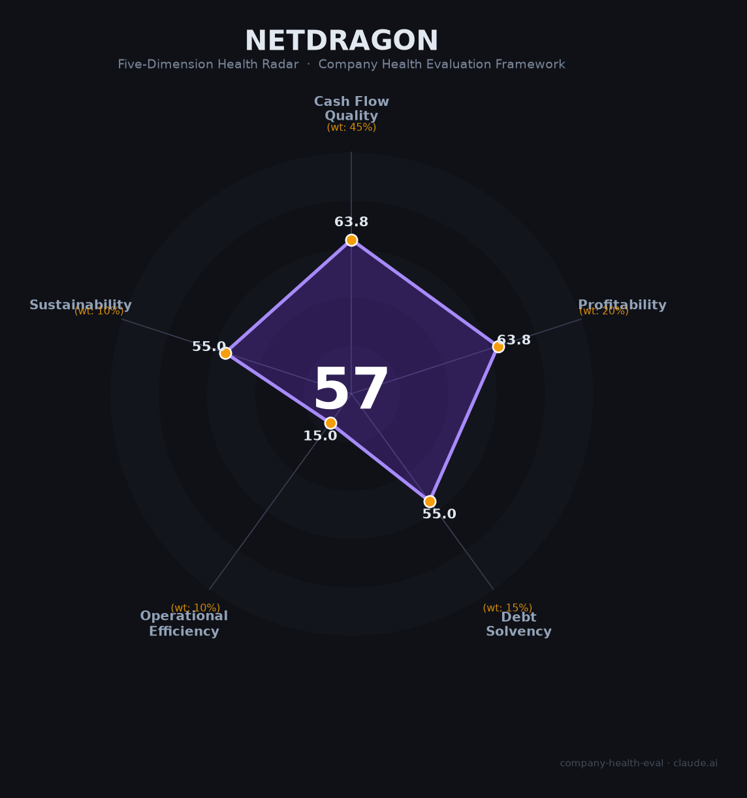

# 网龙（0777.HK）财务健康评估（2026-06-12）

## 一句话结论

🟠 **中等（57/100）** | 200+AI员工战略先行者+毛利率70%+年股息率10%，致命伤：营收3年CAGR -17%+魔域IP占87%+现金跌破借款线

## 一、公司基本画像

| 维度 | 内容 |
|------|------|
| **上市** | 港交所0777.HK（2007年），福州总部 |
| **创始人** | 刘德建（1999年，¥70万起家），核心管理层长期稳定 |
| **员工** | ~3,408人（2025，同比-26%），2024年底P8以下大规模裁员 |
| **核心业务** | 游戏73%（魔域IP占87%）、教育Mynd.ai 27%（Promethean互动平板） |
| **2025营收** | ¥44.75亿（-26%），净利润¥1.51亿（-51%） |
| **财务特征** | 毛利率70.3%（+5pp，AI降本）、OCF ¥3.78亿（-64%）、现金¥15.45亿<借款¥23.56亿 |
| **AI布局** | "马上AI"战略，200+ AI员工(Agent)，AI占游戏工作量25%，数字人CEO唐钰，火山引擎合作 |

网龙是中国最激进的"AI替代人力"实验场——2024年底裁撤1,530人，UI设计师几乎全军覆没。毛利率从62%→70%验证了AI降本，但营收3年跌37%、净利3年跌73%，现金首次跌破借款线。

## 二、五维评估

### 1. 现金流质量（64/100）
OCF ¥11.2→10.5→3.8亿（骤降64%），现金¥15.5亿<借款¥23.6亿（首现净债务）→ 关注

### 2. 盈利能力（64/100）
毛利率70.3%（AI降本显著）→ 优秀。但净利率仅3.4% → 一般。营收3年CAGR -17% → 预警

### 3. 偿债能力（55/100）
资产负债率45.8%（攀升），借款/权益44%，净债务¥-8.1亿 → 全部关注

### 4. 运营效率（15/100）
魔域IP占游戏收入87%（20年老游戏）→ 危险。员工-26%（AI替代大规模裁员）→ 危险

### 5. 可持续发展（55/100）
AI员工矩阵独特+火山引擎/豆包生态 → 关注。海外教育持续巨亏（¥4.4亿）+Edmodo FTC禁令+Rokid偷拍门 → 关注

## 三、评分

| 维度 | 得分 |
|------|:----:|
| 现金流 | 63.8 |
| 盈利 | 63.8 |
| 偿债 | 55.0 |
| 运营 | 15.0 |
| 可持续 | 55.0 |
| **综合** | **56.7** 🟠 |

## 四、核心风险

1. **魔域单一IP依赖（极高）**：占游戏87%，运营20年，新游连年失败
2. **AI转型阵痛（高）**：裁员+营收暴跌+现金吃紧，处于"收入下降、现金吃紧、投资扩张"尴尬期
3. **教育业务持续失血（高）**：Mynd.ai亏¥4.4亿+Edmodo FTC永久禁令

## 五、求职视角

- **优势**：AI员工战略全球最激进先行者，福州福利顶级(公积金12%+弹性工作)
- **短板**：营收利润双降，P8以下被裁风险，人才流失率20-25%
- **建议**：仅适合对AI Agent替代人力实验感兴趣者

*评估日期：2026-06-12 | 数据来源：网龙2025年报（2026.3.26披露）*
