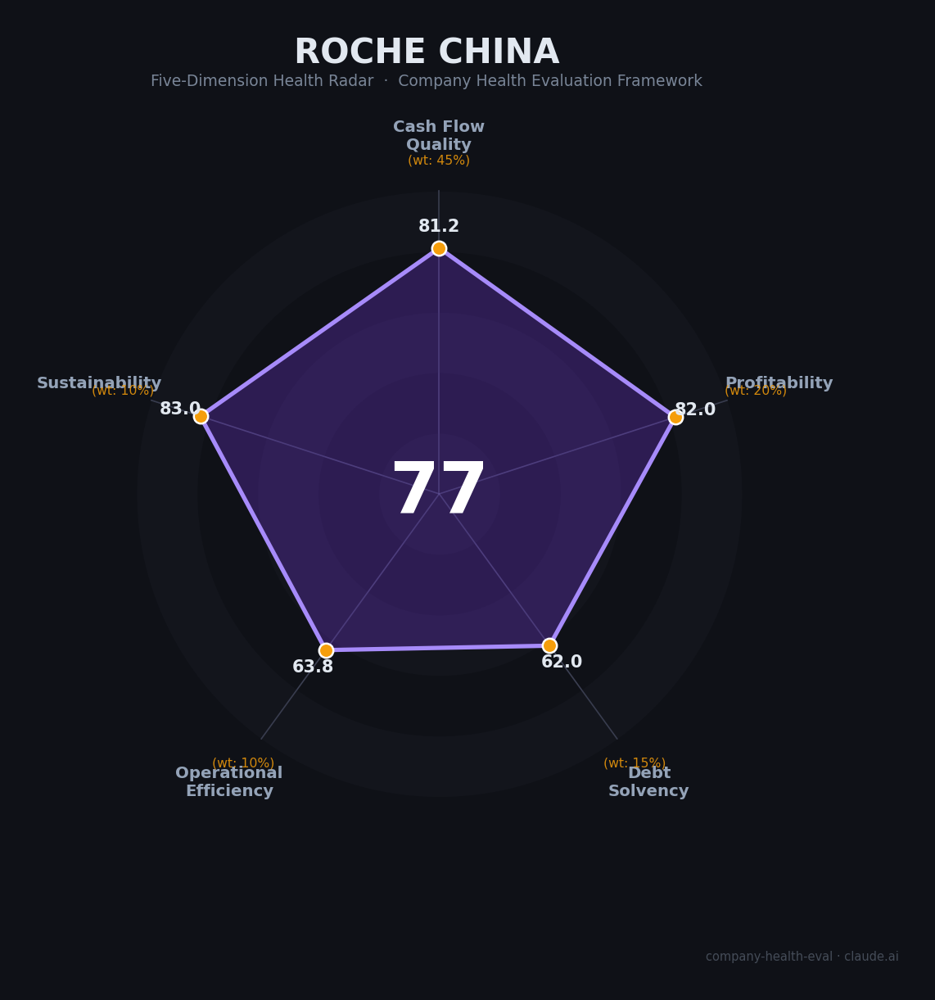

# 罗氏制药（中国）（Roche China）财务健康评估（2026-08-11）

## 一句话结论

🟡 **中等偏上（77/100）** | 全球现金流最强的制药巨头在华持续加码——高薪稳定平台，但中国区诊断业务承压、生物药集采+医保谈判是核心风险点

---

## 一、公司基本画像

| 项目 | 内容 |
|------|------|
| 主体 | 🔒 罗氏（Roche），瑞士上市公司（ROG.SIX），中国区主体为上海罗氏制药有限公司（1994年成立）与罗氏诊断产品（上海）有限公司（2000年） |
| 成立 | 🔒 罗氏1926年起涉足中国市场，1994年上海罗氏制药正式成立，首家入驻张江跨国药企；2024年在华30周年 |
| 股权 | 🔒 外商全资，瑞士总部控股100%；无股权质押 |
| 规模 | 🔒 中国区员工5,000+（官方口径，制药+约2,500诊断，合计约6,000-7,000预估）；全球员工103,000+ |
| 主营 | 🔒 在华三大板块：制药（肿瘤之王）、诊断（IVD市场领导者）、创新中心体系（CICoR 250研究员+加速器+GDD全球药品开发中心300+人） |
| 药物 | 🔒 在华28款产品/8个治疗领域，19款进入国家医保；肿瘤重磅：赫赛汀/帕捷特/美罗华/安维汀/泰圣奇等 |
| 出海/合作 | 🔒 2022-2025与济民可信、宜联生物、信达生物等达成近10项全球独家许可（License-out模式） |
| 数据口径 | ⚠️ 罗氏未上市、中国区财务不单独披露，本报告财务侧以罗氏集团2025财年报为基础，中国区用分部明细+估算 |

> 一句话定性：罗氏中国是「外资药企在中国的顶级平台」——全球现金流堡垒（集团营收CHF 615亿、净利CHF 138亿、研发率22%）庇护，在华持续加码投资（2025年20.4亿张江生物药基地、研发中心8.63亿、加速器近3亿），薪酬和稳定性在医药外企中居前。但中国区正面临生胶原药集采、医保谈判与外资企业研发撤退潮的夹击。

---

## 二、五维财务健康评估

### 1. 现金流质量（81/100）| 权重45%

| 指标 | 🔒 公开数据 | 评估 |
|------|-----------|------|
| 经营现金流净额 | 2025集团OCF CHF 188.5亿（2024年CHF 200.9亿），持续强劲为正 | ✅ 健康：大药企顶级现金机器 |
| 现金及等价物 | 2025末现金CHF 55.8亿+市场证券CHF 98.9亿| ✅ 健康：合计约CHF 155亿 |
| 有息负债 | 集团有息负债CHF 316亿（长期274+短期42），净债务CHF 162亿 | ⚠️ 关注：有息负债规模较大 |
| 净现比 | OCF 188.5/归母净利128.8≈1.46 | ✅ 健康：利润含金量高 |

**小结**：现金流维度接近满分——全球制药业最强的现金创造者之一，经营现金流长期大于净利润（净现比1.46），研发投入CHF 122-133亿仍能从经营中造血。偿债压力为集团并购积累的有息负债所致，但维持S&P AA/穆迪Aa2评级，风险总体可控。中国区作为集团第二大市场，共享集团现金流安全垫。

### 2. 盈利能力（82/100）| 权重20%

| 指标 | 🔒 公开数据 | 评估 |
|------|-----------|------|
| 毛利率 | 集团72.9%（制药分部80.9%，诊断45.4%） | ✅ 优秀：制药毛利率>80% |
| 净利率 | 2025净利率~21-23%（IFRS净利CHF 137.99亿/营收615亿） | ✅ 良好：>15%区间 |
| 营收增速 | 集团+7%（CER，2025），连续5年增长 | ✅ 良好：10-20%附近 |
| 研发费用率 | 研发投入/营收≈22%（IFRS） | ✅ 良好：10-25%理想区间 |
| 人均产出 | 集团约CHF 60万/人 | ✅ 优秀：制药界顶级 |

**小结**：盈利能力优秀——集团毛利率73%、净利率超20%、研发投入全球第二，靠Ocrevus/Vabysmo/Phesgo等新一代药物持续放量对冲专利悬崖。中国区制药收入2025年+10%（CER），是少数在华增长的外资药企之一。

### 3. 偿债能力（62/100）| 权重15%

| 指标 | 🔒 公开数据 | 评估 |
|------|-----------|------|
| 资产负债率 | 62.4%（2025末） | ⚠️ 关注：中等偏上 |
| 有息负债/权益 | 有息负债CHF 316亿 / 权益CHF 379亿 ≈0.84x | ⚠️ 关注：偏高 |
| 流动比率 | 138%（官方口径） | ⚠️ 关注：1-2区间 |
| 净债务 | CHF 162亿 | ⚠️ 关注：可控但存在 |
| 信用评级 | S&P AA / Moody's Aa2 / Fitch AA | ✅ 健康：投资级最高档 |

**小结**：偿债能力中等——集团负债率62%、净债务CHF 162亿，在大药企中属常见水平，AAA类信用评级使融资成本低。中国区法人主体为全外资、无股权质押，偿债安全性高，但受集团整体杠杆拖累该维度得分。

### 4. 运营效率（63/100）| 权重10%

| 指标 | 🔒 公开数据 | 评估 |
|------|-----------|------|
| 应收周转 | 医药/医院客户回款周期长；中国区应收受医保支付节奏影响 | ⚠️ 关注 |
| 客户集中度 | 全球医院/医保/患者高度分散 | ✅ 健康 |
| 员工规模趋势 | 中国区5,000+员工（制药）呈扩张态势（新基地投建、创新中心扩编） | ⚠️ 关注：2026-07裁员103人报道 |
| 高管稳定性 | 集团CEO稳定；2026年中国区当地新老副总裁更替报道 | ⚠️ 关注：近期人员变动 |

**小结**：运营效率中等偏上——客户高度分散、员工规模扩张是加分项；但医药行业应收账期普遍偏长，且2026年7月有中国区「裁员103人/多位副总裁离任」的媒体报道（未证实影响范围），拉低了员工与高管稳定性评分。

### 5. 可持续发展（83/100）| 权重10%

| 指标 | 🔒 公开数据 | 评估 |
|------|-----------|------|
| 行业赛道规模 | 全球肿瘤/创新药CAGR超10%，中国创新药+出海持续高景气 | ✅ 健康：大赛道 |
| 技术壁垒 | 大分子单抗/CAR-T/基因治疗全球领导者，研发强度22% | ✅ 健康：壁垒极高 |
| 客户/业务多元化 | 制药+诊断双板块，治疗领域8大，全球化布局 | ✅ 健康 |
| 资金支持 | 集团利润丰厚、现金充裕，中国区2025新投资20.4亿 | ✅ 健康 |
| 政策环境 | 集采+医保谈判降价，2026生物药集采第二轮冲击原研 | ⚠️ 关注：罗氏曲妥契贝伐直接暴露 |

**小结**：可持续发展能力较强——罗氏是罕见在「研发+诊断+商业化」三线都全球布局的巨头，中国区20.4亿元新基地、研发中心升级、多项本土license-in交易都表明战略级投入。主要风险是生物药集采扩大化对原研大单品的侵蚀（中国区医药份额或受影响）。

---

## 三、综合评分与健康等级

| 维度 | 得分 | 权重 | 加权得分 |
|------|:----:|:----:|:--------:|
| 现金流质量 | 81.2 | 45% | 36.5 |
| 盈利能力 | 82.0 | 20% | 16.4 |
| 偿债能力 | 62.0 | 15% | 9.3 |
| 运营效率 | 63.8 | 10% | 6.4 |
| 可持续发展 | 83.0 | 10% | 8.3 |
| **综合得分** | **77/100** | **100%** | **76.9/100** |

**健康等级：🟡 中等偏上（Moderate-High）** — 稳健型，局部有短板但整体可控。

---

## 四、同业对标

| 对比项 | 罗氏（中国） | 信达生物 | 恒瑞医药 | 阿斯利康（中国） |
|--------|------------|----------|----------|-----------------|
| 上市/估值 | 瑞士上市，全球市值约2,000亿+CHF | 港股上市，市值约1,200亿港元 | A+H上市，市值约3,600亿人民币 | 全球上市，中国第2大外资药企 |
| 2025营收 | 集团CHF615亿（中国约48亿CHF） | 130亿人民币 | 316亿人民币 | 中国约$60亿美元级 |
| 毛利率 | 72.9% | ~80% | 86.1% | ~75% |
| 净利率 | ~22% | ~10% | 24.4% | ~15% |
| 员工（中国） | 5,000-6,000 | 7,502 | 20,602 | 约16,000 |
| 核心差异 | 全球现金最强、创新药研发顶级；在华产品线老化 | 创新药+BD出海双轮 | 中国本土创新绝对龙头 | 肺癌全球第一 |

**对标结论**：罗氏中国在「薪酬与品牌」上具有外企顶级优势，但以中国区视角看，营收规模已被阿斯利康反超、创新药定义被国内强集采冲击。作为雇主，其最大卖点是「全球最稳制药平台的稳定与高薪」。

---

## 五、核心风险清单

1. **生物药集采侵蚀原研（中高）**：2026年生物药集采第二轮扩大至曲妥珠单抗/贝伐珠等罗氏大单品，中国原研用量价承压，可能压缩中国制药收入（2025年+10%增速面临下行风险）。
2. **医保谈判降价（中）**：肿瘤新药2025-2026国家谈判持续以量换价，续约品种降价压力大；Phesgo等新进目录利好对冲部分损失。
3. **诊断业务承压（中）**：中国区2025诊断收入-24%（医疗价格整治），拖累中国区整体营收-11%；诊断毛利率下滑至45%。
4. **外资在华政策趋紧（中）**：医药反腐合规压力、审批政策调整，外资药企整体在华份额受本土创新药挤压。
5. **人员/组织调整（中低）**：2026-07中国区裁员103人及多位副总裁离任报道（影响范围待证实），显示集团控制成本下的结构性调整。

---

## 六、求职/择业视角

### 核心优势
- **平台与品牌**：全球药企顶级品牌，中国5,000+员工，各岗位（研发/医学/销售/诊断）体系成熟，跳板价值极高；
- **薪酬竞争力**（📊）：职友集数据罗氏中国平均月薪高于上海医疗器械/制药中位约15%；研发岗（硕博）约¥20-50K/月，年终奖+专项奖金丰厚，MNC中头部薪资；
- **稳定性**：集团康亥财务表现+在华加码投资（张江20.4亿基地、CICoR），无大的裁员公告（虽2026年Q2有局部裁减报道）。

### 现存短板
- **薪酬-稳定性 vs 本土高增长**：绝对薪资略低于互联网/金融，但高于大部分药企；晋升通道官僚化、层级较多；
- **中国区业务波动**：诊断部门近年受政策冲击，肿瘤药原研遭遇集采，部分业务团队存在不确定性；
- **人员调整**：2026年裁员报道（103人）与高管离任，需在面试中核实团队稳定性。

### 分场景建议

| 个人诉求 | 推荐 | 次选 | 规避 |
|----------|------|------|------|
| 稳定+深耕 | **罗氏制药** | 恒瑞医药 | 面临重组的仿制小药企 |
| 高薪+跳板 | 百济神州/恒瑞 | 罗氏/信达 | 母公司高杠杆的药企 |
| 成长+融资红利 | 创新药biotech（出海） | 罗氏/恒瑞创新药板块 | 仿制药平台 |
| 多元+跨领域 | **罗氏（制药+诊断双板块）** | 阿斯利康 | 单一仿药 |

---

## 七、总结

**罗氏制药（中国）是外资药企在中国「现金流最稳、薪资最高、平台最全」的顶级雇主：**

背靠全球营收CHF 615亿、净利率22%、研发投入全球最高档的罗氏集团，在华拥有完整的制药+诊断+研发中心体系，薪酬福利上海外企梯队前列，中国区近两年持续加码投资（20.4亿基地等），是追求稳定+国际化职业发展的首选外资医药平台。

唯一明显短板是中国区正面临生物药集采、医保谈判与本土创新药三重价格挤压，诊断业务在2025年已出现-24%的收缩，人员和业务存在结构性调整的可能。

在医药行业分化、外资在华份额持续下降、中国生物药市场本土替代加速的大环境下，属于**中等偏上**风险等级，适合追求**高薪酬+稳定+国际化平台、勇于在外资体系深耕深耕的求职者**，不适合追求中国式高增长股权回报或想要快速晋升的激进型候选。

---

*评估方法：商泰汽车（iAUTO）五维企业健康度框架 · 数据截至2026年8月 · 🔒公开财报（罗氏集团2025财年报） · 中国区数据为官分披露+估算，未公开部分已标注📊估算/⚠️未证实*