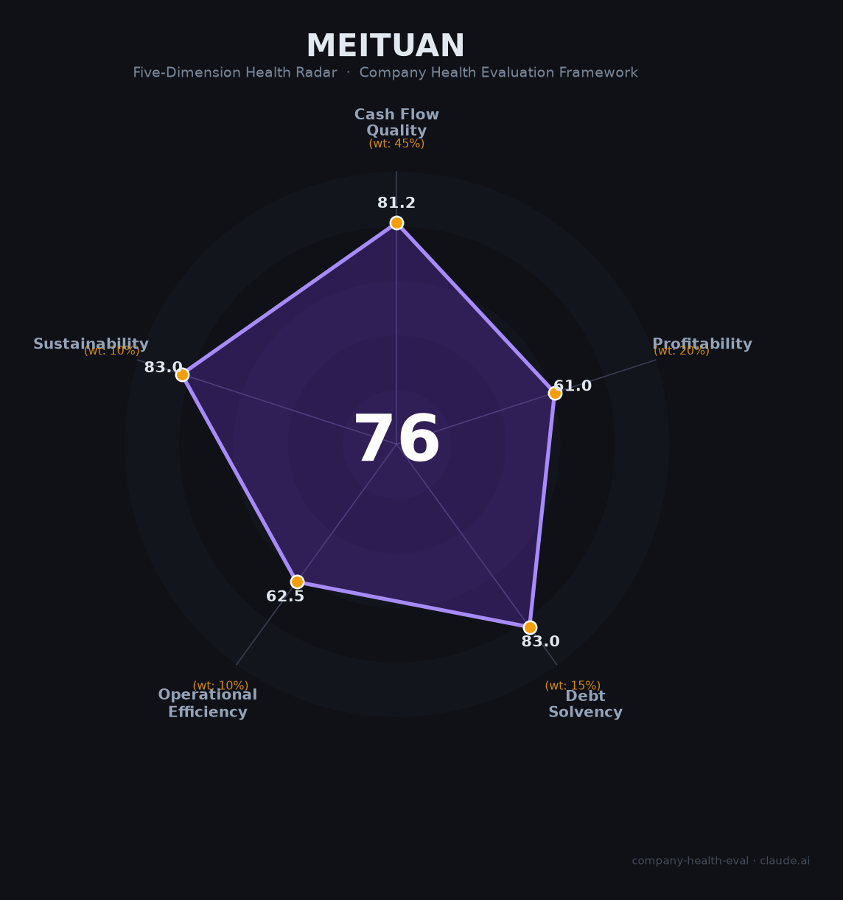

# 美团（Meituan 3690.HK）财务健康评估（2026-06-12）

## 一句话结论

🟠 **中等 · 综合得分 76/100** | 中国本地生活绝对霸主，2024年曾创571亿经营现金流巅峰，但2025年外卖大战致由盈转亏（-234亿）、核心高管流失、标普降级至BBB+——这是一家「结构性优势无与伦比，但处于十年最艰难周期」的修复期巨头。

---

## 一、公司基本画像

| 项目 | 详情 |
|------|------|
| **运营主体** | 美团（Meituan），2010年3月上线，开曼群岛注册 |
| **创始人/CEO** | 王兴（1979年，清华电子工程学士、特拉华大学计算机硕士） |
| **上市信息** | 港交所主板，2018年9月20日上市，股票代码 3690.HK 🔒 |
| **IPO详情** | 发行价69港元/股，募资约49亿美元，当时估值约534亿美元 |
| **当前市值** | 约4,822-4,937亿港元（2026年6月），较高点蒸发约80% 🔒 |
| **员工规模** | 约109,185人（2025年末，-5% YoY）；骑手约1,403万人（灵活用工） 🔒 |
| **主营业务** | 核心本地商业71.5%（外卖+闪购+到店酒旅）+ 新业务28.5%（KeeTa海外+小象超市+快驴等） |
| **核心产品** | 美团App、大众点评、美团闪购、KeeTa、小象超市、LongCat大模型、无人机配送 |
| **2025年营收** | 3,649亿元（+8.1% YoY） 🔒 |
| **2025年净利润** | **-233.5亿元**（2024年为+358亿，由盈转亏） 🔒 |

**一句话定性**：美团是中国本地生活服务的绝对龙头（外卖GTV份额60%+、到店GTV约1.2万亿），凭借全球最大即时配送网络和万亿级真实交易数据构建了极深护城河。但2025年遭遇阿里（淘宝闪购）、京东、抖音三方围攻，外卖大战烧掉400亿+补贴，全年由盈转亏。2026Q1已快速减亏，UE优势拉大至3元/单，21家券商一致看好修复。最大长期变量：AI Agent时代美团会否沦为"运力供应商"。

---

## 二、五维财务健康评估

### 1. 现金流质量（81/100）🟡 | 权重45%

**2025年经营现金流转负是外卖大战的一次性冲击，而非结构性恶化。**

| 评估指标 | 状态 | 判断 | 依据 |
|----------|------|------|------|
| 经营现金流净额 | 2022 +114亿 → 2023 +405亿 → 2024 **+571亿** → 2025 **-138亿** | 🟡 一战性转负 | 🔒 年报。2025年外卖大战烧掉400亿+补贴，但2026Q1已显著改善 |
| 现金及等价物 | **1,068亿元**（2025年末）+ 短期理财601亿 = 约1,669亿 | 🟢 充裕 | 🔒 年报。年运营支出约4,000亿，现金覆盖约5个月 |
| 有息负债（纯银行借款） | **约12亿元** | 🟢 极低 | 🔒 年报。1,068亿现金 vs 12亿借款，净现金状态 |
| 租赁负债 | 约603亿元（配送站点+办公场地） | 🟡 运营性 | 🔒 年报。非金融性债务，是配送网络的必要成本 |
| 应收周转天数 | **约3天** | 🟢 卓越 | 🔒 年报。C端即时结算，平台模式天然优势 |
| 净现比 | 2024年 571亿/358亿 = **1.60**；2025年因亏损不可比 | 🟡 2024优秀 | 🔒 年报。2024年利润含金量极高 |

**本维度分析**：美团2025年前是现金流机器的教科书——四年OCF从-40亿飙升至571亿。2025年转负是外卖大战（阿里+京东+抖音三方围攻）的一次性冲击，2026Q1已显著减亏（核心本地商业亏损从Q4的100亿降至20亿）。纯银行借款仅12亿元，账上现金超千亿，资产负债表极为稳健。

**扣分项**：2025年OCF转负且FCF同样为负（-15分）；外卖大战期间补贴400亿+烧掉了两年的利润积累（-10分）；标普降级至BBB+、穆迪展望负面（-5分）。

---

### 2. 盈利能力（61/100）🔴 | 权重20%

**2025年遭外卖大战重创——毛利率和净利率全面崩塌，但2026Q1已快速修复。**

| 评估指标 | 状态 | 判断 | 依据 |
|----------|------|------|------|
| 毛利率 | 2023 35.1% → 2024 **38.4%** → 2025 **30.4%**（↓8pct） | 🔴 大幅下滑 | 🔒 年报。补贴大战直接侵蚀毛利 |
| 净利率 | 2024 +10.6% → 2025 **-6.4%**（-17pct） | 🔴 亏损 | 🔒 年报。全年亏损234亿 |
| 营收增速（3年CAGR） | 2,200亿（2022）→ 3,649亿（2025），CAGR约**18.4%** | 🟡 放缓 | 🔒 年报。2022-2024 CAGR 23.5%，2025降至8.1% |
| 研发费用率 | 2025年**7.1%**（260亿/3,649亿） | 🟡 中等偏下 | 🔒 年报。绝对额增长23.5%，但占比下滑 |
| 人均产出 | 约**334万元/人**（3,649亿/10.9万人） | 🟢 优秀 | 🔒 年报。平台型公司效率优势明显 |
| 外卖UE（单均经济） | 2025Q4 单均亏损-2.0元，但竞对（淘宝闪购-3.1、京东-3.8）更差 | 🟡 相对优势 | 📊 券商估算。UE gap拉大至1-3元 |

**本维度分析**：2025年是美团盈利能力的历史低点——营销费用暴增60.9%至1,029亿（对比2024年640亿）。但UE gap拉大是关键信号：美团单均亏损2元，竞对3-4元，意味着价格战持久战中美团有结构性成本优势。2026Q1核心本地商业亏损从100亿骤降至20亿，修复速度超预期。高盛预计2026Q2核心本地商业有望盈亏平衡。

**扣分项**：2025年全面转亏且亏损幅度历史最大（-25分）；营收增速从22%骤降至8.1%（-10分）；销售费用率28.2%不可持续（-5分）；外卖大战2026下半年可能反复（-10分）。

---

### 3. 偿债能力（83/100）🟢 | 权重15%

| 评估指标 | 状态 | 判断 | 依据 |
|----------|------|------|------|
| 资产负债率 | **46.79%**（2024年末） | 🟡 适中 | 🔒 年报。总负债1,518亿/总资产3,244亿 |
| 纯银行借款 | **约12亿元** | 🟢 极低 | 🔒 年报。现金1,068亿可覆盖89倍，净现金状态 |
| 租赁负债 | 约603亿元（使用权资产） | 🟡 运营性负债 | 🔒 年报。非金融性，是配送基础设施的必要组成部分 |
| 流动比率 | 约**2.09**（2025Q1） | 🟢 健康 | 🔒 季报。>2的标准安全线 |
| 信用评级 | 标普**BBB+**（负面展望）、穆迪**负面**展望 | 🟠 降级中 | 📊 2026年3月。反映竞争地位削弱、市场份额下滑 |
| 融资能力 | 2021年配股+可转债募资约100亿美元；港股通标的 | 🟢 极强 | 🔒 公开。资本市场融资通道畅通 |

**本维度分析**：美团的资产负债表在互联网大厂中属于最健康梯队——纯金融借款仅12亿元，账上现金加理财超1,600亿元，实质为净现金公司。标普和穆迪的降级/负面展望主要反映对竞争格局的担忧，而非即期偿债风险。

**加分项**：净现金状态，纯银行借款可忽略不计（+10分）；强大的资本市场上融资能力（+5分）。

---

### 4. 运营效率（62/100）🟡 | 权重10%

| 评估指标 | 状态 | 判断 | 依据 |
|----------|------|------|------|
| 应收周转 | **约3天** | 🟢 卓越 | 🔒 年报。即时交易模式，几乎无资金占用 |
| 客户/商家集中度 | 7.7亿+用户、1,450万+商家 | 🟢 极分散 | 🔒 年报。无单一客户依赖 |
| 员工规模趋势 | 2024年 -5%（114,731→109,185），减员增效 | 🟡 优化中 | 🔒 年报。优选关停涉及人员调整 |
| 高管稳定性 | 夏华夏（首席科学家/13年）、司天歌（平台技术负责人/9年）、张川（到店总裁/8年）2025年均离职 | 🔴 核心流失 | 📊 公开报道。技术派元老批量离开 |
| 合规记录 | 2025年幽灵外卖被罚**7.46亿元** + 多次被约谈"内卷式竞争" + 删照片隐私危机 | 🔴 严重 | 🔒 公开处罚。近年最大单笔罚单 |

**本维度分析**：美团平台模式的运营效率在应收周转和客户分散度上表现卓越。但2025年暴露出严重合规短板——幽灵外卖罚7.46亿元（近年最大单笔平台处罚）、删照片隐私危机冲上热搜、投诉量超6.68万件。核心高管批量流失（三位任职8-13年的技术/业务元老）是另一个值得警惕的信号。

**扣分项**：幽灵外卖罚7.46亿+投诉6.68万件（-15分）；三位核心技术高管离职（-8分）；优选关停千亿沉没成本（-5分）。

---

### 5. 可持续发展（83/100）🟠 | 权重10%

| 评估指标 | 状态 | 判断 | 依据 |
|----------|------|------|------|
| 行业赛道空间 | 本地生活O2O线上交易3.89万亿（2025），线上渗透率仅30.8% | 🟢 空间大 | 📊 艾媒咨询。仍有70%线下市场待线上化 |
| 技术护城河 | 全球最大即时配送网络+LongCat万亿参数大模型+70条无人机航线+500万单无人车 | 🟢 极深 | 🔒 年报。物理世界数据壁垒难以复制 |
| AI Agent风险 | 字节豆包月活3.4亿全栈闭环截流；阿里千问打通淘宝/饿了么 | 🔴 入口威胁 | 📊 行业分析。美团可能沦为"运力供应商" |
| 海外扩张 | KeeTa覆盖香港/沙特/卡塔尔/科威特/阿联酋/巴西，香港已盈利 | 🟡 投入期 | 🔒 年报。2025年新业务亏损101亿，短期继续烧钱 |
| 骑手社保政策 | 2025年11月全国推广养老保险补贴（平台补贴50%） | 🟠 成本上升 | 🔒 公开政策。司法趋严认定劳动关系 |
| 反垄断/佣金监管 | 2021年罚34.42亿；2026年新国标抽成上限27%试点 | 🟠 持续制约 | 🔒 监管文件。变现能力受限 |

**本维度分析**：美团的长期可持续性取决于一个核心问题——在AI Agent时代，美团是从"平台"升级为"AI服务底座"（To A战略），还是被降级为"配送管道"。字节豆包和阿里千问正在上游截流本地生活需求，美团选择与腾讯元宝结盟（小美接入元宝、跑腿Skill开放API）是务实之举。海外KeeTa香港已盈利验证模式，但中东和巴西距离盈利仍需数年。

---

## 三、综合评分与健康等级

| 维度 | 得分 | 权重 | 加权得分 |
|------|:----:|:----:|:--------:|
|现金流质量| 81 |45%| 36.5 |
|盈利能力| 61 |20%| 12.2 |
|偿债能力| 83 |15%| 12.4 |
|运营效率| 62 |10%| 6.2 |
|可持续发展| 83 |10%| 8.3 |
| **76/100** |**—**|**100%**|**75.60**|

**健康等级**：🟡 **中等偏上（Moderate-High）** — 资产负债表极其稳健、平台护城河极深，但2025年外卖大战全面转亏 + AI入口威胁 + 合规/高管流失问题叠加，使这家巨头处于十年最艰难修复期。

---

## 四、同业对标

| 对比项 | **美团** | 阿里本地生活（饿了么/淘宝闪购） | 携程 | 抖音生活服务 |
|--------|---------|-------------------------------|------|------------|
| 上市状态 | 港股 3690.HK | 阿里集团（NYSE/港股） | 纳斯达克/港股 | 未上市 |
| 核心业务营收 | 3,649亿（2025） | ~671亿（本地生活FY2025） | 624亿（2025） | 未披露 |
| 毛利率 | 30.4% | 未单独披露 | 80-81% | 未披露 |
| 净利润 | **-234亿** | 约-23亿/季 | **+333亿** | 亏损 |
| 市场份额 | 外卖50-53%、到店~60% | 外卖42-45% | OTA 56% | 到店~40%（核销前） |
| 核心优势 | 配送网络+数据壁垒+UE优势 | 全生态协同+资金无限 | 品牌+高利润OTA | 流量+内容+低获客成本 |
| 2025年战损 | 营销开支+389亿至1,029亿 | 中国电商EBITA-857亿 | 未受影响 | 月亏数亿 |

**对标结论**：美团在"重资产+高壁垒"的配送领域保持UE绝对领先，但到店OTA的利润厚度远逊携程（80%+毛利率 vs 30%），外卖商业模式天然比OTA"苦"。AI时代最大的威胁不是饿了么或京东，而是字节/阿里在上游用AI截流，让美团沦为"运力执行层"。

---

## 五、核心风险清单

### 1. 🔴 外卖大战复燃风险（等级：高）
- **描述**：2025年三家烧掉1,500亿+；阿里已明确"三年不关心亏损"；虽2026年3月监管喊停，但若抖音或京东加大投入，下半年可能再起波澜。
- **触发条件**：2026H2某平台重启大规模补贴 → 美团被迫跟投 → UE修复中断。
- **量化影响**：每增加100亿补贴，直接吞噬约2.7%的营收利润率。

### 2. 🔴 AI入口截流（等级：高，中长期）
- **描述**：字节豆包（月活3.4亿）和阿里千问正在实现"对话即交易"的AI Agent闭环。若用户习惯在AI助手中直接订餐，美团App的流量入口价值将归零。
- **触发条件**：微信AI智能体2026H2推出并覆盖13亿月活 → 美团流量骤降。
- **量化影响**：若30%订单来自第三方AI Agent（而非美团App），美团将损失在线营销收入（2024年约412亿）。

### 3. 🔴 骑手劳动关系风险（等级：高，中长期）
- **描述**：最高法2024年确立"支配性劳动管理"认定标准，多地法院系统性认定骑手劳动关系。若大规模适用，人力成本将数量级增长。
- **触发条件**：人社部出台新规要求平台为全部骑手缴纳五险一金。
- **量化影响**：参考京东模式（每人约2,000元/月），按300万活跃骑手计算，年成本约720亿元。

### 4. 🟠 核心高管流失（等级：中高）
- **描述**：夏华夏（首席科学家/13年）、司天歌（平台技术负责人/9年）、张川（到店总裁/8年）2025年先后离开，"技术派退、运营派进"。
- **触发条件**：更多核心技术人才跟随离开 → 技术组织能力下降。
- **量化影响**：AI/无人车等前沿方向可能延缓。

### 5. 🟠 合规与声誉风险（等级：中高）
- **描述**：幽灵外卖罚7.46亿、删照片隐私危机、投诉6.68万件、标普/穆迪降级。
- **触发条件**：再次发生重大合规事件 → 监管升级 → 业务受限。
- **量化影响**：幽灵外卖处罚导致6个月禁止新增蛋糕店铺，直接影响该品类GMV。

### 6. 🟡 海外亏损扩大（等级：中）
- **描述**：2025年新业务亏损101亿（主要为KeeTa），2026年亏损仍将显著。巴西受挫、中东地缘风险。
- **触发条件**：巴西投入持续无效 → 战略收缩 → 减值。

---

## 六、求职/择业视角

### 核心优势
- **技术栈匹配度极高**：Agent/MCP/RAG/Multi-Agent方向与简历完美匹配（match score 92）
- **AI投入决心大**：260亿/年研发投入（绝大多数投向AI），王兴亲自定调"进攻"战略
- **平台规模带来的技术挑战**：亿级DAU、万亿级数据、全球最大实时调度系统——技术成长空间巨大
- **上海有AI核心团队**：杨浦互联宝地为"上海总部"，AI搜索/Agent方向
- **薪酬竞争力**：大模型Agent架构岗40-70K·16薪，年包64-112万，与BAT同级

### 现存短板
- **"开水团"福利文化**：大厂中福利垫底——无房补、无免费三餐、仅免费开水
- **加班强度大**：核心业务"10-10-5"甚至更卷
- **裁员不手软**：2024-2025年已优化约5%+"无固定期限合同也照裁"
- **归属感低**：脉脉口碑"工厂感很浓，流水线螺丝钉"
- **2026年奖金不确定性**：2025全年亏损，年终奖可能受影响
- **期权覆盖面窄**：L7（资深）以上才有RSU，不如字节全员期权

### 分场景建议

| 个人诉求 | 推荐度 | 说明 |
|----------|:------:|------|
| AI Agent方向深耕 | 🟢 推荐 | Agent架构岗与简历完美匹配，美团AI转型刚起步有大量从0到1机会 |
| 稳定+WLB | 🔴 不推荐 | 外卖大战期间极致内卷，福利差，裁员文化 |
| 高薪+跳板 | 🟡 可行 | 现金薪酬有竞争力，但"开水团"雇主品牌在大厂中偏弱 |
| 上海发展 | 🟢 推荐 | 杨浦AI团队是核心研发基地，通勤便利 |

---

## 七、总结

美团是中国本地生活服务「结构性优势无与伦比，但处于十年最艰难周期」的修复期巨头：全球最大即时配送网络+万亿级真实交易数据+LongCat万亿参数大模型构成极深护城河，2024年巅峰期经营现金流高达571亿。但2025年外卖大战（三家烧掉1,500亿+）将公司拖入全面亏损（-234亿），叠加幽灵外卖罚7.46亿、三位核心技术高管离职、AI入口被字节/阿里截流的系统性威胁。2026Q1修复速度超预期（核心本地商业亏损从100亿骤降至20亿），21家券商一致看好。在外卖大战趋于理性与AI To A战略加速落地的大环境下，属于🟠中等风险等级，适合对AI Agent方向有强烈兴趣、能承受高强度和高不确定性的技术人才积极考虑。

---

*评估日期：2026-06-12 | 数据截至：2025年年报（港交所披露）、2026Q1季报、2026年6月公开市场数据*
