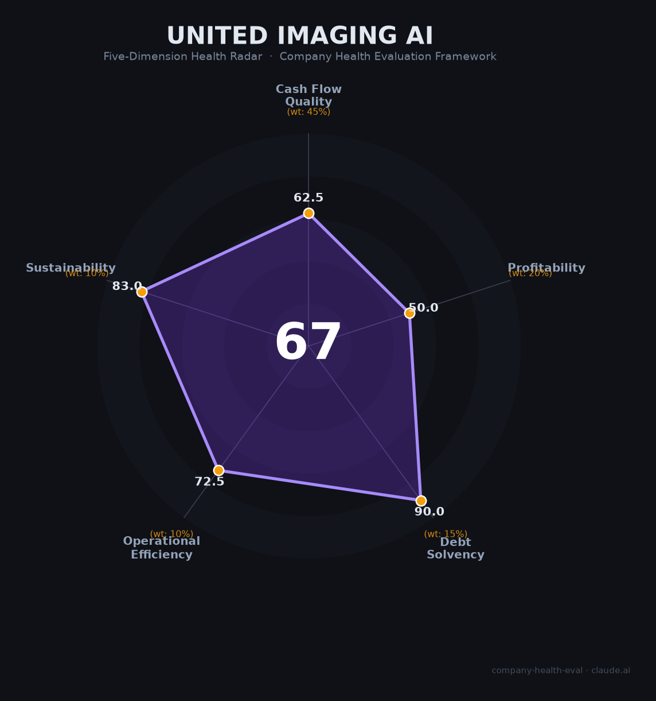

# 联影智能（United Imaging AI）财务健康评估（2026-06-12）

## 一句话结论

🟠 **中等（67.2/100）** | 医疗AI影像赛道龙头+联影集团背书+百亿独角兽，唯一短板是商业化未跑通——连续亏损+DRG/DIP封死单独收费路径

## 一、公司基本画像

- **主体**：上海联影智能医疗科技有限公司，2017年12月成立，联影集团控股子公司（非联影医疗688271.SH子公司，二者为"兄弟公司"同受集团控制）
- **管理**：联席CEO沈定刚（全球最早做医学影像AI的科学家之一，IEEE/AIMBE/MICCAI Fellow）+周翔（前西门子医疗CAD事业部全球负责人）；研发总裁詹翊强（约翰霍普金斯博士）；核心团队稳定
- **规模**：社保参保约292人（上海总部），含分支估计300-500人；硕博占比50%+
- **主营**：uAI智能诊疗平台+"元智"医疗大模型（文本+影像+视觉+语音+混合五大模态），100+款AI应用，覆盖4000+医院
- **认证**：NMPA三类证19张（行业前二）、CE 31张（全球第一）、FDA 15张
- **财务（2024，未经审计）**：营收2.88亿、净亏损1.27亿、净资产-2.59亿（资不抵债）；2020-2023年CAGR约90%但2024年增速放缓至13%
- **融资**：2025年6月A轮10亿元，投后估值100亿元（百亿AI医疗独角兽）；易方达/上国投资管领投
- **母公司参照**：联影医疗（688271）2025年营收138亿、净利18.69亿，A股市值约925亿

## 二、五维财务健康评估

### 1. 现金流质量（62.5/100）

| 指标 | 判断 | 依据 |
|------|------|------|
| 经营现金流 | ⚠️ 关注 | 未上市无公开现金流量表；连续亏损（年亏1.27亿）意味经营现金流为负 |
| 现金跑道 | ✅ 健康 | 2025年6月A轮10亿元到账，联影集团持续输血，短期资金无忧 |
| 有息负债 | ✅ 健康 | 软件公司轻资产模式，无传统银行借款 |
| 净现比 | 🔴 危险 | 亏损状态，无正净利润可比较 |

### 2. 盈利能力（50.0/100）

| 指标 | 判断 | 依据 |
|------|------|------|
| 毛利率 | ✅ 良好 | 未公开，参照行业纯AI公司（数坤84%、推想82%）预计70-80% |
| 净利率 | 🔴 预警 | 净利率约-44%，持续亏损（2024亏1.27亿、2023亏1.36亿） |
| 营收增速 | ✅ 优秀 | 2020-2023年CAGR约90%；2024年13%增长（减速但仍正增长） |
| 研发费用率 | 🔴 预警 | 远超35%且亏损状态（AI医疗企业早期典型特征，但按评分标准为预警） |
| 人均产出 | ⚠️ 一般 | 约41万/人（2.88亿/约700人估算），低于硬件+软件的联影医疗（126万/人） |

### 3. 偿债能力（90.0/100）

| 指标 | 判断 | 依据 |
|------|------|------|
| 资产负债率 | ✅ 健康 | 轻资产软件公司，主要"负债"为累计亏损导致的所有者权益为负，非外部债务 |
| 有息负债率 | ✅ 健康 | 无银行借款或其他有息负债 |

> 缺失指标：流动比率、现金比率、股权质押比例——未上市子公司无公开数据，但轻资产+集团背书模式下偿债风险极低。

### 4. 运营效率（72.5/100）

| 指标 | 判断 | 依据 |
|------|------|------|
| 应收周转 | ⚠️ 关注 | 母公司联影医疗应收账款57亿（为净利润14倍+），关联交易模式下子公司可能类似 |
| 客户集中度 | ✅ 健康 | 覆盖4000+医院（含98%国内头部医院），极度分散 |
| 员工规模趋势 | ⚠️ 关注 | 母公司2025年裁员~30%；联影智能招聘温和，非大规模扩张 |
| 高管稳定性 | ✅ 健康 | 沈定刚+周翔+詹翊强三驾马车稳定，沈定刚2025年获MICCAI Enduring Impact Award |

### 5. 可持续发展能力（83.0/100）

| 指标 | 判断 | 依据 |
|------|------|------|
| 行业赛道 | ✅ 健康 | 中国AI医学影像市场2023-2025 CAGR 127%，2025E达150亿元；政策（卫健委84个AI场景指引）强力驱动 |
| 技术壁垒 | ✅ 健康 | 19张三类证（行业前二）+31张CE（全球第一）+500+专利+500+论文；元智大模型五大模态；沈定刚学术背书 |
| 业务多元化 | ✅ 健康 | 七大专科方案+100+AI应用+10+智能体；海外CE/FDA双线布局 |
| 资本支持 | ✅ 健康 | 联影集团+10亿A轮+100亿估值+潜在独立IPO；母公司联影医疗市值925亿 |
| 政策风险 | ⚠️ 关注 | DRG/DIP 2.0封死AI单独收费路径；2026年14部委新纠风要点；医疗反腐常态化压低设备采购预算 |

## 三、综合评分与健康等级

| 维度 | 得分 | 权重 | 加权得分 |
|------|------|------|----------|
| 现金流质量 | 62.5 | 45% | 28.1 |
| 盈利能力 | 50.0 | 20% | 10.0 |
| 偿债能力 | 90.0 | 15% | 13.5 |
| 运营效率 | 72.5 | 10% | 7.2 |
| 可持续发展 | 83.0 | 10% | 8.3 |
| **综合得分** | | **100%** | **67.2** |

**健康等级：🟠 中等（Moderate）**——技术+认证+赛道三重优势明确，但亏损持续+商业化路径受阻是核心短板。

## 四、同业对标

| 对比项 | 联影智能 | 数坤科技 | 推想医疗 | 鹰瞳科技（02251.HK） |
|--------|---------|---------|---------|-------------------|
| 上市状态 | 未上市（A轮） | 未上市（D轮） | 未上市 | 港股上市 |
| 2024营收 | 2.88亿 | 未披露（估1-3亿） | 未披露（估1-3亿） | 1.56亿 |
| 净利润 | -1.27亿 | 亏损 | 亏损（预计2025盈利） | -2.55亿 |
| 毛利率 | 估70-80% | 84%（2021H1） | 82%（2020） | 55%（2024） |
| 三类证数量 | 19张 | 18-19张 | 14+张 | 3张 |
| 估值/市值 | 100亿（投后） | ~94亿（2021） | ~70亿（2021） | ~11.5亿港元 |
| 核心差异 | 设备+AI一体化+多模态大模型 | 心血管AI领先 | 最早可能盈利 | 唯一上市对照，市值缩水80%+ |

**对标结论**：联影智能在营收规模和认证数量上是纯AI医疗影像赛道龙头，但鹰瞳科技从上市高点跌超80%警示——二级市场对"未盈利AI医疗"的估值逻辑极为苛刻。

## 五、核心风险清单

1. **商业模式未跑通（高）**：DRG/DIP 2.0明确AI不能单独定价、不能向患者额外收费，基本封死按次收费的传统商业路径。医院的采购动力从"增收"转为"降本"，AI付费意愿存疑。

2. **资不抵债与持续亏损（中高）**：所有者权益-5.04亿（2024Q3），年亏1.27亿，若集团或外部融资中断，12-18个月内面临资金压力。

3. **母公司承压传导（中）**：联影医疗2024年营收-9.73%/净利-36.08%/OCF转负，2025年裁员~30%，应收账款57亿。母公司自身造血能力受损可能压缩对AI业务的输血。

4. **员工口碑极差（中）**：脉脉/知乎90%负面评价，"134+大小周"无加班费，公积金8%，管理混乱。核心AI人才可能流向互联网大厂。

5. **一级市场估值虚高（中）**：100亿估值对应2.88亿营收PS~35x，而鹰瞳科技港股PS仅~7x。若独立IPO，估值可能大幅回调。

## 六、求职/择业视角

### 核心优势
- **技术天花板极高**：沈定刚是全球医学影像AI奠基人级学者，联影智能三类证+NMPA审批经验在国内独一无二
- **赛道确定性**：医疗AI影像是中国AI落地最成熟的垂直场景之一，政策明确支持
- **品牌背书**：联影集团+联影医疗（A股925亿市值）体系内，简历含金量高

### 现存短板
- **薪酬性价比低**：AI算法岗20-40K·14薪，比互联网大厂同级低30-50%，且无加班费
- **工作强度极大**："134+大小周"（周一至四加班至晚8点+，周六大小周），员工普遍"身心俱疲"
- **裁员风险**：母公司2024年有裁员记录，应届生试用期被裁案例；联影智融每年15%固定淘汰率
- **竞业限制严苛**：离职竞业限制被广泛使用，跳槽受限

### 分场景建议

| 个人诉求 | 推荐度 | 说明 |
|----------|--------|------|
| 医疗AI长期深耕 | ✅ 推荐 | 技术+认证+场景三重壁垒，行业Top1平台，适合扎根 |
| 高薪+短期跳板 | ❌ 不推荐 | 薪酬低于互联网大厂30-50%，竞业限制严格 |
| 应届生首份工作 | ⚠️ 谨慎 | 技术成长好但试用期裁员风险+加班强度需慎重评估 |
| 算法→产品转型 | ✅ 推荐 | 医疗AI产品化全流程经验（三类证+临床落地），稀缺能力 |

## 七、总结

联影智能是中国医疗AI影像领域「认证最多、估值最高、技术底座最深厚」的公司：19张NMPA三类证+31张CE（全球第一）+元智医疗大模型五大模态+4000+医院落地，唯一短板是DRG/DIP政策封死了AI的独立收费商业路径——医院"愿意用但不一定愿意付钱"的矛盾尚未解决。

在医疗AI影像市场三年CAGR 127%的大爆发背景下，联影智能属于**中等风险、高成长潜力**的标的。适合愿意接受较低现金薪酬、对医疗AI赛道有长期信念、看重技术深度和行业壁垒的技术人才；不适合追求短期高薪、无法接受高强度加班、或对裁员风险敏感（尤其是应届生）的求职者。

---

*评估日期：2026-06-12 | 数据截止：2026年6月*
*信息来源：联影医疗上市公司公告、36氪、东方财富、企查查/天眼查、脉脉/知乎员工口碑、IDC/NMPA公开数据*
