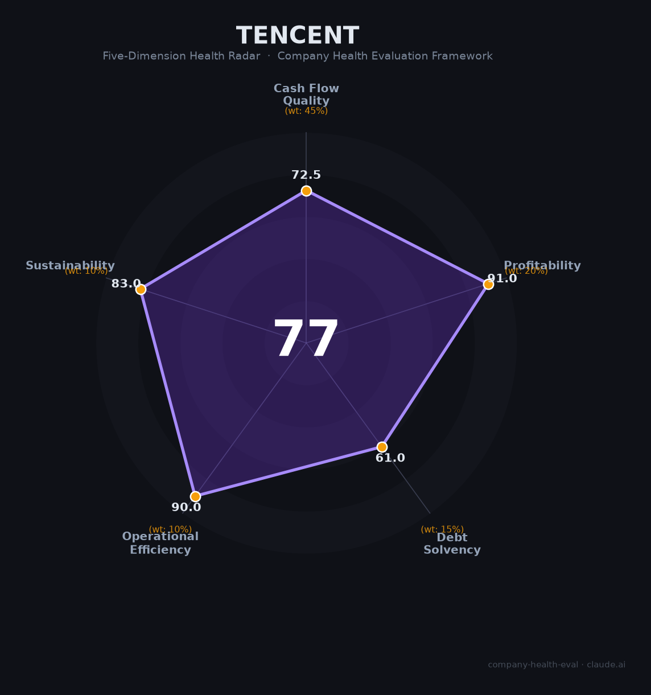

# 腾讯 财务健康评估（2026-06-12）

## 一句话结论

🟡 **中等偏上（77.3/100）** | 盈利能力卓越 + 运营效率顶级 + 现金流充沛，但偿债结构有优化空间，中美科技竞争是最大外部风险

---

## 一、公司基本画像

| 项目 | 内容 |
|------|------|
| **全称** | 腾讯控股有限公司（Tencent Holdings Limited） |
| **成立** | 1998年11月11日，深圳 |
| **上市** | 港股0700.HK（2004年6月16日），恒生指数成分股 |
| **市值** | 约4.2万亿港元（2026年6月） |
| **创始人/CEO** | 马化腾（持股8.82%，实际控制人） |
| **第一大股东** | Prosus/Naspers（持股22.8%，放弃投票权） |
| **员工** | 114,848人（2026年Q1） |
| **主营业务** | 游戏（49%营收）+ 金融科技及企业服务（31%）+ 网络广告（19%） |
| **核心产品** | 微信/WeChat、QQ、腾讯游戏、腾讯云、微信支付、混元大模型 |
| **2025年营收** | 7,517.66亿元（+14%） |
| **2025年净利润** | 2,248.42亿元（+16%） |
| **投资版图** | 持仓约600家公司，公允价值超1万亿元，年化回报约16% |

腾讯是中国最大的互联网公司，从社交/游戏帝国转型为AI时代的底层技术投资者和平台型巨头。2025年底挖来前OpenAI研究员姚顺雨（ReAct框架提出者）任首席AI科学家，全面发力AI Agent和混元大模型。

---

## 二、五维财务健康评估

### 1. 现金流质量（72.5/100）

| 指标 | 状态 | 详情 |
|------|------|------|
| 经营现金流净额 | ✅ 健康 | 连续3年为正：2023年2,220亿 → 2024年2,585亿 → 2025年3,031亿 |
| 现金及等价物 | ⚠️ 关注 | 纯现金1,410亿元覆盖约3个月运营支出；含短期投资等流动性资产合计4,478亿元，覆盖约10个月，未达12个月阈值 |
| 有息负债 | ⚠️ 关注 | 有息负债率19.9%，总额4,064亿元（综合借贷利率约3.5%），处于可控但非零负债区间 |
| 净现比 | ✅ 健康 | 经营现金流/净利润 = 1.35（2025年），盈利质量优秀 |

腾讯现金流基本盘扎实：年经营现金流超3,000亿元，月均产生约250亿元现金流入。但有息负债近20%和现金覆盖不足12个月（纯口径）拖累了本维度得分。净现比1.35表明利润"含金量"高——每赚1元利润，对应1.35元真金白银的现金流入。

### 2. 盈利能力（91.0/100）

| 指标 | 等级 | 详情 |
|------|------|------|
| 毛利率 | 🌟 卓越 | 56.2%（2025年），连续三年攀升（48.1% → 52.9% → 56.2%），创近十年新高 |
| 净利率 | 🌟 卓越 | 29.9%（IFRS），Non-IFRS 34.5%，远超15%基准线 |
| 营收增速 | 👍 良好 | 近3年CAGR约10.7%（+9.8% → +8.4% → +13.9%），2025年加速明显 |
| 研发费用率 | 🌟 卓越 | 11.4%（857亿元），处于10-25%最优区间 |
| 人均产出 | 🌟 卓越 | 649万元/人，远超互联网行业平均（200-300万），约为行业1.5倍以上 |

盈利能力是腾讯最强的维度。毛利率56.2%在互联网行业处于顶级水平（阿里40%，百度约50%），且仍在持续改善。人均产出649万元在头部互联网公司中仅次于字节（500万+），远高于阿里（423万）和百度（400万+）。Non-IFRS净利率34.5%意味着每100元收入产生34.5元调整后利润，盈利能力极强。

### 3. 偿债能力（61.0/100）

| 指标 | 状态 | 详情 |
|------|------|------|
| 资产负债率 | ✅ 健康 | 39.13%（2025年末），低于40%阈值 |
| 有息负债率 | ⚠️ 关注 | 19.9%，位于<20%区间上沿，总额4,064亿元 |
| 流动比率 | ⚠️ 关注 | 约1.4，处于1-2区间（流动资产/流动负债） |
| 现金比率 | 🔴 危险 | 约0.4（纯现金/流动负债），低于0.5阈值 |
| 股权质押比例 | ✅ 健康 | 创始人及大股东股权质押极低 |

偿债能力是腾讯的相对短板。虽然资产负债率不到40%、整体财务结构安全，但现金比率偏低（0.4，低于0.5的健康线）和流动比率一般（1.4）反映其短期偿付指标不够优秀。不过腾讯年经营现金流超3,000亿元，实际偿债风险极低——这些比率指标主要反映资产负债表结构而非真实的违约风险。Prosus持股22.8%放弃投票权，不存在大股东质押爆仓风险。

### 4. 运营效率（90.0/100）

| 指标 | 状态 | 详情 |
|------|------|------|
| 应收周转 | ✅ 健康 | 23-24天，远优于互联网行业平均（30-60天），现金循环周期为-107天 |
| 客户集中度 | ✅ 健康 | 服务数十亿用户+百万级企业客户，无单一客户依赖 |
| 员工规模趋势 | ✅ 健康 | 近三年稳定增长（105K → 111K → 116K），2026年Q1微幅调整 |
| 高管稳定性 | ✅ 健康 | 马化腾+刘炽平核心组合稳定超20年，姚顺雨加入补强AI领导力 |

运营效率评分90分，四大指标均为健康。应收账款23-24天回款极快，应付账款周转约132天，现金循环周期为-107天——这意味着腾讯在产业链中议价能力极强，可以用供应商的钱运营近4个月。员工规模温和扩张（年均+5,000人），2026校招技术岗扩招36%、AI渗透率75%，显示持续投入而非收缩。

### 5. 可持续发展能力（83.0/100）

| 指标 | 状态 | 详情 |
|------|------|------|
| 行业赛道空间 | ✅ 健康 | 游戏全球第一、AI>40% CAGR、云>20%增速，三大赛道均处于增长通道 |
| 技术壁垒 | ✅ 健康 | 微信生态14亿月活+全球游戏IP矩阵+混元大模型+AI Agent布局，壁垒3年+难以复制 |
| 业务多元化 | ✅ 健康 | 游戏/社交/广告/金融科技/云/AI六大引擎，投资组合覆盖600+公司 |
| 资本支持 | ✅ 健康 | 港股上市+年回购千亿港元+万亿级投资组合，资本实力雄厚 |
| 政策/监管风险 | ⚠️ 关注 | 中美科技竞争（CFIUS审查、1260H清单）是最大外部不确定性 |

可持续发展能力得分83分。国内监管环境多维度改善（游戏版号常态化、AI监管备案完成、金融整改收官），但美国CFIUS对其海外游戏投资（Riot Games全资、Epic Games 28%）的审查仍是悬而未决的风险。腾讯2025年底正式推出"元宝"AI助手并全面发力Agent，但C端MAU仅约豆包的1/5，AI应用层竞争激烈。

---

## 三、综合评分与健康等级

| 维度 | 得分 | 权重 | 加权得分 |
|------|:----:|:----:|:--------:|
| 现金流质量 | 72.5 | 45% | 32.6 |
| 盈利能力 | 91.0 | 20% | 18.2 |
| 偿债能力 | 61.0 | 15% | 9.2 |
| 运营效率 | 90.0 | 10% | 9.0 |
| 可持续发展 | 83.0 | 10% | 8.3 |
| **综合得分** | **77.3** | **100%** | **77.3/100** |

**健康等级：🟡 中等偏上（Moderate-High）**

---

## 四、同业对标

| 对比项 | 腾讯 | 阿里巴巴 | 字节跳动 | 百度 |
|--------|:----:|:--------:|:--------:|:----:|
| 上市/融资 | 港股0700 | 港股+美股 | 非上市（估值~5000亿美元） | 港股+美股 |
| 2025年营收 | 7,518亿 | 9,963亿 | ~13,000亿（估） | 1,291亿 |
| 营收增速 | +14% | +6% | +20% | -3% |
| 净利润 | 2,248亿 | 1,295亿 | ~3,520亿（估） | 56亿 |
| 毛利率 | **56%** | 40% | ~55%（估） | ~50%（估） |
| 净利率 | **30%** | 13% | ~27% | 4% |
| 员工数 | 11.5万 | 12.8万 | ~15万 | ~5万 |
| 人均营收 | **649万** | 423万 | 500万+ | 400万+ |
| AI大模型MAU | 第3（元宝） | 第2（千问） | **第1（豆包）** | 第5+（文心） |
| 云市场份额 | 第3-5（~9%） | **第1（~33%）** | 第2（AI云~15%） | 第6+（~6%） |
| 游戏全球排名 | **第1** | — | — | — |

**对标结论**：腾讯在盈利效率（毛利率/净利率/人均产出）和游戏领域是绝对的行业第一；但在AI应用层（C端MAU仅为豆包1/5）和云计算（份额约阿里云的1/4）领域处于追赶位置。综合来看，腾讯是"利润质量最高的中国互联网平台"，当前最大的竞争压力来自字节跳动在AI应用层的全面领先。

---

## 五、核心风险清单

1. **中美科技竞争（高风险）**：CFIUS持续审查腾讯对Riot Games（全资）、Epic Games（28%）的投资，若强制剥离将打击游戏全球化战略。2025年1月被列入美国防部1260H清单（影响有限但短期压制股价）。

2. **AI应用层落后（中高风险）**：元宝MAU约4,000万，仅为豆包（2.26亿）的1/5。AI Agent方向姚顺雨刚加入半年，产品化尚在早期。若不能在AI应用层建立差异化优势，可能错失下一代平台机会。

3. **大股东持续减持（中风险）**：Prosus/Naspers持股从约28%降至22.8%，持续缓慢减持压制港股估值。腾讯以年回购800-1,120亿港元对冲，但结构性问题未消除。

4. **游戏业务增长天花板（中低风险）**：国内游戏市场增速降至个位数，版号常态化后竞争加剧。《王者荣耀》等核心IP已运营多年，需要新爆款接棒。

5. **金融牌照续展（低风险）**：财付通支付牌照2026年5月到期，需关注续展进展。注册资本已增至223亿元（行业最高），续展概率高。

---

## 六、求职/择业视角

### 核心优势
- **稳定性极高**：中国最大互联网公司之一，年经营现金流超3,000亿元，无大规模裁员风险（高管明确否认），CFO表示"跟硅谷公司不太一样"
- **薪酬竞争力强**：人均用工成本112.8万元，校招技术岗30-45万/年，AI岗年薪60-90万，核心部门（游戏/微信）年终奖5-8个月
- **品牌背书顶级**："有鹅选鹅"是行业共识，腾讯经历对跳槽字节/阿里/创业均为强力加分
- **AI转型机遇**：姚顺雨加入后AI组织大重组（AI Lab并入混元，团队扩张至600人+），2026校招技术岗扩招36%，AI渗透率75%

### 现存短板
- **工作强度中等偏上**：核心业务（游戏、元宝、AI产品线）加班严重，部分团队"每天加班到凌晨"；边缘业务线相对轻松
- **竞业限制严格**：腾讯是互联网大厂中竞业限制诉讼最多的企业之一（至少48件），平均违约金约242万元
- **薪酬天花板**：高级别总包（T9约60-100万）低于字节同级（2-2约86-128万），期权增值空间不如未上市独角兽

### 分场景建议

| 个人诉求 | 推荐 | 次选 | 规避 |
|----------|------|------|------|
| 稳定+深耕 | 腾讯（游戏/微信/云等成熟业务线） | 阿里云 | 字节（竞争压力极大） |
| 高薪+跳板 | 拼多多（18薪制） | 腾讯（AI Agent方向） | 百度（增长乏力） |
| AI成长红利 | 字节豆包（C端第一） | 腾讯混元元宝（姚顺雨带队，成长空间大） | 百度文心（C端萎缩） |
| 多元+跨领域 | 腾讯（六大业务线，内部活水机制完善） | 阿里 | 垂直领域小公司 |

---

## 七、总结

腾讯是中国互联网行业"盈利能力最强、运营效率最高"的平台型巨头——毛利率56%创十年新高、人均产出649万行业领先、经营现金流超3,000亿且净现比1.35，唯一短板是偿债比率指标（现金比率/流动比率）在财务模型下显得不够突出，以及中美科技竞争带来的外部政策不确定性。在中国互联网行业从"消费互联网"向"AI Agent平台"转型的大背景下，腾讯属于中等偏上（77.3分），适合追求稳定性+长期发展+AI转型红利的求职者的选择。对于以AI Agent为职业方向的候选人，姚顺雨领导下的混元团队提供了技术深度与平台资源的独特组合。

---

*评估日期：2026年6月12日 | 数据截至：2026年Q1财报（2026年5月13日发布）*
