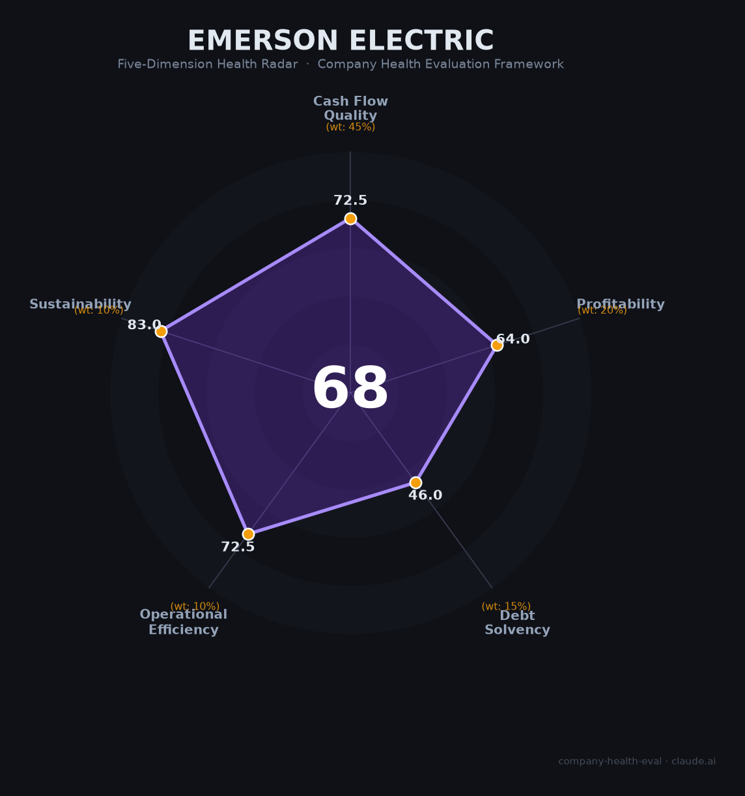

# 艾默生电气（Emerson Electric）财务健康评估（2026-07-11）

## 一句话结论
🟠 **中等（67.9/100）** | 自动化转型战略正确、毛利率持续攀升，但$131亿债务压身+商誉占净资产90%是核心隐忧

## 一、公司基本画像

| 项目 | 详情 |
|------|------|
| 主体 | Emerson Electric Co.（NYSE: EMR） |
| 成立时间 | 1890年9月，密苏里州圣路易斯 |
| 总部 | 密苏里州克莱顿市 Emerson Tower（2024年迁入） |
| CEO | Surendralal (Lal) Karsanbhai（2021年2月上任，Emerson百年历史仅第四位CEO） |
| 员工总数 | ~71,000人（FY2025） |
| 业务板块 | 智能设备（阀门/传感器/离散自动化/安全工具）+ 软件与控制（控制系统/NI测试测量/AspenTech） |
| 市值 | ~$780亿（2026年7月） |
| 机构持股 | ~92%（Vanguard 9.8%、BlackRock 7.2%、State Street 4.9%） |
| 财富500强 | 排名约前150位 |
| 股息增长 | 连续**69年** 🔒 公开财报 |

**战略转型**：Emerson 在过去5年完成了从多元化工业集团向**纯工业自动化公司**的根本性转变。出售了 Climate Technologies（$140亿，2023年）、InSinkErator（$30亿，2022年）等非核心业务，同时收购了 NI/National Instruments（$82亿，2023年）和 AspenTech（2025年全资收购），聚焦于过程自动化、离散自动化和工业软件三大赛道。

## 二、五维财务健康评估

### 1. 现金流质量（72.5/100）🟡 中等偏上

| 指标 | 状态 | 数据支撑 |
|------|------|----------|
| 经营现金流净额 | 🟢 健康 | FY2023受重组影响仅$6.37亿（异常），FY2024 $33.32亿 / FY2025 $30.98亿，正常化年份均为正 |
| 现金及等价物 | 🟠 关注 | $15.44亿（FY2025），相对于$180亿营收体量偏薄（因连续大额收购消耗现金） |
| 有息负债 | 🟠 关注 | 总负债$131.16亿（含短期$48亿），债务/EBITDA 2.21x。FY2025因AspenTech收购融资大幅增加 |
| 净现比（OCF/NI） | 🟢 健康 | FY2025: 1.35（$30.98亿 / $22.93亿），利润含金量良好 |

**核心判断**：经营现金流质量本身不错（正常化年份FCF $27-33亿），但现金储备在大规模收购后处于低位，且$131亿总负债是持续关注点。管理层指引债务/EBITDA将在2026年回落至2.0x以下。

### 2. 盈利能力（64.0/100）🟠 中等

| 指标 | 状态 | 数据支撑 |
|------|------|----------|
| 毛利率 | 🟢 优秀 | **52.8%**（FY2025），FY2021→FY2025 累计提升853bps，得益于向软件/高附加值自动化转型 |
| 净利率 | 🟡 良好 | 12.4%（持续经营），FY2023剥离Climate Technologies后利润率显著改善 |
| 营收增速（3年CAGR） | 🟠 一般 | FY2022→FY2025: +9.3%（含收购贡献），有机增速约3-5% |
| 研发费用率 | 🟠 一般 | 4.3%（$7.71亿），作为工业自动化公司属于正常偏低水平 |
| 人均产出 | 🟠 一般 | ~$25.4万/人，在工业自动化行业中处于中等水平 |

**亮点**：毛利率52.8%在工业行业中属于顶级水平（Honeywell ~37%、Rockwell ~42%），证明了转型纯自动化公司的战略正确性。但营收有机增速偏温和，人均产出不及纯软件公司。

### 3. 偿债能力（46.0/100）🔴 中等偏下

| 指标 | 状态 | 数据支撑 |
|------|------|----------|
| 资产负债率 | 🟠 关注 | 51.6%，处于40-70%区间 |
| 有息负债率 | 🔴 危险 | 31.3%（$131.16亿 / $419.64亿），远超30%警戒线，主要因NI和AspenTech收购融资 |
| 流动比率 | 🟠 关注 | 估计1.1-1.3，短期借款$48亿显著压缩流动性空间 |
| 现金比率 | 🔴 危险 | 估计0.2（$15.44亿 / ~$75亿流动负债），远低于0.5 |
| 股权质押 | 🟢 健康 | 美股公众公司，无质押风险 |

**⚠️ 最大风险维度**：Emerson为战略转型（NI + AspenTech）背负了沉重债务。$131亿总负债 + 仅$15亿现金 + 短期借款$48亿的搭配令人担忧。S&P给予投资级评级，但杠杆率已接近舒适区上限。

### 4. 运营效率（72.5/100）🟡 中等偏上

| 指标 | 状态 | 数据支撑 |
|------|------|----------|
| 应收周转 | 🟠 关注 | 工业自动化的项目制业务模式导致DSO偏高，行业常态 |
| 客户集中度 | 🟢 健康 | 覆盖油气、化工、制药、半导体、电力等多行业，高度分散 |
| 员工规模趋势 | 🟠 关注 | FY2020 83,500 → FY2025 71,000（-15%），主要因剥离Climate Technologies（-18,000）和NI收购（+7,000）的大型结构性变化 |
| 高管稳定性 | 🟢 健康 | CEO Karsanbhai稳固，CFO/COO/CTO经验丰富，百年企业仅换过4位CEO |

**核心判断**：业务多元化程度极佳（"卖铲子"型商业模式，不依赖单一终端市场），但持续的收购整合（NI裁员、组织重构）带来了执行风险。

### 5. 可持续发展能力（83.0/100）🟡 中等偏上

| 指标 | 状态 | 数据支撑 |
|------|------|----------|
| 行业赛道空间 | 🟢 健康 | 全球工业自动化市场CAGR ~8-10%（2023-2028），受nearshoring、能源转型、数字化驱动 |
| 技术壁垒 | 🟢 健康 | DeltaV DCS、Rosemount传感器、Fisher阀门、NI测试平台——多项技术需10年+积累 |
| 客户/业务多元化 | 🟢 健康 | 横跨过程工业、离散制造、混合行业的全栈自动化供应商 |
| 资本支持 | 🟢 健康 | NYSE上市，S&P 500成分股，69年连续股息增长，机构持股92% |
| 政策/监管风险 | 🟠 关注 | 中美科技摩擦（NI测试设备可能受出口管制影响）、半导体周期性波动、能源政策变化 |

**核心优势**：全球"再工业化"（nearshoring/reshoring）+ 能源转型 + 工业4.0三大趋势共同推动自动化需求。Emerson作为少数能提供从传感器→执行器→控制系统→工业软件的"全栈"自动化供应商，长期受益确定性高。

## 三、综合评分与健康等级

| 维度 | 得分 | 权重 | 加权得分 |
|------|------|------|----------|
| 现金流质量 | 72.5 | 45% | 32.6 |
| 盈利能力 | 64.0 | 20% | 12.8 |
| 偿债能力 | 46.0 | 15% | 6.9 |
| 运营效率 | 72.5 | 10% | 7.3 |
| 可持续发展 | 83.0 | 10% | 8.3 |
| **综合得分** | | | **67.9 / 100** |
| **健康等级** | | | **🟠 中等（Moderate）** |

## 四、同业对标

| 指标 | **Emerson** | **Honeywell** | **Rockwell Automation** | **Siemens (DI)** |
|------|:---:|:---:|:---:|:---:|
| 上市地 | NYSE | NASDAQ | NYSE | 法兰克福 |
| FY2025营收 | $180亿 | ~$390亿 | ~$90亿 | ~€190亿 |
| 毛利率 | **52.8%** | ~37% | ~42% | ~40% |
| 净利率（持续经营） | 12.4% | ~16% | ~11% | ~12% |
| 员工数 | 71,000 | ~95,000 | ~27,000 | ~113,000 |
| 债务/EBITDA | **2.21x** | ~1.5x | ~1.8x | ~1.0x |
| 商誉/净资产 | **~90%** | ~60% | ~50% | ~40% |
| 股息增长 | 69年 | ~15年 | ~15年 | — |
| 员工Glassdoor评分 | 3.7 | **4.1** | 3.9 | 4.1 |

**对标结论**：Emerson在毛利率上领先所有对标公司（纯自动化+软件组合的优势），但杠杆率也是最高的——这是"转型税"（$82亿NI收购 + AspenTech全资收购）。若债务成功去杠杆，财务画像将显著改善。

## 五、核心风险清单

1. **高杠杆风险（高）**：$131亿总负债，债务/EBITDA 2.21x，短期借款$48亿需再融资。FY2025因AspenTech收购融资杠杆率短暂升至约2.8x。触发条件：利率持续高位 + 工业自动化需求下行 → 债务偿还压力急剧上升。

2. **商誉减值风险（中高）**：商誉$181.93亿占股东权益$202.98亿的**~90%**（有形净资产为负数）。NI收购产生了$34.42亿商誉。若NI或AspenTech业绩不及预期，减值将对利润表产生巨大冲击。触发条件：测试测量市场持续低迷或AspenTech增长失速。

3. **NI整合风险（中）**：NI FY2024并表后贡献营收$14.64亿但净亏损$5.37亿（收购会计调整所致）。收购后多次裁员引发员工士气问题和人才流失。触发条件：整合进展缓慢，NI核心人才继续流失。

4. **离散自动化周期性下行（中）**：FY2024离散自动化营收$25.1亿（同比-5%），FY2025仅微增至$25.2亿。制造业PMI低迷直接拖累该板块。触发条件：全球制造业衰退深化。

5. **中美科技摩擦（中）**：NI的测试测量设备（半导体测试、航空航天等）可能受到美国对华出口管制政策的影响。Emerson中国区是第二大市场（15个生产基地、8个研发中心、2000+工程师）。触发条件：出口管制进一步扩大至测试测量领域。

6. **薪酬竞争力不足（低-中）**：Glassdoor薪酬评分仅3.4/5，在Honeywell（4.0）、Schneider Electric（4.0）、Siemens（3.8）等同行中垫底。可能影响关键人才招聘和留存。

## 六、求职/择业视角

### 核心优势

- **行业前景广阔**：工业自动化是全球"再工业化"的核心受益者，nearshoring、能源转型、AI+工业4.0三重驱动力支撑长期需求。
- **技术深度极高**：DeltaV、Fisher、Rosemount、NI等品牌在各自细分领域均为全球前二，技术经验可迁移至Honeywell/ABB/Siemens/Rockwell等同行。
- **稳定性尚可**：69年连续股息增长说明公司穿越周期的能力。虽是传统工业企业，但转型后的纯自动化定位比多元化集团更具战略清晰度。
- **中国区有实质投入**：天津武清新研发基地投资6亿人民币，中国贡献Emerson全球约1/3专利，研发和工程师岗位有实质技术含量。

### 现存短板

- **薪酬明显低于同行**：Glassdoor薪酬满意度在Honeywell、Schneider Electric、Siemens、ABB等6家对标公司中排名倒数第二。工程师群体尤其不满（Glassdoor 3.1/5，推荐率仅62%）。
- **持续重组疲劳**：5年内员工经历了Climate Technologies剥离（-18,000人）、NI收购（+7,000人）、多轮裁员——组织不确定性高，员工士气受损。
- **职业发展缓慢**："晋升需5年以上""管理层级多、决策慢"是Glassdoor高频负面评价。
- **远程办公政策收紧**：多数岗位要求每周到岗2-3天，部分地区已升至4天。纯远程岗位基本不再提供。
- **商誉风险传导至就业安全**：若发生商誉减值或债务危机，可能触发新一轮裁员——2023-2025年的裁员经历表明公司不回避削减人力成本。

### 分场景建议

| 个人诉求 | 推荐度 | 说明 |
|----------|--------|------|
| 稳定+深耕 | ⭐⭐⭐ | 百年企业+69年股息增长，但重组频繁+高杠杆是减分项 |
| 高薪+跳板 | ⭐⭐⭐ | 薪酬偏低但行业通用性强，培养2-3年跳槽至Honeywell/Siemens/Schneider薪资可涨20-30% |
| 成长+爆发 | ⭐⭐⭐ | 自动化行业长期趋势确定，但大型工业企业增长曲线平缓 |
| 多元+跨领域 | ⭐⭐⭐⭐ | 过程自动化+离散制造+工业软件的组合提供多方向职业发展空间 |

## 七、总结

**Emerson Electric 是工业自动化领域「转型最彻底的传统巨头」**：出售$170亿非核心业务 + 收购NI和AspenTech完成了向纯自动化公司的蜕变，毛利率52.8%行业领先，长期受益于全球再工业化和能源转型趋势。唯一但关键的短板是为此背负的$131亿债务——商誉占净资产90% + 短期借款$48亿的组合使得财务结构偏脆弱。

在当前（2026年7月）环境下，Emerson 属于 **中等风险、中等回报** 的选择——适合看好工业自动化长期趋势、能接受短期财务杠杆偏高的求职者。若未来2-3年债务成功去杠杆，公司财务画像和就业吸引力都将显著提升。

---

*评估日期：2026-07-11 | 数据来源：SEC EDGAR 10-K（FY2021-FY2025）、StockAnalysis、Macrotrends、Glassdoor、Comparably、Indeed*
*评分引擎：`.claude/skills/company-health-eval/scripts/score.py` v3.0*
