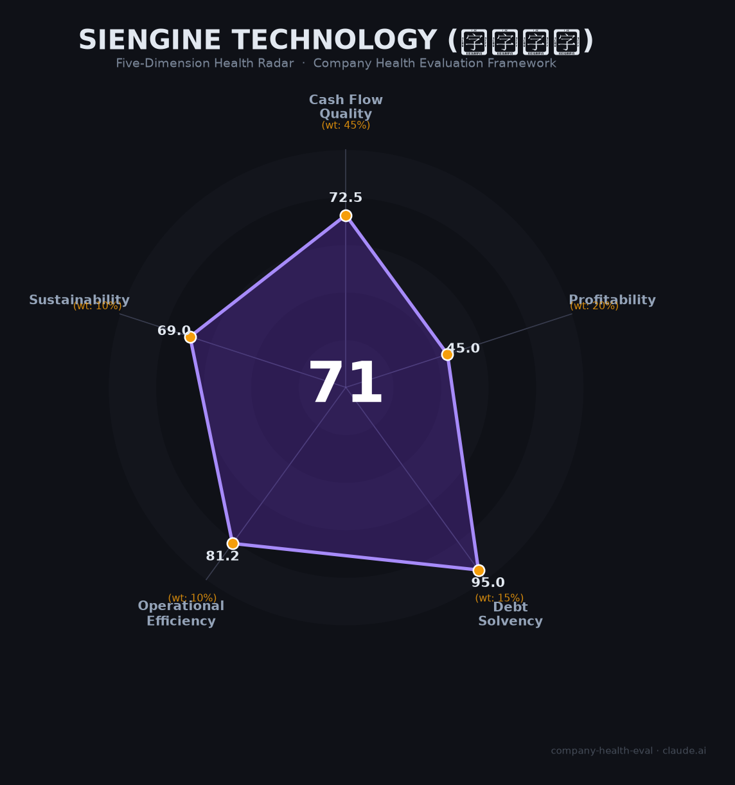

# 芯擎科技 财务健康评估（2026-06-14）

## 一句话结论

🟡 **中等偏上（71/100）** | 国产座舱芯片第一+龙鹰二号5nm追平高通，但烧钱亏损+吉利依赖+台积电命脉三重考验

---

## 一、公司基本画像

| 项目 | 内容 |
|------|------|
| **主体** | 湖北芯擎科技股份有限公司（SiEngine Technology），2018年9月由亿咖通（吉利系）与安谋中国合资成立 |
| **总部** | 武汉经济技术开发区；研发中心分布北京、上海、深圳、沈阳、重庆及美国 |
| **创始人/CEO** | 汪凯博士（伊利诺伊大学博士，前飞思卡尔全球销售VP兼亚太总裁、华芯通CEO、Broadcom大中华区总经理），30年+芯片行业经验 |
| **董事长** | 沈子瑜（亿咖通创始人兼CEO，上海交大硕士，李书福合伙人） |
| **股权结构** | 亿咖通超21%（第一大股东）、安谋中国约11%、红杉中国/中金资本/国调基金等机构股东；5个员工持股平台合计约20.5% |
| **员工规模** | 约400余人（集团口径），社保参保105人（母公司）；研发占比85%，硕博比例72%+ |
| **核心产品** | 龙鹰一号SE1000（7nm座舱SoC，2022年底量产，出货超百万片）；龙鹰二号SE2000（5nm座舱SoC，2026年4月发布，2027Q1适配）；星辰一号AD1000（7nm智驾，512 TOPS，2025年12月量产） |
| **商业模式** | Fabless芯片设计，Tier1/车企直销+技术授权 |
| **融资与估值** | 累计融资超30亿元（2025年B轮超10亿+2026年4月超1亿美元战略融资）；2026年初市场估值约200亿元 |
| **IPO状态** | 2025年12月完成股份制改造，筹备港股上市 |

**一句话定性**：芯擎科技是中国车规级智能座舱SoC国产替代的领跑者——龙鹰一号装机量国产第一（市占率4.1%，2025年1-11月），龙鹰二号5nm芯片已发布宣称全面超越高通8295，正从"吉利系亲儿子"向全行业+全球化供应商转型。

---

## 二、五维财务健康评估

### 1. 现金流质量（72.5/100）

| 评估指标 | 判断 | 依据 |
|----------|------|------|
| 经营现金流净额 | 🟡 关注 | 营收尚在爬坡（2024年估3-5亿），研发烧钱（年投入2-3亿），OCF大概率仍为负；CEO汪凯称"需出货几百万颗才回本"📊 |
| 现金覆盖周期 | 🟢 健康 | 累计融资超30亿，B轮后账面估16亿+，按年消耗2-3亿计算可支撑5-8年，远超12个月安全线📊 |
| 有息负债水平 | 🟢 健康 | 零有息负债，纯股权融资模式，无银行贷款记录🔒 |
| 净现比 | 🟡 关注 | 尚未盈利，无法计算有效净现比；以2024年营收3-5亿vs烧钱3亿+估算，现金流为净流出📊 |

**核心判断**：芯擎的现金流呈现典型的"高融资、高消耗"硬科技创业特征。现金安全垫极厚（30亿+融资），但经营现金流尚未转正。芯片行业"每颗芯片要卖几百万颗才回本"的规律意味着现金流拐点取决于出货量增速——按当前趋势（2025年出货150万片+，2026年龙鹰二号和星辰一号上车），预计2027-2028年有望达到经营现金流盈亏平衡。

### 2. 盈利能力（45.0/100）

| 评估指标 | 判断 | 依据 |
|----------|------|------|
| 毛利率 | 🟠 一般 | 估算25-35%（Fabless早期），低于行业稳态水平（成熟车规Fabless 40-60%）；龙鹰一号需以价换量对抗高通8155📊 |
| 净利率 | 🔴 预警 | 持续亏损——年营收3-5亿vs研发投入2-3亿+SG&A，净利率深负📊 |
| 营收增速（3年CAGR） | 🟢 优秀 | 2023年超1亿→2024年估3-5亿→2025年有望超10亿，CAGR远超200%📊 |
| 研发费用率 | 🔴 预警 | 研发费用率超45%且持续亏损——属于硬科技Fabless的典型特征，但按评分框架触发"alert"📊 |
| 人均产出 | 🟠 一般 | 人均营收约75-125万元（3-5亿/400人），远低于成熟Fabless（瑞芯微人均173万，联发科人均1000万+），处于成长期正常偏低水平📊 |

**核心判断**：盈利能力是芯擎当前最弱的维度——营收增速惊人（200%+ CAGR）但基数极低，规模效应尚未显现。这是硬科技Fabless的必经阶段（地平线、黑芝麻均持续亏损），但评分框架对"高研发烧钱+亏损"严格扣分。毛利率改善路径清晰：出货量从百万级→千万级摊薄单位成本，叠加龙鹰二号5nm高ASP产品放量，稳态毛利率有望在3-5年内升至40%+。

### 3. 偿债能力（95.0/100）

| 评估指标 | 判断 | 依据 |
|----------|------|------|
| 资产负债率 | 🟢 健康 | 零有息负债+超30亿元股权融资，Fabless轻资产模式，负债率极低🔒 |
| 有息负债率 | 🟢 健康 | 0%。从未借贷，全部依赖股权融资📊 |
| 流动比率 | 🟢 健康 | 大量现金储备（估16亿+）vs有限短期应付款，流动比远超2📊 |
| 现金比率 | 🟢 健康 | 纯Fabless无存货压力，现金比率远超1📊 |
| 股权质押比例 | 🟢 健康 | 无股权质押记录；Pre-IPO阶段股东以战略持有为主🔒 |
| 加分项 | ✅ | 零有息负债+高新技术企业税务优惠 → +5分🔒 |

**核心判断**：偿债能力是芯擎最亮眼的维度——零负债+30亿+现金储备，不存在任何债务违约风险。创始团队通过5个员工持股平台保留约20.5%股权激励池，融资节奏精准（几乎每年一轮），既保证资金充裕又不过度稀释。

### 4. 运营效率（81.2/100）

| 评估指标 | 判断 | 依据 |
|----------|------|------|
| 应收/渠道回款 | 🟢 健康 | Fabless芯片交货给Tier1/OEM，回款周期60-90天，行业标准；前装定点→量产→回款的闭环已跑通🔒 |
| 客户集中度 | 🟡 关注 | 吉利系（领克/极氪/银河）估计占比超60%，单客户依赖显著；但已获一汽红旗、长安、德国大众等订单，集中度在快速下降📊 |
| 员工规模趋势 | 🟢 健康 | 从2022年几十人→2024年400余人，高速扩张中；多城市研发中心布局（武汉/北京/上海/深圳/美国）🌐 |
| 高管稳定性 | 🟢 健康 | CEO汪凯自2019年至今在任（6年+），董事长沈子瑜自2018年至今（8年+），核心技术团队70%来自高通/AMD/联发科📊 |

**核心判断**：运营效率在快速改善。最大待解问题是客户集中度——吉利系超60%的依赖使芯擎面临"既是亲儿子又是单客户"的双刃剑。但德国大众海外订单（年80万片+）和一汽红旗定点是关键的"去吉利化"里程碑。如果2026-2027年大众订单稳定交付+新增2-3家非吉利系大客户，客户集中度可从"warning"升至"healthy"。

### 5. 可持续发展能力（69.0/100）

| 评估指标 | 判断 | 依据 |
|----------|------|------|
| 行业赛道空间 | 🟢 健康 | 中国座舱SoC市场CAGR 23%（2025E 204亿元→2030E 500亿+），国产化率从不足3%（2023）→18%（2025）→目标50%+（2030），赛道空间极为广阔📊 |
| 技术壁垒 | 🟡 关注 | 龙鹰一号7nm国产首发+龙鹰二号5nm追平高通8295（200 TOPS AI算力），12款产品矩阵覆盖座舱+智驾+AI加速。但高通技术仍领先1代（8295已规模出货），制程依赖台积电构成硬天花板📊 |
| 业务多元化 | 🟡 关注 | 产品线已从单一座舱芯片扩展到座舱+智驾+AI加速+SerDes，客户从吉利系扩展到一汽/大众/长安。但吉利系仍占60%+，全行业渗透仍在早期📊 |
| 资本支持 | 🟢 健康 | 港股IPO筹备中（2025年12月完成股改），估值约200亿；累计融资超30亿，资本弹药充裕；地平线/黑芝麻已上市为芯擎IPO提供了估值锚📊 |
| 政策/监管风险 | 🟡 关注 | 国产替代政策强力利好（2028年国产化率目标50%+），但美国出口管制（台积电7nm/5nm代工受限）和ARM架构授权不确定性构成核心威胁📊 |

**核心判断**：芯擎站在国产替代最强劲的顺风赛道上，但地缘政治逆风同样剧烈。台积电代工依赖是"阿喀琉斯之踵"——中芯国际7nm良率仅30-50%，无法完全替代。ARM架构授权是另一悬案。积极面：龙鹰二号5nm发布证明了芯擎持续迭代的技术能力，大众海外订单证明了国际竞争力，港股IPO将为下一阶段扩张提供关键资金。

---

## 三、综合评分与健康等级

| 维度 | 得分 | 权重 | 加权得分 |
|------|------|------|----------|
| 现金流质量 | 72.5 | 45% | 32.6 |
| 盈利能力 | 45.0 | 20% | 9.0 |
| 偿债能力 | 95.0 | 15% | 14.2 |
| 运营效率 | 81.2 | 10% | 8.1 |
| 可持续发展 | 69.0 | 10% | 6.9 |
| **综合得分** | | | **70.9 / 100** |

**健康等级**：🟡 **中等偏上（Moderate-High）**

雷达图清晰展示了芯擎的"双峰双谷"结构：偿债能力（95）和运营效率（81）为双高峰，盈利能力（45）和可持续发展（69）为双低谷，形成典型的硬科技创业"烧钱换增长"剖面。现金流质量（72.5）居中，处于从"纯消耗"到"近盈亏平衡"的过渡期。

---

## 四、同业对标

| 对比项 | 芯擎科技 | 地平线 (9660.HK) | 黑芝麻智能 (02533.HK) | 芯驰科技 |
|--------|:-------:|:---------------:|:---------------------:|:-------:|
| 成立时间 | 2018年 | 2015年 | 2016年 | 2018年 |
| 上市状态 | 港股筹备中 | 港股上市(2024.10) | 港股上市(2024.8) | 科创板筹备中 |
| 估值/市值 | ~200亿元（估） | ~685亿港元 | ~95亿港元 | >140亿元（估） |
| 2024年营收 | 3-5亿元（估） | 23.8亿元 | 4.7亿元 | ~10亿元（估） |
| 2025年营收 | 有望超10亿元（估） | 37.6亿元(+57.7%) | 8.2亿元(+73.4%) | — |
| 毛利率 | 25-35%（估） | 77.3%（含授权92%毛利率） | 41.1% | ~40%（估） |
| 盈利状态 | 亏损 | 经调整亏损28.1亿 | 经调整亏损10.8亿 | 亏损 |
| 出货量(座舱) | 超百万片(龙鹰一号) | — | — | 800万片(X9系列) |
| 出货量(智驾) | 星辰一号刚量产 | 超400万套(征程) | ~15万片(华山) | V9系列已量产 |
| 员工规模 | ~400人 | ~2,320人 | ~1,000人 | ~500人 |
| 核心客户 | 吉利系60%+一汽/大众/长安 | 比亚迪/理想/大众等 | 一汽/东风/吉利等 | 覆盖90%+主机厂 |
| 本体系得分 | **71** 🟡 | 63 🟠（已评估） | 未评估 | 未评估 |

**对标结论**：芯擎科技在国产车规芯片阵营中定位独特——座舱SoC出货量国产第一（2025年1-11月装机48.1万颗），智驾芯片刚起步（星辰一号2025.12量产），规模介于地平线（智驾王者，营收37.6亿）与黑芝麻（智驾挑战者，营收8.2亿）之间。与芯驰科技（全栈布局，800万片座舱出货）错位竞争：芯擎走高ASP（7nm/5nm先进制程），芯驰走高覆盖（MCU+网关+座舱全覆盖）。核心差距在于营收规模——地平线是芯擎的约4倍（37.6 vs ~10亿），但芯擎的营收增速更快（200%+ vs 58%）。

---

## 五、核心风险清单

1. **台积电代工卡脖子（高风险）**：龙鹰一号（7nm）和龙鹰二号（5nm）均依赖台积电代工。美国2025年出口管制新规——16nm以下先进逻辑芯片原则上需许可——虽主要瞄准AI训练芯片，但车规SoC存在被"扩大化执行"的风险。中芯国际7nm良率仅30-50%、产能5万片/月，短期内无法完全替代。如果台积电断供，芯擎最先进产品（龙鹰二号5nm）将直接停摆。触发条件：中美关系急剧恶化或美国将车规SoC纳入实体清单。

2. **ARM架构授权风险（中高风险）**：芯擎所有产品基于ARM架构。"一代一买"的授权模式限制了自主迭代空间。ARM母公司已多次传出欲绕过Arm China直接授权的动向。高通与ARM的诉讼案（2022年起）对全球ARM授权模式有风向标意义。如果ARM提高授权费（传涨300%）或收紧授权条件，将直接挤压芯擎利润空间和产品迭代节奏。

3. **吉利/亿咖通关联交易集中度（中风险）**：吉利系估计占营收60%+。虽然德国大众海外订单（年80万片+）和一汽红旗定点正在降低集中度，但短期内吉利仍是绝对核心客户。如果吉利系转向自研芯片（类似比亚迪自研D9000）或增加其他供应商（如高通），芯擎将面临剧烈冲击。但李书福通过芯擎+亿咖通+星纪魅族构建完整汽车智能化生态闭环的战略意图明显，短期放弃可能性低。

4. **盈利时间表不确定性（中风险）**：CEO汪凯称"需出货几百万颗才回本"。2025年出货约150万片，若按年化200-300万片增速，盈亏平衡点可能在2027-2028年。但若龙鹰二号和星辰一号的市场接受度不及预期，或行业价格战加剧（高通降价打压国产替代），盈利时间表可能大幅推迟。好在30亿+融资储备提供了足够的安全边际。

5. **车企自研芯片的替代威胁（中低风险）**：蔚来（神玑NX9031/5nm）、小鹏（图灵/7nm）、理想（马赫M100/5nm）、比亚迪（D9000系列）均已量产或即将量产自研芯片。但地平线CEO余凯预判"80%车企仍依赖供应商"，芯擎的目标客群是非头部的第二梯队车企+海外客户。5nm芯片研发成本约20亿元，需年销百万辆级才具备经济性——这让大多数中小车企的自研芯片计划不具备可行性。

---

## 六、求职/择业视角

### 核心优势

- **Pre-IPO期权价值高**：5个员工持股平台合计20.5%股权激励池，在200亿估值+港股上市预期下，早期核心员工的期权回报空间可观。2025年12月已完成股份制改造，上市进程确定性高
- **技术团队含金量高**：CEO汪凯博士30年国际芯片大厂履历（Broadcom/Freescale/华芯通）+核心团队70%来自高通/AMD/联发科，技术履历含金量是中国芯片行业顶级水平
- **赛道确定性极强**：国产车规芯片替代是"十年不遇"的结构性机会——从3%→18%→目标50%+国产化率，政策驱动力和市场规模增速（CAGR 23%）均属顶级
- **财务安全**：零负债+30亿+融资+港股上市在即=几乎没有公司倒闭风险，是芯片创业公司中难得的"稳"+"快"组合

### 现存短板

- **现金薪酬不及外资大厂**：架构师级85-90K/月 vs 高通/英伟达同级年薪150-200万（含RSU），现金差距30-50%。期权回报是弥补现金差距的核心工具，但变现依赖上市+解禁
- **工作强度因项目组差异大**：龙鹰二号5nm和星辰一号量产阶段大概率高强度，但公司规模小（400人）意味着个人影响力大
- **武汉总部可能限制人才选择**：相比上海/北京/深圳，武汉的芯片人才生态和跳槽机会更有限（但公司在北京/上海/深圳均设有研发中心）
- **技术天花板受制于地缘政治**：如果台积电断供5nm及以下制程，芯擎最先进产品的迭代空间被封住，长期技术发展受限

### 分场景建议

| 个人诉求 | 推荐 | 次选 | 规避 |
|----------|------|------|------|
| 期权回报+上市红利 | 芯擎科技（Pre-IPO+20.5%股权池+200亿估值） | 地平线/黑芝麻（已上市，期权成熟度高但弹性小） | — |
| 技术成长+履历镀金 | 地平线（规模最大，技术深度最强） | 芯擎科技（7nm→5nm先进制程经验稀缺） | 芯驰（产品线广但制程偏成熟） |
| 现金高薪+稳定 | 高通/英伟达中国（外企薪资天花板+股票） | 地平线（已上市+RSU可流通） | 芯擎（现金差距明显） |
| 国产芯片情怀+长期主义 | 芯擎科技（国产替代旗手） | 地平线/黑芝麻 | — |
| WLB优先 | — | 芯擎（965弹性，规模小管理扁平） | 任何Pre-IPO硬科技公司（上市冲刺期都不轻松） |

---

## 七、总结

**芯擎科技** 是中国车规级智能座舱芯片领域「国产替代的旗手、高通的追赶者」：龙鹰一号7nm出货超百万片、装机量国产第一（市占率4.1%），龙鹰二号5nm宣称全面超越高通8295；唯一短板是**营收尚处早期（~10亿级）、持续亏损、台积电代工和ARM授权构成地缘政治硬天花板**。

在「国产车规芯片替代加速（国产化率3%→18%→50%+）+港股IPO在即+龙鹰二号5nm+星辰一号智驾芯片双线量产」的大环境下，芯擎科技属于**中等偏上风险**，适合**对期权回报有期待、能接受创业公司现金薪酬折价、认同国产芯片长期价值**的求职者。值得持续观察的拐点信号：港股IPO时点与估值、龙鹰二号2027年上车表现、德国大众海外订单的持续放量、非吉利系客户营收占比能否突破50%。

---

*评估日期：2026-06-14 | 数据截至：2026年6月（龙鹰二号5nm已发布，星辰一号已量产）*
*评分引擎：company-health-eval v1.1 | 数据来源标注：🔒公开财报/工商 📊估算 🌐网络口碑*
