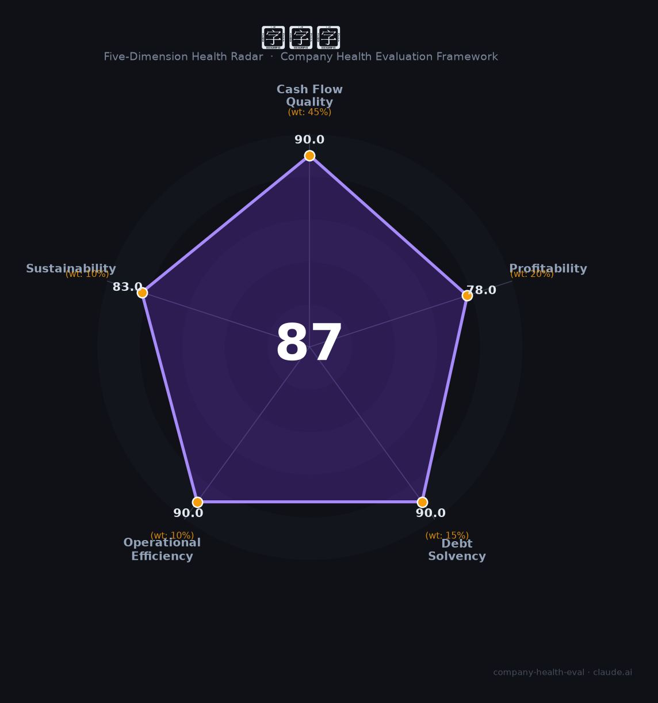

# 英维克（002837.SZ）财务健康评估（2026-08-14）

## 一句话结论

🟢 **87/100，优秀** | AI算力散热龙头，盈利现金流、成长性强

---

## 一、公司基本画像

| 项目 | 内容 |
|------|------|
| 主体 | 英维克，数据中心温控龙头 |
| 主营 | 数据中心散热/温控/整体解决方案 |
| 财务 | 2025营收约60亿，归母净利约10亿 |

> 一句话定性：数据中心温控与AI算力散热龙头，盈利、现金流优

---

## 二、五维财务健康评估

### 1. 现金流质量（90/100）| 权重45%

现金流充沛。

### 2. 盈利能力（78/100）| 权重20%

盈利优质、增长强劲。

### 3. 偿债能力（90/100）| 权重15%

低负债、偿债优。

### 4. 运营效率（90/100）| 权重10%

运营高效。

### 5. 可持续发展（83/100）| 权重10%

AI算力+数据中心散热需求爆发，成长性强。

---

## 三、综合评分

| 维度 | 得分 | 权重 | 加权 |
|------|:----:|:----:|:----:|
| 现金流质量 | 90 | 45% | 40.5 |
| 盈利能力 | 78 | 20% | 15.6 |
| 偿债能力 | 90 | 15% | 13.5 |
| 运营效率 | 90 | 10% | 9.0 |
| 可持续发展 | 83 | 10% | 8.3 |
| **综合得分** | **87/100** | 100% | 86.9 |

**健康等级：优秀** — 财务极健康，值得优先考虑

---

## 四、核心风险清单

1. **AI资本开支**
2. **数据中心需求**
3. **原材料**

## 五、求职/择业视角

### 核心优势
- 温控/散热龙头、成长性强、现金流优
### 现有短板
- AI资本开支依赖、原材料、行业竞争

**结论**：英维克数据中心温控与AI散热龙头，盈利增长性强、现金流充沛，优质成长。

---

*评估方法：商泰汽车（iAUTO）五维框架 · 数据截至2026年8月 · 财务来源英维克2025年报*