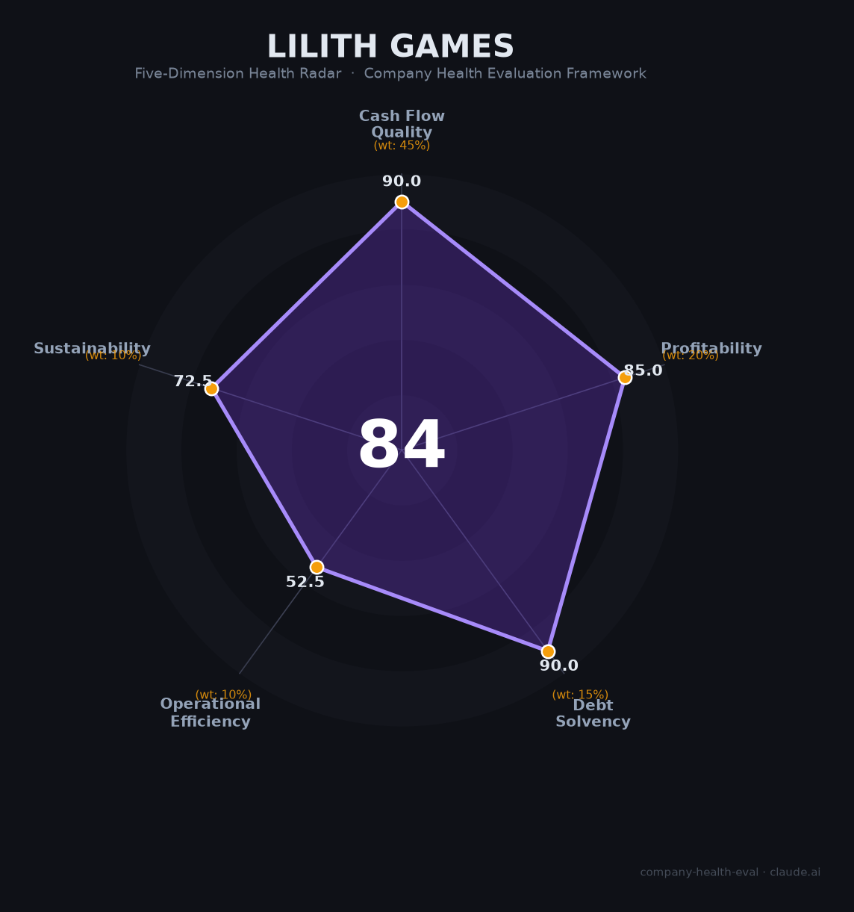

# 莉莉丝游戏（Lilith Games）财务健康评估（2026-06-12）

## 一句话结论

🟡 **中等偏上（84/100）** | 零负债+SLG运营能力顶级+游戏圈最佳WLB，唯一致命伤：超60%收入系于一款7年老游戏

## 一、公司基本画像

| 维度 | 内容 |
|------|------|
| **主体** | 上海莉莉丝科技股份有限公司（非上市） |
| **成立** | 2013年5月10日，上海 |
| **创始人** | 王信文（CEO，~37%）、袁帅（CPO，~26%）、张昊（COO，~19%），三人均为南大校友+前腾讯北极光工作室 |
| **融资** | 仅2013年天使轮¥200万（IDG）+ 2015年A轮数千万（高榕/IDG）+ 后续腾讯入股。早期融资极小，快速自我造血 |
| **估值** | ¥225亿（2025胡润全球独角兽榜），较2021年峰值$80亿回调显著 |
| **员工** | 全球约2,300+人，上海徐汇华鑫慧享城 |
| **主营** | SLG+放置卡牌手游研发与全球发行，海外收入占比>70% |
| **核心产品** | 万国觉醒（2018，累计>$35亿）、剑与远征（2019，累计>$15亿）、剑与远征：启程（2024，首年>¥20亿） |
| **2024年营收** | ~¥100亿（上海官方披露，首次跨入百亿门槛），同比+30% |
| **AI布局** | AWS Bedrock+Claude多模态，已落地6+生成式AI应用，Multi-Agent系统建设中 |

莉莉丝是中国SLG出海「上海F4」之一，以《万国觉醒》全球累计超$35亿封神，2024年成为上海游戏四小龙中首个营收破百亿者。但2025年Sensor Tower排名从第5跌至第11，《远光84》投入¥10亿惨败，转型阵痛明显。

## 二、五维财务健康评估

### 1. 现金流质量（90.0/100）

| 指标 | 现状 | 判定 |
|------|------|------|
| 经营现金流 | SLG成熟产品OCF充裕，壳木对标OCF/NI=1.15x | ✅ 健康 |
| 现金跑道 | 2025.6单月利润~¥6.67亿（流传），自给自足 | ✅ 健康 |
| 有息负债 | **零**外部融资依赖，无银行贷款 | ✅ 健康 |
| 净现比 | SLG预付费+成熟期OCF>NI | ✅ 健康 |

**解读**：莉莉丝的现金流来自三款拳头产品的持续造血。《万国觉醒》运营7年+仍月流水过亿，《剑与远征》七周年累计$15亿。2025年6月流传单月利润约¥6.67亿，若全年化约¥80亿利润——虽未经审计但指向极强的盈利能力。无负债、无外部融资依赖，财务安全垫极厚。

### 2. 盈利能力（85.0/100）

| 指标 | 现状 | 判定 |
|------|------|------|
| 毛利率 | SLG行业70-83%，估~75% | 🏆 优秀 |
| 净利率 | 估10-20%（SLG成熟期），流传56%存疑 | ✅ 良好 |
| 营收增速（3Y CAGR） | 2021 ¥74.85亿→2024~¥100亿，CAGR~10% | ✅ 良好（10-20%） |
| 研发/AI投入 | 6+GenAI应用+Multi-Agent+Claude多模态 | 🏆 优秀 |
| 人均产出 | ~¥435万/人（2024） | ✅ 良好（行业中等偏上） |

**解读**：莉莉丝的盈利能力核心来自SLG品类的高毛利+成熟期买量成本递减。相比壳木游戏净利率33%（神州泰岳上市可查），莉莉丝10-20%的净利率受新游试错成本拖累（《远光84》单项目亏损¥10亿）。若剔除一次性试错成本，成熟产品线利润释放潜力巨大。

### 3. 偿债能力（90.0/100）

| 指标 | 数值 | 判定 |
|------|------|------|
| 资产负债率 | 接近0% | ✅ 健康 |
| 有息负债率 | 0% | ✅ 健康 |
| 流动比率 | 极高 | ✅ 健康 |
| 现金比率 | 极高 | ✅ 健康 |
| 股权质押 | 无 | ✅ 健康 |

**解读**：莉莉丝是中国极少数「从未大规模融资却做到百亿营收」的科技公司。三位创始人通过自然人持股+持股平台保持绝对控制，外部投资机构（IDG/高榕/腾讯）占比极小。零负债+极强自有现金流→资产负债表极为干净。

### 4. 运营效率（52.5/100）

| 指标 | 现状 | 判定 |
|------|------|------|
| 产品集中度 | 《万国觉醒》占营收>60% | 🔴 危险（单一产品依赖） |
| 员工规模趋势 | 1,900→2,300+，持续扩招 | ✅ 健康 |
| 高管稳定性 | 三人创始联盟稳固，但中层/项目负责人更替频繁 | ⚠️ 关注 |

**解读**：运营效率是莉莉丝最大的结构性软肋。>60%收入来自一款运营7年+的SLG，而新品管线屡遭重挫——2024年《生活派对》裁撤、《万龙觉醒》未达预期，2025年《远光84》¥10亿投入血本无归。唯一亮点是《Palmon: Survival》月流水破¥6000万。三位创始人在腾讯时期就是同事+南大校友，13年联盟稳固，但中层流动性偏高（制作人凯丁下课、北京负责人涉腐刑拘）。

### 5. 可持续发展（72.5/100）

| 指标 | 现状 | 判定 |
|------|------|------|
| 行业赛道 | 全球手游+6%，SLG品类+16%，但竞争白热化 | ⚠️ 关注 |
| 技术壁垒 | SLG全球化运营+AI多智能体先发优势 | ✅ 健康 |
| 业务多元化 | >70%海外收入，200+国家地区覆盖 | ✅ 健康 |
| 资本支持 | 未上市，纯自有现金流 | ⚠️ 关注 |
| 政策/监管 | IDFA冲击+多法域合规+版号限制 | ⚠️ 关注 |

**解读**：SLG仍是全球手游第一大品类（$175亿），莉莉丝的全球化运营能力（>70%海外收入、200+国家）是核心壁垒。但IDFA隐私政策后买量精准度骤降，2020年峰值$10.8亿→2023年$6.25亿缩水42%。未上市限制了融资渠道和员工激励流动性，「阿拉丁计划」（项目20%利润分红）是勉力留人的补偿方案。版号获批节奏慢（2025年仅1个），被迫持续「全力出海」。

## 三、综合评分与健康等级

| 维度 | 得分 | 权重 | 加权得分 |
|------|:----:|:----:|:--------:|
| 现金流质量 | 90.0 | 45% | 40.5 |
| 盈利能力 | 85.0 | 20% | 17.0 |
| 偿债能力 | 90.0 | 15% | 13.5 |
| 运营效率 | 52.5 | 10% | 5.2 |
| 可持续发展 | 72.5 | 10% | 7.2 |
| **综合得分** | | | **83.5** |
| **健康等级** | | | **🟡 中等偏上** |

## 四、同业对标

| 对比项 | 莉莉丝 | 壳木（神州泰岳） | 三七互娱 | FunPlus |
|--------|:------:|:------:|:------:|:------:|
| 上市 | 未上市 | A股 300002 | A股 002555 | 未上市 |
| 2024年营收 | ~¥100亿 | ¥46.6亿 | ¥174亿 | ~$3.85亿 |
| 净利率 | ~10-20%（估） | 33.3% | 15.3% | 未披露 |
| 海外占比 | >70% | >90% | 32.8% | ~100% |
| 人均创收 | ~¥435万 | ~¥1,086万 | ~¥506万 | ~¥138万 |
| 核心产品 | 万国觉醒（7年+） | 旭日之城（6年+） | P&S（4年+） | SoS（5年+） |

**对标结论**：莉莉丝在SLG出海阵营中居于中上游——收入规模超壳木/FunPlus但利润率不及壳木（壳木受益于更极致的费用控制），与三七互娱体量相当但海外能力更强。核心差距在「新品迭代成功率」——同期点点互动/元趣以SLG+X融合玩法横扫市场，莉莉丝仍靠老产品支撑。

## 五、核心风险清单

1. **单产品依赖症（高）**：《万国觉醒》>60%收入占比，运营7年+已进入成熟后期。一旦加速下滑，公司现金流将面临断崖式冲击。
2. **新品失败率高（高）**：《远光84》¥10亿打水漂、《生活派对》裁撤、《万龙觉醒》不及预期、《剑与家园2》关停——《Palmon: Survival》是近年唯一亮点但尚待规模化验证。
3. **SLG赛道格局恶化（中高）**：点点互动（Whiteout Survival月流¥12亿）和元趣（Last War月流¥15亿）以SLG+X融合玩法降维打击，莉莉丝的纯SLG模式护城河正在被侵蚀。
4. **IDFA后买量模式受冲击（中高）**：苹果ATT政策使买量精准度骤降，2020→2023收入缩水42%。虽然2024年恢复至百亿，但买量成本持续上升。
5. **未上市限制（中）**：无公开市场融资渠道→¥10亿级试错完全自担；核心员工激励缺乏流动性→长期留人挑战。
6. **内部反腐（中）**：2026年5月通报70+起违规、10+人移送司法、22家供应商拉黑→短期声誉承压但长期利好治理。

## 六、求职/择业视角

### 核心优势
- **WLB行业天花板**：965双休+午休2小时，7点后工位空一半，CEO公开反对996
- **福利传说级**：Herman Miller人体工学椅+升降桌+撸猫房+健身房+乐队排练厅+每周五免费酒吧+年会30g金条
- **薪酬第一梯队**：校招15-30K·16薪（24-48万），社招25-50K·16薪（40-80万），核心项目20%利润分红（阿拉丁计划）
- **上海徐汇漕河泾**：候选人在上海，通勤便利
- **无竞业协议**（游戏行业极其罕见）

### 现存短板
- **项目风险高**：成功项目暴富vs失败项目全裁，「阿拉丁计划」将风险转嫁给员工
- **培训不系统**：「上来就是干」，新人成长靠自己
- **无食堂/无房补**：相比字节网易在生活配套上有短板
- **职业天花板**：未上市+创始人高度控盘→晋升通道窄

### 分场景建议

| 个人诉求 | 推荐程度 | 理由 |
|----------|:--------:|------|
| 稳定+深耕 | 🟡 推荐 | 现金充裕+WLB极好，但项目失败可能被裁 |
| 高薪+跳板 | 🟢 强烈推荐 | 薪酬行业顶级+SLG运营经验稀缺+无竞业限制 |
| 成长+AI赛道 | 🟡 推荐 | AI Agent+游戏交叉是独特经验，Claude/Bedrock/Multi-Agent直接接触 |
| WLB优先 | 🟢 强烈推荐 | 可能是中国游戏圈最不卷的大厂 |

## 七、总结

莉莉丝游戏是中国SLG出海「财务极稳、运营能力顶级、WLB行业天花板」的公司：零负债+百亿营收+>70%海外收入构成了极强的抗风险能力，6+GenAI应用+Multi-Agent系统布局是游戏AI落地的标杆。唯一致命伤是>60%收入系于《万国觉醒》一款7年老游戏——这不是财务问题，是战略问题。

在当前「SLG赛道内卷+新品管线青黄不接」的背景下，莉莉丝属于🟡 **中等偏上**，适合**追求高薪酬+极致WLB+热爱SLG品类、能承受项目失败风险**的求职者——一个赚钱不难、加班不多、但赌项目运气的选择。

---

*评估日期：2026-06-12 | 数据截至：2024年上海官方披露+2026年6月第三方估算（Sensor Tower/AppMagic/36氪）*
