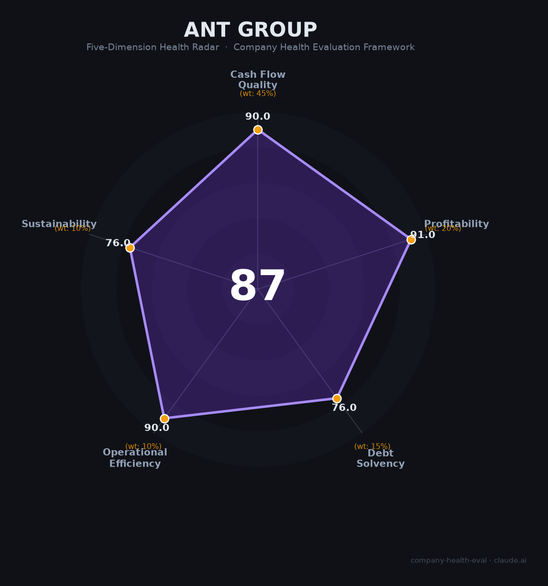

# 蚂蚁集团 财务健康评估（2026-06-12）

## 一句话结论

🟢 **优秀（86.7/100）** | 现金储备2,800亿+、净利润强劲反弹（+61%）、AI全面转型；唯监管遗留问题（金控牌照未获批）和支付份额持续下滑是核心隐忧

---

## 一、公司基本画像

| 项目 | 内容 |
|------|------|
| **全称** | 蚂蚁科技集团股份有限公司（Ant Group） |
| **成立** | 2014年10月（前身支付宝2004年12月） |
| **总部** | 杭州（Z空间+ A空间，在建全球总部二期） |
| **创始人** | 马云（2023年1月放弃实际控制权，表决权从53.46%降至6.2%） |
| **董事长兼CEO** | 井贤栋 |
| **员工** | 36,559人（2024年末），技术人员占比59% |
| **主营业务** | 数字支付（~40%营收）+ 数字金融科技平台（信贷/理财/保险，~60%） |
| **核心产品** | 支付宝（全球MAU 10.4亿）、支小宝AI助手（5,908万用户）、百灵大模型、百宝箱Agent平台 |
| **2024年净利润** | ~383亿元（+61% YoY，📊 推算自阿里财报权益法） |
| **估值** | ~880亿美元（2025-2026年估算，较2020年IPO峰值3,150亿美元缩水72%） |
| **IPO状态** | 母公司整体上市无时间表；蚂蚁国际子公司拟2026年赴港IPO，估值~100亿美元 |

蚂蚁集团是中国最大的金融科技平台，2020年11月IPO（估值2.1万亿元）在临门一脚被叫停，随后经历三年全面整改（罚款71.23亿元、业务重塑、控制权变更）。2024年起利润强劲反弹，2025年3月成立AGI部门全面转型AI。当前是最典型的"凤凰涅槃"型公司——监管枷锁渐松，估值远未修复。

---

## 二、五维财务健康评估

### 1. 现金流质量（90.0/100）

| 指标 | 状态 | 详情 |
|------|------|------|
| 经营现金流净额 | ✅ 健康 | 连续多年盈利（2021年峰值730亿→2022年312亿→2023年238亿含罚款→2024年反弹383亿），经营现金流预计持续为正（📊 估算） |
| 现金及等价物 | ✅ 健康 | 自有银行存款317亿+交易性金融资产2,491亿=合计流动性约2,808亿元（2024年末），覆盖运营支出约21个月 |
| 有息负债 | ✅ 健康 | 传统有息负债极低。信贷业务98%资金来自合作银行，自身信用风险敞口小 |
| 净现比 | ✅ 健康 | 支付业务手续费实时到账、信贷技术费按月结算，现金转换周期极短，净现比预计>1（📊 估算） |

蚂蚁集团现金流质量评分90分，四大指标均为健康。核心优势在于支付业务的"现金流前置"特性——手续费在交易瞬间即确认收入，几乎零应收账款。2024年末流动性资产2,808亿元，足以覆盖21个月以上运营支出，远超12个月的健康阈值。唯一的不确定性是非上市公司不披露现金流量表，OCF和净现比均为估算。

### 2. 盈利能力（91.0/100）

| 指标 | 等级 | 详情 |
|------|------|------|
| 毛利率 | 🌟 卓越 | 信贷中介业务毛利率~78%（📊 行业估算），综合毛利率估算55-70%，远超金融科技行业75分位 |
| 净利率 | 🌟 卓越 | 2024年净利润383亿/估算营收~2,000亿≈19%，远超15%基准线 |
| 营收增速 | 👍 良好 | 近3年受监管整改压制，估算CAGR 8-12%。2024年起AI和跨境支付驱动重新加速 |
| 研发费用率 | 🌟 卓越 | 2024年研发投入234.5亿元，估算研发费用率约11-12%，处于10-25%最优区间 |
| 人均产出 | 🌟 卓越 | ~568万元/人（📊 估算营收2,100亿/37,000人），显著高于金融科技行业平均 |

盈利能力评分91分，五项指标中四项卓越。蚂蚁的78%毛利率来自其独特的"联合贷"轻资产模式——只提供技术和风控，98%资金来自合作银行，这在全球金融科技中都是顶级的商业模式。2024年净利润强劲反弹61%，显示业务已走出整改低谷。人均产出568万元充分体现37,000人团队的高效运转。

### 3. 偿债能力（76.0/100）

| 指标 | 状态 | 详情 |
|------|------|------|
| 资产负债率 | ✅ 健康 | 总资产6,586亿元中包含923亿元客户资金存款（非债务性负债），剔除后估算资产负债率<40%（📊 估算） |
| 有息负债率 | ✅ 健康 | 集团层面传统有息负债极低，信贷业务依赖合作银行出资 |
| 流动比率 | ⚠️ 关注 | 无法精确验证（非上市公司不披露流动负债明细） |
| 现金比率 | ⚠️ 关注 | 无法精确验证（同上） |
| 股权质押比例 | ✅ 健康 | 2023年控制权调整后，股权结构清晰，无大股东质押风险 |

偿债能力评分76分。两个"关注"评级仅因非上市公司数据不透明，而非已知偿债风险。实际偿债能力极强——账面流动性2,808亿元，远超过任何可预见的债务义务。蚂蚁消金（注册资本230亿元，行业最高）也已满足监管资本金要求。

### 4. 运营效率（90.0/100）

| 指标 | 状态 | 详情 |
|------|------|------|
| 应收周转 | ✅ 健康 | 支付手续费实时到账，信贷技术费按月结算，应收账款周转天数预计<15天 |
| 客户集中度 | ✅ 健康 | 10.4亿支付宝MAU + 8,000万+商户，零单一客户依赖 |
| 员工规模趋势 | ✅ 健康 | 近三年逆势扩张（26K→30K→37K），两年增长40%，2026年校招技术岗占比85% |
| 高管稳定性 | ✅ 健康 | 井贤栋（董事长兼CEO）在位10年+，倪行军（CTO，支付宝第一行代码作者）20年+，核心团队稳定 |

运营效率评分90分，四大指标全健康。蚂蚁近三年逆势扩招40%（从26,000人到37,000人），在互联网行业裁员潮中独树一帜——这反映了AI战略投入和国际化扩张的决心。2026年校招技术岗占比85%、AI岗超70%，人才结构正向AI方向深度调整。

### 5. 可持续发展能力（76.0/100）

| 指标 | 状态 | 详情 |
|------|------|------|
| 行业赛道空间 | ⚠️ 关注 | 第三方支付市场增速降至3%（进入存量竞争），支付宝份额从82.8%（2014）降至20.7%（2024）。但AI+金融科技和跨境支付（+18%）提供新增长极 |
| 技术壁垒 | ✅ 健康 | 百灵Ling-1T万亿参数大模型（C-Eval 92.19，开源模型前列）+ 支付宝10亿用户数据飞轮 + 金融风控20年积累，3年+难以复制 |
| 业务多元化 | ✅ 健康 | 支付+信贷+理财+保险+AI+区块链+跨境支付，覆盖金融全链条 |
| 资本支持 | ✅ 健康 | 年净利润383亿元自给自足，蚂蚁国际IPO（估值$100亿+）即将打开新的融资通道 |
| 政策/监管风险 | ⚠️ 关注 | 金融控股公司牌照至今未获批（整改的核心法律程序未完结），支付市场份额持续下滑，央行"规范互联网平台金融业务"政策方向不确定 |

可持续发展能力评分76分。百灵大模型在技术评测中表现亮眼（C-Eval 92.19超越多个主流竞品），集团AI产品矩阵完整（支小宝+百宝箱+灵光App）。但支付主航道面临结构性挑战：微信支付在线下场景和笔数上已遥遥领先（8:2），2024年淘宝接入微信支付进一步削弱支付宝的闭环优势。金控牌照未获批是最大的监管悬案。

---

## 三、综合评分与健康等级

| 维度 | 得分 | 权重 | 加权得分 |
|------|:----:|:----:|:--------:|
| 现金流质量 | 90.0 | 45% | 40.5 |
| 盈利能力 | 91.0 | 20% | 18.2 |
| 偿债能力 | 76.0 | 15% | 11.4 |
| 运营效率 | 90.0 | 10% | 9.0 |
| 可持续发展 | 76.0 | 10% | 7.6 |
| **综合得分** | **86.7** | **100%** | **86.7/100** |

**健康等级：🟢 优秀（Excellent）**

---

## 四、同业对标

| 对比项 | 蚂蚁集团 | 腾讯金融科技 | 京东科技 | 字节抖音支付 |
|--------|:----:|:----------:|:--------:|:----------:|
| 上市/估值 | 未上市（~$880亿） | 腾讯子公司（集团$5,000亿+） | 未上市（~¥1,400亿） | 字节子公司 |
| 年收入估算 | ~2,100亿（估） | 金科板块~1,700亿 | 未公开 | ~95亿（年化） |
| 净利润 | 383亿（2024） | 集团2,248亿 | 未公开 | 亏损（-12.7%利润率） |
| 支付份额（笔数） | 36.2% | **59.7%** | <1% | <1% |
| 用户规模 | 支付宝10.4亿MAU | 微信支付14.7亿MAU | 京东5.8亿年活 | 抖音7.9亿MAU |
| AI核心模型 | 百灵Ling-1T（C-Eval 92.19） | 混元T1（C-Eval 91.9） | 言犀大模型 | 豆包（2.27亿MAU） |
| 员工数 | 37,000 | 115,000（集团） | 10,000+ | 150,000（集团） |
| 跨境支付 | **Alipay+ 40钱包/18亿用户** | 有限 | 无 | 无 |

**对标结论**：蚂蚁集团在盈利能力（净利率~19%）、跨境支付（Alipay+是全球覆盖面最广的跨境支付网络）和AI技术（百灵Ling-1T评测领先）三个维度保持竞争优势；但在支付主战场，微信支付已全面反超（笔数份额59.7% vs 36.2%），且差距仍在扩大。蚂蚁正从"支付公司"向"AI+金融科技平台"战略转型。

---

## 五、核心风险清单

1. **金控牌照未获批（高风险）**：自2021年被要求申设金控以来已逾5年，牌照仍未获批。这是整改在法律程序上未完全收官的标志，也是重启IPO的最大障碍。若最终被拒或要求更严格的资本金，将严重冲击业务模式和估值。

2. **支付份额持续下滑（中高风险）**：支付宝支付笔数份额从2014年的82.8%降至2024年的20.7%（按金额仍领先）。微信支付凭借社交粘性在线下场景形成碾压优势（8:2）。2024年淘宝接入微信支付进一步瓦解支付宝的电商闭环护城河。

3. **监管政策反复风险（中风险）**：央行2025年提出"规范互联网平台金融业务"，若要求提高自营贷款比例（当前仅2%），将大幅增加资本金需求和信用风险敞口。金融稳定法2026年有望三审通过，可能带来新的合规要求。

4. **估值修复漫长（中风险）**：当前估值~880亿美元，仅为2020年IPO峰值（3,150亿美元）的28%。员工期权回购价从400元降至115元，人才激励效果大打折扣。蚂蚁国际独立IPO（估值$100亿+）是短期最现实的估值催化剂。

5. **稳定币/Web3监管两难（低风险）**：蚂蚁在香港申请稳定币牌照布局，但2025年10月被央行/网信办指示暂停。数字人民币推广遇冷但监管对民营稳定币高度警惕，创新空间受限。

---

## 六、求职/择业视角

### 核心优势
- **现金薪酬竞争力强**：校招技术岗36-50万/年，博士月薪50K行业断层领先，AI Agent岗月薪30-70K·20薪（年包60-120万）。2025年取消13薪改为并入月base（月薪涨8.3%），现金流改善
- **AI转型红利期**：2025年3月成立AGI部门（CTO何征宇直接挂帅），百灵大模型已开源万亿参数模型，校招AI岗超70%，"蚂蚁星"计划GPU无上限。百宝箱Agent平台是金融AI落地的核心场景
- **国际化机遇**：蚂蚁国际拟2026年赴港IPO（估值$100亿+），覆盖220+市场，跨境支付增速+18%，是少有的中国FinTech全球化平台
- **稳定性回升**：2023年71亿罚款落地后进入常态化监管，2024年员工净增6,800人，无大规模裁员风险

### 现存短板
- **IPO期权兑现遥遥无期**：母公司整体上市无时间表，期权回购价仅115元（2020年为400元），早期员工的"造富梦"已基本破碎
- **工作强度高+绩效文化严苛**：361考核制（10%强制淘汰）、"325"低绩效=变相裁员、"没有大腿就是待宰羔羊"的嫡系文化广为诟病
- **品牌背书有限**：蚂蚁经历对跳槽传统互联网大厂（腾讯/字节）的加分不如阿里/腾讯。金融科技赛道较窄，跨界通用性一般
- **支付业务增长天花板**：支付宝国内用户已近饱和，存量竞争激烈，支付方向不再是高增长赛道

### 分场景建议

| 个人诉求 | 推荐 | 次选 | 规避 |
|----------|------|------|------|
| 稳定+深耕 | 蚂蚁（支付/风控等成熟业务线，杭州总部） | 腾讯金融科技 | 字节金融（亏损期） |
| 高薪+现金回报 | 蚂蚁（AI Agent方向，现金薪资高于期权预期） | 字节豆包 | 期望IPO暴富的小公司 |
| AI成长红利 | 蚂蚁AGI部门（百灵大模型+百宝箱Agent平台） | 阿里通义千问 | 百度文心（C端萎缩） |
| 国际化+跨境 | 蚂蚁国际（Alipay+，2026年港股IPO预期） | 连连数字 | 纯国内支付公司 |

---

## 七、总结

蚂蚁集团是中国金融科技领域"盈利能力最强、现金储备最充裕"的平台——自有流动性2,808亿元覆盖21个月运营支出，净利润383亿元且强劲反弹（+61%），百灵万亿参数大模型评测领先，唯一短板是金控牌照未获批（整改5年仍未完全收官）和支付主航道份额持续被微信支付侵蚀。在中国金融科技从"野蛮生长"转向"持牌合规"的大背景下，蚂蚁属于优秀（86.7分），适合追求高现金薪酬+AI转型机遇+国际化平台、且能接受IPO期权兑现不确定性的求职者的选择。对于以AI Agent为职业方向的候选人，蚂蚁百宝箱Agent平台在金融垂直场景（支付MCP、风控、信贷）具备独特壁垒——是"离交易最近的Agent平台"。

---

*评估日期：2026年6月12日 | 数据截至：2024年末财报/2026年Q1公开报道 | 注意：蚂蚁集团为非上市公司，财务数据多为基于阿里财报权益法的推算，标注「📊 估算」*
