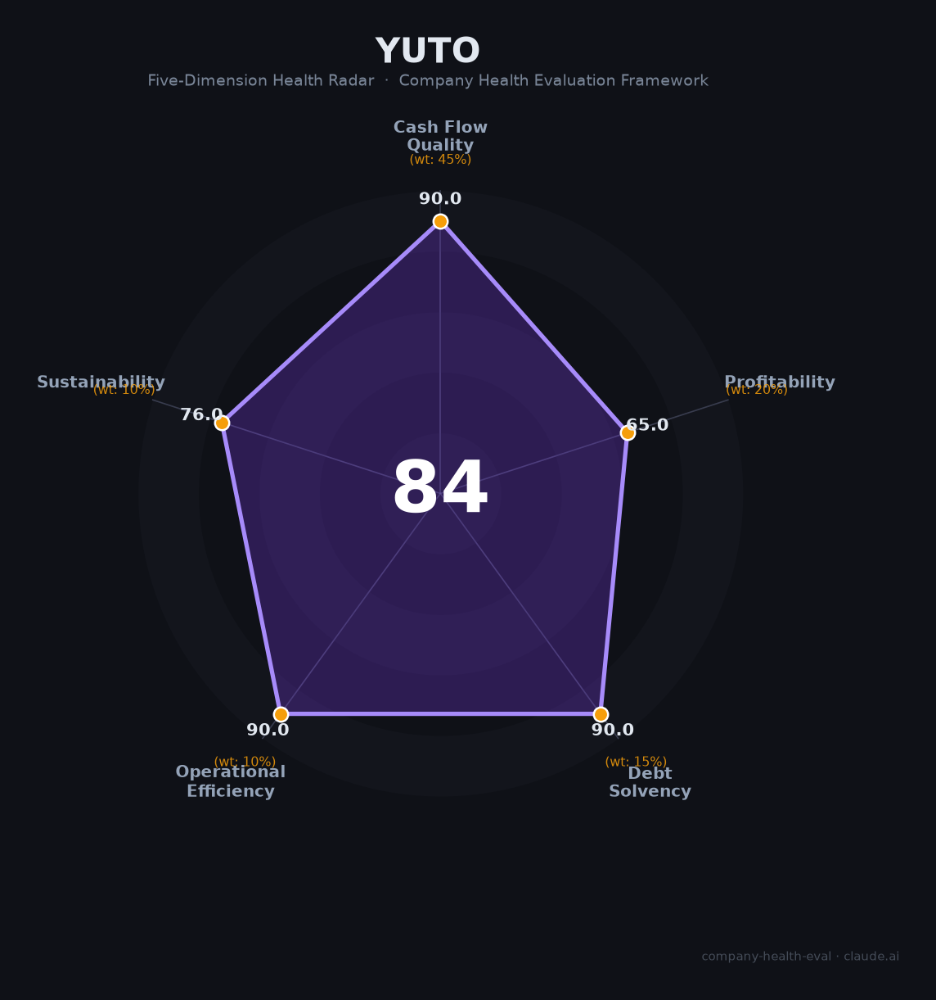

# 裕同科技（002831.SZ）财务健康评估（2026-08-14）

## 一句话结论

🟡 **84/100，中等偏上** | 消费电子包装龙头，营收稳、盈利强、现金流好

---

## 一、公司基本画像

| 项目 | 内容 |
|------|------|
| 主体 | 裕同科技，包装行业龙头 |
| 主营 | 消费电子/智能硬件包装 |
| 财务 | 2025营收172.38亿(+0.47%)，归母净利15.92亿(+13.05%) |

> 一句话定性：包装龙头，营收持平、净利双位数增、现金流强

---

## 二、五维财务健康评估

### 1. 现金流质量（90/100）| 权重45%

经营现金流强、现金储备充足。

### 2. 盈利能力（65/100）| 权重20%

毛利率与净利提升，盈利质量高。

### 3. 偿债能力（90/100）| 权重15%

低负债、偿债极稳健。

### 4. 运营效率（90/100）| 权重10%

运营效率高。

### 5. 可持续发展（76/100）| 权重10%

消费电子包装需求平稳，海外布局+环保包装打开空间。

---

## 三、综合评分

| 维度 | 得分 | 权重 | 加权 |
|------|:----:|:----:|:----:|
| 现金流质量 | 90 | 45% | 40.5 |
| 盈利能力 | 65 | 20% | 13.0 |
| 偿债能力 | 90 | 15% | 13.5 |
| 运营效率 | 90 | 10% | 9.0 |
| 可持续发展 | 76 | 10% | 7.6 |
| **综合得分** | **84/100** | 100% | 83.6 |

**健康等级：中等偏上** — 整体稳健，局部有待改善

---

## 四、核心风险清单

1. **消费电子需求波动**
2. **包装业毛利率承压**
3. **客户集中**

## 五、求职/择业视角

### 核心优势
- 包装龙头、现金流好、员工稳定
### 现有短板
- 营收增长停滞

**结论**：裕同科技包装龙头，盈利与现金流强、负债低，营收增长平稳，稳健优质。

---

*评估方法：商泰汽车（iAUTO）五维框架 · 数据截至2026年8月 · 财务来源裕同科技2025年报*