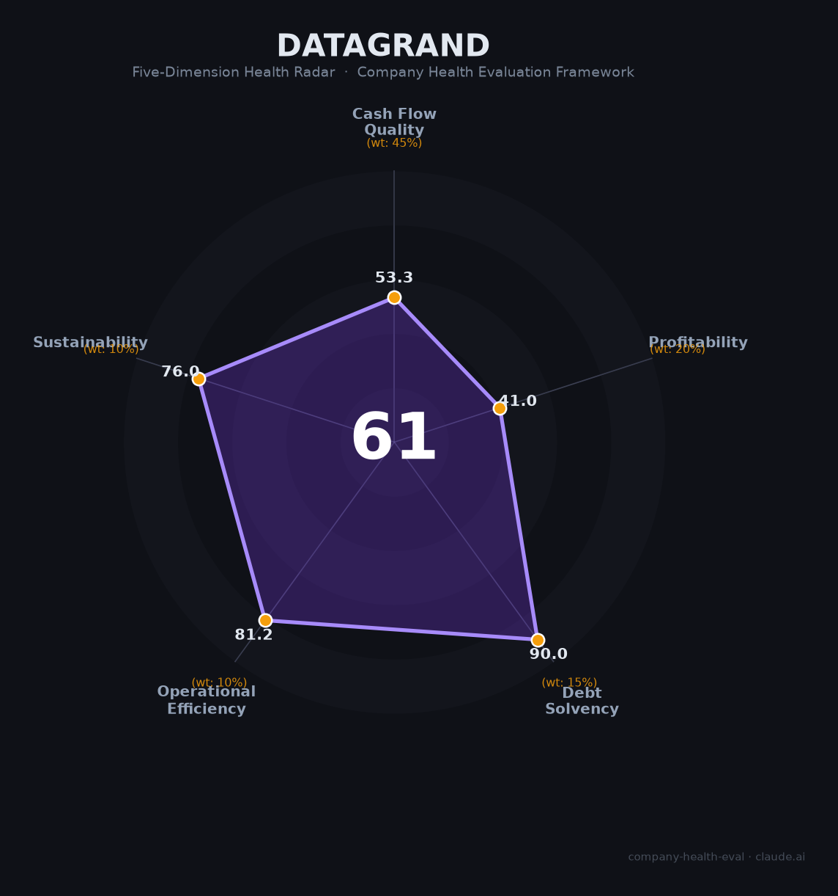

# 达观数据（DataGrand）财务健康评估（2026-06-12）

## 一句话结论

🟠 **中等（61/100）** | NLP文本智能小巨人，金融客户壁垒深厚，C轮后4年未融资+大厂免费挤压是核心生存压力

---

## 一、公司基本画像

- **主体**：达而观信息科技（上海）有限公司，2015年5月成立，总部上海张江
- **股权结构**：陈运文（CEO，直接24.45%+员工平台11.95%，合计36.4%），中信/招商/广发/中信建投四大券商参股，深创投、真格基金、软银赛富等
- **规模**：约400-500人（上海总部社保参保约173-283人），北京/深圳/成都/苏州/长沙分支
- **主营**：NLP文本智能处理+企业级知识库+智能数字员工Agent，自研"曹植"大模型（70B参数，Transformer+MoE）
- **资质**：国家级专精特新"小巨人"（2021）、上海市创新型企业总部（2026）、吴文俊人工智能奖
- **融资状态**：天使轮至C+轮累计约11亿元，最新一轮为2023年2月C+轮（基石资本领投），迄今超3年无新融资

**一句话定性**：国内NLP文本智能处理龙头，覆盖80%股份制银行+全部头部券商，金融场景壁垒深厚，但C轮后融资断档、私有化重交付模式、大厂免费产品挤压三重压力下处境艰难。

---

## 二、五维财务健康评估

### 1. 现金流质量（53/100）

| 指标 | 判定 | 依据 |
|------|:--:|------|
| 经营现金流净额 | 🔴 危险 | 非上市AI公司，C轮后多年未融资，几乎必然为负 |
| 现金及等价物 | 🟡 关注 | C轮融资5.8亿（2022）+C+轮数亿（2023），但距今3年+无新融资，400-500人团队消耗下现金可能趋紧 |
| 有息负债 | 🟢 健康 | VC驱动型公司，几乎零有息负债 |
| 净现比 | — 缺失 | 无利润数据 |

**核心判断**：C+轮（2023.2）后超3年无新融资，在当前AI烧钱大环境下现金压力不容忽视。零负债是亮点，但自我造血能力尚未验证。

### 2. 盈利能力（41/100）

| 指标 | 判定 | 依据 |
|------|:--:|------|
| 毛利率 | 🟡 良好 | AI软件公司，私有化部署起步价68万，软件毛利率估计50-70% |
| 净利率 | 🔴 预警 | 大概率深度亏损（10年公司仍未盈利，2023年营收-10%） |
| 营收增速（3年CAGR） | 🟠 一般 | 2021年+7%、2023年-10%，增长不稳定，最新年度可能有恢复但无公开数据 |
| 研发费用率 | 🔴 预警 | AI创业公司，自研70B大模型，研发费用率几乎必然远超35%且亏损 |
| 人均产出 | 🟠 一般 | 估算人均营收60-100万元（按3-5亿营收/500人），企业软件行业中等 |

**核心判断**：营收规模估测数亿元级别，金融客户基础扎实但增长乏力。私有化部署模式导致人效偏低，SaaS化率不足影响利润可扩展性。

### 3. 偿债能力（90/100）

| 指标 | 判定 | 依据 |
|------|:--:|------|
| 资产负债率 | 🟢 健康 | VC驱动，轻资产，负债极低 |
| 有息负债率 | 🟢 健康 | 零有息负债 |
| 流动比率 | 🟢 健康 | 现金储备尚可，短期无偿还压力 |
| 现金比率 | 🟢 健康 | 低负债、较高现金 |
| 股权质押 | 🟢 健康 | 非上市公司，无股权质押 |

### 4. 运营效率（81/100）

| 指标 | 判定 | 依据 |
|------|:--:|------|
| 应收周转 | 🟡 关注 | 金融/政务大客户付款周期长，B2B私有化部署回款通常90-180天+ |
| 客户集中度 | 🟢 健康 | 100+银行+全部头部券商，覆盖金融/制造/能源/政务多元行业 |
| 员工规模趋势 | 🟢 健康 | 2026年员工近500人，校招/社招持续活跃，未见大幅缩减 |
| 高管稳定性 | 🟢 健康 | 创始人陈运文2015年至今稳固，核心管理团队稳定，2026年引入新董事 |

**核心判断**：运营效率在AI创业公司中属优秀——客户多元、团队稳定、无裁员记录。主要短板在金融客户回款周期长。

### 5. 可持续发展能力（76/100）

| 指标 | 判定 | 依据 |
|------|:--:|------|
| 行业赛道空间 | 🟢 健康 | 智能文档处理（IDP）市场CAGR 35-47%，RAG市场CAGR 35-44%，赛道高速增长 |
| 技术壁垒 | 🟡 关注 | "曹植"70B大模型+200+专利+NLP深耕10年，但开源大模型（DeepSeek/Qwen）降低技术门槛 |
| 客户/业务多元化 | 🟢 健康 | 金融+制造+能源+政务多行业，知识库+IDP+Agent三产品线 |
| 融资/资本支持 | 🟡 关注 | C+轮后3年+无新融资，2020年提出科创板IPO至今6年无实质进展，退出路径不明 |
| 政策/监管风险 | 🟢 健康 | 信创适配（华为昇腾）、专精特新政策利好，B端工具层受AI内容标识监管直接影响小 |

**核心判断**：赛道高速增长和政策顺风是最大利好，但融资断档和IPO无进展是核心隐忧——在AI烧钱大赛中，"没钱"就是最大的风险。

---

## 三、综合评分与健康等级

| 维度 | 得分 | 权重 | 加权得分 |
|------|:----:|:----:|:--------:|
| 现金流质量 | 53 | 45% | 24.0 |
| 盈利能力 | 41 | 20% | 8.2 |
| 偿债能力 | 90 | 15% | 13.5 |
| 运营效率 | 81 | 10% | 8.1 |
| 可持续发展 | 76 | 10% | 7.6 |
| **综合得分** | | | **61/100** |
| **健康等级** | | | 🟠 **中等（Moderate）** |

---

## 四、同业对标

| 对比项 | 达观数据 | 明略科技 | 海致科技 |
|--------|---------|---------|---------|
| 上市状态 | 未上市（C+轮） | 02718.HK | 02706.HK |
| 估值 | 估算20-36亿元 | ~356亿港元 | ~223亿港元 |
| 营收（估算） | 估3-5亿元 | 14.26亿元 | 6.21亿元 |
| 核心赛道 | NLP文本智能+知识库 | 营销智能+Agent | 知识图谱+除幻 |
| 金融客户覆盖 | 80%股份制银行 | 135家500强 | 金融+公安+政务 |
| 大模型 | 曹植70B（自研） | 接入第三方 | 接入开源 |
| 融资状态 | 3年+无新融资 | 2025.11 IPO | 2026.2 IPO |

**对标结论**：达观数据在金融文本智能细分赛道市占率领先，但营收规模、资本支持和品牌知名度均落后于已上市同业。在AI Agent赛道，明略（3,000+Agent）和海致（Atlas智能体）均已上市，达观的竞争压力显著。

---

## 五、核心风险清单

1. **融资断档（高）**：C+轮（2023.2）至今超3年无新融资，累计约11亿元在AI烧钱大赛中并不充裕。若无新一轮融资或IPO，现金可能在1-2年内耗尽。

2. **大厂免费挤压（高）**：360企业知识库完全免费、钉钉/飞书/企微均推出免费AI知识库功能，直接冲击达观的中小客户SaaS市场。大厂"免费+生态绑定"组合拳正在压缩垂直厂商生存空间。

3. **IPO停滞（中高）**：2020年提出"瞄准科创板"至今6年无实质进展。科创板对未盈利AI企业审核趋严，A股上市窗口不明朗。

4. **私有化重交付模式（中）**：金融/政务客户偏好私有化部署，导致项目制收入占比高、人效偏低（估60-100万/人）、SaaS经常性收入不足。

5. **薪酬竞争力不足（中）**：员工口碑反映薪资"同行业最低"，公积金比例下调，年假缩减，人才吸引和留存面临挑战。

---

## 六、求职/择业视角

### 核心优势
- **NLP技术积累扎实**：10年深耕文本智能，吴文俊人工智能奖，技术经验可迁移至大厂AI部门
- **金融客户资源丰富**：80%银行覆盖率，对跳槽至金融科技岗位有背书价值
- **专精特新"小巨人"**：国家级资质认定，政策支持力度大
- **团队稳定无裁员**：相比AI行业大厂和创业公司频繁裁员，达观相对稳定

### 现存短板
- **薪酬行业最低**：应届生6.5-7.5K/月，中位技术岗12-18K，远低于AI行业均值
- **融资前景不明**：3年+无融资，公司能撑多久存疑
- **交付压力大**：金融项目996常态，技术人员需背业绩指标（10人小组600-800万）
- **福利逐年缩水**：公积金降比例、年假12→6天、取消团建

### 分场景建议

| 个人诉求 | 推荐 | 次选 | 规避 |
|----------|------|------|------|
| NLP/文本智能方向 | 达观数据（技术积累+客户资源） | 明略科技 | — |
| 高薪+增长 | 字节/阿里/拼多多 | 明略/海致（已上市） | 达观（薪资低） |
| 稳定不出差 | — | 科大讯飞 | 达观（金融项目交付频繁） |

---

## 七、总结

达观数据是NLP文本智能赛道「金融场景壁垒最深、技术积累最扎实、但资本支持最弱」的专精特新小巨人：80%银行覆盖率、自研70B大模型、200+专利，客户粘性极高。但C轮后3年+无融资、科创板IPO计划6年无进展、大厂免费产品挤压、薪酬行业最低——这四重压力让公司处于"技术好但没钱"的尴尬境地。

在AI赛道确定性爆发但资本向头部集中（"六小虎"虹吸90%资金）的大环境下，达观数据属于**中等风险、偏下回报**的选择。适合追求NLP垂直赛道深度经验、能接受低薪但求稳定的人；不适合追求高现金薪酬、快速成长或期权变现的人。**核心关注信号：是否在2026年内宣布新融资或正式启动IPO辅导——这将决定公司是"活下去"还是"被收购"。**

---

*评估日期：2026-06-12 | 数据来源：公开报道、融资公告、启信宝/企查查工商信息、招聘平台*
*评分引擎：company-health-eval v1.0 | 雷达图：DataGrand_health_radar.png*
