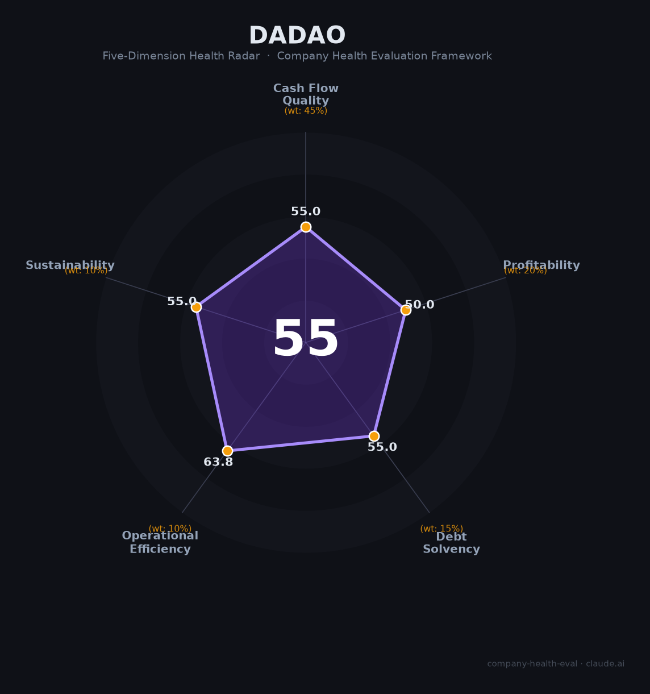

# 达道工业（—（非上市））财务健康评估（2026-08-13）

## 一句话结论

🔴 **55/100，中等偏下** | 精密制造，非上市数据有限

---

## 一、公司基本画像

| 项目 | 内容 |
|------|------|
| 主体 | 🔒 达道工业科技，精密制造 |
| 主营 | 🔒 精密制造/工业科技 |
| 财务 | 🔒 非上市，数据有限 |

> 一句话定性：精密制造细分，数据透明度受限。

---

## 二、五维财务健康评估

### 1. 现金流质量（55/100）| 权重45%

### 2. 盈利能力（50/100）| 权重20%

### 3. 偿债能力（55/100）| 权重15%

### 4. 运营效率（64/100）| 权重10%

### 5. 可持续发展（55/100）| 权重10%

---
## 三、综合评分

| 维度 | 得分 | 权重 | 加权 |
|------|:----:|:----:|:----:|
| 现金流质量 | 55 | 45% | 25 |
| 盈利能力 | 50 | 20% | 10 |
| 偿债能力 | 55 | 15% | 8 |
| 运营效率 | 64 | 10% | 6 |
| 可持续发展 | 55 | 10% | 6 |
| **综合得分** | **55** | 100% | 55 |

**健康等级：🔴 中等偏下**

---
## 四、核心风险清单

1. **非上市公司，信息披露有限**
1. **数据透明度不足**
1. **精密制造重资产投入**

## 五、求职/择业视角
- **核心优势**：精密制造
- **现存短板**：数据不透明

**结论**：需尽调，非首选
---
*评估方法：商泰汽车（iAUTO）五维企业健康度框架 · 数据截至2026年8月 · 来源：公开/行业资料*