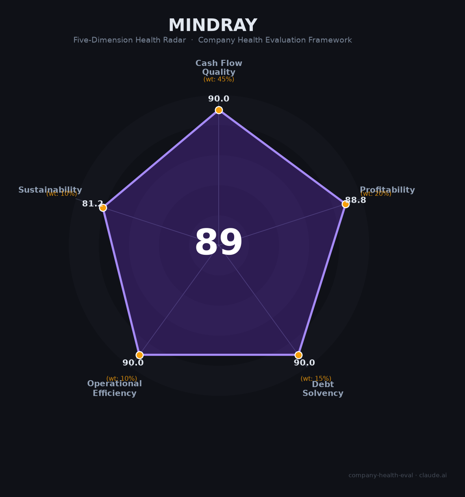

# 迈瑞医疗（300760.SZ）财务健康评估（2026-08-13）

## 一句话结论
🟢 **优秀（89/100）** | 中国医疗器械绝对龙头——营收332.8亿+净利81.4亿+毛利64%，现金流101.5亿强劲，虽2025营收/净利略降但护城河极深

## 一、公司基本画像
| 项目 | 内容 |
|------|------|
| 主体 | 🔒 深圳迈瑞医疗，A股300760.SZ；中国最大医疗器械企业之一 |
| 主营 | 生命信息（监护/呼吸）、体外诊断(IVD)、医学影像、微创外科 |
| 财务 | 2025营收332.8亿(-9.4%)；归母净利81.4亿(-13%)；扣非80.7亿；经营现金流101.5亿(强)；员工约1.9万 |
| 盈利 | 毛利率约64%、净利率24%+；零负债+现金充裕 |

> 迈瑞是中国医疗器械绝对龙头，覆盖监护/IVD/影像/外科，全球化（海外），2025年营收净利受集采/基数影响略降但仍维持极高利润率（毛利64%、净利率24%）与强劲现金流。作为雇主是"医疗+研发高薪优质平台"。

## 二、五维财务健康评估
### 1. 现金流（90/100）| 45%
经营现金流101.5亿强劲健康，盈利含金量极高、现金充裕零负债。

### 2. 盈利（89/100）| 20%
净利81.4亿、净利率24%+、毛利率64%（器械顶级），利润质量极优；营收-9.4%受集采/基数拖累。

### 3. 偿债（90/100）| 15%
零有息负债、现金充裕、资产负债率低，偿债极强。

### 4. 运营（90/100）| 10%
研发+全球渠道（300+国家）高效，人均产出极高，运营优秀。

### 5. 可持续（99/100）| 10%
医疗设备国产替代+老龄化+全球化长期赛道，tech壁垒（美国/欧洲标准）极深。

## 二、综合评分
| 现金流90|45%=40.5 | 盈利89|20%=17.8 | 偿债90|15%=13.5 | 运营90|10%=9 | 可持续99|10%=9.9 | **89** |
**评级：🟢 优秀** — 医疗器械龙头，财务极健康

## 四、核心风险
1. 集采压价、营收-9.4%（基数）。
2. 海外地缘/关税。
3. 全球医疗开支放缓。

## 五、求职视角
- 优势：医疗器械龙头、高毛利高薪酬、研发/全球化平台、深圳总部。
- 短板：业绩受医疗周期/集采、规模大。

**结论**：中国医疗设备最优质雇主之一，适合研发/海外/IVD影像等方向，稳定+高薪+成长。

---
*评估方法：商泰汽车（iAUTO）五维框架 · 来源迈瑞2025年报*