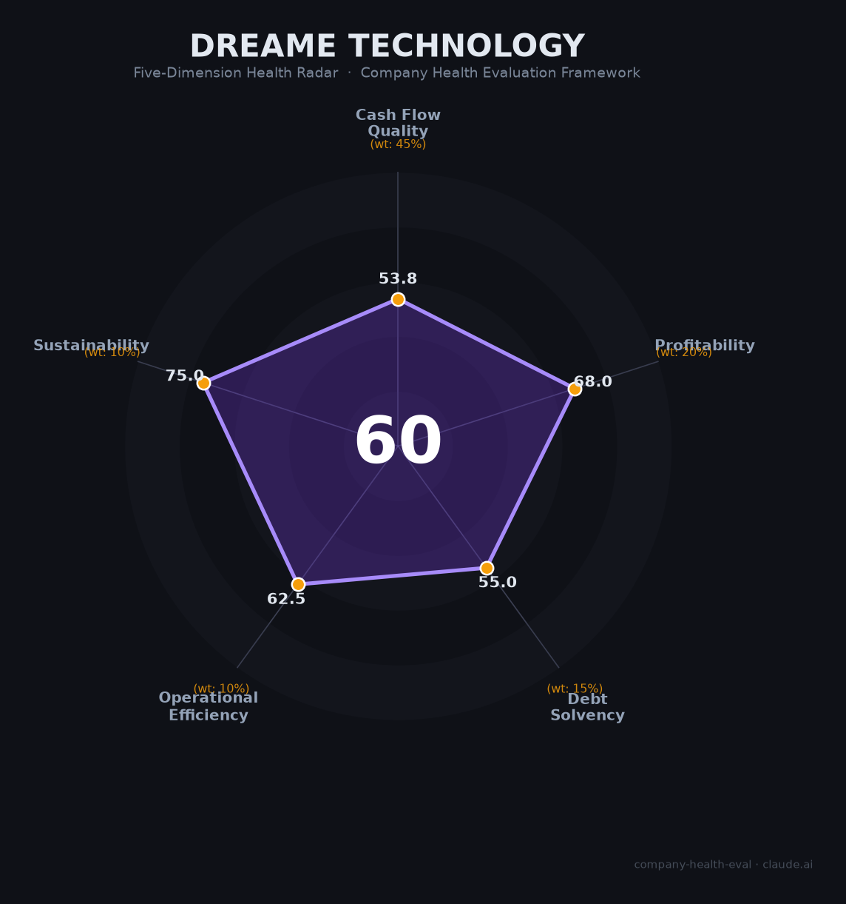

# 追觅科技（Dreame Technology）财务健康评估（2026-06-12）

## 一句话结论

🟠 **中等（59.8/100）** | 技术底子扎实但创始人风险极高——俞浩全网禁言+财务数据严重存疑+劳工合规红线，建议观望

## 一、公司基本画像

- **主体**：追觅科技（苏州）有限公司，2017年12月成立，创始人俞浩（1987年，清华航院）
- **股权**：俞浩控制62%+（2025年以50亿元回购老股），小米系已套现28亿元退出；2026年6月通过要约收购嘉美包装（002969）成为A股实控人
- **规模**：自称5,000-15,000人（社保参保不足700人，严重注水）；全球专利6,379件
- **主营**：扫地机器人（占营收91%）+洗地机，全球出货量第三（10.5%份额，2025年+102%增速）；人形机器人在研未量产
- **财务（HKEX招股书口径，最可信）**：2022年营收66亿→2023年86亿→2024年119亿，净利润约7.5亿（净利率~6%）
- **融资**：累计融资约$5.78亿；2026年6月Pre-IPO轮投前估值700亿元，计划最快2027年港股IPO
- **定位**：从"扫地机黑马"急速膨胀为"无边界生态"——跨界造车、手机、芯片、咖啡店等30+领域

## 二、五维财务健康评估

### 1. 现金流质量（53.8/100）

| 指标 | 判断 | 依据 |
|------|------|------|
| 经营现金流 | ⚠️ 关注 | 未上市无公开现金流量表；营收快速增长但利润率薄（~6%） |
| 现金跑道 | ✅ 健康 | Pre-IPO融资中（投前700亿），现金储备充足 |
| 有息负债 | ⚠️ 关注 | 天空工场创投管理67只基金/416亿元，政府LP占比高，类债权压力存在 |
| 净现比 | 🔴 危险 | 2025年自称净利润55亿但前三季仅10.4亿（同比-29.5%），Q4需45亿才达标——业界普遍认为不可能 |

### 2. 盈利能力（68.0/100）

| 指标 | 判断 | 依据 |
|------|------|------|
| 毛利率 | ⚠️ 一般 | 约36%（2024），低于科沃斯48.8%、石头42.4%，高端定位未完全转化为毛利率优势 |
| 净利率 | ✅ 良好 | 5-6%（2024），勉强进入"良好"区间；2025声称13.9%不可信 |
| 营收增速 | ✅ 优秀 | 2022-2024 CAGR约34%：66亿→86亿→119亿（HKEX招股书，经审计） |
| 研发费用率 | ✅ 良好 | 约7-12%，位于5-10%"良好"区间 |
| 人均产出 | ⚠️ 一般 | 约2.4万/人（按5,000人计），低于石头5.4万/人，与科沃斯2.1万/人持平 |

### 3. 偿债能力（55.0/100）

| 指标 | 判断 | 依据 |
|------|------|------|
| 资产负债率 | ⚠️ 关注 | 无公开数据；政府LP资金（416亿规模，60%+为政府出资）构成类债权压力 |
| 有息负债率 | ⚠️ 关注 | 造车子公司星空计划汽车232万元股权被冻结；拖欠猎头费69.3万元 |

> 缺失指标：流动比率、现金比率、股权质押比例——未上市公司无公开数据，该维度评分仅基于2/5指标，置信度较低。

### 4. 运营效率（62.5/100）

| 指标 | 判断 | 依据 |
|------|------|------|
| 应收周转 | ✅ 健康 | 消费硬件To C模式，现金回款快 |
| 客户集中度 | ✅ 健康 | 全球120+国家、数百万终端消费者，极度分散 |
| 员工规模趋势 | ⚠️ 关注 | 官方口径急速扩张（5,000→15,000），但社保数据不支持；多BU同时扩张，管理承压 |
| 高管稳定性 | 🔴 危险 | 中国区总裁郭人杰离职、人形机器人负责人喻超离职创业；核心高管批量流失 |

### 5. 可持续发展能力（75.0/100）

| 指标 | 判断 | 依据 |
|------|------|------|
| 行业赛道 | ✅ 健康 | 全球扫地机器人+20.1%（2025）；人形机器人即将爆发（2026预计2.8-5.1万台） |
| 技术壁垒 | ✅ 健康 | 6,379件专利，高速数字马达20万转，专利诉讼中压倒科沃斯（一审胜诉886.9万赔偿） |
| 业务多元化 | ✅ 健康 | 全球120+国家，海外收入占比~54%（招股书）至80%（自称）；客户极度分散 |
| 资本支持 | ✅ 健康 | Pre-IPO融资进行中（单笔最低3.5亿，含中东主权基金），政府基金深度绑定 |
| 政策风险 | 🔴 危险 | 俞浩2026年6月5日全网禁言；地方政府排查追觅合作；嘉美包装复牌跌停；IPO前景被蒙阴影 |

## 三、综合评分与健康等级

| 维度 | 得分 | 权重 | 加权得分 |
|------|------|------|----------|
| 现金流质量 | 53.8 | 45% | 24.2 |
| 盈利能力 | 68.0 | 20% | 13.6 |
| 偿债能力 | 55.0 | 15% | 8.2 |
| 运营效率 | 62.5 | 10% | 6.2 |
| 可持续发展 | 75.0 | 10% | 7.5 |
| **综合得分** | | **100%** | **59.8** |

**健康等级：🟠 中等（Moderate）**——有明确的重大风险点（创始人合规+财务可信度+劳工合规），需具体情况判断。

## 四、同业对标

| 对比项 | 追觅科技 | 科沃斯（603486） | 石头科技（688169） |
|--------|---------|-----------------|-------------------|
| 上市状态 | 未上市（Pre-IPO） | A股主板 | A股科创板 |
| 2025营收 | ~119亿（2024招股书）/ 自称400亿+ | 190亿 | 187亿 |
| 毛利率 | ~36% | 48.8% | 42.4% |
| 净利率 | ~5-6% | 9.2% | 7.3% |
| 全球出货份额 | 10.5%（#3） | 14.3%（#2） | 17.7%（#1） |
| 员工规模 | 自称5,000（社保<700） | ~9,000 | ~3,452 |
| 市值/估值 | 700亿（投前） | ~315亿 | ~264亿 |
| 核心差异 | 增速最快(+102%)但财务可信度堪忧 | 双品牌+盈利能力最强 | 量额全球双冠但增收不增利 |

**对标结论**：追觅在出货增速上领先同行，但盈利能力（毛利率、净利率）显著低于科沃斯和石头，且700亿投前估值已超过两家上市公司市值之和——估值合理性存疑。

## 五、核心风险清单

1. **创始人合规风险（极高）**：俞浩2026年6月5日被全网禁言，地方国资排查合作，嘉美包装跌停。若禁言升级为监管调查，Pre-IPO融资、政府补贴、上市计划将全面受阻。

2. **财务数据可信度风险（高）**：2025年自称营收400亿+、净利润55亿，但前三季度仅120亿/10.4亿（同比-29.5%），Q4需单季280亿——业界普遍认为不可能。700亿估值以不可信数据为基础。

3. **劳工合规红线（高）**：32岁工程师猝死（赔偿仅10万 vs 法定230万）；14名前员工被判违反竞业限制赔偿388.5万；社保按最低基数缴纳；86%员工反映频繁加班。劳动争议随时可能升级为重大声誉事件。

4. **高管流失与组织失控（中高）**：中国区总裁、人形机器人负责人等核心高管离职；30+领域跨界扩张导致管理半径崩溃；造车子公司股权被冻结。

5. **产品质量与品牌信任（中高）**：返修率4.8%行业最高，黑猫投诉超8,232条（接近科沃斯8,409条但销量仅为其一半）。"过保即坏"口碑持续侵蚀品牌。

## 六、求职/择业视角

### 核心优势
- **薪资竞争力较强**：技术岗30-60K·15薪，年薪45-90万，在上海属于中上水平
- **技术成长空间**：具身智能/VLA/RL方向与行业前沿接轨，扫地机器人算法+人形机器人双线可积累
- **全球化经验**：海外业务占比高，国际化视野

### 现存短板
- **稳定性极差**：创始人风险+高管流失+财务可信度危机，公司可能在1-2年内面临重大变局
- **工作强度极高**：86%员工反映频繁加班，社保按最低基数，"15薪"实际难以全额兑现
- **品牌背书负面**：脉脉/知乎/NGA社区一致"避雷"，下一份工作HR可能质疑你在追觅的经历
- **法律风险**："断指计划"争议+竞业限制严苛（已有多名前员工被判赔），离职可能面临诉讼

### 分场景建议

| 个人诉求 | 推荐度 | 说明 |
|----------|--------|------|
| 高薪+短期跳板 | ⚠️ 谨慎 | 薪资到位但离职竞业风险高，且品牌背书减弱 |
| 稳定+深耕 | ❌ 不推荐 | 创始人风险+组织动荡，不适合长期发展 |
| 具身智能/机器人赛道 | ⚠️ 有条件 | 技术积累真实，但建议优先考虑石头科技、优必选等更稳定标的 |
| 应届生首份工作 | ❌ 不推荐 | 社保最低基数+加班文化+猝死先例，风险收益不匹配 |

## 七、总结

追觅科技是全球智能清洁家电领域「增速最快但治理最令人担忧」的公司：技术底子扎实（全球专利6,379件、扫地机出货增速+102%、海外渠道覆盖120国），唯一短板是创始人俞浩的极端个人风格正在从"驱动力"蜕变为公司最大的系统性风险——全网禁言、财务可信度崩塌、劳工合规红线、高管流失、跨界失控多条战线同时告警。

在家电补贴退坡+人形机器人准入趋严+创始人监管风险三重压力下，追觅属于**中等风险**标的。适合风险承受能力强、追求短期高薪、且对具身智能赛道有强烈信念的技术人才短期过渡；不适合追求稳定、惧怕法律纠纷、或将其作为长期职业平台的求职者。

---

*评估日期：2026-06-12 | 数据截止：2026年6月*
*信息来源：HKEX招股书、IDC、东方财富、天眼查、中国裁判文书网、脉脉/知乎员工口碑*
