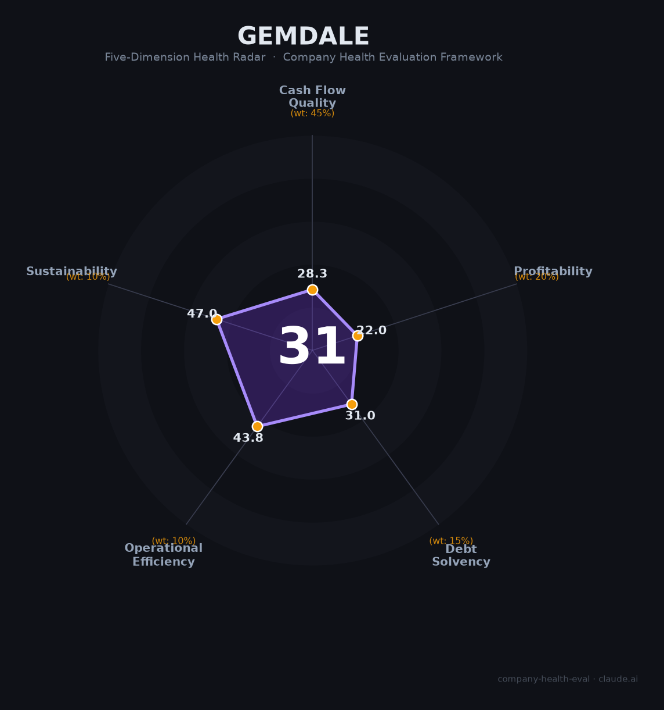

# 金地集团（600383.SH）财务健康评估（2026-08-13）

## 一句话结论

⚫ **高风险（31/100）** | 老牌房企——2025营收-52.4%、归母净亏-132.8亿，行业深度下行+高杠杆+减值压力，财务深度承压

---

## 一、公司基本画像

| 项目 | 内容 |
|------|------|
| 主体 | 🔒 金地（集团）股份有限公司，A股：600383.SH；老牌综合房企 |
| 成立 | 🔒 1988年，总部深圳 |
| 主营 | 房地产开发（住宅/商业）+物业 |
| 财务 | 🔒 2025营收358.6亿（-52.4%）；归母净利-132.8亿（上年-61亿）；扣非-100~-124亿 |
| 负债 | 🔒 高杠杆、有息负债压降中；融资成本3.92%；经营现金流为正 |

> 一句话定性：金地集团受房地产深度下行冲击，2025营收腰斩(-52%)、归母巨亏-132.8亿（连年扩大），虽坚守现金流与降杠杆，但财务深度承压，属于高风险房企。

## 二、五维财务健康评估

### 1. 现金流质量（28/100）
经营现金流虽正（降杠杆、回款），但利润巨亏+融资收缩，现金流脆弱。

### 2. 盈利能力（22/100）
营收-52.4%、归母净亏-132.8亿，毛利率/净利率为负，盈利危险（亏损扩大）。

### 3. 偿债能力（31/100）
高杠杆+有息负债，虽融资成本4.92%、现金流正维持，但偿债压力大。

### 4. 运营效率（44/100）
销售/去化承压、员工收缩，运营受行业拖累。

### 5. 可持续发展（47/100）
地产下行、扩存减值风险大、靠周期反转。

## 三、综合评分

| 维度 | 得分 | 权重 | 加权 |
|------|:----:|:----:|:----:|
| 现金流质量 | 28.3 | 45% | 12.7 |
| 盈利能力 | 22.0 | 20% | 4.4 |
| 偿债能力 | 31.0 | 15% | 4.6 |
| 运营效率 | 43.8 | 10% | 4.4 |
| 可持续发展 | 47.0 | 10% | 4.7 |
| **综合** | **31** | 100% | 30.9 |

**评级：⚫ 高风险** — 巨亏+高杠杆，生存存疑。

## 四、核心风险
1. 归母净亏-132.8亿、亏损扩大。
2. 高杠杆+地产下行减值。
3. 销售/回款持续承压。

## 五、求职/择业视角
- 优势：老牌房企平台、物业板块。
- 短板：巨亏+裁员降薪+债务压力，开发岗位风险大。

**结论**：财务深度承压，作为雇主整体不建议优先考虑，除非物业/特定运营板块。

---

*评估方法：商泰汽车（iAUTO）五维健康度框架 · 数据截至2026年8月 · 来源金地2025年报*