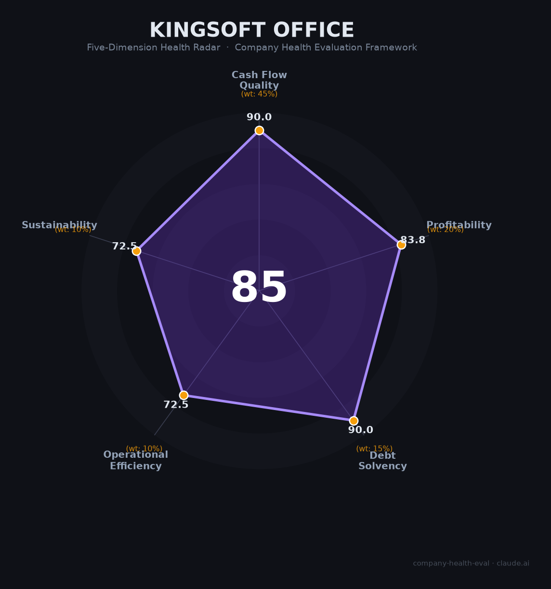

# 金山办公（688111.SH）财务健康评估（2026-06-12）

## 一句话结论

🟢 **优秀（85/100）** | 毛利率86%+零负债+中国唯一「高毛利+高净利」的上市办公软件公司，核心悬案：C端增长见顶（MAU 6.78亿）+AI商业化仅12%渗透率

## 一、公司基本画像

| 维度 | 内容 |
|------|------|
| **上市** | A股科创板688111.SH（2019年），母公司金山软件（03888.HK），雷军为实控人（~14%） |
| **员工** | ~6,048人（研发66%），珠海总部+武汉/北京/广州 |
| **核心产品** | WPS Office（全球MAU 6.78亿，中国市占率34%第一）、WPS 365（企业版，+65%增速）、WPS AI |
| **2025营收** | ¥59.29亿（+16%），归母净利润¥18.36亿（+12%） |
| **财务特征** | 毛利率86%、净利率31%、研发费率35%、零有息负债、现金+金融资产~¥24亿、净现比1.36 |
| **AI产品** | WPS灵犀（三大办公Agent）、数字员工2.0、AI月活8,013万（+307%）、日均Token 2,000亿+ |

## 二、五维评估

### 1. 现金流质量（90/100）
OCF ¥20.6→22.0→25.0亿，净现比>1.3。零有息负债+¥24亿现金 → 全部健康

### 2. 盈利能力（84/100）
毛利率86%（中国办公软件最高）+净利率31% → 优秀。营收3Y CAGR~15% → 良好。研发费率35%（¥21亿AI投入）→ 良好。人均创收¥98万 → 良好

### 3. 偿债能力（90/100）
零有息负债，资产负债率29%（均为经营性）→ 全部健康

### 4. 运营效率（72/100）
个人订阅占61%但用户基数分散 → 关注。员工持续增长(4,500→6,048) → 健康。高管团队极稳 → 健康

### 5. 可持续发展（72/100）
AI+办公CAGR 58% → 健康。WPS格式+信创90%+6.78亿MAU→壁垒强。高度依赖国内个人订阅 → 关注。套娃收费被央媒点名 → 关注

## 三、评分

| 维度 | 得分 |
|------|:----:|
| 现金流 | 90.0 |
| 盈利 | 83.8 |
| 偿债 | 90.0 |
| 运营 | 72.5 |
| 可持续 | 72.5 |
| **综合** | **85.3** 🟢 |

## 四、核心风险

1. **C端见顶（高）**：MAU 6.78亿+增速仅7%，移动端仅+2%。个人订阅增速从17%→12%→8%，两年腰斩
2. **AI变现未验证（高）**：AI月活8,013万但渗透率仅12%，套娃收费被新华社/人民日报点名批评
3. **信创红利减弱（中）**：党政覆盖率>90%，存量替换空间收窄至约¥20-25亿/年

## 五、求职视角

- **优势**：中国唯一盈利的上市办公软件公司，WPS AI Agent方向前沿，珠海生活性价比极高，公积金12%拉满
- **短板**：361末位淘汰（每年10%强制淘汰），"国企作风"管理文化，薪资仅为BAT的0.8倍
- **建议**：适合追求WLB+AI办公方向的技术人才，不适合追求顶级薪酬者

*评估日期：2026-06-12 | 数据来源：金山办公2025年报（2026.3.25披露）*
