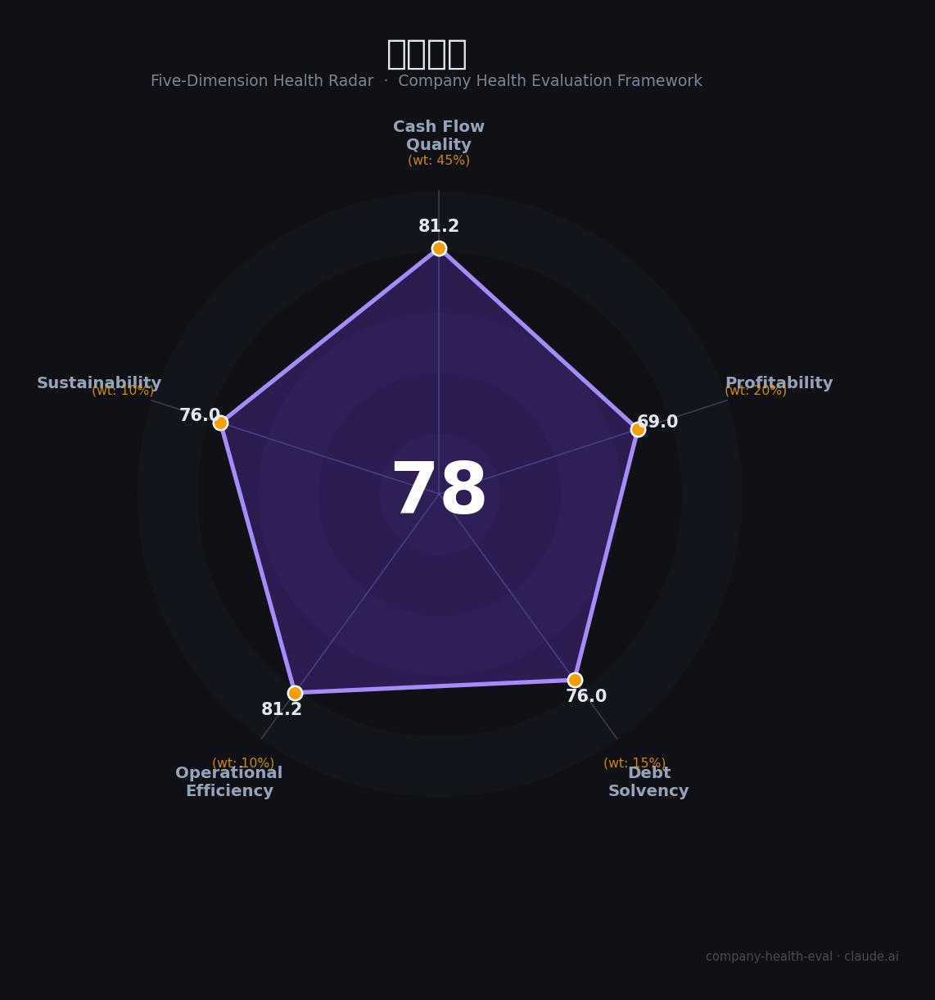

# 金蝶国际（0268.HK）财务健康评估（2026-08-14）

## 一句话结论

🟡 **78/100，中等偏上** | 企业SaaS龙头，扭亏为盈、订阅+AI双驱动

---

## 一、公司基本画像

| 项目 | 内容 |
|------|------|
| 主体 | 金蝶国际，中国企业SaaS龙头 |
| 主营 | 企业管理软件/云ERP/订阅 |
| 财务 | 2025扭亏为盈，订阅收入+20.9%，经调整净利2.32亿，AI收入超3亿 |

> 一句话定性：企业SaaS龙头，扭亏为盈、订阅转型见效

---

## 二、五维财务健康评估

### 1. 现金流质量（81/100）| 权重45%

经营现金流转好、扭亏。

### 2. 盈利能力（69/100）| 权重20%

经调整净利转正，盈利修复。

### 3. 偿债能力（76/100）| 权重15%

负债适中、现金充足。

### 4. 运营效率（81/100）| 权重10%

订阅转型效率提升。

### 5. 可持续发展（76/100）| 权重10%

云+AI+信创，国产替代成长。

---

## 三、综合评分

| 维度 | 得分 | 权重 | 加权 |
|------|:----:|:----:|:----:|
| 现金流质量 | 81 | 45% | 36.5 |
| 盈利能力 | 69 | 20% | 13.8 |
| 偿债能力 | 76 | 15% | 11.4 |
| 运营效率 | 81 | 10% | 8.1 |
| 可持续发展 | 76 | 10% | 7.6 |
| **综合得分** | **78/100** | 100% | 77.5 |

**健康等级：中等偏上** — 整体稳健，局部有待改善

---

## 四、核心风险清单

1. **订阅转型投入**
2. **AI变现待验证**
3. **宏观IT支出**

## 五、求职/择业视角

### 核心优势
- SaaS龙头、订阅收入高增、AI布局
### 现有短板
- 净利仍薄、转型投入大

**结论**：金蝶国际企业SaaS龙头，2025扭亏为盈、订阅与AI双轮驱动，是国产云ERP成长的优质标的。

---

*评估方法：商泰汽车（iAUTO）五维框架 · 数据截至2026年8月 · 财务来源金蝶国际2025业绩*